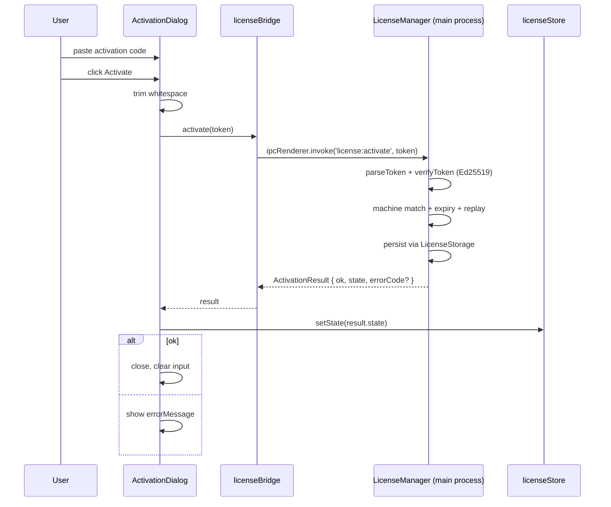

# ActivationDialog

> Source: `src/components/license/ActivationDialog.tsx`

## Overview

`ActivationDialog` is the modal that lets the user activate a license.
It shows the device's machine code (with a copy-to-clipboard button)
and accepts a pasted activation token. Submission round-trips to the
main process, which performs Ed25519 signature verification, machine
binding, expiry, and replay protection — see
[license manager](/api/electron/license-manager).

The dialog is **always-mounted** by `WorkspaceLayout` so any code can
trigger it via `useLicenseStore.getState().promptActivation()`. The
dialog registers its own opener on mount; consumers never need a ref.

## Component props

```ts
export function ActivationDialog(): JSX.Element | null;
```

No props. The component is self-controlled and reads everything it
needs from `licenseStore`.

## Behavior

### Self-registration as the prompt target

```ts
useEffect(() => {
  registerPromptActivation(() => {
    setOpen(true);
    setError(null);
  });
}, [registerPromptActivation]);
```

`licenseStore.registerPromptActivation(fn)` overwrites the store's
internal callback. `licenseStore.promptActivation()` then invokes
that callback. This indirection keeps the trigger reachable from
non-React code paths (zustand mutators, action dispatchers,
`editable-guard.ts`).

### Activation flow



### Machine code copy

```tsx
<button onClick={handleCopy}>
  {copied ? <FaCheck /> : <FaCopy />}
  {copied ? 'Copied' : 'Copy'}
</button>
```

`handleCopy` writes `state.machineCode` to the clipboard via
`navigator.clipboard.writeText`. The "Copied" state lasts 1.5 seconds
then reverts.

### State summary

The header shows the current status inline:

```tsx
<h2>
  Apollo Map Studio License
  <span>
    status: {state.status} · {state.reason}
  </span>
</h2>
```

When `status === 'activated'`, an emerald banner shows the license id
and expiry timestamp:

```tsx
<section className="bg-emerald-500/10 border border-emerald-500/30">
  Activated · {license.name || 'unnamed license'}
  id: {license.id} · expires:{' '}
  {license.expires === 0 ? 'never' : new Date(license.expires).toLocaleString()}
</section>
```

### Tampered banner

When `status === 'tampered'`, the dialog shows an amber explanation:

> The licensing layer detected tampering with the system clock or
> stored license files. Re-activation is required after correcting
> your system clock and removing any modified license files.

The user must fix the underlying tampering (clock rollback or
modified storage) before activation can re-establish state — see
[time guard](/api/electron/license-time-guard).

### Input handling

```tsx
<textarea
  value={code}
  onChange={(e) => setCode(e.target.value)}
  spellCheck={false}
  autoCorrect="off"
  autoCapitalize="off"
  rows={5}
/>
```

A 5-row textarea so multi-line tokens paste cleanly. Whitespace and
newlines are stripped on submit:

```ts
const trimmed = code.trim().replace(/\s+/g, '');
```

### ESC and backdrop

```ts
useEffect(() => {
  if (!open) return;
  const handler = (e: KeyboardEvent) => {
    if (e.key === 'Escape') {
      e.preventDefault();
      handleClose();
    }
  };
  window.addEventListener('keydown', handler);
  return () => window.removeEventListener('keydown', handler);
}, [open, handleClose]);
```

`handleClose` no-ops while `busy` is true so the user can't close the
dialog mid-IPC.

### Auto-focus

```ts
useEffect(() => {
  if (open) {
    const t = setTimeout(() => textareaRef.current?.focus(), 50);
    return () => clearTimeout(t);
  }
}, [open]);
```

50ms delay so the focus call lands after the modal has painted —
otherwise the underlying app's key handler can swallow the focus.

## Examples

### Triggering from anywhere

```ts
import { useLicenseStore } from '@/store/licenseStore';

if (!useLicenseStore.getState().state.canEdit) {
  useLicenseStore.getState().promptActivation();
}
```

### Reading activation result programmatically

```ts
import { licenseBridge } from '@/lib/license-bridge';

const result = await licenseBridge.activate(token);
if (!result.ok) console.error(result.errorCode, result.errorMessage);
```

The dialog already does this; you'd only call it directly from a
custom CLI / smoke test.

### Tools that issue tokens

The repo includes `tools/license-gen/` — a Node CLI that signs a
payload with the matching Ed25519 private key. The desktop app never
holds the private key.

## Related

- [License manager](/api/electron/license-manager)
- [License crypto](/api/electron/license-crypto)
- [License banner](/api/components/license-banner)
- [licenseStore](/api/store/license-store)
- [useLicenseSync](/api/hooks/use-license)
- [Architecture: license system](/architecture/license-system)
