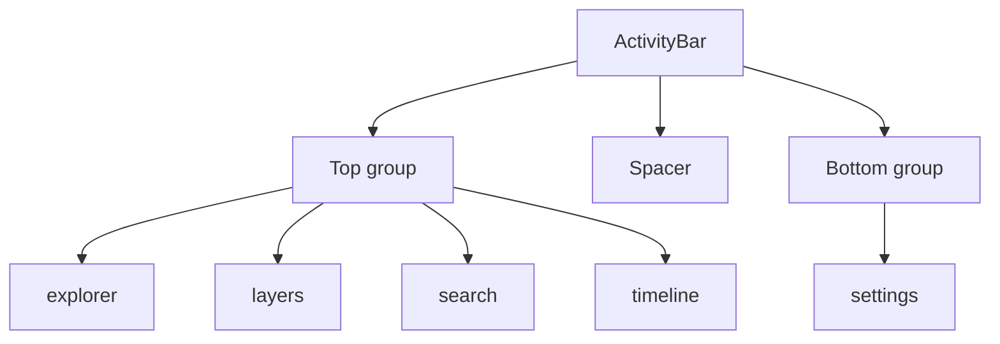

# ActivityBar

> 源码：`src/components/layout/ActivityBar.tsx`

## 用途与 UX 角色

`ActivityBar` 是 WorkspaceLayout 主内容区域最左侧的 48px 宽栏。它沿用 VS Code 的风格：

- **顶部 4 个 tab**：`explorer` / `layers` / `search` / `timeline`
- **底部 1 个 tab**：`settings`
- 当前激活 tab 左缘有一根 `2×20px` 的 cyan 高亮条
- 鼠标悬停按钮显示 `title` 工具提示

它本身不渲染面板内容——只通过 `onTabChange(tab)` 通知父级（最终落到 `SidebarContext`），`SidebarPanel` 根据 `activeTab` 渲染对应面板（`MapOutline` / `LayerTree` / `SearchPanel` / `SettingsPanel` 等）。

## 组件组合树



## 类型与 Props

```ts
export type ActivityTab = 'explorer' | 'layers' | 'search' | 'timeline' | 'settings';

interface ActivityBarProps {
  activeTab: ActivityTab;
  onTabChange: (tab: ActivityTab) => void;
}
```

| Prop          | 类型                         | 默认值 | 说明                                  |
| ------------- | ---------------------------- | ------ | ------------------------------------- |
| `activeTab`   | `ActivityTab`                | —      | 当前激活的 tab                        |
| `onTabChange` | `(tab: ActivityTab) => void` | —      | 点击 tab 时回调，父级负责更新 context |

`tabs` 数组在文件内常量定义（`ActivityBar.tsx:11-17`），不开放外部扩展——增删 tab 需修改源文件。

## 内部状态

无 `useState`、无 `useEffect`——这是一个纯展示组件。父组件 `WorkspaceLayoutInner` 通过 `useSidebar()` 读 `activeTab` / `setActiveTab`。

## 渲染骨架

```jsx
<div className="w-12 bg-ams-bg-base border-r border-ams-border-subtle flex flex-col items-center py-2 shrink-0">
  <div className="flex flex-col items-center gap-1">{/* top 4 tabs */}</div>
  <div className="flex-1" />
  <div className="flex flex-col items-center gap-1">{/* bottom settings */}</div>
</div>
```

每个 tab 按钮：

```jsx
<button onClick={() => onTabChange(id)} title={label} className={…}>
  {activeTab === id && <div className="absolute left-0 top-1/2 -translate-y-1/2 w-[2px] h-5 bg-ams-accent rounded-r" />}
  <Icon className="w-5 h-5" />
</button>
```

## 性能注释

- 5 个固定 button，无重复渲染压力。
- 选中态判断 `activeTab === id` 是 O(1)。
- 没有任何 portal / lazy / suspense——activity bar 永远是可见的。

## 设计 token

`ActivityBar` 是 `ams-*` 的另一个**示范迁移**点（与 [StatusBar](./status-bar.md) 一同）：

- 容器 `bg-ams-bg-base border-r border-ams-border-subtle`
- 激活 tab：`text-ams-text-primary bg-ams-surface-active`
- 闲置：`text-ams-text-muted hover:text-ams-text-primary hover:bg-ams-surface-hover`
- 高亮条：`bg-ams-accent`

## 源码索引

| 关注点             | 文件位置                         |
| ------------------ | -------------------------------- |
| 组件主体           | `ActivityBar.tsx:19-69`          |
| `tabs` 常量数组    | `ActivityBar.tsx:11-17`          |
| 顶部 group 渲染    | `ActivityBar.tsx:23-42`          |
| 底部 settings 渲染 | `ActivityBar.tsx:48-67`          |
| `SidebarContext`   | `src/context/SidebarContext.tsx` |

## 跨页参考

- [WorkspaceLayout](./workspace-layout.md) — 父组件
- `SidebarPanel` — 根据 `activeTab` 渲染面板内容（位于 `src/components/layout/panels/SidebarPanel.tsx`）
- [MapOutline](./map-outline.md) / [LayerTree](./layer-tree.md) / [SearchPanel](./search-panel.md) / [SettingsPanel](./settings-panel.md) / [TimelinePanel](./timeline-panel.md) — 5 个 tab 对应的内容面板

## 英文镜像

[/en/api/components/activity-bar](/en/api/components/activity-bar)
