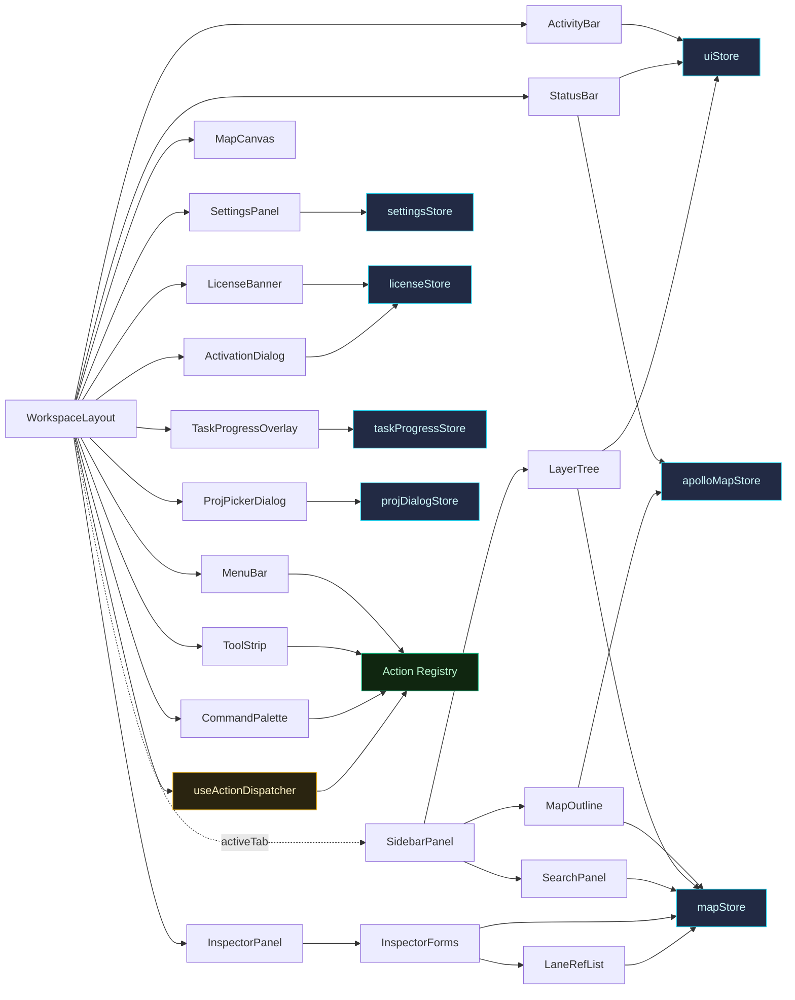

# 组件 API 总览

本节是 Apollo Map Studio 前端 **React 组件**的权威参考。每个组件单独成页，包含：

- 用途与 UX 角色（**Purpose & UX role**）
- Props 接口表（**name / type / default / description**）
- 内部状态（hooks、Zustand 选择器、XState 选择器）
- 副作用（事件订阅、MapLibre 图层注册、FSM 事件发送）
- 渲染骨架（DOM / 图层结构）
- 性能注释（`memo`、`RAF`、effect 依赖）
- 源码索引（**file:line**）
- 跨页面链接（指南、架构、其他组件）

## 组件分层

```mermaid
flowchart TB
  Root[WorkspaceLayout] --> MenuBar
  Root --> LicenseBanner
  Root --> ToolStrip
  Root --> ActivityBar
  Root --> Dockview[Dockview Shell]
  Dockview --> MapPanel[Map Panel<br/>= MapCanvas]
  Dockview --> SidebarPanel[Sidebar Panel<br/>= MapOutline / LayerTree / SearchPanel / SettingsPanel]
  Dockview --> InspectorPanel[Inspector Panel<br/>= InspectorForms + LaneRefList]
  Dockview --> TimelinePanel
  Root --> StatusBar
  Root --> CommandPalette
  Root --> SettingsModal[SettingsPanel \(modal\)]
  Root --> ProjPickerDialog
  Root --> TaskProgressOverlay
  Root --> ActivationDialog
```

依据 [`ARCHITECTURE.md`](/architecture/) 的层级约束，`components/` 是最顶层；它**可以**自由消费 `hooks/`、`store/`、`lib/`、`core/`、`types/`，但反向引用是**禁止的**。每个组件页都标记了它直接消费的下层模块。

## 组件总表

| 组件                                              | 类型             | 主要用途                                                                                                         | 源码                                                                                     |
| ------------------------------------------------- | ---------------- | ---------------------------------------------------------------------------------------------------------------- | ---------------------------------------------------------------------------------------- |
| [WorkspaceLayout](./workspace-layout.md)          | Shell（根）      | 全屏 grid：MenuBar / LicenseBanner / ToolStrip / Dockview / StatusBar，注入 `EditorProvider` + `SidebarProvider` | `src/components/layout/WorkspaceLayout.tsx`                                              |
| [MapCanvas](./map-canvas.md)                      | Map（核心）      | MapLibre GL 容器；冷热图层、网格、Apollo 图层、事件路由器的宿主                                                  | `src/components/map/MapCanvas.tsx`                                                       |
| [MenuBar](./menu-bar.md)                          | Shell            | 顶部菜单（File / Edit / View / Tools / Help）+ 模式切换                                                          | `src/components/layout/MenuBar.tsx`                                                      |
| [ToolStrip](./tool-strip.md)                      | Shell            | 工具条：默认/连接 + 11 元素图标 + 工具变体 + 视图切换                                                            | `src/components/layout/ToolStrip.tsx`                                                    |
| [ActivityBar](./activity-bar.md)                  | Shell            | VS Code 风格左侧活动栏：Explorer / Layers / Search / Timeline / Settings                                         | `src/components/layout/ActivityBar.tsx`                                                  |
| [MapOutline](./map-outline.md)                    | Sidebar Panel    | 只读结构概要：实体计数、健康检查、Apollo 头部元数据                                                              | `src/components/layout/panels/MapOutline.tsx`                                            |
| [LayerTree](./layer-tree.md)                      | Sidebar Panel    | `react-arborist` 拖放树：Road / Junction / Lane 父子关系                                                         | `src/components/layout/panels/LayerTree.tsx` + `LayerTree/`                              |
| [SearchPanel](./search-panel.md)                  | Sidebar Panel    | id / type 子串扁平搜索（200 项上限）                                                                             | `src/components/layout/panels/SearchPanel.tsx`                                           |
| [InspectorForms](./inspector-forms.md)            | Inspector Panel  | 实体详情表单分发器（Lane / Road / Signal / PNCJunction / Overlap / 17 种 Apollo 实体）                           | `src/components/layout/panels/InspectorForms.tsx` + `InspectorForms/` + `SchemaForm.tsx` |
| [LaneRefList](./lane-ref-list.md)                 | Inspector Helper | 可点击的 lane id 药丸列表，路由 `SELECT_ENTITY` FSM 事件                                                         | `src/components/layout/panels/LaneRefList.tsx`                                           |
| [SettingsPanel](./settings-panel.md)              | Modal            | undo limit / 视口中心 / lane 半宽 / 箭头间距等用户偏好设置                                                       | `src/components/layout/panels/SettingsPanel.tsx` + `MapMetadataForm.tsx`                 |
| [StatusBar](./status-bar.md)                      | Shell            | 底部状态条：模式 / 实体计数 / 光标坐标 / Zoom / Apollo 信息                                                      | `src/components/layout/StatusBar.tsx`                                                    |
| [TimelinePanel](./timeline-panel.md)              | Bottom Panel     | 场景模式时间轴：tracks + keyframes + 播放头，当前使用组件内状态                                                  | `src/components/layout/panels/TimelinePanel.tsx`                                         |
| [CommandPalette](./command-palette.md)            | Overlay          | `cmdk` 命令面板，按 ⌘K 打开，绑定 Action Registry                                                                | `src/components/layout/panels/CommandPalette.tsx`                                        |
| [TaskProgressOverlay](./task-progress-overlay.md) | Overlay          | 全屏长任务进度条（导入/导出 spatial worker 任务）                                                                | `src/components/layout/TaskProgressOverlay.tsx`                                          |
| [ProjPickerDialog](./proj-picker-dialog.md)       | Modal            | 导入无 PROJ 字符串的 Apollo 地图时弹出，三种模式选择投影                                                         | `src/components/dialogs/ProjPickerDialog.tsx`                                            |
| [LicenseBanner](./license-banner.md)              | Shell            | 试用倒计时 / 过期警示横幅，开放激活弹窗                                                                          | `src/components/license/LicenseBanner.tsx`                                               |
| [ActivationDialog](./activation-dialog.md)        | Modal            | 显示机器码 + 粘贴激活码 → Ed25519 验证                                                                           | `src/components/license/ActivationDialog.tsx`                                            |

## 阅读顺序建议

1. **[WorkspaceLayout](./workspace-layout.md)** — 先理解整体骨架，再下钻到具体面板。
2. **[MapCanvas](./map-canvas.md)** — 理解冷热图层、worker 桥、事件路由如何在一个组件内被装配。
3. **[InspectorForms](./inspector-forms.md)** — Schema 驱动的表单系统是 proto 抗腐蚀层在 UI 侧的集中体现。
4. **[LayerTree](./layer-tree.md)** + **[ToolStrip](./tool-strip.md)** — 拖放语义和 Action Registry 单一信源。

## 跨页参考

- 架构总览 → [`/architecture/`](/architecture/)
- Action Registry → `src/core/actions/registry.ts`（[`/api/core/actions/`](/api/core/actions/)）
- FSM 状态机 → `src/core/fsm/editorMachine.ts`（[`/api/core/fsm/`](/api/core/fsm/)）
- Zustand 存储 → [`mapStore`](/api/store/store-map) / [`uiStore`](/api/store/store-ui)
- Hooks 总览 → [`/api/hooks`](/api/hooks)

::: tip 阅读约定

- 所有 `file:line` 引用基于 v1 分支的 HEAD，迁移到 v2 时请重新核对。
  :::

## 英文版本

英文 mirror 见 [`/en/api/components/`](/en/api/components/)，结构与 zh 版完全平行。

## 实体类型与组件矩阵

下表把 Apollo HD-Map 的 17 种实体 + 6 种绘图原语映射到具体的渲染/编辑组件，便于"我要找编辑某类实体的代码"时快速定位：

| 实体类型       | LayerTree 分组             | Inspector 表单         | Outline 计数键 | Action 注册分类 |
| -------------- | -------------------------- | ---------------------- | -------------- | --------------- |
| `lane`         | Lanes / Junction / Section | LaneForm (SchemaForm)  | `lane`         | `lane`          |
| `road`         | Roads / Junction           | RoadForm               | `road`         | `road`          |
| `junction`     | Junctions                  | JunctionForm           | `junction`     | `junction`      |
| `signal`       | Signals                    | SignalForm             | `signal`       | `signal`        |
| `crosswalk`    | Crosswalks                 | CrosswalkForm (RO)     | `crosswalk`    | `crosswalk`     |
| `stopSign`     | Stop Signs                 | StopSignForm           | `stopSign`     | `stopSign`      |
| `yieldSign`    | Yield Signs                | YieldSignForm (RO)     | `yieldSign`    | `yieldSign`     |
| `speedBump`    | Speed Bumps                | SpeedBumpForm (RO)     | `speedBump`    | `speedBump`     |
| `clearArea`    | Clear Areas                | ClearAreaForm (RO)     | `clearArea`    | `clearArea`     |
| `parkingSpace` | Parking Spaces             | ParkingSpaceForm       | `parkingSpace` | `parkingSpace`  |
| `parkingLot`   | Parking Lots               | (DrawingForm fallback) | `parkingLot`   | `parkingLot`    |
| `pncJunction`  | PNC Junctions              | PNCJunctionForm        | `pncJunction`  | `pncJunction`   |
| `rsu`          | RSUs / Junction            | RSUForm (RO)           | `rsu`          | `rsu`           |
| `area`         | Areas                      | AreaForm               | `area`         | `area`          |
| `barrierGate`  | Barrier Gates              | BarrierGateForm        | `barrierGate`  | `barrierGate`   |
| `overlap`      | Overlaps                   | OverlapForm            | `overlap`      | `overlap`       |
| `speedControl` | Speed Controls             | (DrawingForm fallback) | `speedControl` | `speedControl`  |
| `polyline`     | Polylines                  | DrawingForm            | (drawingCount) | `drawing`       |
| `bezier`       | Beziers                    | DrawingForm            | (drawingCount) | `drawing`       |
| `arc`          | Arcs                       | DrawingForm            | (drawingCount) | `drawing`       |
| `rect`         | Rectangles                 | DrawingForm            | (drawingCount) | `drawing`       |
| `polygon`      | Polygons                   | DrawingForm            | (drawingCount) | `drawing`       |
| `catmullRom`   | CatmullRom                 | DrawingForm            | (drawingCount) | `drawing`       |

**RO** = read-only（只渲染 `<Section><Value /></Section>`）。

## 调用关系一览

下面这张图浓缩了所有组件之间的"谁调谁、谁监听谁的 store"。颜色：白色 = 组件 / 蓝色 = store / 黄色 = hook / 绿色 = registry：



## 测试覆盖

各组件的测试文件位置（参考开发指南 [`/contributing`](/contributing)）：

| 组件                  | 测试位置                                                       |
| --------------------- | -------------------------------------------------------------- |
| WorkspaceLayout       | （集成层面，通过 `e2e/` Playwright 覆盖）                      |
| MapCanvas             | `src/components/map/__tests__/MapCanvas.test.tsx`              |
| InspectorForms.lane   | `src/components/layout/panels/__tests__/lane-form.test.tsx`    |
| LayerTree.treeBuilder | `src/components/layout/panels/__tests__/treeBuilder.test.ts`   |
| SearchPanel           | `src/components/layout/panels/__tests__/search.test.tsx`       |
| SchemaForm            | `src/components/layout/panels/__tests__/SchemaForm.test.tsx`   |
| Overlap inspector     | `src/components/layout/panels/__tests__/overlap-form.test.tsx` |
| Action Registry       | `src/core/actions/__tests__/registry.test.ts`                  |

## 维护规约

1. 加新组件前先决定它属于哪一层（Shell / Sidebar / Inspector / Overlay）——索引页对应位置必须同步更新。
2. 新增 prop 必须同步更新中英文对应组件页的 Props 表格。
3. 改动 source map 中标注的"file:line"时——记得 `git grep` 这些坐标在 docs 里的引用一起更新。
4. 不要在文档里复制大段代码——保留接口签名与行号引用即可。

## 命名约定

每个组件文件、目录、测试都遵循以下命名：

| 类别                 | 模式                                        | 示例                                  |
| -------------------- | ------------------------------------------- | ------------------------------------- |
| 主组件文件           | `PascalCase.tsx`                            | `WorkspaceLayout.tsx`                 |
| 同名目录（拆子模块） | `PascalCase/`                               | `WorkspaceLayout/dockviewLayout.ts`   |
| 子模块辅助文件       | `camelCase.ts`                              | `dockviewLayout.ts`, `treeBuilder.ts` |
| 测试目录             | `__tests__/`                                | `panels/__tests__/`                   |
| 测试文件             | `{component}.test.tsx` / `{module}.test.ts` | `lane-form.test.tsx`                  |
| Hook 文件            | `use{Name}.ts`                              | `useColdLayer.ts`                     |
| Store 文件           | `{name}Store.ts`                            | `mapStore.ts`                         |

任何偏离这些模式的命名要在 PR 里写明理由。

## 文档可读性指南

- 表格优先于段落——读者扫描更快。
- 每个 mermaid 图配一个 caption 句子。
- `file:line` 链接而不是粘贴源码——避免重复维护。
- 保留 `::: tip` / `::: warning` 等 VitePress 容器。
- 中英文组件页保持相同的信息结构，便于读者在两种语言之间切换。
