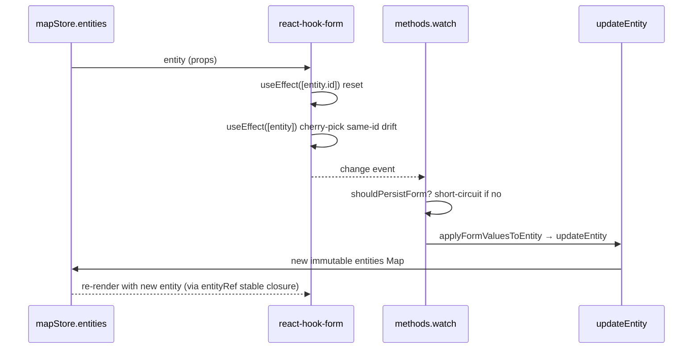

# InspectorForms

> 源码：
>
> - `src/components/layout/panels/InspectorForms.tsx`（dispatcher + re-export）
> - `src/components/layout/panels/InspectorForms/lane.tsx`（Lane → SchemaForm 包装）
> - `src/components/layout/panels/InspectorForms/pncJunction.tsx`（专门定制）
> - `src/components/layout/panels/InspectorForms/overlap.tsx`（专门定制 + override 钉位）
> - `src/components/layout/panels/InspectorForms/<entity>.tsx`（简单手写表单）
> - `src/components/layout/panels/InspectorForms/readOnly.tsx`（只读摘要表单）
> - `src/components/layout/panels/InspectorForms/formSync.ts`（手写表单同步 hook）
> - `src/components/layout/panels/InspectorForms/DrawingForm.tsx`（兜底，绘图原语）
> - `src/components/layout/panels/InspectorForms/resolver.ts`（zod resolver helper）
> - `src/components/layout/panels/SchemaForm.tsx`（schema-driven 通用表单）

## 用途与 UX 角色

`InspectorForms` 提供 Inspector 面板（右侧 Dockview panel）选中实体后的表单视图。它包含：

1. **EntityForm 分发器**——根据 `entity.entityType` switch 到具体表单。
2. **17 种实体表单**（Apollo 全集）+ DrawingForm 兜底（polyline / bezier / arc …）。
3. **SchemaForm**——通用 schema-driven 表单，目前只供 `LaneForm` 使用，未来可扩展。
4. **专门定制表单**：`PNCJunctionForm`（passage groups 编辑）、`OverlapForm`（is_merge + 区域多边形 override 钉位）。

整个表单子系统的核心约束是 **proto 抗腐蚀层**：所有 schema 验证、entity↔form 转换都通过 `@/types/inspectorSchema` + `@/lib/schemas`，proto 类型不直接出现在表单组件中。

## 组件组合树

```mermaid
flowchart TB
  EF[EntityForm dispatcher]
  EF -->|lane| LF[LaneForm \(SchemaForm\)]
  EF -->|junction / parkingSpace / signal / stopSign / road / area / barrierGate| HW[entity-specific forms]
  EF -->|crosswalk / speedBump / yieldSign / clearArea / rsu| RO[readOnly.tsx]
  EF -->|pncJunction| PNC[PNCJunctionForm]
  EF -->|overlap| OV[OverlapForm]
  EF -->|polyline / bezier / arc / rect / polygon / catmullRom| DF[DrawingForm \(fallback\)]
  HW --> Sync[formSync.ts]
  LF --> SF[SchemaForm]
  SF --> Hook[react-hook-form + zodResolver]
  SF --> Adapter["entity ↔ form via formValuesFromEntity / applyFormValuesToEntity"]
```

## EntityForm dispatcher

```ts
export function EntityForm({ entity }: { entity: MapEntity }): JSX.Element;
```

| Prop     | 类型        | 默认值 | 说明                                       |
| -------- | ----------- | ------ | ------------------------------------------ |
| `entity` | `MapEntity` | —      | 当前选中实体；分发依据 `entity.entityType` |

`switch` 表（`InspectorForms.tsx:46-80`）覆盖：

| `entityType`                                        | 表单组件                                    |
| --------------------------------------------------- | ------------------------------------------- |
| `lane`                                              | `LaneForm` (→ `SchemaForm`)                 |
| `junction`                                          | `JunctionForm` (`junction.tsx`)             |
| `parkingSpace`                                      | `ParkingSpaceForm` (`parkingSpace.tsx`)     |
| `signal`                                            | `SignalForm` (`signal.tsx`)                 |
| `stopSign`                                          | `StopSignForm` (`stopSign.tsx`)             |
| `road`                                              | `RoadForm` (`road.tsx`)                     |
| `pncJunction`                                       | `PNCJunctionForm` (`pncJunction.tsx`)       |
| `overlap`                                           | `OverlapForm` (`overlap.tsx`)               |
| `area`                                              | `AreaForm` (`area.tsx`)                     |
| `barrierGate`                                       | `BarrierGateForm` (`barrierGate.tsx`)       |
| `crosswalk`                                         | `CrosswalkForm` (read-only, `readOnly.tsx`) |
| `speedBump`                                         | `SpeedBumpForm` (read-only, `readOnly.tsx`) |
| `yieldSign`                                         | `YieldSignForm` (read-only, `readOnly.tsx`) |
| `clearArea`                                         | `ClearAreaForm` (read-only, `readOnly.tsx`) |
| `rsu`                                               | `RSUForm` (read-only, `readOnly.tsx`)       |
| 其余（polyline/bezier/arc/rect/polygon/catmullRom） | `DrawingForm` (fallback)                    |

## SchemaForm（通用）

`SchemaForm<TEntity, TFormValues>` 是 schema 驱动的表单——给定 `EntitySchema<TEntity, TFormValues>`，它：

1. 通过 `formValuesFromEntity(schema, entity)` 把实体转表单值。
2. `react-hook-form` 用 `zodResolver(schema.validation)` 做实时校验，**`mode: 'onChange'`**，保证表单在写回 store 前先通过字段校验。
3. **重 seed**仅在 `entity.id` 变化时（避免 mid-edit 被自身 watch 触发的 store update 覆写）。
4. **同 id drift**通过 `diffFormAgainstEntity` cherry-pick——例如 undo/redo / canvas drag 让单个字段变化时只刷新该字段。
5. **持久化**通过 `methods.watch(...)` 订阅，`shouldPersistForm` dedupe 后调 `applyFormValuesToEntity` + `mapStore.updateEntity`。
6. **渲染**按 `schema.sectionOrder` 分组，每个 section 内编辑字段优先于只读字段。

```ts
interface SchemaFormProps<TEntity extends MapEntity, TFormValues extends FieldValues> {
  schema: EntitySchema<TEntity, TFormValues>;
  entity: TEntity;
}
```

`renderField`（`SchemaForm.tsx:140-166`）支持两种 `kind`：

- `number` → `<Input type="number" min/max/step />`
- `enum` → `<Select options enumCategory />`

## LaneForm

```ts
export function LaneForm({ entity }: { entity: LaneEntity }): JSX.Element;
```

包装 `<SchemaForm schema={LaneInspectorSchema} entity={entity} />`。同时 re-export 三个 helper：

```ts
laneFormValuesFromEntity(entity); // 给 useDrawCommit / 测试使用
diffLaneFormAgainstEntity(form, entity);
shouldPersistLaneForm(form, entity);
```

## 手写简单表单与只读摘要

简单手写表单按实体拆在 `InspectorForms/<entity>.tsx`。每个表单都遵循同一模板：

1. `formValuesFrom<Entity>(entity)` 把实体投影到表单值。
2. `useForm<…>({ resolver: zodResolverZ4(schema), mode: 'onChange', defaultValues })`。
3. `useEntityFormSync(entity, methods, formValuesFrom<Entity>)` 统一处理换实体 reset 与同 id drift sync。
4. `methods.watch(...)` 只保留真正的写 store 规则，dedupe 后调用 `updateEntity`。

只读表单（`CrosswalkForm` / `SpeedBumpForm` / `YieldSignForm` / `ClearAreaForm` / `RSUForm`）集中在
`readOnly.tsx`，只渲染 `<Section>` + `<Value>`，无 react-hook-form。

`SignalForm` 是个特例：除了 `type` enum + `signInfo` 多选 checkbox，还有 `subsignals` 行内编辑 + "Regenerate from stop line" 按钮——后者调 `regenerateSignalGeometry` 重算信号灯外形。

## PNCJunctionForm（专门定制）

PNC junction 拓扑特殊：嵌套两层结构 `passageGroups[].passages[]`，每条 passage 关联多个 `lane / signal / stopSign / yieldSign` id。`pncJunction.tsx` 提供：

- `IdMultiSelect`：多选下拉 + 已选 id 药丸（带 `×` 移除）。
- `PassageBlock`：单条 passage 的编辑卡（type select + 4 类 id multi-select）。
- 顶层：增/删 passage group + 添加 passage。

通过 `nextSubId(SUB_PREFIX.passage, …)` / `nextSubId(SUB_PREFIX.passageGroup, …)` 生成不冲突的子 id。每次编辑直接 `updateEntity(id, next)` 写回。

## OverlapForm（专门定制 + override 钉位）

`overlap.tsx` 实现两种"钉位"机制：

1. **`is_merge` 钉位**：lane × lane 类型 overlap 中，用户在 UI toggle `is_merge` 后，把 path `objects.<i>.laneOverlapInfo.isMerge` 加到 `entity._userOverrides`。下一次 reconcile 不会用自动推断覆盖该值。
2. **`regionOverlaps` 钉位**：`entity._userOverrides += 'regionOverlaps'`，固定整组 region polygon + 关联 `regionOverlapId`。

`withOverride` / `clearOverride` 是纯函数（exported for tests）。UI 渲染：

- "Lane × Lane Semantics" 段：每条 lane object 一行 toggle，pinned 显示 `pinned ×` 按钮。
- "Region Overlaps" 段：`pin` / `pinned ×` 切换，下方枚举每个 region 的 polygon 数 + 顶点数。

## DrawingForm（fallback）

`DrawingForm` 给 polyline / bezier / arc / rect / polygon / catmullRom 用。它无 form 状态，只显示：

- ID
- 顶点数（依次尝试 `points` / `anchors` / `polygon.points`）

## resolver

`resolver.ts` 是一个简单的 type-narrowed 包装：

```ts
export function zodResolverZ4<T extends FieldValues>(schema: ZodType<T, T>): Resolver<T>;
```

仅为绕过 `@hookform/resolvers/zod` 在 zod v4 时的 TS 推断问题。

## 副作用与生命周期

每个 form 组件的关键副作用模式：



## 性能注释

- **latest entity ref**：`SchemaForm` 内部持有最新 entity ref；手写表单通过
  `useEntityFormSync` 取得同样的 ref，让 `methods.watch` 回调不重启订阅也能读到最新实体。
- **`shouldPersistForm` 是死循环 gate**：watch 写回 store → store 触发 re-render → useEffect 同 id drift sync → 触发 watch → 死循环。`shouldPersistForm` 只在表单值与实体差异**仍存在**时返回 true，否则 short-circuit。
- **`mode: 'onChange'` 强制实时校验**：用于防止无效表单值写回实体，不能改回 `onSubmit`。
- **lazy 加载**：`InspectorForms` 通过 `WorkspaceLayout/lazyPanels.tsx:36-39` 的 `LazyEntityForm` 懒加载。

## 源码索引

| 关注点                  | 文件位置                                              |
| ----------------------- | ----------------------------------------------------- |
| EntityForm dispatcher   | `InspectorForms.tsx:45-80`                            |
| Lane re-exports         | `InspectorForms.tsx:39-44`                            |
| LaneForm                | `InspectorForms/lane.tsx:32-34`                       |
| SchemaForm 主体         | `SchemaForm.tsx:53-136`                               |
| SchemaForm 同 id drift  | `SchemaForm.tsx:85-101`                               |
| SchemaForm watch 持久化 | `SchemaForm.tsx:105-114`                              |
| 手写表单同步 hook       | `formSync.ts`                                         |
| SignalForm 特例         | `signal.tsx`                                          |
| PNCJunctionForm         | `pncJunction.tsx:151-262`                             |
| OverlapForm + override  | `overlap.tsx:65-212`                                  |
| DrawingForm 兜底        | `DrawingForm.tsx:4-23`                                |
| zodResolverZ4           | `resolver.ts:9-11`                                    |
| Schema 定义             | `src/types/inspectorSchema.ts` / `src/lib/schemas.ts` |

## 跨页参考

- [WorkspaceLayout](./workspace-layout.md) → InspectorPanelContent → `LazyEntityForm`
- [`mapStore.updateEntity`](/api/store/store-map)
- [`entityOps`](/api/lib) — proto 抗腐蚀层
- [LaneRefList](./lane-ref-list.md) — Inspector 中 lane id 跳转
- [架构](/architecture/) — Anti-corruption layer 与表单校验约束

## 英文镜像

[/en/api/components/inspector-forms](/en/api/components/inspector-forms)

## 与其他组件的协作

本组件位于 [WorkspaceLayout](./workspace-layout.md) 装配的 React 树中——大部分协作通过 store / context 完成，少量通过 props 直接传递。下表枚举可观察到的耦合点：

| 组件                                     | 协作方式                                                            |
| ---------------------------------------- | ------------------------------------------------------------------- |
| [WorkspaceLayout](./workspace-layout.md) | 直接 mount 并/或注入 `actorRef` / 调度 callback                     |
| [MapCanvas](./map-canvas.md)             | 通过 `mapStore.entities` 间接联动（修改后冷层 round-trip 重渲染）   |
| [LayerTree](./layer-tree.md)             | 通过 `mapStore` 共享实体状态                                        |
| [InspectorForms](./inspector-forms.md)   | 通过 `editorMachine.context.selectedEntityId` 同步选中实体          |
| [Action Registry](/api/core)             | 共享同一份 `ACTION_DEFS`；新增交互通常加 action，而不是组件特化逻辑 |

::: tip 维护建议
当组件之间需要**直接 prop 传递**时，先问自己：能不能改放到 store？如果该数据被 ≥3 个组件读取，store 通常更合适；2 个之间则 props 更轻量。
:::

## 设计 Token 与样式约定

本组件遵循 [架构](/architecture/) "Design tokens" 章节的命名约定：

- 背景：`bg-ams-bg-base` / `bg-ams-surface-active` / `bg-ams-surface-hover`
- 文字：`text-ams-text-primary` / `text-ams-text-secondary` / `text-ams-text-muted` / `text-ams-text-disabled`
- 边界：`border-ams-border-subtle` / `border-ams-border-strong`
- 强调：`text-ams-accent` / `bg-ams-accent`

新增样式应优先复用以上 token。如果当前 token 不能精确表达意图，再扩展 `src/index.css` 的 `@theme` 块。

## 测试策略

| 测试类型                | 关注点                                                         |
| ----------------------- | -------------------------------------------------------------- |
| 单元（vitest）          | Pure 函数、reducer、derived selector                           |
| 组件（testing-library） | props → render output、用户交互 → 回调触发                     |
| 集成                    | 与 store 协同（mock 全局 store） / 与 actor 协同（mock actor） |
| E2E（Playwright）       | 跨组件流程（draw → undo → redo / import → 编辑 → export）      |

测试文件遵循 `__tests__/{component}.test.tsx` 命名约定，与组件同级。
