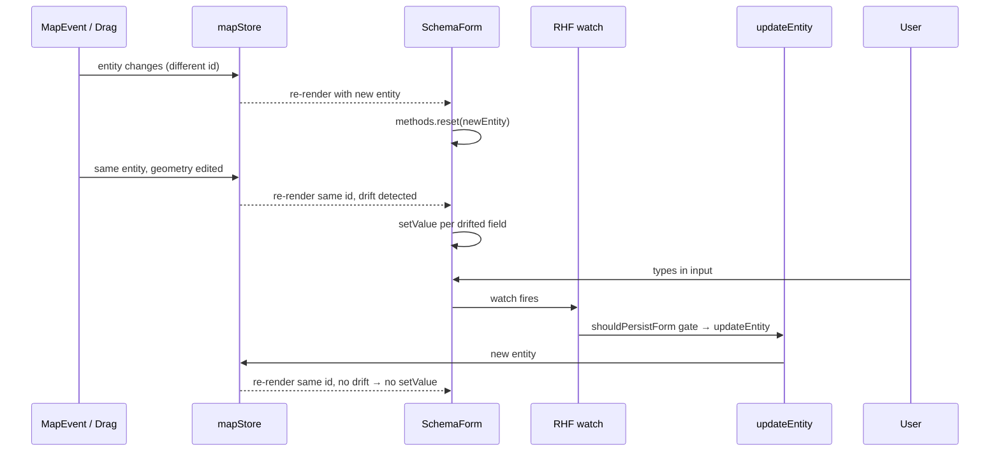

# Inspector Forms

> Source: `src/components/layout/panels/InspectorForms.tsx`, `src/components/layout/panels/InspectorForms/{DrawingForm,lane,overlap,pncJunction,simpleForms}.tsx`, `src/components/layout/panels/InspectorForms/resolver.ts`, `src/components/layout/panels/SchemaForm.tsx`

## Overview

The Inspector panel renders a per-entity-type form so the user can
edit non-geometry attributes — lane type, signal subsignal types,
PNC-junction passages, overlap merge semantics, etc. There are three
flavors:

1. **Schema-driven forms** — `LaneForm` (and any future `SchemaForm`
   user) declares the form via `EntitySchema` records; field
   layout, validation, and persistence all run from data.
2. **Hand-rolled simple forms** — single-or-double-field forms
   (`JunctionForm`, `RoadForm`, `StopSignForm`, `BarrierGateForm`,
   `AreaForm`, `ParkingSpaceForm`, `SignalForm`) using `react-hook-form`
   directly with `zod` validation.
3. **Bespoke forms** — `OverlapForm` and `PNCJunctionForm` need
   custom UI (pin buttons, multi-select pills, passage groups) that
   doesn't fit a flat schema.

The dispatcher `EntityForm` switches on `entity.entityType` and picks
the right form. Drawing primitives fall through to the read-only
`DrawingForm`.

## Component props

```ts
export function EntityForm({ entity }: { entity: MapEntity }): JSX.Element;
```

The Inspector panel calls `<EntityForm entity={...} />` with the
currently-selected entity from `mapStore`.

## Behavior

### Dispatcher

```tsx
export function EntityForm({ entity }: { entity: MapEntity }) {
  switch (entity.entityType) {
    case 'lane': return <LaneForm entity={entity as LaneEntity} />;
    case 'junction': return <JunctionForm entity={entity as JunctionEntity} />;
    case 'parkingSpace': return <ParkingSpaceForm ... />;
    case 'signal': return <SignalForm ... />;
    // ... 14 cases ...
    default: return <DrawingForm entity={entity} />;
  }
}
```

Adding a new Apollo entity type means adding a case here and a form
component.

### Schema-driven path: SchemaForm

`SchemaForm` (in `panels/SchemaForm.tsx`) is the engine. Given an
`EntitySchema` and a live entity, it:

1. Seeds `react-hook-form` with `formValuesFromEntity(schema, entity)`.
2. On entity-id change, `methods.reset(...)` to seed the new entity.
3. On same-id drift (canvas drag, undo, etc.), runs
   `diffFormAgainstEntity(...)` and pushes only the moved fields via
   `setValue` — this is the fix that prevents mid-edit clobbering.
4. Subscribes to `methods.watch(...)` and persists changes via
   `applyFormValuesToEntity(schema, ...)` + `updateEntity(...)`.
   Short-circuited by `shouldPersistForm(...)` so the
   store→sync→watch→update loop terminates.
5. Renders sections in `schema.sectionOrder` — editable fields first,
   read-only rows after.



`SchemaForm` enforces `mode: 'onChange'` so `formState.isValid` is
live per keystroke — the LaneForm regression test pins this.

### Lane form

`lane.tsx` is the thinnest possible wrapper:

```tsx
export function LaneForm({ entity }: { entity: LaneEntity }) {
  return <SchemaForm schema={LaneInspectorSchema} entity={entity} />;
}
```

It also re-exports the schema's read/diff/persist helpers so
regression tests can pin behavior without going through the React
component.

### Simple forms (simpleForms.tsx)

Each follows the same pattern — `useForm` with `zodResolverZ4`, an
`entityRef` to prevent stale closures inside the watch, and a manual
diff before calling `updateEntity`. The pattern is duplicated rather
than abstracted because each form has its own quirks:

| Form                                                                          | Special handling                                                                                        |
| ----------------------------------------------------------------------------- | ------------------------------------------------------------------------------------------------------- |
| `JunctionForm`                                                                | `type` enum with `UNKNOWN` fallback skip on optional-write                                              |
| `ParkingSpaceForm`                                                            | Heading is degrees in form, radians in entity — converts in/out                                         |
| `SignalForm`                                                                  | Type change regenerates boundary + subsignals via `regenerateSignalGeometry`; `signInfo[]` flag toggles |
| `StopSignForm`, `RoadForm`                                                    | Type enum with skipping logic                                                                           |
| `AreaForm`                                                                    | Type + name (with empty-string→undefined coercion)                                                      |
| `BarrierGateForm`                                                             | Type enum                                                                                               |
| `CrosswalkForm`, `SpeedBumpForm`, `YieldSignForm`, `ClearAreaForm`, `RSUForm` | Pure read-only summary                                                                                  |

### shouldSkipOptionalEnumWrite

```ts
function shouldSkipOptionalEnumWrite<T extends string>(
  next: T | undefined,
  current: T | undefined,
  fallback: T,
): boolean {
  return next === undefined || next === current || (current === undefined && next === fallback);
}
```

Used by JunctionForm / StopSignForm / RoadForm. The proto's optional
enum field is "absent" (the sentinel `UNKNOWN`) when the user has not
chosen anything. If the form holds the fallback and the entity holds
`undefined`, we don't want to mass-write `UNKNOWN` and dirty the
proto round-trip.

### OverlapForm

`overlap.tsx` is bespoke because Overlap's reconcile pipeline supports
**user overrides** (pinning) at specific paths. The form:

- Lists all participating objects (lanes, signals, etc.) read-only.
- For each lane participant, lets the user toggle `isMerge`. The
  toggle records the path
  `objects.<i>.laneOverlapInfo.isMerge` in `entity._userOverrides`.
- Lets the user pin or unpin the entire `regionOverlaps` polygon list.

```ts
export function withOverride(entity: OverlapEntity, path: string): OverlapEntity;
export function clearOverride(entity: OverlapEntity, path: string): OverlapEntity;
export const REGION_OVERLAPS_OVERRIDE_PATH; // re-exported from core
```

`withOverride` / `clearOverride` are pure transforms exported for
testability. The runtime contract is consumed by
`core/elements/overlap/reconcile.ts` — pinned paths are skipped on
reconcile.

### PNCJunctionForm

`pncJunction.tsx` is bespoke because the PNC junction nests:

```
PNCJunction
├─ passageGroup #1
│  ├─ passage #1 (laneIds, signalIds, stopSignIds, yieldIds, type)
│  └─ passage #2
└─ passageGroup #2
```

The form provides:

- Add / remove passage groups.
- Add / remove passages within a group.
- Multi-select pill UI for each id-list (lanes / signals / stop /
  yield), backed by a per-type `availableIds` lookup that scans
  `mapStore.entities` for matching entityType.

Adding/removing passages allocates fresh ids via
`nextSubId(SUB_PREFIX.passage, existingIds)` from `lib/idGenerator`.

### DrawingForm

`DrawingForm.tsx` is the fallback for drawing primitives — read-only
ID and vertex count. Polyline / bezier / arc / rect / polygon all
flow through here.

### resolver.ts

```ts
export function zodResolverZ4<T extends FieldValues>(schema: ZodType<T, T>): Resolver<T>;
```

Thin generic wrapper around `@hookform/resolvers/zod` that types the
schema as `ZodType<T, T>` (input == output). All forms in this folder
import this helper instead of the raw `zodResolver` so the schema
generic stays consistent.

## Examples

### Reading the lane schema's helpers

```ts
import {
  laneFormValuesFromEntity,
  diffLaneFormAgainstEntity,
  shouldPersistLaneForm,
} from '@/components/layout/panels/InspectorForms';

const values = laneFormValuesFromEntity(lane);
const diffs = diffLaneFormAgainstEntity({ ...values, type: 'CITY_DRIVING' }, lane);
const willPersist = shouldPersistLaneForm({ ...values, type: 'CITY_DRIVING' }, lane);
```

These are exposed for tests; production code uses `LaneForm` /
`SchemaForm` directly.

### Pinning an overlap region

```ts
import {
  withOverride,
  REGION_OVERLAPS_OVERRIDE_PATH,
} from '@/components/layout/panels/InspectorForms/overlap';

const pinned = withOverride(overlapEntity, REGION_OVERLAPS_OVERRIDE_PATH);
useMapStore.getState().updateEntity(overlapEntity.id, pinned);
```

### Adding a new simple form

1. Add a schema + form values type to `lib/schemas`.
2. Add a `<NewEntityForm>` to `simpleForms.tsx` modeled on
   `JunctionForm`.
3. Add the case to `EntityForm` switch.

## Related

- [Inspector schema](/api/types/inspector-schema)
- [Schemas (zod)](/api/lib/schemas)
- [mapStore.updateEntity](/api/store/store-map)
- [Overlap reconcile](/api/core/elements-overlap)
- [PNC junction proto](/api/types/apollo)
- [Element registry](/api/core/elements)
