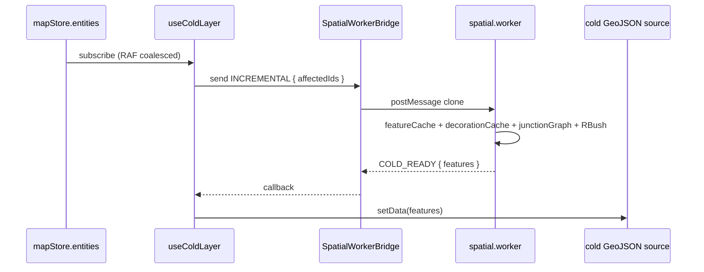

# MapCanvas

> 源码：`src/components/map/MapCanvas.tsx`，配套 `src/components/map/coldLayerConfig.ts`、`src/components/map/entityMutations.ts`

## 用途与 UX 角色

`MapCanvas` 是地图渲染的**装配点**——一个轻量级的 React 组件，把 MapLibre GL 容器、spatial worker bridge 与一系列围绕它工作的 hooks 串起来。它本身**几乎不写业务代码**：所有渲染逻辑、事件路由、性能优化都被拆进 `src/hooks/use*Layer.ts` 与 `src/hooks/useMap*` 里，`MapCanvas` 只负责"按正确的顺序把它们都调用一次"。

这样的拆分有两个目的：

1. **关注点分离** —— 每个 hook 只对一个图层/一类事件负责，便于单测与替换。
2. **生命周期归位** —— `MapCanvas` 在 mount 时创建 worker bridge，在 unmount 时 dispose；`mapRef` / `mapLoadedRef` / `bridgeRef` 是这套 hook 共享的稳定 refs。

## 组件组合树

```mermaid
flowchart TB
  Root[MapCanvas]
  Root --> Container[div.containerRef \(MapLibre 容器\)]
  Root --> Init[useMapLibreInit]
  Init --> Map[(maplibregl.Map)]
  Root --> WB[SpatialWorkerBridge]
  WB --> Worker[spatial.worker.ts]
  Root --> Hooks[Hook stack]
  Hooks --> H1[useDrawCommit]
  Hooks --> H2[useMapEventRouter]
  Hooks --> H3[useOverlayLayer]
  Hooks --> H4[useColdLayer]
  Hooks --> H5[useHotLayer]
  Hooks --> H6[useGridLayer]
  Hooks --> H7[useApolloLayer]
  Hooks --> H8[useCursorManager]
  Hooks --> H9[useDragPan]
```

## Props 接口

```ts
interface MapCanvasProps {
  actorRef: ActorRefFrom<typeof editorMachine>;
}
```

| Prop       | 类型                                 | 默认值 | 说明                                                                   |
| ---------- | ------------------------------------ | ------ | ---------------------------------------------------------------------- |
| `actorRef` | `ActorRefFrom<typeof editorMachine>` | —      | 来自 `EditorProvider` 的 XState actor 引用——所有 hook 均通过它读写 FSM |

::: tip 最佳实践
不要直接在 `MapCanvas` 外创建 actor；`MapCanvas` 应当**总是**从 `useEditorActor()`（或 lazy panel 包装层 `MapPanelContent`）拿到顶层 actor，避免重复实例化 FSM 导致状态分裂。
:::

## 内部状态

| Ref                      | 类型                                           | 创建/释放                                                           |
| ------------------------ | ---------------------------------------------- | ------------------------------------------------------------------- |
| `containerRef`           | `React.RefObject<HTMLDivElement>`              | 渲染时绑定 `<div ref={containerRef}>`；MapLibre 在此 div 中初始化   |
| `bridgeRef`              | `React.RefObject<SpatialWorkerBridge \| null>` | mount 时 `new SpatialWorkerBridge()`；unmount 时 `bridge.dispose()` |
| `mapRef`, `mapLoadedRef` | 来自 `useMapLibreInit(containerRef)`           | hooks 共享的 MapLibre 实例与"已 load"标志                           |

## 副作用

| 时机                                                         | 行为                                                                                                            |
| ------------------------------------------------------------ | --------------------------------------------------------------------------------------------------------------- |
| `useEffect(() => new SpatialWorkerBridge(); return cleanup)` | mount 时建立 worker bridge，unmount 时显式 `dispose()` 释放 worker（`MapCanvas.tsx:24-31`）                     |
| `useMapLibreInit(containerRef)`                              | 创建 MapLibre `Map` 实例；订阅 `load` 事件；返回 `mapRef` + `mapLoadedRef`                                      |
| `useDrawCommit(actorRef)`                                    | 订阅 FSM `xstate.transition`；在绘制状态退出时调用 `mapStore.addEntity`（读取 **post-transition** 快照）        |
| `useMapEventRouter(mapRef, actorRef, bridgeRef)`             | 把 MapLibre 的 `click` / `mousemove` / `dblclick` / `mouseup` 路由到 FSM；`isDuplicateInput` 处理 dblclick 去重 |
| `useOverlayLayer(...)`                                       | 渲染选择/编辑高亮 GeoJSON 图层                                                                                  |
| `useColdLayer(mapRef, mapLoadedRef, actorRef, bridgeRef)`    | RAF 合并 `mapStore.entities` 变更；通过 `bridgeRef` 发往 worker，回写 `cold` GeoJSON 源                         |
| `useHotLayer(...)`                                           | 监听 FSM context 内的实时绘制状态，每帧重写 `hot` 源                                                            |
| `useGridLayer(...)`                                          | 渲染 grid 辅助线，开关由 `uiStore.gridEnabled` 控制                                                             |
| `useApolloLayer(...)`                                        | 在 Apollo `.bin/.txt` 导入后渲染 lane / road / signal 等 Apollo 实体                                            |
| `useCursorManager(mapRef, actorRef)`                         | 根据 FSM 状态切换 MapLibre canvas 的 `cursor` CSS 类                                                            |
| `useDragPan(mapRef, actorRef)`                               | 在某些 FSM 状态下禁用 maplibre 自带 dragPan，改为自定义平移行为                                                 |

## 渲染骨架

```jsx
return <div ref={containerRef} className="w-full h-full" />;
```

整个 MapCanvas 在 React 树中只渲染一个 div——所有 MapLibre 元素都由 maplibregl 直接接管 DOM。

### 图层栈（z-order）

```
┌──────────────── overlayLayer (selection / editPoints highlights)
├──────────────── hotLayer (in-flight draw preview)
├──────────────── apolloLayer (imported HD-map renderable: lane corridor, boundaries, decorations)
├──────────────── coldLayer (committed entity GeoJSON, junction-stitched + decorated)
├──────────────── gridLayer (debug grid, optional)
└──────────────── basemap (MapLibre raster / vector)
```

### 数据流（冷热分层）



详见 [冷层流水线 / Phase E](/architecture/) 章节。

## 性能注释

- **RAF coalesce**：`useColdLayer` 把多次 `mapStore.entities` 写入合并到下一帧再 dispatch 给 worker，避免抖动。
- **Worker boundary 克隆**：`SpatialWorkerBridge` 通过 `postMessage` 序列化数据，**不要**在主线程持有 worker 内部缓存的可变引用。
- **Hot 层不缓存**：`useHotLayer` 每帧都重算一个小尺寸 FeatureCollection，CPU 友好但不进 worker——延迟比 worker round-trip 短。
- **Mount/unmount 一次**：`MapCanvas` 只在 Inspector 选项卡或父 panel 重新挂载时才会被销毁；正常切换 FSM 状态不会触发 dispose。
- **Bridge 一次性**：`SpatialWorkerBridge` 不应当被父组件 re-create；`bridgeRef` 跨 hook 共享。

## 源码索引

| 关注点                            | 文件位置                                |
| --------------------------------- | --------------------------------------- |
| 组件主体                          | `MapCanvas.tsx:20-46`                   |
| Worker bridge 生命周期            | `MapCanvas.tsx:24-31`                   |
| Hook 栈                           | `MapCanvas.tsx:33-43`                   |
| 冷层 worker 入口                  | `src/core/workers/spatial.worker.ts`    |
| Cold layer hook                   | `src/hooks/useColdLayer.ts`             |
| Hot layer hook                    | `src/hooks/useHotLayer.ts`              |
| Map event router (dblclick dedup) | `src/hooks/useMapEventRouter.ts`        |
| 实体改写器                        | `src/components/map/entityMutations.ts` |
| 冷层图层样式                      | `src/components/map/coldLayerConfig.ts` |

## 跨页参考

- [WorkspaceLayout](./workspace-layout.md) — 父组件
- [`useColdLayer`](/api/hooks) / [`useHotLayer`](/api/hooks) / [`useMapEventRouter`](/api/hooks) — 关键 hook 文档
- [`spatial.worker.ts`](/api/core) — worker 协议
- [架构](/architecture/) — 冷热图层流水线、Phase E 增量装饰

## 英文镜像

[/en/api/components/map-canvas](/en/api/components/map-canvas)

## Hook 装配顺序解读

`MapCanvas` 中 hook 的调用顺序**有意义**——React 保证 hook 按 stable order 执行，但每个 hook 内部对 `mapRef` / `mapLoadedRef` / `actorRef` / `bridgeRef` 的副作用注册顺序决定了图层叠放（z-order）和事件分发优先级：

1. `useMapLibreInit` — 必须最先执行，建出 maplibre `Map` 实例。所有后续 hook 才能拿到非 null 的 `mapRef.current`。
2. `useDrawCommit` — 不依赖 map 实例（只订阅 actor），先注册比后注册都行；放在第二位是惯例。
3. `useMapEventRouter` — 依赖 map 实例，订阅 click/move/dblclick；优先级在画布交互链路头部。
4. `useOverlayLayer` — 选择/编辑高亮——位于栈顶，永远遮盖其他图层。
5. `useColdLayer` — 已提交实体；冷层 setData 进入 worker round-trip。
6. `useHotLayer` — 实时绘制预览；每帧 setData。
7. `useGridLayer` — 调试网格；位于栈底但在 basemap 之上。
8. `useApolloLayer` — Apollo 导入实体（lane corridor / road / signal）。
9. `useCursorManager` — CSS cursor 切换。
10. `useDragPan` — drag 行为重写。

::: tip 排序原则
"先创建 map 实例 → 高优先级事件 → 高 z-order 图层 → 低 z-order 图层 → CSS 行为修饰"。改变这个顺序会改变图层栈叠放或事件命中——加新 hook 时考虑放在哪一档。
:::

## Worker 协议详细说明

`SpatialWorkerBridge` 通过 `postMessage` 向 `spatial.worker.ts` 发送以下消息（详见 `src/core/workers/protocol.ts`）：

| 消息              | 方向          | 用途                                                                     |
| ----------------- | ------------- | ------------------------------------------------------------------------ |
| `SYNC`            | main → worker | 全量重建——在初次加载或 reset 时使用，传入完整 `entities` 序列化          |
| `INCREMENTAL`     | main → worker | 增量更新——传入 `affectedIds`，worker 只重新 decorate 这些 lane           |
| `HIT_TEST`        | main → worker | 通过 RBush 查最近 features，主线程做命中测试时调用                       |
| `COLD_READY`      | worker → main | 包含 `features` GeoJSON FeatureCollection，主线程 setData 到 cold source |
| `HIT_TEST_RESULT` | worker → main | 命中测试响应                                                             |

冷层增量优化（Phase E）的核心：worker 内部维护：

- `featureCache: Map<entity_id, Feature[]>` — 每个 entity 编译后的原始 features
- `decorationCache: Map<lane_id, Feature[]>` — 每个 lane 经过 junction stitching 后的 boundary 装饰特征
- `junctionGraph: LaneJunctionGraph` — endpoint 依赖图，O(K) 查 lane 的依赖
- `tree: RBush` — 空间索引，O(log N + K) 命中测试

INCREMENTAL 消息的 affected set = `pre-update dependents ∪ changed lanes ∪ post-update dependents`，复杂度 O(K)，K 通常 2-4。

## 事件路由细节

`useMapEventRouter` 把 maplibre 原生事件路由到 FSM。关键 dedup 逻辑：

```ts
// useMapEventRouter.ts isDuplicateInput
if (lastEventTime + DOUBLE_CLICK_THRESHOLD > now) {
  return true; // dblclick 紧跟 click，跳过 click 事件
}
```

这避免了"click + dblclick" 同时触发 FSM 两个分支。

## 已知约束

- **MapLibre 实例只创建一次**：在 `useMapLibreInit` 内 mount 时 `new maplibregl.Map(...)`。`map.remove()` 在 unmount 时调用——但 mount 后的中途 dispose 没有重建路径。
- **Worker bridge 不可重用**：`bridgeRef` 在 mount 时创建，dispose 后不能 reactivate；只能等 `MapCanvas` 重 mount。
- **Cold layer setData 是覆盖而非合并**：每次 SYNC / INCREMENTAL 都全量替换 GeoJSON feature collection。

## 故障排查

| 症状                       | 可能原因                                                   | 修复路径                                                     |
| -------------------------- | ---------------------------------------------------------- | ------------------------------------------------------------ |
| 首次加载 lane 不渲染       | Apollo 导入未触发 SYNC（`useColdLayer` 时机问题）          | 检查 `mapStore.entities` 是否已写入；查 `bridge.send` 调用栈 |
| dblclick 触发了 click 行为 | `isDuplicateInput` dedup 失效                              | 检查 `useMapEventRouter.ts` 时间窗口                         |
| 拖动卡顿                   | RAF coalesce 失效，每次 mousemove 都触发 worker round-trip | 确保 `useColdLayer` 内部 RAF 包裹                            |
| Worker 假死                | postMessage 数据中包含 cyclic ref                          | 序列化前 deepClone / structuredClone                         |

## FAQ

**Q：可以在 MapCanvas 外触发 setData 吗？**
A：不推荐。所有 cold layer setData 应该走 `useColdLayer` 维护的 source；直接调 `map.getSource('cold').setData()` 会被下次 RAF 覆盖。

**Q：能否把 hot layer 改造成 worker 化？**
A：理论可以，但延迟敏感——hot layer 需要 < 16ms 响应来跟手。worker round-trip 至少 5ms，不值得。

**Q：MapLibre 的 zoom 如何传给 StatusBar？**
A：`useMapLibreInit` 在 `move` 事件里把 zoom 写入 `useUIStore.currentZoom`，StatusBar 订阅该字段。
