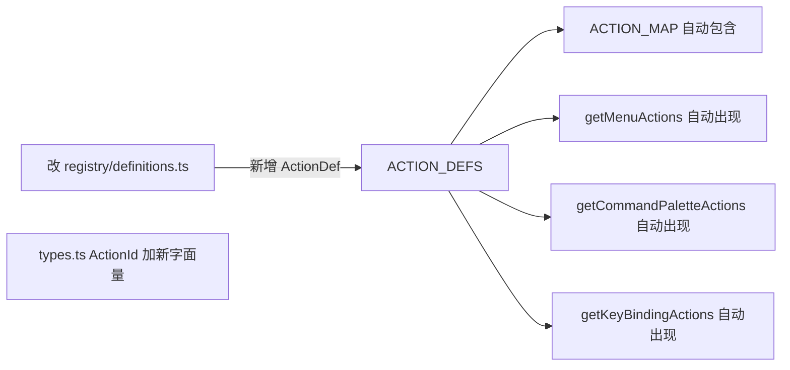
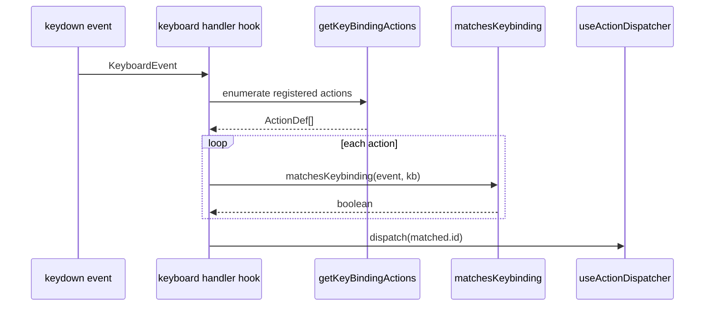

# `actions/registry` — 动作注册表

> 源码：`src/core/actions/registry.ts`（barrel）
>
> - `src/core/actions/registry/{definitions,helpers,types}.ts`
>   测试：`src/core/actions/__tests__/registry.test.ts`

## Purpose & Invariants

动作注册表是 Apollo Map Studio 中**所有**用户可执行操作的单一事实源（R5 规范）。
任何带按钮、菜单、快捷键的功能都先在 `ACTION_DEFS` 表里注册一行，再由各消费方
（MenuBar、CommandPalette、ToolStrip、键盘 handler）通过 helpers 拉取。

### 为什么集中注册？

历史上，菜单字符串、键盘 dispatcher 的 `if (e.key === 'p')`、ToolStrip 的图标列表
是三处独立硬编码。新增一个绘图工具要改 5 个文件，且经常漏改 menu 排序或快捷键提示。

集中后规则简化为：

> 加新动作 = 改 1 个文件（`registry/definitions.ts`），所有消费方自动同步。

### 不变量（必须保持）

1. **`ActionDef.id` 全局唯一**：`ACTION_MAP` 用它做 O(1) 反查。
2. **`drawTool` 字段对应 FSM 中的 `DrawTool`**：`getToolAction(drawTool)` 倒查的就是这条。
3. **`shortcut` 用 Mac glyph 形式**（`⌘S`、`⇧⌘Z`）：`formatShortcut` 在非 Mac 平台
   把 `⌘` 转成 `Ctrl+`、`⇧` 转成 `Shift+`、`⌥` 转成 `Alt+`。
4. **`keybinding.ctrl: true` 在 `matchesKeybinding` 中匹配 `ctrlKey || metaKey`**：
   一份配置同时跑 macOS 的 ⌘ 和 Windows/Linux 的 Ctrl。
5. **`category` 是封闭枚举**（`'file' | 'edit' | 'view' | 'tool' | 'selection'`）：
   命令面板和分组按它呈现。

## Public API

### Types

```ts
export type ActionId =
  | 'importApollo'
  | 'exportApolloBin'
  | 'exportApolloText'
  | 'settings'
  | 'undo'
  | 'redo'
  | 'delete'
  | 'toggleGrid'
  | 'toggleSnap'
  | 'resetLayout'
  | 'commandPalette'
  | 'defaultMode'
  | 'connectLanes'
  | 'tool:drawPolyline'
  | 'tool:drawBezier'
  | 'tool:drawArc'
  | 'tool:drawRotatedRect'
  | 'tool:drawPolygon'
  | 'tool:drawCatmullRom';

export type ActionCategory = 'file' | 'edit' | 'view' | 'tool' | 'selection';
export type ToolStripSlot = 'selection' | 'view';

export interface KeyBinding {
  key: string;
  ctrl?: boolean;
  shift?: boolean;
  alt?: boolean;
  global?: boolean;
}

export interface ActionDef {
  id: ActionId;
  label: string;
  category: ActionCategory;
  shortcut?: string; // Mac glyph form: '⌘S', '⇧⌘Z', '⌫', 'P'
  keybinding?: KeyBinding;
  icon?: IconType;
  inCommandPalette: boolean;
  menu?: string; // 'File' | 'Edit' | 'View'
  menuOrder?: number; // 同 menu 内升序，未指定按 99 兜底
  isToggle?: boolean;
  drawTool?: DrawTool; // 仅 category='tool' 使用
  uiSlot?: ToolStripSlot;
  uiOrder?: number;
}
```

文件位置：`src/core/actions/registry/types.ts`。

### `ACTION_DEFS: ActionDef[]`

`registry/definitions.ts` 中的静态数组，**当前 19 条**：

| id                     | category  | shortcut | menu      | drawTool        |
| ---------------------- | --------- | -------- | --------- | --------------- |
| `importApollo`         | file      | —        | File / 1  | —               |
| `exportApolloBin`      | file      | ⌘S       | File / 11 | —               |
| `exportApolloText`     | file      | ⇧⌘S      | File / 12 | —               |
| `settings`             | file      | ⌘,       | File / 90 | —               |
| `undo`                 | edit      | ⌘Z       | Edit / 10 | —               |
| `redo`                 | edit      | ⇧⌘Z      | Edit / 20 | —               |
| `delete`               | edit      | ⌫        | Edit / 40 | —               |
| `connectLanes`         | edit      | C        | Edit / 50 | —               |
| `toggleGrid`           | view      | ⌘G       | View / 20 | —               |
| `toggleSnap`           | view      | —        | View / 30 | —               |
| `resetLayout`          | view      | —        | View / 10 | —               |
| `commandPalette`       | view      | ⌘K       | —         | —               |
| `defaultMode`          | selection | H        | —         | —               |
| `tool:drawPolyline`    | tool      | P        | —         | drawPolyline    |
| `tool:drawBezier`      | tool      | B        | —         | drawBezier      |
| `tool:drawArc`         | tool      | A        | —         | drawArc         |
| `tool:drawRotatedRect` | tool      | R        | —         | drawRotatedRect |
| `tool:drawPolygon`     | tool      | G        | —         | drawPolygon     |
| `tool:drawCatmullRom`  | tool      | —        | —         | drawCatmullRom  |

来源：`src/core/actions/registry/definitions.ts:22-222`。

### `ACTION_MAP: Map<ActionId, ActionDef>`

`new Map(ACTION_DEFS.map((a) => [a.id, a]))` —— O(1) id 反查。
`ToolStrip` 处理 `tool:drawX` action 时直接 `ACTION_MAP.get(id)?.drawTool`。

文件位置：`src/core/actions/registry/helpers.ts:10`。

### `getActionsByCategory(category) => ActionDef[]`

按 category 过滤，**不排序**（保留 definitions 中的声明顺序）。
（`helpers.ts:12-14`）

### `getMenuActions(menu: string) => ActionDef[]`

按 `a.menu === menu` 过滤、按 `menuOrder` 升序（未填按 99 兜底）。MenuBar 渲染 File/Edit/View
菜单时调用。
（`helpers.ts:16-20`）

```ts
getMenuActions('Edit');
// → [undo, redo, delete, connectLanes]  (按 menuOrder 10/20/40/50)
```

### `getMenuNames() => string[]`

收集所有出现过的 menu 名（去重）。MenuBar 用它枚举顶层菜单。
（`helpers.ts:22-28`）

### `getCommandPaletteActions() => ActionDef[]`

`a.inCommandPalette === true` 的子集。CommandPalette 用它构建可搜索条目。
（`helpers.ts:30-32`）

### `getKeyBindingActions() => ActionDef[]`

带 `keybinding` 的子集，键盘 handler 遍历它做 `matchesKeybinding`。
（`helpers.ts:34-36`）

### `getToolAction(drawTool: DrawTool) => ActionDef | undefined`

DrawTool → ActionDef 反查。FSM 退出 draw state 时，`useDrawCommit` 用这个把
`drawTool` 还原成 actionId 上报埋点。
（`helpers.ts:38-40`）

### `getToolStripSlotActions(slot: ToolStripSlot) => ActionDef[]`

按 `uiSlot === slot` 过滤、按 `uiOrder` 升序。`ToolStrip` 用它渲染顶部按钮组
（当前 slot：`'selection' | 'view'`）。
（`helpers.ts:42-46`）

### `matchesKeybinding(e: KeyBindingEvent, kb: KeyBinding) => boolean`

键盘事件匹配规则：

```ts
key.toLowerCase() === kb.key.toLowerCase() &&
  !!kb.ctrl === (e.ctrlKey || e.metaKey) && // ⌘ === Ctrl
  !!kb.shift === e.shiftKey &&
  !!kb.alt === e.altKey;
```

关键点：`kb.ctrl` 同时匹配 macOS 的 `metaKey` 和 Win/Linux 的 `ctrlKey`，所以
一条 `{ key: 's', ctrl: true }` 在两边都触发。
（`helpers.ts:48-54`）

### `formatShortcut(shortcut: string | undefined) => string`

平台感知的快捷键展示。Mac 保留 glyph（`⌘S`），其它平台替换：

| Glyph | 替换为   |
| ----- | -------- |
| `⌘`   | `Ctrl+`  |
| `⌃`   | `Ctrl+`  |
| `⇧`   | `Shift+` |
| `⌥`   | `Alt+`   |

非 modifier glyph（`⌫` Backspace、`⏎` Return）原样透传。
（`helpers.ts:98-108`）

### `isMacPlatform() => boolean`

记忆化的平台检测。优先 `navigator.userAgentData.platform`，回退
`navigator.platform` + `navigator.userAgent`。iPad 伪装桌面 Safari 也能识别。
测试时通过 `_resetIsMacCache()` 清除缓存。
（`helpers.ts:69-91`）

## 算法 / 流程

### 注册一条新动作



如果新动作是 draw 工具，还要在 `fsm/editorMachine.ts` 的 `DrawTool` union 里
加一个字面量 + 在 `DRAW_STATES` 数组里加上 state 名。

### 键盘分发链



`KeyBinding.global` 字段保留给「需要在输入框焦点时也响应」的场景（如 `⌘S`）；
默认行为由消费 hook 决定，`registry` 本身不读这个字段。

### 平台展示链

```
ActionDef.shortcut = '⇧⌘Z'
        │
        ├── isMacPlatform() === true  → '⇧⌘Z'      （MenuBar / 命令面板）
        └── isMacPlatform() === false → 'Shift+Ctrl+Z'
```

## 复杂度

| 函数                       | 复杂度         | 备注                            |
| -------------------------- | -------------- | ------------------------------- |
| `ACTION_MAP.get(id)`       | O(1)           | Map                             |
| `getActionsByCategory`     | O(N)           | 不排序                          |
| `getMenuActions`           | O(N log N)     | 排序，但 N=19，常数级           |
| `getCommandPaletteActions` | O(N)           | filter                          |
| `getKeyBindingActions`     | O(N)           | filter                          |
| `getToolAction(drawTool)`  | O(N)           | find；N=6 时常数级              |
| `matchesKeybinding`        | O(1)           | 4 个布尔比较                    |
| `formatShortcut`           | O(L)           | 4 个 replace；L = shortcut 长度 |
| `isMacPlatform`            | O(1) amortized | 首次扫 UA 字符串后缓存          |

## 测试覆盖

`src/core/actions/__tests__/registry.test.ts` 覆盖：

- 每个 `ActionId` 都对应到 `ACTION_DEFS` 中**唯一**的一条
- `getMenuActions` 排序符合 `menuOrder`
- `matchesKeybinding` 的 4 个布尔字段穷举（有 ctrl 没 shift / 有 ctrl + shift…）
- `formatShortcut` 在 Mac / 非 Mac 路径分别快照
- `isMacPlatform` 在 `userAgentData.platform`、`navigator.platform`、UA 三档兜底
- `getToolAction` 对每个 `DrawTool` 都能拿回非空

## 消费者清单

| 消费方                                            | 调用                                                                                             |
| ------------------------------------------------- | ------------------------------------------------------------------------------------------------ |
| `src/components/layout/MenuBar.tsx`               | `getMenuNames()` + `getMenuActions(menu)`                                                        |
| `src/components/layout/panels/CommandPalette.tsx` | `getCommandPaletteActions()`                                                                     |
| `src/components/layout/ToolStrip.tsx`             | `getToolStripSlotActions('view' / 'selection')` + `ACTION_MAP.get(id)?.drawTool`                 |
| `src/hooks/useActionDispatcher.ts`                | `getKeyBindingActions()` + `matchesKeybinding(e, kb)`，并 switch on `ActionId`（编译期检查穷举） |

## 加新动作的 checklist

1. `registry/types.ts`：在 `ActionId` union 加字面量。
2. `registry/definitions.ts`：在 `ACTION_DEFS` 数组加一条 `ActionDef`，**至少**填
   `id` / `label` / `category` / `inCommandPalette`。如果要在菜单出现，加 `menu` +
   `menuOrder`；要走快捷键，加 `shortcut` + `keybinding`。
3. `useActionDispatcher.ts` 的 switch 加一个 case（TS 会强制提示穷举不全）。
4. 测试：在 `registry.test.ts` 加一条「新 id 出现且属性符合期望」。

如果是新绘图工具，还要：

5. `fsm/editorMachine.ts` 的 `DrawTool` 加字面量、`DRAW_STATES` 加状态名、
   补 `states[name].on` 的 transition map。
6. 在 `useDrawCommit.ts` 中处理对应的 commit 路径。
7. `core/elements.ts`：让某个 `MapElementDef.tools` 含这个新工具。

## See also

- [FSM / editorMachine](./fsm-editor-machine) — `DrawTool` 类型与 draw state 列表
- [elements](./elements) — `MAP_ELEMENTS` 中每个元素的允许工具
- [hooks/useActionDispatcher](/api/hooks/use-action-dispatcher) — action id → effect 的桥
- [components/MenuBar](/api/components/menu-bar) — 顶层消费者
