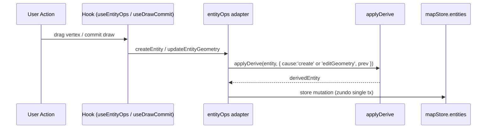

# `elements/derive` — 派生引擎

> 源码：`src/core/elements/derive/index.ts` + `types.ts` + `rules/{lane,parkingSpace}.ts`
> 测试：`src/core/elements/derive/__tests__/`

## Purpose & Invariants

派生引擎的责任：**把"从几何能算出来的字段"在 entity 落地之前一次性算好**。

业务背景：

- `lane.length` = `polylineLengthMeters(centralCurve)` —— 几何变了 length 就过期。
- `lane.turn` = 起终点方向夹角分类 —— 几何变了 turn 就可能过期。
- `parkingSpace.heading` = `_sourceRect.rotation`（拖旋转手柄会改 rotation）—— 必须同步。
- `lane.boundaryType[s=0]` = 项目默认 `DEFAULT_LANE_BOUNDARY_TYPE` —— 创建时种子值。

如果分散在 hook / 工厂 / inspector 表单里各自实现，会出现"创建时算过、拖动时
忘了再算"或者"inspector 改完几何 length 没刷"这类漂移。`applyDerive(entity, ctx)`
是 `create` / `editGeometry` 两类事件**唯一**的折叠入口，所有路径必经此函。

### 核心契约

1. **纯函数**：rule 不持有外部状态，输入 `(entity, ctx)` 输出新 entity（或同引用 no-op）。
2. **声明顺序折叠**：rules 按数组顺序 reduce，前一条的 output 是下一条的 input。
3. **`_userOverrides` 优先**：如果 entity 的 `_userOverrides: string[]` 包含 rule
   `owns` 数组中**任意**一条路径，整条 rule 跳过。
4. **trigger 过滤**：每条 rule 默认在 `['create', 'editGeometry']` 触发；可通过
   `rule.on` 收窄到子集。

### 不变量

- `applyDerive` 不修改 `_userOverrides` 自身（写入由 `markUserOverride` 显式负责）。
- 没有注册 rules 的 entityType 走 fast-path：`return entity`。
- rule 的 `apply` 必须是幂等的（连续多次跑结果不变）—— 测试会断言这条。

## Public API

### Types

```ts
export type DeriveCause = 'create' | 'editGeometry' | 'editAttribute';

export interface DeriveContext<E extends MapEntity> {
  cause: DeriveCause;
  /** 触发前的 entity 状态，给 diff-based gating 用（可选） */
  prev?: E;
  /** editAttribute 时用户改过的字段路径列表 */
  changedPaths?: readonly string[];
}

export interface DeriveRule<E extends MapEntity> {
  id: string; // 调试与去重用
  owns: readonly string[]; // rule 写入的字段路径
  on?: readonly DeriveCause[]; // 默认 ['create','editGeometry']
  apply(entity: E, ctx: DeriveContext<E>): E;
}
```

文件位置：`src/core/elements/derive/types.ts`。

### `applyDerive<E>(entity: E, ctx: DeriveContext<E>) => E`

主入口。按 `entity.entityType` 查 `REGISTRY`，逐条 reduce：

```ts
export function applyDerive<E extends MapEntity>(entity: E, ctx: DeriveContext<E>): E {
  const rules = REGISTRY[entity.entityType];
  if (!rules || rules.length === 0) return entity;

  const overrides = readOverrides(entity);
  let next: MapEntity = entity;

  for (const rule of rules) {
    const triggers = rule.on ?? DEFAULT_TRIGGERS; // ['create','editGeometry']
    if (!triggers.includes(ctx.cause)) continue;
    if (rule.owns.some((path) => overrides.has(path))) continue;
    next = rule.apply(next, ctx);
  }

  return next as E;
}
```

来源：`src/core/elements/derive/index.ts:42-57`。

### `markUserOverride<E>(entity: E, path: string) => E`

往 `entity._userOverrides` 加路径，已存在则返回原引用（idempotent）。
inspector 表单写 `lane.length` 之类字段时调用，使后续 editGeometry 不再覆写。

```ts
export function markUserOverride<E extends MapEntity>(entity: E, path: string): E {
  const arr = (entity as { _userOverrides?: readonly string[] })._userOverrides ?? [];
  if (arr.includes(path)) return entity;
  return { ...entity, _userOverrides: [...arr, path] } as E;
}
```

来源：`src/core/elements/derive/index.ts:63-67`。

### `clearUserOverride<E>(entity: E, path: string) => E`

释放某个 path 回派生，未在覆盖列表里则原引用返回。
inspector「释放此字段」按钮使用。

```ts
export function clearUserOverride<E extends MapEntity>(entity: E, path: string): E {
  const arr = (entity as { _userOverrides?: readonly string[] })._userOverrides;
  if (!arr || !arr.includes(path)) return entity;
  const next = arr.filter((p) => p !== path);
  return { ...entity, _userOverrides: next.length > 0 ? next : undefined } as E;
}
```

来源：`src/core/elements/derive/index.ts:74-79`。

## 已注册规则

### lane 规则（`derive/rules/lane.ts`）

| id                  | owns                                                          | on           | apply 行为                                                     |
| ------------------- | ------------------------------------------------------------- | ------------ | -------------------------------------------------------------- |
| `lane.length`       | `['length']`                                                  | (default)    | `polylineLengthMeters(centerPoints(e))`；同值返回原引用        |
| `lane.turn`         | `['turn']`                                                    | (default)    | `inferLaneTurn(centerPoints(e))`；同值返回原引用               |
| `lane.boundarySeed` | `['leftBoundary.boundaryType', 'rightBoundary.boundaryType']` | `['create']` | 数组为空时种入 `[{ s:0, types:[DEFAULT_LANE_BOUNDARY_TYPE] }]` |

`boundarySeed` 是 create-only 的设计抓手：**只**在创建时把空数组种子化，避免
mid-edit 拖动覆写用户在 inspector 里编辑过的 boundaryType segments。

### parkingSpace 规则（`derive/rules/parkingSpace.ts`）

| id                             | owns          | on        | apply 行为                                              |
| ------------------------------ | ------------- | --------- | ------------------------------------------------------- |
| `parkingSpace.headingFromRect` | `['heading']` | (default) | 若有 `_sourceRect`，把 `heading` 同步到 `rect.rotation` |

业务理由：`drawRotatedRect` 工具创建的车位带 `_sourceRect`；rotate 手柄会改
`rect.rotation`，但 inspector 显示的 `heading` 字段是 proto 直字段。`derive` 让
两者保持一致。

## 触发链路



## `_userOverrides` 路径表达式

路径用 dot 表达式：

- `length` → `entity.length`
- `leftBoundary.boundaryType` → `entity.leftBoundary.boundaryType`
- `regionOverlaps` → `(OverlapEntity).regionOverlaps`（在 overlap pipeline 用）

**精度匹配**：rule.owns 中只要**任意一条**路径出现在 `_userOverrides`，rule 就跳。
所以 lane.length / lane.turn 是 1:1 ownership；boundary type 是双路径绑定一条
rule（用户覆盖左 boundary 的 type 数组就同时锁住右——这个语义可以未来调整）。

## 复杂度

| 操作                   | 复杂度                                                                                                                                                         |
| ---------------------- | -------------------------------------------------------------------------------------------------------------------------------------------------------------- |
| `applyDerive` per call | O(R · O · A)，R=该 type 注册的 rule 数（lane=3、parking=1）；O=overrides 数（典型 0~3）；A=每条 rule apply 内部代价（lane.length 的 polyline 长度计算 = O(N)） |
| `markUserOverride`     | O(K) where K = 已有 overrides 数                                                                                                                               |
| `clearUserOverride`    | O(K)                                                                                                                                                           |

实际：lane apply 一次约 0.05ms（500 点 centralCurve），单帧多次调用也无 perf 风险。

## 测试覆盖

`src/core/elements/derive/__tests__/`：

- `applyDerive` 在 `create` cause 跑 boundarySeed，在 `editGeometry` 不跑（`on` 过滤）
- 对应 `_userOverrides` 路径在覆盖列表 → rule 跳过
- `markUserOverride` idempotent
- `clearUserOverride` 路径不存在时不变 reference
- 每条 lane rule 同值时返回原 reference（性能契约）

## 加新 rule 的 checklist

1. 在 `derive/rules/<entityType>.ts` 中（或新建文件）定义 `DeriveRule<EntityType>`：

   ```ts
   const myRule: DeriveRule<LaneEntity> = {
     id: 'lane.myField',
     owns: ['myField'],
     on: ['create', 'editGeometry'],
     apply: (e) => {
       const next = computeMyField(e);
       return next === e.myField ? e : { ...e, myField: next };
     },
   };
   ```

2. 把 rule 加到该 entity 类型的导出数组（如 `laneRules`）。
3. 不需要改 `index.ts`：`REGISTRY` 直接读 `laneRules` / `parkingSpaceRules`。
4. 测试：写一条 happy path + 一条 `_userOverrides` 钉位 + 一条幂等 reference equality。

## See also

- [elements](./elements) — `MapElementType` 与允许的工具
- [elements/overlap](./elements-overlap) — 同样以 `_userOverrides` 钉位
  保护用户编辑的 isMerge / regionOverlaps
- [geometry/apolloCompile](./geometry-apollo-compile) — `inferLaneTurn` 实现
- [lib/entityOps](/api/lib/entity-ops) — UI 写入 entity 的唯一入口；create / update
  路径都先调 `applyDerive`
