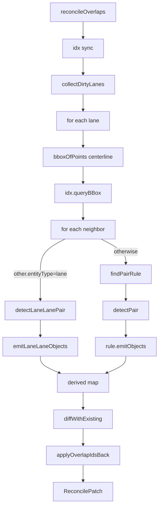
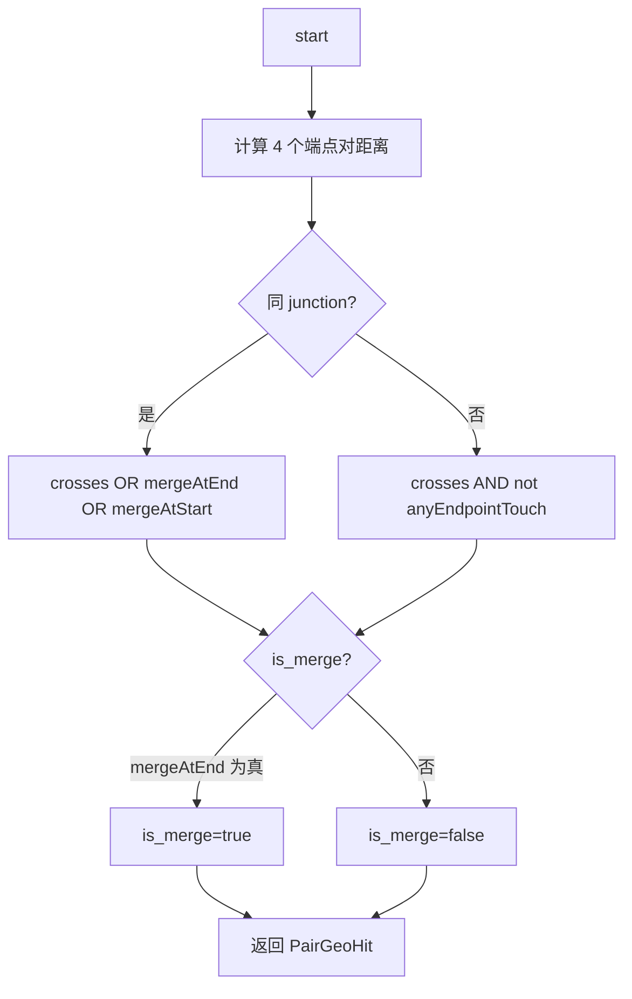

# `elements/overlap` — Overlap 重算管线

> 源码：`src/core/elements/overlap/`（12 文件）
> 测试：`src/core/elements/overlap/__tests__/`
> 关键文件：`reconcile.ts` / `spatialIndex.ts` / `pairTable.ts` / `intersect.ts`

## Purpose & Invariants

Apollo HD Map 的 `OverlapEntity` 描述 lane 与其它实体（junction、crosswalk、
signal、stopSign、signalLine、parkingSpace、…）相交的元数据：参与 id、
lane 上的弧长区间 `start_s/end_s`、合流标记 `is_merge`、可选的 region 多边形。

这条管线把这件事变成**纯函数**：`(entities, mode) → patch`。

- 输入：`ReadonlyMap<id, MapEntity>` + `ReconcileMode`
- 输出：`ReconcilePatch { changes, removedOverlapIds, stats }`
- store 在主线程一次性 apply patch（保持 zundo 单事务）

### 不变量

1. **id 单一体系（B.3 重构后）**：所有 overlap 的 id 都是
   `overlap_<sortedParticipants...>`。导入 Apollo 数据后第一次 reconcile 会把
   原 id 顺序统一到 sorted 形式，之后 set-diff 一致。**没有** "imported preserve"
   分支——overlap = 几何派生事实，由 reconcile 全权管理。
2. **手工修改用 `_userOverrides` 钉位保护**：`isMerge` 和 `regionOverlaps`
   是允许用户覆盖的字段；overrides 路径走 `parseLaneIsMergeOverride` 与
   `REGION_OVERLAPS_OVERRIDE_PATH`。reconcile 不动这些字段。
3. **lane 是 primary**：proto 的 `LaneOverlapInfo` 是唯一携带 `start_s/end_s`
   的 oneof 分支，所以扫描循环的抓手是 "per lane × neighbors"，O(L · k_avg)
   而非 O(N²)。
4. **每个对子最多一条 OverlapEntity**：dedup 由 `makeOverlapId([a,b])`
   语义 id 完成。
5. **lane × lane 同 junction / 跨 junction 行为不同**（GAP-2/GAP-7）：
   - 同 junction：穿越 / 端点合流 / 端点分流都计为 overlap（路口内轨迹冲突）
   - 跨 junction：只有"中心线穿越且不是单纯端点共享"才计；端点共享归 pred/succ 拓扑
   - `is_merge` 仅在 end-end 重合时为真（其它端点共享是 split / 拓扑链接）

## 文件地图

| 文件                  | 职责                                                                                 |
| --------------------- | ------------------------------------------------------------------------------------ |
| `index.ts`            | 公开 API barrel（`reconcileOverlaps` + `SpatialIndex` + `makeOverlapId` 等）         |
| `reconcile.ts`        | 主流程                                                                               |
| `spatialIndex.ts`     | RBush 包装；bbox 签名增量同步；模块级 singleton                                      |
| `intersect.ts`        | 几何相交基元（segments, polyline×polyline, polyline×polygon, point-in-polygon）      |
| `pairTable.ts`        | lane × secondary 配对规则 + `detectLaneLanePair` + emitter 工厂                      |
| `geometryAdapters.ts` | proto → 几何适配（`getCenterline` / `getPolygon` / `getStopLines` / `getPolylines`） |
| `computeLaneS.ts`     | lane 弧长缓存 + `projectSegmentParam`（segIdx,t → s 米）                             |
| `overlapId.ts`        | 语义化派生 id（`overlap_<sortedParts>`）                                             |
| `regionId.ts`         | 区域 id（`makeRegionId([a,b], idx)`）                                                |
| `overridePaths.ts`    | `_userOverrides` 路径解析                                                            |
| `laneCorridor.ts`     | lane corridor 多边形（GAP-5：lane × crosswalk 区域相交）                             |
| `polyClip.ts`         | polygon-clipping 包装（`intersectPolygons` / `largestRing`）                         |
| `types.ts`            | `BBox` / `IndexNode` / `ReconcileMode` / `ReconcilePatch` / `PairHit`                |

## Public API

### Types

```ts
export type ReconcileMode =
  { mode: 'incremental'; dirtyIds: ReadonlySet<string> } | { mode: 'full' };

export interface ReconcilePatch {
  changes: Map<string, MapEntity>;
  removedOverlapIds: Set<string>;
  stats: {
    pairsTested: number;
    pairsMatched: number;
    overlapsCreated: number;
    overlapsRemoved: number;
    durationMs: number;
  };
}

export interface BBox {
  minX: number;
  minY: number;
  maxX: number;
  maxY: number;
}
export interface IndexNode extends BBox {
  id: string;
  entityType: MapEntity['entityType'];
}
```

### `reconcileOverlaps(entities, mode, index?) => ReconcilePatch`

主入口（`reconcile.ts:57`）。流程：

1. 取 `idx = index ?? getSharedSpatialIndex()`，按 mode 同步：
   - `'full'` → `idx.syncFromEntities(entities)`（O(N) 全表 bbox 签名比对）
   - `'incremental'` → `idx.syncDirty(entities, dirtyIds)`（O(|dirtyIds|)）
2. `collectDirtyLanes` 拿到本轮要 rescan 的 lane 集合。
3. for each lane：bbox 索引查邻居 → 对每个邻居：
   - 邻居也是 lane → `detectLaneLanePair`
   - 否则 → `findPairRule(other.entityType)` + `detectPair`
4. 对子 `(lane, other)` 用 `makeOverlapId([lane.id, other.id])` 派生稳定 id；
   set-based dedup（symmetric in (A,B)）。
5. `diffWithExisting`：与现有 `OverlapEntity` 比对，得到 `changes` +
   `removedOverlapIds`；mergeWithOverrides 保留 `isMerge` / `regionOverlaps`
   钉位字段。
6. `applyOverlapIdsBack`：把派生 overlap id 同步回每个参与实体的
   `overlapIds: string[]` 字段（incremental 模式只动 dirtyIds 的 entity）。

### `invalidateLaneCaches(removedLaneIds: Iterable<string>): void`

清除 `computeLaneS` 中已删除 lane 的弧长缓存。配合 `mapStore.deleteEntity`
使用，避免 lane id 复用时拿到旧弧长。

### `SpatialIndex`

RBush 包装类。核心方法：

- `build(entities)` — 全量构建，O(N) load
- `syncFromEntities(entities)` — 全量比对，bbox 签名变化才重 insert/remove
- `syncDirty(entities, dirtyIds)` — O(|dirtyIds|) 增量
- `insert(entity)` / `remove(id)` — 单条
- `queryBBox(bbox) => IndexNode[]` — 邻居查询
- `queryNeighbors(id) => IndexNode[]` — 单实体邻居（不含自身）
- `clear()`、`size()`、`getBBox(id)`

### `bboxForEntity(entity) => BBox | null`

按 entityType 拿 bbox：

- lane → `bboxOfPoints(centerline)`
- 多边形类 → `bboxOfPoints(polygon.points)`
- stopLines / polylines 类 → 多 bbox 并集
- 没有几何 → null（不进索引）

### `getSharedSpatialIndex() / resetSharedSpatialIndex()`

模块级 singleton。store 复用同一实例避免每次 reconcile new + load N 节点。
worker 内独立 V8 isolate，自己持有 singleton（`overlap.worker.ts` 启动时
`resetSharedSpatialIndex()` 一次）。

### `makeOverlapId / isDerivedOverlapId`

```ts
makeOverlapId(['lane_3', 'junction_1']) === 'overlap_junction_1__lane_3';
isDerivedOverlapId('overlap_a__b') === true;
```

排序后用 `__` 连接，对 (A,B)/(B,A) 对称。

## 算法详解

### 配对扫描循环



### 几何相交策略矩阵

| secondary type                                           | geometry           | 触发条件                                          |
| -------------------------------------------------------- | ------------------ | ------------------------------------------------- |
| junction / pncJunction / clearArea / parkingSpace / area | polygon            | `polylineIntersectsPolygon`                       |
| crosswalk                                                | polygon (+ region) | 同上 + `laneCorridor × polygon` 计算精确区域      |
| signal / stopSign / yieldSign / barrierGate              | stopLines          | `polylinesIntersect(centerline, line)` 任意一条   |
| speedBump                                                | polylines          | `polylinesIntersect(centerline, line)`            |
| lane                                                     | special            | `detectLaneLanePair`（同 junction 内/外不同规则） |

### `detectLaneLanePair` 规则（GAP-2/GAP-7）



cosLat 用 laneA 起点纬度局部计算，避免大范围跨纬度地图全图均值带来的米空间偏差。

### bbox 签名增量同步

`SpatialIndex.bboxSig: Map<id, "minX|minY|maxX|maxY">` —— 缓存的是 bbox 的字符串
签名而**不是** entity reference。原因：immer producer 退出时会把 draft proxy
冻结成新 reference，旧版用 `prev === e` 比对会全图 ref-miss → cold-rebuild。
改用签名后：

- `lane.junctionId` 这种非几何字段变更 → 签名不变 → 跳过 tree mutation
- `centralCurve` 内容变了 → 签名变 → 重 insert
- immer freeze 切 ref → 签名不变 → 跳过

### 用户钉位保护（`mergeWithOverrides`）

`OverlapEntity._userOverrides` 可能包含：

| 路径                                    | 含义                                                                  |
| --------------------------------------- | --------------------------------------------------------------------- |
| `'objects.<i>.laneOverlapInfo.isMerge'` | 第 i 条 ObjectOverlapInfo 的 isMerge 钉位（手工切换合流标记）         |
| `'regionOverlaps'`                      | 整个 regionOverlaps 数组钉位（lane × crosswalk 多边形手工调整后保留） |

reconcile 仍重新计算所有 derived objects，但在 `mergeOneObject` 里：

- 若 i 在 isMerge 钉位 set → 把 derived.isMerge 替换回 existing 旧值
- 若 region 钉位 → 保留 existing.regionOverlaps + 同步 regionOverlapId 引用

## 复杂度

| 操作 | 复杂度 | 备注 |
| ------------------------------- | ------------ | -------------------------------- | ---- | -------------- |
| `reconcileOverlaps` full | O(L · k) | L=lane 数；k=平均邻居数（RBush） |
| `reconcileOverlaps` incremental | O( | dirty | · k) | dirty 通常 1~3 |
| `idx.syncFromEntities` | O(N) | 签名比对 |
| `idx.syncDirty` | O( | dirtyIds | ) | |
| `idx.queryBBox` | O(log N + k) | RBush |
| `detectLaneLanePair` | O(M·M) | M=segment 数；典型 < 100 |
| `polylineIntersectsPolygon` | O(M·V) | V=polygon 边 |

5w 实体规模实测：

- 编辑期 incremental（dirty=1）< 6ms
- 全量 reconcile ~450ms（走 worker，主线程不阻塞）

## 测试覆盖

`src/core/elements/overlap/__tests__/` 关键覆盖：

- `reconcile.test.ts` — full/incremental 双模式、各类 secondary 类型
- `spatialIndex.test.ts` — bbox 签名增量、immer reference 切换不误更新
- `intersect.test.ts` — 半开射线 / segment 共线 / polygon 退化
- `pairTable.test.ts` — 每条 PairRule 都能 emit 正确的 ObjectOverlapInfo
- `detectLaneLanePair` — 同 junction / 跨 junction / 4 种端点共享组合
- `mergeWithOverrides` — isMerge 钉位、regionOverlaps 钉位、引用一致性

## 主线程 vs Worker 分流

| 触发                                              | 路径               | 原因                                 |
| ------------------------------------------------- | ------------------ | ------------------------------------ |
| 编辑期 dirty                                      | 主线程 incremental | < 6ms，worker postMessage 开销不划算 |
| 导入完成 / 用户 "Recompute overlaps" / 导出前校验 | overlap.worker     | 5w 实体 ~450ms，主线程会卡帧         |

`overlap.worker.ts` 是 full 模式的封装；主线程通过 `OverlapWorkerBridge`
（参见 [workers-overlap](./workers-overlap)）发起请求。

## See also

- [elements/derive](./elements-derive) — 同样的 `_userOverrides` 钉位语义
- [workers/overlap](./workers-overlap) — Overlap Worker bridge 与协议
- [geometry/laneTopology](./geometry-lane-topology) — pred/succ/neighbor 派生
  （和 overlap pipeline 在端点共享判断上职责互补）
- [lib/entityOps](/api/lib/entity-ops) — store mutation 时的 dirty 计算入口
