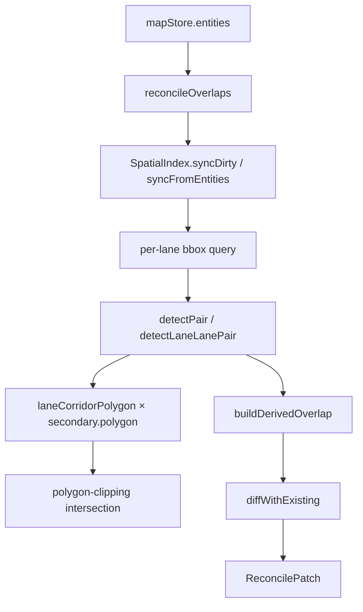

# Elements: overlap pipeline

> Source: `src/core/elements/overlap/{index,reconcile,types,...}.ts` (12 files)

## Overview

The overlap pipeline derives `OverlapEntity` instances from the _intersections_
between lanes and other map entities (junctions, crosswalks, signals, stop
signs, signal lines, parking spaces, …). Apollo's HD Map proto stores
overlap metadata as a first-class entity (`OverlapEntity`) carrying
`ObjectOverlapInfo[]` — for each participant, where the overlap starts /
ends along the lane (`laneOverlapInfo.startS / endS`) plus auxiliary
flags like `isMerge`. This module is the single owner of that derivation:
nothing else writes overlap entities.

The pipeline is **pure**: `(entities, mode) → patch`. The store applies
the patch in one zundo transaction.



Two operating modes:

- **`full`** — rebuild every lane × neighbour pair. Used for cold
  start / undo-redo / import / pre-export validation.
- **`incremental`** — only re-test the lanes in `dirtyIds` (or lanes
  that share an endpoint with a dirty non-lane entity). Used for in-edit
  reconcile, kept under ~6 ms per call so it can run on the main thread
  inside the 16 ms frame budget.

::: info Single id system (B.3 refactor)
Every overlap id is the semantic form `overlap_<sortedParticipants...>`.
Imported Apollo data has its `overlap_signal_0_lane_35`-style ids
coerced into this canonical sorted shape on first reconcile. There is no
"imported preserve" branch — overlap is treated as a derived geometric
fact owned by reconcile. Manual edits to `isMerge` / region polygons
survive via `_userOverrides` pinning (see [override paths](#override-paths)).
:::

## Module map

| File                  | Role                                                                                 |
| --------------------- | ------------------------------------------------------------------------------------ |
| `index.ts`            | Public re-exports                                                                    |
| `types.ts`            | `BBox`, `IndexNode`, `ReconcileMode`, `ReconcilePatch`, `PairHit`, `ResolvedOverlap` |
| `reconcile.ts`        | Main entry point + diff vs existing + override merge                                 |
| `spatialIndex.ts`     | RBush wrapper; bbox-signature-keyed sync                                             |
| `geometryAdapters.ts` | Entity → centerline / polygon / stopLines / polylines                                |
| `intersect.ts`        | Pure geometric primitives (bbox, segment cross, point-in-poly, etc.)                 |
| `pairTable.ts`        | Data-driven config: which entity pairs with what geometry                            |
| `computeLaneS.ts`     | Lane arc-length cache + segment-param projection                                     |
| `polyClip.ts`         | `polygon-clipping` wrapper (intersection / largest ring)                             |
| `laneCorridor.ts`     | Build the lane's geographic footprint polygon                                        |
| `overlapId.ts`        | `makeOverlapId(participantIds)` — semantic id derivation                             |
| `regionId.ts`         | `makeRegionId(participantIds, slot)` — for `RegionOverlapInfo`                       |
| `overridePaths.ts`    | Pin-path encoding shared with inspector                                              |

## Public API (index.ts)

```ts
export { reconcileOverlaps, invalidateLaneCaches } from './reconcile';
export {
  SpatialIndex,
  bboxForEntity,
  getSharedSpatialIndex,
  resetSharedSpatialIndex,
} from './spatialIndex';
export { makeOverlapId, isDerivedOverlapId } from './overlapId';
export type { ReconcileMode, ReconcilePatch, BBox, IndexNode } from './types';
```

Internal modules (`pairTable`, `intersect`, `polyClip`, …) are
implementation details — do not import them from outside `overlap/`.

## Types (types.ts)

```ts
interface BBox {
  minX;
  minY;
  maxX;
  maxY: number;
}
interface IndexNode extends BBox {
  id: string;
  entityType: MapEntity['entityType'];
}

type ReconcileMode = { mode: 'incremental'; dirtyIds: ReadonlySet<string> } | { mode: 'full' };

interface ReconcilePatch {
  changes: Map<string, MapEntity>; // overlap entities + overlapIds writes-back
  removedOverlapIds: Set<string>; // ids to delete
  stats: {
    pairsTested;
    pairsMatched: number;
    overlapsCreated;
    overlapsRemoved: number;
    durationMs: number;
  };
}
```

`PairHit` (internal) carries the result of a single pair scan, including
optional `laneInterval` (start_s / end_s) and `regionPolygon` (for
`crosswalk` × lane corridor clipping).

## reconcile.ts

### `reconcileOverlaps(entities, mode, index?): ReconcilePatch`

Main entry. The `index` parameter is optional; without it, the module
uses `getSharedSpatialIndex()` and syncs it according to mode (full →
`syncFromEntities`, incremental → `syncDirty`).

Algorithm:

1. **Sync index** — bbox signatures detect which entities' geometry
   actually changed; ref-equal entries skip tree mutation.
2. **Collect dirty lanes** — full mode = every lane; incremental =
   lanes in `dirtyIds`, plus lanes near a dirty non-lane (RBush
   `queryBBox`).
3. **Per-lane scan** — query neighbours by bbox, dedup pairs by
   `makeOverlapId([a, b])`, dispatch to `detectLaneLanePair` (lane × lane)
   or `detectPair` (lane × secondary).
4. **Build derived overlaps** — `{ id, participantIds, objects, regions }`.
5. **Diff vs existing** — produces `changes` (overlap entities + lanes
   with updated `overlapIds`) and `removedOverlapIds`.

::: warning Incremental scope is narrow
In incremental mode, an existing overlap is only candidate for removal
if **at least one** participant id is in `mode.dirtyIds`. Without this
guard a far-away overlap whose lane wasn't edited would be deleted
because it didn't appear in this round's `derived` map.
:::

### `invalidateLaneCaches(removedLaneIds)`

Clears the per-lane arc-length cache for deleted lanes.

### Override merge

`mergeWithOverrides(existing, derivedObjects)` reads
`existing._userOverrides` and rebuilds the `objects` array preserving:

- `isMerge` flag — when path matches `objects.<i>.laneOverlapInfo.isMerge`
- `regionOverlapId` reference — when path equals `regionOverlaps`

The geometric fields (`startS` / `endS`) always follow derivation.

## spatialIndex.ts

### `SpatialIndex` class

RBush-backed; keys nodes by entity id and tracks the last-seen bbox via
a string signature `"minX|minY|maxX|maxY"`.

| Method                          | Cost                      | Use                      |
| ------------------------------- | ------------------------- | ------------------------ |
| `build(entities)`               | O(N)                      | bulk load (cold start)   |
| `syncFromEntities(entities)`    | O(N)                      | full reconcile / undo    |
| `syncDirty(entities, dirtyIds)` | O(\|dirtyIds\|)           | edit-time                |
| `insert(entity)`                | O(log N) skip if sig same | single-entity update     |
| `remove(id)`                    | O(log N)                  | delete                   |
| `queryBBox(bbox)`               | O(log N + k)              | neighbour scan           |
| `queryNeighbors(id)`            | O(log N + k)              | shorthand                |
| `getBBox(id)`                   | O(1)                      | reconcile dedup          |
| `clear()`                       | O(N)                      | worker terminate / tests |
| `size()`                        | O(1)                      | telemetry                |

::: info Why bbox signatures, not entity references
An earlier revision cached entity references and compared `prev === e`.
But when entities flow through immer producers, the draft proxy is
replaced by a frozen object on producer exit — every subsequent
`syncFromEntities` was a ref-miss, forcing a full cold rebuild.
Switching to bbox signature-keyed comparison means non-geometric field
edits (e.g. `lane.junctionId` change with the same centerline) skip the
tree mutation entirely, and immer's freeze-swap doesn't trigger false
invalidations.
:::

### Singleton

`getSharedSpatialIndex()` lazy-creates a module-level `SpatialIndex`.
Reconcile reuses this so the index survives between calls; `zundo`
undo / redo just swaps `entities` references and `syncFromEntities`'s
bbox-signature comparison invalidates only the actually-changed nodes.
`resetSharedSpatialIndex()` is the test escape hatch.

### `bboxForEntity(entity): BBox | null`

Computes a bbox by entity type:

- `lane` → centerline
- area-shaped entities → polygon
- signals / stopSigns / yieldSigns / barrierGate → `bboxUnion(stopLines)` padded by `OVERLAP_STOPLINE_PROBE_DEG`
- speedBump → `bboxUnion(polylines)`
- otherwise → `null` (entity does not enter the index)

## intersect.ts

Pure geometric primitives. Inputs are `GeoPoint[]` (lng/lat degrees);
outputs are degrees, except `endpointsCoincide` which works in metres
via cosLat correction.

| Function                                      | Returns            | Notes                                      |
| --------------------------------------------- | ------------------ | ------------------------------------------ |
| `bboxOfPoints(points, pad?)`                  | `BBox \| null`     | empty array → `null` (caller guards)       |
| `bboxUnion(boxes)`                            | `BBox \| null`     | empty → `null`                             |
| `bboxOverlap(a, b)`                           | `boolean`          | inclusive on edges                         |
| `segmentsIntersect(a1, a2, b1, b2)`           | `GeoPoint \| null` | cross-product; collinear → null            |
| `pointInPolygon(point, polygon)`              | `boolean`          | half-open ray cast, skips horizontal edges |
| `polylinesIntersect(a, b)`                    | `boolean`          | any pair of segments                       |
| `polylineIntersectsPolygon(line, polygon)`    | `boolean`          | endpoints inside count as hit              |
| `polylinePolygonCrossings(line, polygon)`     | `SegmentParam[]`   | for `start_s` / `end_s` derivation         |
| `polylinePolylineCrossings(a, b)`             | `SegmentParam[]`   | for stopLine × lane intersections          |
| `endpointsCoincide(a, b, cosLat, toleranceM)` | `boolean`          | metre space                                |

`SegmentParam = { segmentIndex, t }` — segment index along the _first_
polyline plus parametric `t ∈ [0, 1]`.

## pairTable.ts

Data-driven configuration: which entity types pair with which, and what
geometry primitive to use.

```ts
interface PairRule {
  secondaryType: MapEntity['entityType'];
  geometry: 'polygon' | 'stopLines' | 'polylines' | 'lane';
  computeRegion?: boolean;
  emitObjects(lane, other, hit, opts?): ObjectOverlapInfo[];
}
```

Registered rules:

| Secondary                                           | Geometry  | computeRegion |
| --------------------------------------------------- | --------- | ------------- |
| `junction`                                          | polygon   | —             |
| `crosswalk`                                         | polygon   | **yes**       |
| `clearArea`                                         | polygon   | —             |
| `parkingSpace`                                      | polygon   | —             |
| `pncJunction`                                       | polygon   | —             |
| `area`                                              | polygon   | —             |
| `signal` / `stopSign` / `yieldSign` / `barrierGate` | stopLines | —             |
| `speedBump`                                         | polylines | —             |

`detectPair(lane, other, rule)` dispatches to the right primitive
(`detectPolygonHit` / `detectLineGroupHit`) and, when `computeRegion` is
set, additionally computes the lane corridor × secondary polygon
intersection via `polyClip.intersectPolygons` and stores the largest
ring on `hit.regionPolygon`.

### Lane × lane (detectLaneLanePair)

Has its own branch — proto's `LaneOverlapInfo` is the only oneof slot
that carries `start_s` / `end_s`, so the scan loop is "per lane × neighbours"
not "per pair".

Trigger conditions (GAP-2 revision):

1. **Same junction** (both `junctionId` non-null and equal) → crossings
   _or_ end-end merge _or_ start-start fork all count as overlap (path
   conflicts inside the junction itself).
2. **Different junction** → only **real centerline crossings** count;
   pure endpoint touches (succ/pred / fork / merge / selfReverse) are
   topology, not overlap.

`isMerge` (proto field) follows GAP-7 semantics: only true when the
_ends_ coincide — i.e. lanes converge to a shared exit. Start-start
forks (lanes diverging) are not merges.

`cosLat` is taken from the start latitude of `laneA`, not a global mean —
avoids miss/over-detect on multi-degree maps.

## computeLaneS.ts

Lane arc-length cache: prefix sums over the centerline polyline, keyed
by lane id with reference identity of `getCenterline(lane)` as the
revision marker.

```ts
laneArcLength(lane: LaneEntity): number          // total metres
projectSegmentParam(lane, segmentIndex, t): number  // (segIdx, t) → cumulative metres
invalidateLaneArcLength(laneId)                  // delete cache entry
clearLaneArcLengthCache()                        // tests
```

Invalidation is automatic on geometry edit: when `lane.centralCurve` is
mutated, `getCenterline` returns a fresh array reference, so the cached
entry's `centerline === points` check fails and the prefix sum is
rebuilt on next access. Manual invalidation is only needed when a lane
is deleted (`reconcile.invalidateLaneCaches`).

## geometryAdapters.ts

Bridges 14 Apollo entity types to four geometric primitives:

| Function                       | Output               | Used by                                              |
| ------------------------------ | -------------------- | ---------------------------------------------------- |
| `getCenterline(lane)`          | `GeoPoint[]`         | lane scan core                                       |
| `getPolygon(entity)`           | `GeoPoint[] \| null` | polygon-shaped pairs                                 |
| `getStopLines(entity)`         | `GeoPoint[][]`       | signal / stopSign / yieldSign / barrierGate          |
| `getPolylines(entity)`         | `GeoPoint[][]`       | speedBump                                            |
| `isOverlapParticipant(entity)` | `boolean`            | filter                                               |
| `curveToPolyline(curve)`       | `GeoPoint[]`         | helper — concatenates `Curve` segments, dedups joins |

## polyClip.ts

Polygon boolean wrapper around `polygon-clipping` (Martinez algorithm).

```ts
intersectPolygons(a: GeoPoint[], b: GeoPoint[]): GeoPoint[][]
largestRing(rings: GeoPoint[][]): GeoPoint[] | null
```

- Returns 0..n disjoint outer rings, **drops holes** (Apollo
  `RegionOverlapInfo` polygons are simple).
- Operates in lng/lat degrees — boolean ops are position relations,
  units don't matter.
- `largestRing` picks the largest by approximate metre-space area
  (cosLat-corrected).
- `polygon-clipping` can throw on self-intersecting input; we log and
  return `[]` rather than swallowing silently — this surfaces real bugs
  in upstream sanitisation.

## laneCorridor.ts

```ts
laneCorridorPolygon(lane: LaneEntity): GeoPoint[]
```

Builds the lane's geographic footprint as a closed ring (first point
duplicated at the end). Used as the _subject_ polygon for `crosswalk × lane`
region clipping.

Source priority:

1. **Explicit Apollo boundaries** — when `leftBoundary.curve` and
   `rightBoundary.curve` both have ≥ 2 points and form a non-degenerate
   ring (via `explicitLaneBoundaryEdges`), use them.
2. **Centerline offset** — fall back to
   `offsetPolylineDeg(centerline, leftWidth, 'left')` plus the right
   side, using the first sample's width (`lane.leftSamples[0]?.width`)
   or `DEFAULT_LANE_HALF_WIDTH`.

Returns `[]` if the centerline has fewer than 2 points or any width is
≤ 0.

## overlapId.ts

```ts
makeOverlapId(participantIds): string  // 'overlap_<sortedParticipants...>'
isDerivedOverlapId(id): boolean        // startsWith('overlap_')
```

Throws if `participantIds` is empty. Sorts and dedups participants —
order- and duplicate-invariant. Format mirrors Apollo Dreamview's real
data convention (`overlap_signal_0_lane_35`).

## regionId.ts

```ts
makeRegionId(participantIds, slot = 0): string
isDerivedRegionId(id): boolean
```

Format:

- `slot=0` → `region_<sortedIds.join('_')>`
- `slot>0` → `region_<sortedIds.join('_')>__<slot>`

The `__<slot>` suffix uses double underscore to avoid ambiguity with
underscore-separated participant ids. Throws on empty
`participantIds` or non-integer / negative `slot`.

`region_*` and `overlap_*` namespaces are mutually exclusive — a quick
prefix check tells you which kind of derived id you're looking at.

## overridePaths.ts

The single contract source for `_userOverrides[]` strings. Inspector
forms write paths via these helpers; reconcile reads via
`parseLaneIsMergeOverride`. Hardcoding the path on either side would
silently desync the two halves.

```ts
laneIsMergeOverridePath(objectIndex: number): string
// 'objects.<index>.laneOverlapInfo.isMerge'

REGION_OVERLAPS_OVERRIDE_PATH = 'regionOverlaps' as const
parseLaneIsMergeOverride(path): number | null
```

## Examples

Full reconcile after import:

```ts
import { reconcileOverlaps } from '@/core/elements/overlap';

const patch = reconcileOverlaps(entities, { mode: 'full' });
for (const id of patch.removedOverlapIds) entities.delete(id);
for (const [id, e] of patch.changes) entities.set(id, e);
```

Incremental edit (called by `mapStore.applyEntityMutations`):

```ts
const patch = reconcileOverlaps(entities, {
  mode: 'incremental',
  dirtyIds: new Set([editedLaneId]),
});
// patch.stats.durationMs typically < 6 ms for a single-lane edit
// on a 50k-entity map.
```

Off-thread full mode via the overlap worker bridge:

```ts
import { OverlapWorkerBridge } from '@/core/workers/overlapBridge';

const bridge = new OverlapWorkerBridge();
const patch = await bridge.reconcileFull(entities);
applyPatch(patch);
bridge.dispose();
```

## Related

- [Workers: overlap](/api/core/workers-overlap) — off-thread `reconcileFull`
- [Workers: spatial](/api/core/workers-spatial) — independent spatial index for cold-layer features
- [Geometry: laneTopology](/api/core/geometry-lane-topology) — uses the same `SpatialIndex` class
- [lib/entityOps](/api/lib/entity-ops) — applies reconcile patches to the store
