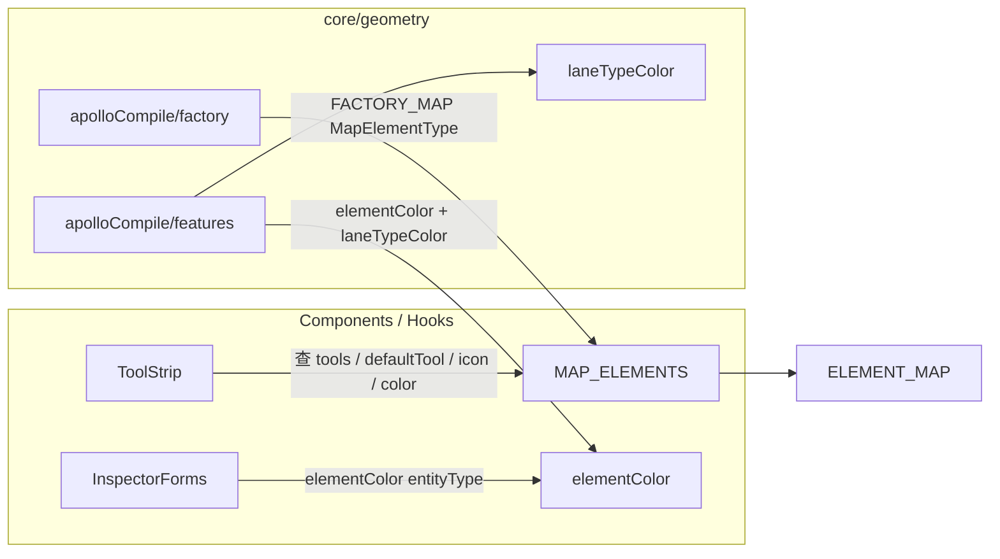

# `elements` — MapElement 目录

> 源码：`src/core/elements.ts`
> 子目录：`src/core/elements/derive/`、`src/core/elements/overlap/`（独立文档）

## Purpose & Invariants

`elements.ts` 定义了 Apollo HD 地图能编辑的**全部** 12 类元素的"元数据卡片"：

- 渲染颜色（hot layer + ToolStrip 图标 tint）
- 显示图标（react-icons 直接引用）
- 允许的绘制工具
- 默认绘制工具
- 几何类型（line / polygon）

它是 ToolStrip 元素分组的渲染源，也是 `core/geometry/apolloCompile/factory.ts`
按 `entityType` 分发到对应 `createXxx` 工厂的钥匙。

### 不变量

1. **`MapElementType` union 与 `MAP_ELEMENTS` 数组类型一致**：每个枚举字面量都
   必须有一行 `MapElementDef`，反之亦然。`ELEMENT_MAP.get(t)!` 可以用 `!` 断言
   是因为这条不变量。
2. **`tools` 是 FSM `DrawTool` 的子集**：FSM 没有的 tool 不会出现在 ToolStrip。
3. **`defaultTool ∈ tools`**：ToolStrip 选中元素时把 ToolStrip 切到 `defaultTool`。
4. **`color` 是十六进制 RGB**（非 ams-\* token）：hot layer 不走 Tailwind，用
   maplibre paint 表达式直接吃 hex。

## Public API

### Types

```ts
export type MapElementType =
  | 'lane'
  | 'junction'
  | 'pncJunction'
  | 'parkingSpace'
  | 'crosswalk'
  | 'signal'
  | 'stopSign'
  | 'speedBump'
  | 'yieldSign'
  | 'clearArea'
  | 'barrierGate'
  | 'area';

export interface MapElementDef {
  type: MapElementType;
  label: string; // 用户可见的中文标签
  tools: DrawTool[]; // 允许的绘制工具
  defaultTool: DrawTool; // 选中元素时默认用的工具
  color: string; // hex RGB
  geometry: 'line' | 'polygon';
  icon: IconType; // react-icons 组件
}
```

### `MAP_ELEMENTS: MapElementDef[]`

12 条静态定义。截取关键字段：

| type           | label    | tools                        | defaultTool     | color     | geometry |
| -------------- | -------- | ---------------------------- | --------------- | --------- | -------- |
| `lane`         | 车道     | drawBezier, drawArc          | drawBezier      | `#4a9eff` | line     |
| `junction`     | 路口     | drawPolygon                  | drawPolygon     | `#ffcc00` | polygon  |
| `pncJunction`  | PNC 路口 | drawPolygon                  | drawPolygon     | `#ff9933` | polygon  |
| `parkingSpace` | 车位     | drawRotatedRect, drawPolygon | drawRotatedRect | `#7c5cbf` | polygon  |
| `crosswalk`    | 人行横道 | drawRotatedRect, drawPolygon | drawRotatedRect | `#ffffff` | polygon  |
| `signal`       | 信号灯   | drawBezier                   | drawBezier      | `#22cc44` | line     |
| `stopSign`     | 停车标志 | drawBezier                   | drawBezier      | `#ff0000` | line     |
| `speedBump`    | 减速带   | drawBezier                   | drawBezier      | `#ffaa00` | line     |
| `yieldSign`    | 让行标志 | drawBezier                   | drawBezier      | `#ff6600` | line     |
| `clearArea`    | 禁停区   | drawRotatedRect, drawPolygon | drawRotatedRect | `#ff4466` | polygon  |
| `barrierGate`  | 道闸     | drawBezier                   | drawBezier      | `#aa66ff` | line     |
| `area`         | 区域     | drawPolygon                  | drawPolygon     | `#66aaff` | polygon  |

来源：`src/core/elements.ts:49-158`。

注意 `stopSign / speedBump / yieldSign / barrierGate / signal` 的 `geometry: 'line'`
反映的是**被绘制的几何形态**——它们的 Apollo proto 对应 `stopLines: Curve[]`，
不是几何上"线 vs 面"的物理意义。

### `ALL_DRAW_TOOLS`

```ts
export const ALL_DRAW_TOOLS = [
  { tool: 'drawBezier', label: '贝塞尔', color: 'bg-pink-500' },
  { tool: 'drawArc', label: '圆弧', color: 'bg-amber-500' },
  { tool: 'drawRotatedRect', label: '矩形', color: 'bg-red-500' },
  { tool: 'drawPolygon', label: '多边形', color: 'bg-purple-500' },
];
```

ToolStrip 用它在"未选元素"时画出 4 个原始几何工具。注意 `drawPolyline` /
`drawCatmullRom` 不在这里——它们是元素的**底层**绘制工具，但 UI 不直接展示。
（`elements.ts:161-166`）

### `ELEMENT_MAP: Map<MapElementType, MapElementDef>`

`new Map(MAP_ELEMENTS.map((e) => [e.type, e]))`，O(1) 反查。
（`elements.ts:168`）

### `elementColor(entityType: string): string | undefined`

```ts
ELEMENT_MAP.get(entityType as MapElementType)?.color;
```

`apolloCompile/features.ts` 用这个拿到默认渲染色，再叠加 lane.type 的语义色
（参见 `laneTypeColor`）。
（`elements.ts:170-173`）

### `laneTypeColor(type: string | undefined): string`

车道 `type` 字段的语义化配色（Apollo `LaneType` 枚举）：

| LaneType       | color     | 含义                               |
| -------------- | --------- | ---------------------------------- |
| `CITY_DRIVING` | `#4a9eff` | 机动车主色（默认/兜底）            |
| `BIKING`       | `#22cc44` | 非机动车（绿色出行）               |
| `SIDEWALK`     | `#cfd4dc` | 人行道（中性亮灰）                 |
| `PARKING`      | `#7c5cbf` | 停车（紫色，与 parkingSpace 呼应） |
| `SHOULDER`     | `#ffaa00` | 路肩（琥珀警示）                   |
| `SHARED`       | `#66aaff` | 共享车道（浅蓝）                   |
| `NONE`         | `#6b7280` | 未定义（冷灰）                     |
| 其它           | `#4a9eff` | 默认蓝                             |

色调取自 ams-\* 调性，但仍是 hex（hot layer 直吃）。
（`elements.ts:187-206`）

## 调用关系



## 测试覆盖

没有专门的 `elements.test.ts`；正确性由消费者间接覆盖：

- `apolloCompile.label.test.ts`：每个 `MapElementType` 都能被 `createApolloEntity`
  工厂创建，验证 `MAP_ELEMENTS` 的 12 条与 `FACTORY_MAP` 12 条 1:1。
- `apolloCompile.gaps.test.ts`：`compileApolloFeatures` 对每个 entityType 都能产
  feature（保证 `elementColor` fallback 不会让某类元素隐身）。
- `signalFactory.test.ts` 等具体子工厂测试。

## 加新元素的 checklist

> 注意：新增"地图元素"是**重活**——会同时涉及 proto 类型、reconcile pipeline、
> ToolStrip 渲染、几何工厂、特征编译。这里只列 `core/elements.ts` 这一步。

1. `MapElementType` union 加新字面量。
2. `MAP_ELEMENTS` 数组加一行 `MapElementDef`，至少填 `type` / `label` / `tools` /
   `defaultTool` / `color` / `geometry` / `icon`。
3. 为新元素**同时**改：
   - `src/types/apollo.ts`：proto 类型 + `MapEntity` union
   - `src/core/geometry/apolloCompile/factory.ts`：`FACTORY_MAP` 加新工厂
   - `src/core/geometry/apolloCompile/features.ts`：`RENDERERS` 加新渲染器
   - `src/core/elements/overlap/pairTable.ts`：如需参与 overlap 重算，加 PairRule
   - `src/components/layout/panels/InspectorForms.tsx`：表单
4. 跑 `apolloCompile.label.test.ts` —— 它会断言 12 → 13 类被 `MAP_ELEMENTS` /
   `FACTORY_MAP` / `RENDERERS` 都处理到。

## See also

- [elements/derive](./elements-derive) — 派生引擎（lane.length / parking.heading）
- [elements/overlap](./elements-overlap) — Overlap 重算管线
- [geometry/apolloCompile](./geometry-apollo-compile) — `createApolloEntity` 工厂
- [actions/registry](./actions-registry) — `DrawTool` 的 SELECT_TOOL action
- [fsm/editorMachine](./fsm-editor-machine) — `DrawTool` 类型本源
