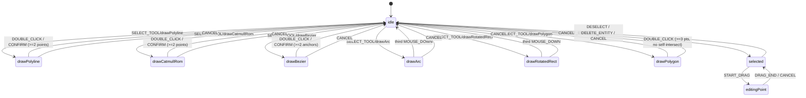

# FSM: editorMachine

> Source: `src/core/fsm/editorMachine.ts`

## Overview

`editorMachine` is the single source of truth for editor interaction state.
It is an XState 5 machine that drives drawing tools, selection, and
control-point editing. UI components (`MapCanvas`, `ToolStrip`, keyboard
handler) all observe and dispatch through this one machine; nothing in
the codebase carries a parallel "is the user mid-draw" boolean.

The machine intentionally only knows about geometric _intent_ — it tracks
the points the user has clicked, the bezier handle being dragged, the
selected entity id. It never touches `mapStore`. Commit-side effects are
handled by `useDrawCommit` (subscribes to FSM transitions, calls
`mapStore.addEntity` when a draw state exits to `idle`) and by
`MapCanvas` (executes vertex moves on `DRAG_END`).

::: info Design rationale (R1 closure)
The undo dispatcher (`useActionDispatcher.ts`) sends `CANCEL` to this
machine _before_ invoking `temporal.undo()`. Without that, mid-draw
Ctrl+Z would leave `drawPoints` populated while `mapStore` rolled back,
corrupting the next CONFIRM. See [architecture audit](/architecture/cold-hot-layers).
:::

## Exports

### Types

#### `DrawTool`

```ts
type DrawTool =
  | 'drawPolyline'
  | 'drawCatmullRom'
  | 'drawBezier'
  | 'drawArc'
  | 'drawRotatedRect'
  | 'drawPolygon';
```

Six drawing tools. Every value matches a state node id in the machine —
`tool === stateValue` is a load-bearing convention used by
`useDrawCommit` and the action registry.

#### `EditorContext`

```ts
interface EditorContext {
  drawPoints: LngLat[];
  previewPoint: LngLat | null;
  bezierAnchors: BezierAnchor[];
  isDraggingHandle: boolean;
  selectedEntityId: string | null;
  dragPointIndex: number;
  dragPointType: DragPointType;
  dragCurrentPoint: LngLat | null;
  dragAltKey: boolean;
  /** 当前正在绘制的 Apollo 元素类型，null 则创建基础几何图形 */
  activeElement: MapElementType | null;
}
```

`drawPoints` and `bezierAnchors` are the in-flight geometry buffers.
`activeElement` is the Apollo element type the user picked from the
toolstrip (e.g. `'lane'`, `'crosswalk'`); `useDrawCommit` reads it to
decide which factory to call.

#### `EditorEvent`

Tagged union of every event the machine accepts. Notable members:

| Event                                    | Payload                                    | Sent by                             |
| ---------------------------------------- | ------------------------------------------ | ----------------------------------- |
| `SELECT_TOOL`                            | `tool: DrawTool, element?: MapElementType` | ToolStrip / keyboard                |
| `MOUSE_DOWN` / `MOUSE_MOVE` / `MOUSE_UP` | `point: LngLat`                            | `useMapEventRouter`                 |
| `DOUBLE_CLICK`                           | `point: LngLat`                            | `useMapEventRouter`                 |
| `CONFIRM` / `CANCEL`                     | —                                          | Enter/Esc handler                   |
| `RESET`                                  | —                                          | `useDrawCommit` post-commit cleanup |
| `SELECT_ENTITY` / `DESELECT`             | `id: string`                               | hit-test result                     |
| `START_DRAG`                             | `index, pointType, altKey?`                | MapCanvas mousedown                 |
| `DRAG_MOVE` / `DRAG_END`                 | `point: LngLat`                            | MapCanvas                           |
| `DELETE_ENTITY`                          | —                                          | keyboard Delete                     |
| `TOGGLE_SMOOTH`                          | `index: number`                            | Alt+click on bezier anchor          |

`RESET` exists because `CONFIRM` / `DOUBLE_CLICK` only target `idle`
without clearing `drawPoints` — `useDrawCommit` must read the
post-transition snapshot to commit. After commit it sends `RESET` to
clear `activeElement` so the toolstrip highlight goes away.

### Functions

#### `isDrawingState(state: string): boolean`

True when the value is one of the six `DrawTool` ids. Used by the cold/hot
layer scheduler to decide which path to take.

### Machine

#### `editorMachine`

The exported XState machine. Built with `setup({ types, guards, actions
}).createMachine({ ... })` — the modern typed pattern. All `assign(...)`
expressions are inlined inside the `actions` map of `setup()` so XState 5's
generic inference flows through cleanly.

::: info XState 5 typing migration
Earlier revisions had `// @ts-nocheck` because lifting `assign(...)` to
top-level constants forces the caller to provide all 5 type arguments
(`TContext, TExpressionEvent, TParams, TEvent, TActor`), and the
resulting `ActionFunction._out_TEvent` widens to `EventObject`, breaking
the structural match against the `setup.actions` map. Inlining inside
`setup({ actions })` sidesteps that entirely and lets us drop the
`@ts-nocheck` pragma.
:::

## Behavior

### State chart



### Guards

| Guard                    | Predicate                                                                    |
| ------------------------ | ---------------------------------------------------------------------------- |
| `minPointsReached`       | `drawPoints.length >= 2` (polyline / catmull / arc / rect / generic confirm) |
| `bezierMinAnchors`       | `bezierAnchors.length >= 2`                                                  |
| `isDraggingHandle`       | `context.isDraggingHandle === true`                                          |
| `twoPointsLaid`          | `drawPoints.length === 2` (third click commits drawArc / drawRotatedRect)    |
| `polygonNoSelfIntersect` | adding `event.point` would not cross an existing edge                        |
| `polygonCanClose`        | `>=3` points and the resulting closed ring is simple                         |
| `polygonCanConfirm`      | same as `polygonCanClose`, used by Enter                                     |

### Actions

| Action                            | Effect                                                                                                                                     |
| --------------------------------- | ------------------------------------------------------------------------------------------------------------------------------------------ |
| `resetDraw`                       | clears `drawPoints` / `previewPoint` / `bezierAnchors` / `isDraggingHandle`, and sets `activeElement` from `SELECT_TOOL.element` (or null) |
| `addPoint`                        | appends `event.point` to `drawPoints`                                                                                                      |
| `updatePreview`                   | sets `previewPoint` to `event.point`                                                                                                       |
| `bezierAddAnchor`                 | pushes a new `BezierAnchor` and sets `isDraggingHandle = true`                                                                             |
| `bezierDragHandle`                | mirror-updates the tail anchor's `handleIn` / `handleOut` while the user drags                                                             |
| `bezierConfirmHandle`             | clears `isDraggingHandle`; if the drag distance was sub-epsilon, nulls the handles to keep a sharp corner                                  |
| `bezierPreview`                   | sets `previewPoint`                                                                                                                        |
| `selectEntity` / `deselectEntity` | toggle `selectedEntityId`, reset drag fields                                                                                               |
| `startDrag`                       | captures `index`, `pointType`, `altKey` from `START_DRAG`                                                                                  |
| `dragMove`                        | updates `dragCurrentPoint`                                                                                                                 |

### Three-click commit (drawArc / drawRotatedRect)

Both share the same on-handler:

```ts
threeClickCommitEvents.MOUSE_DOWN = [
  { guard: 'twoPointsLaid', target: 'idle', actions: 'addPoint' },
  { actions: 'addPoint' },
];
```

XState evaluates transitions top-to-bottom; the first guarded transition
captures the third click and ends in `idle`, the bare second one accepts
the first two clicks.

::: warning dblclick dedup is in the input layer
Earlier revisions had a `removeLastPoint` action because dblclick
typically fires two `mousedown` events. That second click is now squelched
by `useMapEventRouter.isDuplicateInput` before it reaches the FSM. **Do
not** add compensatory `slice(-1)` calls on `DOUBLE_CLICK` — that would
clip the user's actual final point. Single source of truth: dedup in the
input layer; FSM trusts `drawPoints`.
:::

## Examples

Drawing a 3-point polygon (taken from `useMapEventRouter` flow):

```ts
// User clicks toolstrip "Lane" → "Polyline":
actor.send({ type: 'SELECT_TOOL', tool: 'drawPolyline', element: 'lane' });

// Three clicks on the canvas:
actor.send({ type: 'MOUSE_DOWN', point: [121.5, 31.2] });
actor.send({ type: 'MOUSE_DOWN', point: [121.6, 31.2] });
actor.send({ type: 'MOUSE_DOWN', point: [121.6, 31.3] });

// Double-click commits — DOUBLE_CLICK guard `minPointsReached` passes:
actor.send({ type: 'DOUBLE_CLICK', point: [121.6, 31.3] });
// state.value = 'idle', context.drawPoints still holds the three points.

// useDrawCommit subscriber reads the post-transition snapshot,
// invokes mapStore.addEntity, then sends RESET to clear activeElement.
actor.send({ type: 'RESET' });
```

Mid-draw cancellation via undo (the R1 closure):

```ts
// useActionDispatcher.ts:76-82
function undo() {
  // CRITICAL: cancel any in-flight draw before zundo rolls back.
  actor.send({ type: 'CANCEL' });
  temporal.undo();
}
```

## Related

- [Action registry](/api/core/actions-registry) — the source of `SELECT_TOOL` events
- [Geometry: validation](/api/core/geometry-validation) — `wouldSelfIntersect` and `polygonSelfIntersects`
- [Geometry: interpolate](/api/core/geometry-interpolate) — `BezierAnchor` and `mirrorPoint`
- [Architecture: cold/hot layers](/architecture/cold-hot-layers) — how FSM transitions feed into draw commits
