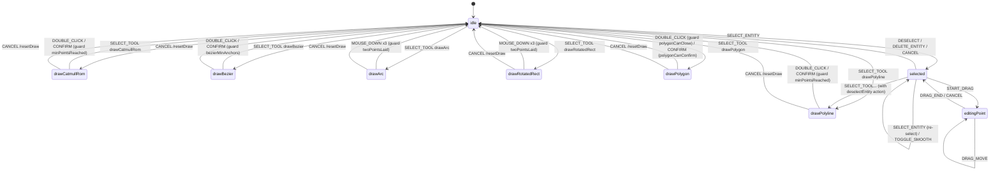

# `fsm/editorMachine` — 编辑器状态机

> 源码：`src/core/fsm/editorMachine.ts`
> 测试：`src/core/fsm/__tests__/editorMachine.test.ts`（~47 KB，是仓库最大的单测）

## Purpose & Invariants

`editorMachine` 是编辑器交互行为的**唯一**事实源。所有
"鼠标点了哪里 → 是不是该加点 / 是不是该 commit / 是不是该 dispatch DRAG_END"
的决策都在这里，UI 层（MapCanvas / hooks）只负责把 DOM 事件翻译成 `EditorEvent`、
读 FSM snapshot 来 render hot layer。

### 不变量

1. **`idle` 是初始态、所有 commit/cancel 的归处**：drawing / selected / editingPoint
   出来的所有路径最后回到 `idle`（commit 路径除外，参见下文 RESET 语义）。
2. **commit 不清空 context**：DOUBLE_CLICK / CONFIRM 转 idle 时**只 target idle，不带
   actions**。`drawPoints` / `bezierAnchors` / `activeElement` 等保留给
   `useDrawCommit` 读 post-snapshot。然后由 `useDrawCommit` 在 idle 收到 commit 之后
   发 `RESET` 事件做收尾，否则 `activeElement` 残留导致 ToolStrip 元素高亮不会清。
3. **Input 层 dedup 是 dblclick 单一事实源**：`useMapEventRouter` 的 `isDuplicateInput`
   已经把 dblclick 的第二次 click 吞掉。FSM **不再**在 DOUBLE_CLICK 路径里 `slice(-1)`
   补偿——这是早期版本的 R1 bug，现已修复（参见 `editorMachine.ts:84-87` 注释）。
4. **`// @ts-nocheck` 是临时妥协**：XState 5 的 `assign(...)` 签名要求 5 个泛型，
   提到 module 顶层会让 `_out_TEvent` 推宽到 `EventObject`，破坏与
   `setup({ types }).actions` 映射的结构匹配。inline assign 即可绕过。文件顶部
   `// @ts-nocheck` 留给历史的 typed-machine 实验态，新代码沿用 inline assign 模式。
   （注：当前文件没有 `// @ts-nocheck`，注释 `editorMachine.ts:120-128` 解释了为何
   把 assign inline。）
5. **selectToolTransitions 单一事实源**：6 条 `SELECT_TOOL` transition 由
   `DRAW_STATES.map(...)` 生成，避免手抄漂移。

## State chart



## Public API

### `DrawTool`

```ts
export type DrawTool =
  | 'drawPolyline'
  | 'drawCatmullRom'
  | 'drawBezier'
  | 'drawArc'
  | 'drawRotatedRect'
  | 'drawPolygon';
```

唯一的"绘制工具"枚举；`actions/registry` 与 `core/elements` 都引用这个类型，
保证三处不漂移。

### `isDrawingState(state: string) => boolean`

判断 FSM `state.value` 是否为 6 个 draw state 之一。
（`editorMachine.ts:28-30`）

### `EditorContext`

```ts
export interface EditorContext {
  drawPoints: LngLat[]; // polyline / arc / rect / polygon 共用
  previewPoint: LngLat | null; // mousemove 实时位置
  bezierAnchors: BezierAnchor[]; // 仅 drawBezier 用
  isDraggingHandle: boolean; // 仅 drawBezier 用
  selectedEntityId: string | null;
  dragPointIndex: number; // -1 表示无
  dragPointType: DragPointType; // 'vertex' | 'control' | 'rotate' | ...
  dragCurrentPoint: LngLat | null;
  dragAltKey: boolean; // 拖控制柄时是否按住 Alt（解锁尖角）
  activeElement: MapElementType | null;
}
```

### `EditorEvent`

```ts
export type EditorEvent =
  | { type: 'SELECT_TOOL'; tool: DrawTool; element?: MapElementType }
  | { type: 'MOUSE_DOWN'; point: LngLat }
  | { type: 'MOUSE_MOVE'; point: LngLat }
  | { type: 'MOUSE_UP'; point: LngLat }
  | { type: 'DOUBLE_CLICK'; point: LngLat }
  | { type: 'CONFIRM' }
  | { type: 'CANCEL' }
  | { type: 'RESET' }
  | { type: 'SELECT_ENTITY'; id: string }
  | { type: 'DESELECT' }
  | { type: 'START_DRAG'; index: number; pointType: DragPointType; altKey?: boolean }
  | { type: 'DRAG_MOVE'; point: LngLat }
  | { type: 'DRAG_END'; point: LngLat }
  | { type: 'DELETE_ENTITY' }
  | { type: 'TOGGLE_SMOOTH'; index: number };
```

#### `RESET` 事件的存在理由

`RESET` 与 `CANCEL` 区别：

| 事件     | 触发场景                       | 谁发                         | 改 context  |
| -------- | ------------------------------ | ---------------------------- | ----------- |
| `CANCEL` | 用户主动取消（Esc / 切换工具） | 键盘 / ToolStrip             | `resetDraw` |
| `RESET`  | commit 完成后**收尾**          | `useDrawCommit` 在 idle 态发 | `resetDraw` |

`useDrawCommit` 监听 FSM transition，在 draw → idle 完成、调用
`mapStore.addEntity(...)` 之后再发 `RESET`，让 `activeElement` 等清空。
否则 ToolStrip 会持续高亮上一次绘制元素，下一次 SELECT_TOOL 才会被覆写。

### `editorMachine`

XState 5 `setup({ types, guards, actions }).createMachine({ id, initial, context, states })`。

```ts
import { createActor } from 'xstate';
import { editorMachine } from '@/core/fsm/editorMachine';

const actor = createActor(editorMachine);
actor.start();
actor.send({ type: 'SELECT_TOOL', tool: 'drawPolyline' });
const snapshot = actor.getSnapshot();
console.log(snapshot.value); // 'drawPolyline'
console.log(snapshot.context.drawPoints); // []
```

## Guards

| guard                    | 条件                                                   | 用在                                                    |
| ------------------------ | ------------------------------------------------------ | ------------------------------------------------------- |
| `minPointsReached`       | `drawPoints.length >= 2`                               | drawPolyline / drawCatmullRom 的 DOUBLE_CLICK / CONFIRM |
| `bezierMinAnchors`       | `bezierAnchors.length >= 2`                            | drawBezier 的 DOUBLE_CLICK / CONFIRM                    |
| `isDraggingHandle`       | `context.isDraggingHandle === true`                    | drawBezier 的 MOUSE_MOVE 分支                           |
| `twoPointsLaid`          | `drawPoints.length === 2`                              | drawArc / drawRotatedRect 第三次 MOUSE_DOWN 落 commit   |
| `polygonNoSelfIntersect` | 加新点不会让多边形自交                                 | drawPolygon 的 MOUSE_DOWN                               |
| `polygonCanClose`        | `points.length >= 3 && !polygonSelfIntersects(points)` | drawPolygon 的 DOUBLE_CLICK                             |
| `polygonCanConfirm`      | 同上                                                   | drawPolygon 的 CONFIRM（命令面板路径）                  |

## Actions

| action                | 写入 context                                                                                                | 触发场景                             |
| --------------------- | ----------------------------------------------------------------------------------------------------------- | ------------------------------------ |
| `resetDraw`           | drawPoints/bezierAnchors/previewPoint/isDraggingHandle 清零；activeElement 取自 SELECT_TOOL.element 或 null | SELECT_TOOL / CANCEL / RESET         |
| `addPoint`            | `drawPoints.push(event.point)`                                                                              | 大多数 draw state 的 MOUSE_DOWN      |
| `updatePreview`       | `previewPoint = event.point`                                                                                | MOUSE_MOVE                           |
| `bezierAddAnchor`     | 追加 `{ point, handleIn:null, handleOut:null }`；isDraggingHandle=true                                      | drawBezier 的 MOUSE_DOWN             |
| `bezierDragHandle`    | 修改最后一个 anchor 的 handleOut/handleIn（mirror）                                                         | drawBezier 拖控制柄期间的 MOUSE_MOVE |
| `bezierConfirmHandle` | 距离 < 1e-6 时把 handleIn/Out 置 null（尖角）                                                               | drawBezier 的 MOUSE_UP               |
| `bezierPreview`       | `previewPoint = event.point`                                                                                | drawBezier 不在拖手柄时的 MOUSE_MOVE |
| `selectEntity`        | `selectedEntityId = event.id` + 重置 drag 字段                                                              | SELECT_ENTITY                        |
| `deselectEntity`      | selectedEntityId=null + drag 字段清零                                                                       | DESELECT / DELETE_ENTITY / CANCEL    |
| `startDrag`           | dragPointIndex/dragPointType/dragAltKey 来自 event                                                          | START_DRAG                           |
| `dragMove`            | dragCurrentPoint = event.point                                                                              | DRAG_MOVE                            |

## 共享 transition map

为了减少 6 个 draw state 的重复定义，FSM 用 3 个共享对象：

### `selectToolTransitions`

`DRAW_STATES.map(tool => ({ guard: ev.tool === tool, target: tool, actions: ['resetDraw'] }))`

每条 transition 都带 `resetDraw`，所以从任意 draw state 切到另一个 draw state 时
context 会清空。

### `selectToolFromSelected`

`selectToolTransitions.map(t => ({ ...t, actions: ['deselectEntity', ...t.actions] }))`

从 selected 态切换工具会先 deselect。

### `sharedDrawEvents`

drawPolyline / drawCatmullRom 共享：

```ts
{
  SELECT_TOOL: selectToolTransitions,
  MOUSE_DOWN: { actions: 'addPoint' },
  MOUSE_MOVE: { actions: 'updatePreview' },
  DOUBLE_CLICK: { guard: 'minPointsReached', target: 'idle' },
  CONFIRM: { guard: 'minPointsReached', target: 'idle' },
  CANCEL: { target: 'idle', actions: 'resetDraw' },
}
```

### `threeClickCommitEvents`

drawArc / drawRotatedRect 共享（点 1=起点，点 2=中段，点 3=commit）：

```ts
{
  SELECT_TOOL: selectToolTransitions,
  MOUSE_DOWN: [
    { guard: 'twoPointsLaid', target: 'idle', actions: 'addPoint' },
    { actions: 'addPoint' },
  ],
  MOUSE_MOVE: { actions: 'updatePreview' },
  CANCEL: { target: 'idle', actions: 'resetDraw' },
}
```

`MOUSE_DOWN` 是数组——XState 5 按顺序找首个 guard 通过的 transition。第三次落点时
`drawPoints.length === 2`，guard 通过，`addPoint` 之后转 idle，`useDrawCommit` 读到
3 个点完成 commit。

## drawPolygon 的特殊路径

```ts
drawPolygon: {
  on: {
    SELECT_TOOL: selectToolTransitions,
    MOUSE_DOWN: { guard: 'polygonNoSelfIntersect', actions: 'addPoint' },
    MOUSE_MOVE: { actions: 'updatePreview' },
    DOUBLE_CLICK: { guard: 'polygonCanClose', target: 'idle' },
    CONFIRM:     { guard: 'polygonCanConfirm', target: 'idle' },
    CANCEL: { target: 'idle', actions: 'resetDraw' },
  },
}
```

`polygonNoSelfIntersect` 在加点前判定，禁止形成自交边。
`polygonCanClose` 在 DOUBLE_CLICK 时判定 ≥3 点 + 闭合后不自交。

## drawBezier 的特殊路径

```ts
drawBezier: {
  on: {
    MOUSE_DOWN: { actions: 'bezierAddAnchor' }, // 落锚点 + 进入拖控制柄态
    MOUSE_MOVE: [
      { guard: 'isDraggingHandle', actions: 'bezierDragHandle' },
      { actions: 'bezierPreview' },
    ],
    MOUSE_UP: { actions: 'bezierConfirmHandle' }, // 距离过近 → 尖角
    DOUBLE_CLICK: { guard: 'bezierMinAnchors', target: 'idle', actions: assign({ isDraggingHandle: false }) },
    CONFIRM: { guard: 'bezierMinAnchors', target: 'idle' },
    CANCEL: { target: 'idle', actions: 'resetDraw' },
  },
}
```

每次 MOUSE_DOWN 落一个新锚点；DOWN-MOVE-UP 一拖一控制柄。MOUSE_UP 距离 < 1e-6（同一像素）
判定为"用户没拖出控制柄" → 尖角锚点；handleIn/Out 都置 null。

## 复杂度

- 每次 transition：O(g) where g = guard 数（最多 4 个候选 transition 评估）。
- context update：O(P) where P = drawPoints / bezierAnchors 数量（spread 拷贝）。
- N 次 SELECT_TOOL transition 生成：O(|DRAW_STATES|) = O(6)。

## 测试覆盖

`editorMachine.test.ts` 覆盖：

- 每个 draw state 的"完整 happy path"：select → 落点 → commit → idle。
- DOUBLE_CLICK 路径**不再**额外削点（GAP-historical：旧版 slice(-1) 双重补偿
  bug 的回归测试）。
- drawBezier 的尖角识别（MOUSE_UP 距离 < 1e-6 → handleIn/Out 置 null）。
- drawPolygon 的 `polygonNoSelfIntersect` 阻止自交点加入。
- selected → editingPoint → DRAG_MOVE → DRAG_END → selected 闭环。
- CANCEL 在每个状态的 target 正确。
- selectToolFromSelected 切工具会先 deselect。
- TOGGLE_SMOOTH 自循环不漂出 selected。
- RESET 在 idle 清掉 activeElement。

## 与 mapStore 的关系（R1 闭环）

```
useActionDispatcher.ts:76-82
   ↓
   undo path:
     1. fsmActor.send({ type: 'CANCEL' })   ← 关键：先 cancel，FSM 回 idle
     2. mapStore.temporal.getState().undo() ← 然后 zundo undo

   忘了第一步 → drawPoints 还停在编辑期，但 entities 已经 rollback。
   下一次 CONFIRM 把 stale drawPoints 当成新 entity 提交 → 数据损坏（R1 bug）。
```

回归测试：`src/hooks/__tests__/undoCancel.test.ts`。

## See also

- [actions/registry](./actions-registry) — `DrawTool` 与 SELECT_TOOL action 的定义
- [elements](./elements) — `MapElementType` / 元素 → 工具映射
- [geometry/validation](./geometry-validation) — `wouldSelfIntersect` / `polygonSelfIntersects`
- [geometry/interpolate](./geometry-interpolate) — `mirrorPoint` / `BezierAnchor` / `cubicBezier`
- [hooks/useDrawCommit](/api/hooks/use-draw-commit) — FSM commit → mapStore.addEntity
- [hooks/useActionDispatcher](/api/hooks/use-action-dispatcher) — undo CANCEL closure
