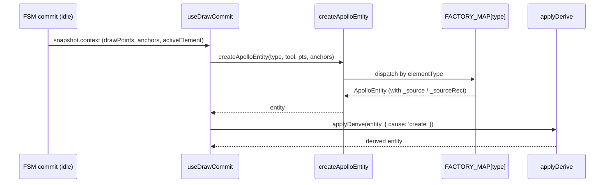
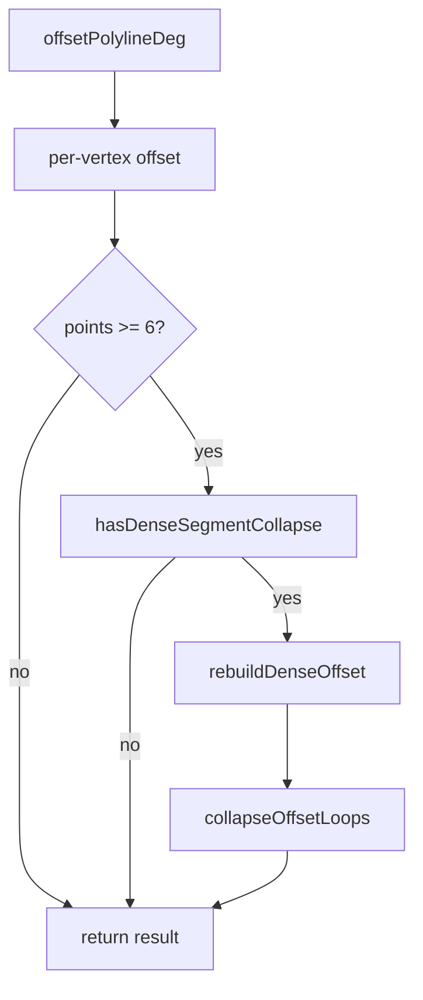

# `geometry/apolloCompile` — Apollo 实体编译与编辑

> 源码：`src/core/geometry/apolloCompile.ts`（barrel） + `apolloCompile/` 子目录（10 文件）
> 测试：`src/core/geometry/__tests__/apolloCompile.{gaps,label}.test.ts`、
> `apolloEntityCoords.test.ts`、`signalFactory.test.ts`、`signalHeading.test.ts`、
> `signalTemplate.test.ts`、`offsetPolyline.{test,bench}.ts`

## Purpose & Invariants

`apolloCompile` 是 Apollo 实体几何方面的**集中抓手**：

1. **创建**（`createApolloEntity`）：从 FSM 的 drawTool + drawPoints + bezierAnchors
   构造 12 类 ApolloEntity 之一。
2. **编辑点抽象**（`getApolloEditPoints / setAllApolloEditPoints / setApolloEditPoint /
moveApolloEntity / deleteApolloVertex`）：把每类实体不同的几何字段
   （centralCurve / polygon / stopLines / position / boundary）映射到
   "可编辑的 GeoPoint[]"统一接口，给拖拽 vertex 用。
3. **GeoJSON 编译**（`compileApolloFeatures`）：把实体翻译成给 maplibre 渲染的
   feature 列表（线 + 多边形 + 标签点）。
4. **辅助函数**：`pointsToCurve` / `pointsToPolygon` / `offsetPolylineDeg` /
   `inferLaneTurn` / `apolloEntityCoords` / `isApolloAreaEntity` /
   `isApolloPolygonEditPoints`。

### 不变量

1. **`FACTORY_MAP` 与 `MAP_ELEMENTS` 一一对应**：12 类元素都有工厂
   （`apolloCompile.label.test.ts` 守门）。
2. **`getApolloEditPoints` / `setAllApolloEditPoints` 必须互逆**：
   `set(get(e), pts) === e` 在 `apolloEntityCoords.test.ts` 断言。
3. **`isApolloAreaEntity` 与 `isApolloPolygonEditPoints` 不同**：lane 是 area
   （hitTest 把 lane fill 当面），但 editPoints 是中心折线。两者是**不同**的判定。
4. **`offsetPolylineDeg` 内部走米空间**：所有几何运算都先 cosLat 投到等距米，
   再反投回经纬度，避免高纬度变形。

## 文件地图

| 文件                      | 职责                                                                                                                                                                              |
| ------------------------- | --------------------------------------------------------------------------------------------------------------------------------------------------------------------------------- |
| `factory.ts`              | `createApolloEntity` + `inferLaneTurn` + 12 个 `createXxx` 子工厂                                                                                                                 |
| `features.ts`             | `compileApolloFeatures` + 12 个 `renderXxx` 渲染器                                                                                                                                |
| `editPoints.ts`           | `getApolloEditPoints / setAllApolloEditPoints / setApolloEditPoint / moveApolloEntity / deleteApolloVertex / apolloEntityCoords / isApolloAreaEntity / isApolloPolygonEditPoints` |
| `conversions.ts`          | `pointsToCurve` / `pointsToPolygon`                                                                                                                                               |
| `offsetPolyline.ts`       | `offsetPolylineDeg`（米空间等距偏移）                                                                                                                                             |
| `projection.ts`           | `projectPoint` / `unprojectPoint` / `Vec2`                                                                                                                                        |
| `laneBoundaryGeometry.ts` | `curvePoints(curve)` / `explicitLaneBoundaryEdges(lane)`                                                                                                                          |
| `signalHeading.ts`        | `computeSignalHeading` / `headingToIconRotate`                                                                                                                                    |
| `signalTemplate.ts`       | `buildSignalTemplate({ type, anchor, heading })` 模板几何                                                                                                                         |

## Public API（barrel `apolloCompile.ts`）

```ts
export { pointsToCurve, pointsToPolygon } from './apolloCompile/conversions';
export { offsetPolylineDeg } from './apolloCompile/offsetPolyline';
export {
  apolloEntityCoords,
  deleteApolloVertex,
  getApolloEditPoints,
  isApolloAreaEntity,
  isApolloPolygonEditPoints,
  moveApolloEntity,
  setAllApolloEditPoints,
  setApolloEditPoint,
} from './apolloCompile/editPoints';
export { createApolloEntity, inferLaneTurn } from './apolloCompile/factory';
export { compileApolloFeatures } from './apolloCompile/features';
```

### `createApolloEntity(elementType, drawTool, points, anchors, options?) => ApolloEntity`

```ts
createApolloEntity(
  elementType: MapElementType,
  drawTool: string,         // FSM DrawTool 的 string 形式
  points: LngLat[],
  anchors: BezierAnchor[],
  options?: { laneHalfWidth?: number; entities?: ReadonlyMap<string, MapEntity> },
): ApolloEntity;
```

按 `elementType` 分发到 `FACTORY_MAP[type]`。`options.entities` 用于
`nextEntityId` 拿到不冲突的 id。子工厂内部按 drawTool 抽出 line 或 polygon 点：

| drawTool                       | line/polygon 抽法                         |
| ------------------------------ | ----------------------------------------- |
| `drawBezier` (anchors ≥ 2)     | `cubicBezier(anchors)` 采样               |
| `drawArc` (points ≥ 3)         | `threePointArc(p1,p2,p3)` 采样            |
| `drawCatmullRom` (points ≥ 2)  | `catmullRom(points)` 采样                 |
| `drawRotatedRect` (points ≥ 3) | `rectCorners(rotatedRectFromPoints(...))` |
| 其它                           | 直接 `coordsToPoints(points)`             |

source-aware：`_source` / `_sourceRect` 字段保留 anchors / arcPoints / rect，
让后续 vertex 拖拽走 source-aware path（参见 `connectLanes` 文档）。

### `inferLaneTurn(centerPts: GeoPoint[]) => LaneTurn`

按 lane 中心线起终点切向夹角分类：

|                                   | Δ              |     | 结果 |
| --------------------------------- | -------------- | --- | ---- |
| < `TURN_INFER_NO_TURN_RAD` (~10°) | `'NO_TURN'`    |
| ≥ `TURN_INFER_U_TURN_RAD` (~150°) | `'U_TURN'`     |
| Δ > 0                             | `'LEFT_TURN'`  |
| Δ < 0                             | `'RIGHT_TURN'` |

cosLat 用 lane 中点纬度修正米空间，然后 `Math.atan2(dy, dx)` 算切向。

### `compileApolloFeatures(entity: ApolloEntity) => GeoJSON.Feature[]`

按 `entity.entityType` 分发到 `RENDERERS[type]`：

| entity                             | 输出 features                                                                                               |
| ---------------------------------- | ----------------------------------------------------------------------------------------------------------- |
| lane                               | 1 个 fill polygon（左边界 + 反转右边界）+ 2 条边界 line（left/right）+ 1~2 条中心线（按 direction 单/双向） |
| junction / pncJunction             | 1 polygon                                                                                                   |
| parkingSpace                       | polygon + label point                                                                                       |
| crosswalk                          | polygon                                                                                                     |
| signal                             | stopLines lines + 标签 point（含 iconRotate）                                                               |
| stopSign / yieldSign / barrierGate | stopLines + 标签                                                                                            |
| speedBump                          | 双层 line（深色阴影 + 上层 dashed）+ 标签                                                                   |
| clearArea / area                   | polygon                                                                                                     |
| road                               | section.boundary.outer 的 edges 折线                                                                        |

label feature 用 `featureId` 编 id：`<entity.id>:<role>[:noStroke][:<side>][:<direction>]`，
保证 maplibre `setData` 可以稳定 diff。

### Edit point API

#### `getApolloEditPoints(entity) => GeoPoint[]`

每类返回什么：

| entityType                                                                        | 返回                                                                                   |
| --------------------------------------------------------------------------------- | -------------------------------------------------------------------------------------- |
| junction / pncJunction / parkingSpace / crosswalk / clearArea / area / parkingLot | `entity.polygon.points`                                                                |
| barrierGate                                                                       | `stopLines[0].segments[0].lineSegment.points`（fallback `polygon.points`）             |
| signal                                                                            | 同上（fallback `boundary.points`）                                                     |
| lane                                                                              | `curvePoints(centralCurve)`（中心折线，**不**含左右边界）                              |
| stopSign / speedBump / yieldSign                                                  | 各自 stopLines / position 第一段折线                                                   |
| road                                                                              | `section[0].boundary.outerPolygon.edges[0].curve` 第一段（多 edge 编辑是 future work） |

#### `setAllApolloEditPoints(entity, points) => ApolloEntity`

写回对应字段；lane 写回时**清空** leftBoundary / rightBoundary 的显式 curve（让
`offsetPolylineDeg` 重算）+ 重算 `length`。

#### `setApolloEditPoint(entity, index, point) => ApolloEntity`

`get → splice → set` 的语法糖。

#### `moveApolloEntity(entity, dx, dy) => ApolloEntity`

整体平移；lane 走 `translateCurve` 三条曲线（central + left + right），其它走
`get + map(translate) + set`。

#### `deleteApolloVertex(entity, index) => ApolloEntity | null`

最小点数检查：polygon 类 ≥ 3，polyline 类 ≥ 2；不足则返回 null（caller 不删）。

### `apolloEntityCoords(entity) => LngLat[]`

hitTest 等用的"实体外形"坐标：lane 走 left+reversed-right 围合环（与
`compileApolloFeatures` 同样的多边形），其它直接转 LngLat。

### `isApolloAreaEntity(entity) => boolean`

「这个实体的 hitTest 是否包含 fill 内部？」—— lane / 各类 polygon 类型为 true。

### `isApolloPolygonEditPoints(entity) => boolean`

「`getApolloEditPoints` 输出是否是闭合环？」—— lane 为 false（中心折线），polygon
类为 true。`deleteApolloVertex` 用这个区分最小点数。

### `pointsToCurve(points) => Curve`

包成 `{ segments: [{ lineSegment:{points}, s:0, startPosition, heading:0, length:0 }] }`。

### `pointsToPolygon(points) => ApolloPolygon`

`{ points }`。

### `offsetPolylineDeg(points, widthMeters, side) => GeoPoint[]`

把折线在米空间向 `'left'` / `'right'` 偏移 `widthMeters`，反投回经纬度。
处理三类 corner：

- 内角：精确 miter 点（让内侧线缩短）
- 外角 miter ≤ MAX_MITER (3)：精确 miter
- 外角 miter > 3：bevel + cap 三点（避免无穷尖角）

dense 折线（≥6 点）额外做 collapse loop 检测：若 offset 结果出现折回，走
`rebuildDenseOffset` + `collapseOffsetLoops`。这是 lane 边界紧弯避免"长三角"
的关键。

## 算法详解

### 创建流程



### offsetPolylineDeg dense collapse



### compileApolloFeatures 渲染分发

每个 RENDERER 接收 `(entity, base)` 其中 `base = { color, id, entityType }`。
返回 `Feature[]`，properties 至少含 `{ id, entityType, role?, color, lineWidth?,
lineOpacity?, dashed?, fillOpacity? }` —— 这些字段被 cold layer 的 paint 表达式读。

## 复杂度

| 操作                     | 复杂度                                  |
| ------------------------ | --------------------------------------- |
| `createApolloEntity`     | O(P) where P = drawPoints / anchors 数  |
| `getApolloEditPoints`    | O(1) 引用 + O(P) 当 lane 走 curvePoints |
| `setAllApolloEditPoints` | O(P) spread                             |
| `moveApolloEntity`       | O(P) translate；lane 是 3·P（三曲线）   |
| `compileApolloFeatures`  | O(P) per entity                         |
| `offsetPolylineDeg`      | O(P) base + O(P²) worst-case collapse   |
| `inferLaneTurn`          | O(P) project + O(1) atan2               |

## 测试覆盖

- `apolloCompile.label.test.ts`：12 类元素都通过 `createApolloEntity` 工厂正确创建
- `apolloCompile.gaps.test.ts`：每类实体 `compileApolloFeatures` 至少产 1 个 feature
- `apolloEntityCoords.test.ts`：lane 的 left+right 环不自交 + `set(get())` 互逆
- `inferLaneTurn.test.ts`：4 类 turn 边界（NO_TURN / LEFT / RIGHT / U_TURN）
- `offsetPolyline.test.ts`：紧弯 collapse、外角 bevel、cosLat 投影
- `signal*.test.ts`：信号灯模板 + heading 从 stopLine 推导
- `offsetPolyline.bench.ts`：性能基准（CI perf budget 一部分）

## See also

- [geometry/connectLanes](./geometry-connect-lanes) — 用 `_source` 字段做 source-aware 端点平移
- [geometry/laneJunctions](./geometry-lane-junctions) — `applyLaneJunctions` 拼接边界 + 装饰
- [elements/derive](./elements-derive) — `applyDerive` 在 create / editGeometry 后调用
- [lib/entityOps](/api/lib/entity-ops) — UI 入口，包装 createApolloEntity
- [hooks/useDrawCommit](/api/hooks/use-draw-commit) — FSM commit → createApolloEntity 桥
