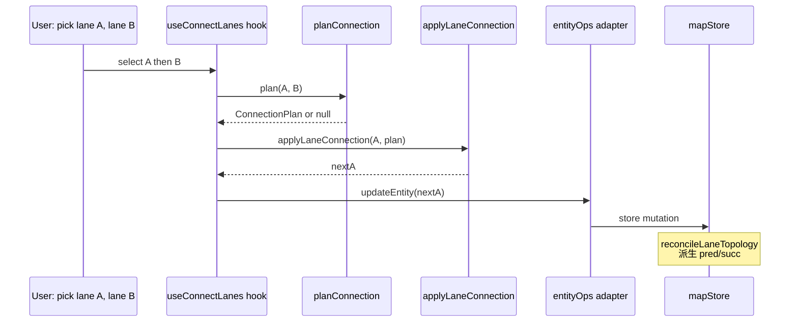

# `geometry/connectLanes` — 车道连接

> 源码：`src/core/geometry/connectLanes.ts`
> 测试：`src/core/geometry/__tests__/connectLanes.test.ts`（~11 KB）

## Purpose & Invariants

`connectLanes` 实现"把两条 lane 端到端对齐"的几何抓手。用户在工具栏触发
`Connect Lanes`（快捷键 `C`）后选两条 lane，本模块：

1. **选最优端点对**（`planConnection`）：4 种 (Astart, Bstart) / (Astart, Bend) /
   (Aend, Bstart) / (Aend, Bend) 组合中找米空间距离最小的一对。
2. **执行平移**（`applyLaneConnection`）：把第一条 lane 的对应端点平移到第二条
   的对应端点位置，**保持源信息一致**——贝塞尔锚点平移、圆弧 arcPoints 改、
   折线直接覆写——再 `applyDerive(editGeometry)` 闭环 length / turn。

之后 `reconcileLaneTopology(Incremental)` 会从端点共享自动派生 pred/succ。

### 不变量

1. **不动 lane B**：B 是锚点，永远不动。所有平移作用在 A。
2. **mode 决定语义**：
   - `'AendToBstart'` → A.end ≡ B.start → A.successor 包含 B
   - `'AstartToBend'` → A.start ≡ B.end → A.predecessor 包含 B
   - `'AstartToBstart'` / `'AendToBend'` → fork / merge，**不**写 pred/succ
     （但 `applyLaneJunctions` 仍把端点拼到一处）
3. **source-aware 至关重要**：不能直接覆盖 centralCurve 里的端点而忽略 `_source`，
   否则 worker 重采样 bezier 时会拿旧 anchors 把端点挪回去，连接看起来"没生效"。

## Public API

### Types

```ts
export type ConnectionMode = 'AendToBstart' | 'AstartToBend' | 'AstartToBstart' | 'AendToBend';

export interface ConnectionPlan {
  mode: ConnectionMode;
  distanceMeters: number;
  /** pred/succ 是否能由本连接派生（fork/merge 为 false） */
  isContinuous: boolean;
  /** A 中心线中要移动的端点索引（0 或 N-1） */
  indexToMove: number;
  /** A 端点要去的目标 (lng,lat) */
  target: GeoPoint;
}
```

### `planConnection(a: LaneEntity, b: LaneEntity): ConnectionPlan | null`

```ts
const candidates = [
  { mode: 'AendToBstart', distance: dist(aE, bS), indexToMove: aLast, target: bS },
  { mode: 'AstartToBend', distance: dist(aS, bE), indexToMove: 0, target: bE },
  { mode: 'AstartToBstart', distance: dist(aS, bS), indexToMove: 0, target: bS },
  { mode: 'AendToBend', distance: dist(aE, bE), indexToMove: aLast, target: bE },
];
candidates.sort((x, y) => x.distance - y.distance);
return candidates[0];
```

距离用 `cosLat` 修正米空间欧氏。任一 lane 缺端点 → null。
（`connectLanes.ts:79-110`）

UI 拿到 plan 之后可：

- 直接执行（如距离很小，自动 snap）
- 弹"距离 X 米，确认连接？"对话框
- 区分 `isContinuous` 在 fork/merge 场景给特殊提示

### `applyLaneConnection(lane: LaneEntity, plan: ConnectionPlan): LaneEntity`

按 lane 的 `_source.drawTool` 分三个分支：

```mermaid
flowchart TD
    AC[applyLaneConnection] --> S{_source.drawTool}
    S -->|drawBezier| BZ[shiftAnchor on first/last anchor;<br/>cubicBezier resample]
    S -->|drawArc| AR[overwrite arcPoints[0 or 2];<br/>threePointArc resample]
    S -->|polyline / unknown| PL[overwrite centralCurve points at index]
    BZ --> WR[writeCenterline + applyDerive]
    AR --> WR
    PL --> WR
    WR --> R[return new lane]
```

#### Bezier 分支（`connectLanes.ts:172-180`）

```ts
const idx = isStartIndex(plan) ? 0 : anchors.length - 1;
anchors[idx] = shiftAnchor(anchors[idx], plan.target); // 平移锚点 + 控制柄
const newPoints = coordsToPoints(cubicBezier(anchors.map(anchorToRuntime)));
return writeCenterline(lane, newPoints, { ...source, anchors });
```

`shiftAnchor` 是关键 helper：把 `anchor.point` 设为 target，**同时**把
`handleIn / handleOut` 平移相同 dx/dy（保持手柄相对位置）。

#### Arc 分支（`connectLanes.ts:183-191`）

```ts
const idx = isStartIndex(plan) ? 0 : 2;
arcPoints[idx] = { ...arcPoints[idx], x: plan.target.x, y: plan.target.y };
const newPoints = coordsToPoints(threePointArc(...));
return writeCenterline(lane, newPoints, { ...source, arcPoints });
```

#### Polyline / 无源 分支（`connectLanes.ts:194-203`）

```ts
const idx = isStartIndex(plan) ? 0 : pts.length - 1;
const newPoints = pts.map((p, i) => i === idx ? { ...p, x:..., y:... } : p);
return writeCenterline(lane, newPoints, source);
```

### `writeCenterline` 内部

把 `centralCurve.segments[0].lineSegment.points` 替换为新点位 + 重算 `length`。
若有 `_source` 一并带上。**结尾必跑** `applyDerive({ cause:'editGeometry', prev: lane })`，
让 length / turn 闭环。

## 为什么不能直接 `setAllApolloEditPoints`

历史尝试过把 connect 直接走 `setAllApolloEditPoints(lane, pts)` —— 看似简洁，
但是该函数会**清空** `leftBoundary / rightBoundary` 的显式 curve，以让 worker 重
采样。结合 `_source.anchors` 和稀疏中心线，会出现：

- bezier 锚点和中心线点位 1:N 错位（典型 anchor=2, samples=48）
- `applyDrag(a, indexToMove, 'vertex', target)` 把 `_source.anchors[N-1]` 当成
  `arcPoints[N-1]` 解析 → `Cannot read properties of undefined (reading 'x')`
- 重采样后的中心线长度与端点不一致

`connectLanes` 单独走 source-aware 路径是为了**绕开**这个 mismatch。

## 复杂度

| 操作                             | 复杂度                        |
| -------------------------------- | ----------------------------- | ------------------------ |
| `planConnection`                 | O(P) for `curvePoints` + O(1) | 距离比较                 |
| `applyLaneConnection` (bezier)   | O(A) + O(A·S)                 | A=anchors，S=每段采样数  |
| `applyLaneConnection` (arc)      | O(64)                         | threePointArc 默认 64 段 |
| `applyLaneConnection` (polyline) | O(P)                          | spread                   |

## 测试覆盖

`connectLanes.test.ts` 覆盖：

- 4 种 mode 各一遍 happy path（指定 lane geometry → 期望 mode）
- bezier 平移后中心线起 / 末点确实在 target，且锚点的 handleIn/Out 同步偏移
- arc 平移后第三点确实在 target，圆心新位置经过新三点
- 多边形（polyline）分支零幻觉
- `applyDerive` 跑了：`length` / `turn` 同步更新
- 退化输入：lane 中心线 < 2 点 → null

## 上层调用



## See also

- [geometry/laneTopology](./geometry-lane-topology) — `reconcileLaneTopology(Incremental)`
  从共享端点派生 pred/succ
- [geometry/apolloCompile](./geometry-apollo-compile) — `_source` 字段语义
- [geometry/interpolate](./geometry-interpolate) — `cubicBezier` / `threePointArc` 重采样
- [elements/derive](./elements-derive) — `applyDerive` 闭环 length/turn
- [useMapEventRouter](/api/hooks/use-map-event-router) — connect-mode UI 事件入口
