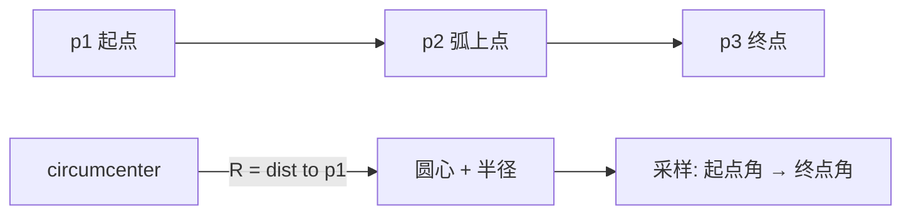
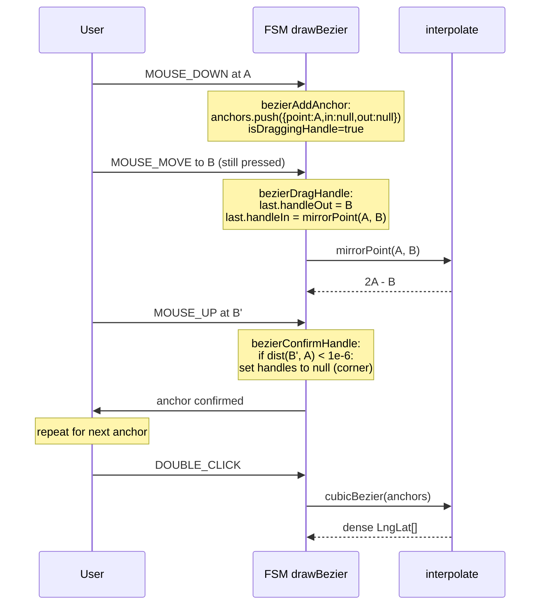

# `geometry/interpolate` — 曲线插值

> 源码：`src/core/geometry/interpolate.ts`
> 测试：分散在 `apolloCompile.gaps.test.ts` / `connectLanes.test.ts` /
> `signalFactory.test.ts`（间接覆盖）

## Purpose & Invariants

`interpolate.ts` 是绘制工具的"采样后端"：FSM 收 click 事件累积 `drawPoints` 与
`bezierAnchors`，commit 时由 `apolloCompile/factory.ts` 调用本模块的函数把控制点
变成 dense 的 GeoPoint 序列，写入 `centralCurve` 或 `polygon`。

### 不变量

1. **输入输出统一为 `LngLat = [lng, lat]`**：所有曲线都在投影到等距米空间后
   计算，再反投回经纬度。投影系数用控制点的纬度均值。
2. **Bezier 控制柄镜像**：FSM 在拖控制柄时调 `mirrorPoint(pivot, pt)` 让 handleIn
   永远是 handleOut 关于锚点的镜像（保证 C1 连续）。`bezierConfirmHandle` 距离
   < 1e-6 时才置 null（尖角），否则保留对称。
3. **rotatedRectFromPoints / rectCorners 配对一致**：rectCorners 用 `-rotation`
   旋转，rotatedRectFromPoints 也算 `-atan2`，保证 round-trip 一致。

## Public API

### Types

```ts
export type LngLat = [number, number];

export interface BezierAnchor {
  point: LngLat;
  handleIn: LngLat | null;
  handleOut: LngLat | null;
}
```

### `mirrorPoint(pivot: LngLat, pt: LngLat) => LngLat`

```ts
[2 * pivot[0] - pt[0], 2 * pivot[1] - pt[1]];
```

以 pivot 为中心镜像 pt。FSM 的 `bezierDragHandle` action 用它保持 handleIn 与
handleOut 关于锚点对称。
（`interpolate.ts:20-22`）

### `catmullRom(points: LngLat[], segments?: number, alpha?: number) => LngLat[]`

Catmull-Rom 样条插值，曲线穿过所有控制点。

| 参数       | 默认 | 说明                                  |
| ---------- | ---- | ------------------------------------- |
| `points`   | —    | 至少 2 个                             |
| `segments` | 32   | 每段采样数                            |
| `alpha`    | 0.5  | 0=uniform, 0.5=centripetal, 1=chordal |

`alpha=0.5` (centripetal) 是 Yuksel 推荐值——避免 self-intersection 和 overshoot。

实现细节：扩展首尾用镜像虚拟点，每个区间 [P_i, P_{i+1}] 通过 P*{i-1}, P_i,
P*{i+1}, P\_{i+2} 计算 Catmull-Rom 等价的两个 cubic Bezier 控制点 b1/b2，再
`cubicBezierPoint(p1, b1, b2, p2, t)` 采样。
（`interpolate.ts:32-93`）

### `cubicBezier(anchors: BezierAnchor[], segments?: number) => LngLat[]`

多段三次贝塞尔曲线插值。

| 参数       | 默认                               |
| ---------- | ---------------------------------- |
| `anchors`  | 至少 2 个，每个带可选 handleIn/Out |
| `segments` | 48                                 |

每段用 `(p0=anchors[i].point, p1=anchors[i].handleOut ?? p0,
p2=anchors[i+1].handleIn ?? p3, p3=anchors[i+1].point)` 采样 cubic
Bezier 公式。null 控制柄退化为锚点（直线段，即"尖角")。
（`interpolate.ts:106-130`）

### `threePointArc(p1, p2, p3, segments?: number) => LngLat[]`

经过三点的圆弧。



实现：

1. cosLat 投影三点到等距空间。
2. 算外接圆 `circumcenter`；共线（`|D| < 1e-12`）→ 返回三点直线段兜底。
3. 算三点对应角度 a1 / a2 / a3；调整 sweep 方向让弧经过 p2。
4. 等步长采样 `segments+1` 个点（含端点）。
5. 反投影回 LngLat。

`segments` 默认 64。
（`interpolate.ts:153-194`）

### `rectCorners(p1, p2, rotation: number) => LngLat[]`

两对角点 + 旋转弧度 → 闭合 5 点矩形。

1. cosLat 投影 p1/p2。
2. 中心 c = (p1+p2)/2，轴对齐 4 角点 raw[]。
3. 绕 c 旋转 `-rotation`（视觉顺时针为正）→ 4 个 LngLat 角。
4. push corners[0] 闭合。

返回 5 个点（最后一个是首点重复）。
（`interpolate.ts:235-271`）

### `rotatedRectFromPoints(a, b, c) => { p1, p2, rotation }`

3 点 → 矩形参数化（drawRotatedRect 三次点击的几何）：

| click | 含义                        |
| ----- | --------------------------- |
| `a`   | 主轴起点                    |
| `b`   | 主轴终点（决定长度 + 旋转） |
| `c`   | 与主轴垂直方向上的宽度点    |

输出兼容 `rectCorners`：返回 `p1` / `p2`（轴对齐对角点）+ `rotation`（弧度）。

退化检测：轴长 < 1e-12 → 退回到 `{ p1: a, p2: c, rotation: 0 }`。
（`interpolate.ts:280-335`）

### `rectRotateHandle(p1, p2, rotation) => LngLat`

矩形旋转手柄位置：中心上方偏移一段距离。
偏移 = 半高 + max(宽,高) × 0.18，保证旋转手柄不会贴在矩形边上。
（`interpolate.ts:340-364`）

## 算法详解

### Bezier 控制柄使用流程（FSM 视角）



### 三点圆弧 sweep 方向修正

```ts
let sweep = normalizeAngle(a3 - a1); // 基础 sweep
const midSweep = normalizeAngle(a2 - a1);
if (
  (sweep > 0 && midSweep > sweep) || // p2 不在 p1→p3 的扇区内
  (sweep < 0 && midSweep < sweep)
) {
  sweep = sweep > 0 ? sweep - 2 * PI : sweep + 2 * PI; // 反向 sweep
}
```

保证最终弧"经过"p2。

## 复杂度

| 函数                    | 复杂度                   |
| ----------------------- | ------------------------ |
| `mirrorPoint`           | O(1)                     |
| `catmullRom`            | O((P-1)·segments)        |
| `cubicBezier`           | O((A-1)·segments)        |
| `threePointArc`         | O(segments)（默认 64+1） |
| `rectCorners`           | O(1)（4 角）             |
| `rotatedRectFromPoints` | O(1)                     |
| `rectRotateHandle`      | O(1)                     |

## 测试覆盖

主要在间接测试：

- `apolloCompile.gaps.test.ts`：每类 drawTool 都能产几何（隐式测 cubicBezier /
  threePointArc / rectCorners / catmullRom）
- `connectLanes.test.ts`：bezier source 平移后 cubicBezier 重采样正确
- `signalFactory.test.ts`：信号灯模板用 rectCorners 的等价旋转
- `editorMachine.test.ts`：FSM 用 mirrorPoint 处理 handleIn/Out

退化场景守门：

- `threePointArc` 共线 → 返回三点直线段
- `rotatedRectFromPoints` 轴长 0 → 退回轴对齐 1-point rect
- `rectCorners` 在 rotation=0 时与轴对齐矩形像素一致

## See also

- [fsm/editorMachine](./fsm-editor-machine) — `bezierAddAnchor` / `bezierDragHandle`
  / `bezierConfirmHandle` actions 调用本模块
- [geometry/apolloCompile](./geometry-apollo-compile) — `factory.ts` 用 cubicBezier /
  threePointArc / rectCorners / catmullRom 抽 line/polygon 点
- [geometry/connectLanes](./geometry-connect-lanes) — bezier / arc 重采样
- [geometry/validation](./geometry-validation) — 自交判定（与本模块互补）
