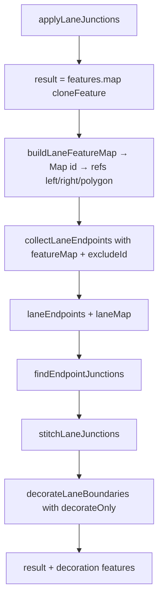
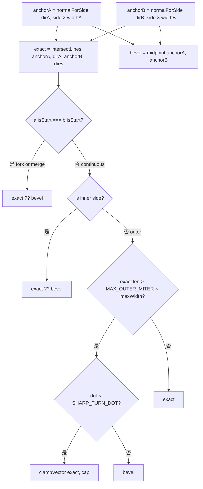
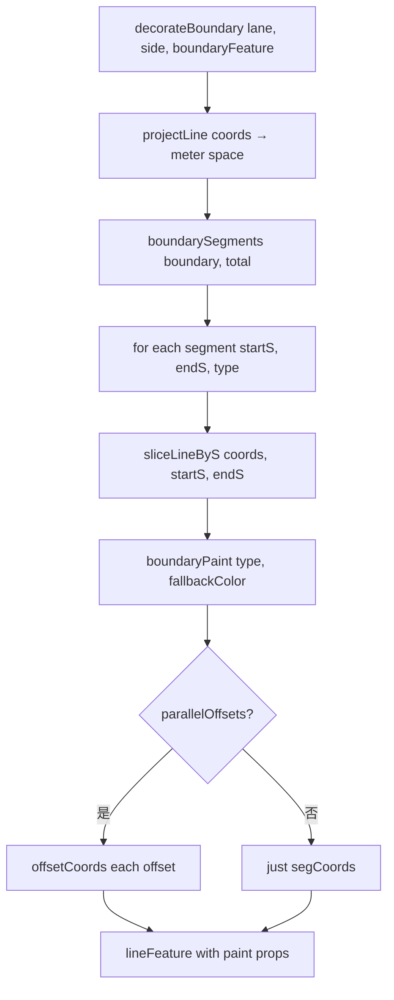
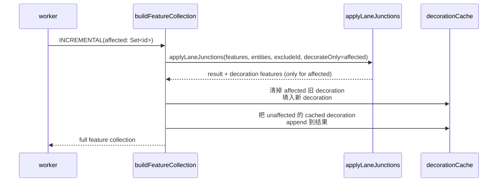

# `geometry/laneJunctions` — 端点拼接 + 边界装饰

> 源码：`src/core/geometry/laneJunctions.ts` + `laneJunctions/internal.ts`
> 测试：`src/core/geometry/__tests__/laneJunctions.test.ts`（~29 KB） +
> `laneJunctions.bench.ts`（~3.5 KB）

## Purpose & Invariants

`applyLaneJunctions` 是 cold-layer feature 编译流程的**最后一步**：

1. **端点拼接**（stitchLaneJunctions）：两条 lane 共享端点（toFixed(6) ≈ 1cm
   精度）时，把它们的左右边界拉到同一个 miter / bevel 点，避免 T 形或缝隙。
2. **边界装饰**（decorateBoundary）：按 lane 的 `boundaryType: [{s, types[]}]`
   段，对左右边界**分段**渲染——单实白线、虚黄、双黄、CURB、点线…全部由这一函
   数产 GeoJSON Feature[]。
3. **polygon 同步**（syncPolygonFromEdges）：左 + 反转右构成 lane 的 fill polygon，
   端点拼接后必须重算 polygon ring。

性能：boundary decoration 是 `buildFeatureCollection` 的主导成本（~3ms × N lane
naive 重建）。**Phase E 优化**通过 worker 端的 `decorationCache: Map<lane_id,
Feature[]>` 缓存装饰特征，并依赖 `decorateOnly` 参数只对受影响 lane 重新装饰。

### 不变量

1. **端点 hash 颗粒度 = `toFixed(6)` ≈ 1cm**：与 `laneTopology.ts` 一致。
2. **fork / merge 不拼接**：`isContinuousJunction` 判定 `a.isStart !== b.isStart`
   才拼。start-start fork 和 end-end merge 是语义路口，但**不**是连续 lane 边——
   把左左和右右拉到一个 miter 会破坏 split/merge 的可视分叉，由 topology / overlap
   层处理。
3. **drawArc / drawBezier / drawCatmullRom lane 不剪边界**（`shouldTrimBoundaryOnStitch`）：
   这些是 dense 采样曲线，剪掉首尾段会切穿弧成一个长三角。仅 sparse polyline lane
   （≤ 6 点）允许 trim 折回。
4. **`decorateOnly` 缺省 = 全量装饰**：增量场景才传 affected lane 集。

## 文件分工

| 文件                        | 职责                                                                                                                                                                                                                        |
| --------------------------- | --------------------------------------------------------------------------------------------------------------------------------------------------------------------------------------------------------------------------- |
| `laneJunctions.ts`          | 顶层 `applyLaneJunctions`：collectLaneEndpoints + findEndpointJunctions + stitchLaneJunctions + decorateLaneBoundaries                                                                                                      |
| `laneJunctions/internal.ts` | 类型 / helper：`LaneEndpoint`、`LaneFeatureRefs`、`endpointDirection`、`sideJoinOffset`、`updateLineEndpoint`、`syncPolygonFromEdges`、`buildLaneFeatureMap`、`cloneFeature`、`laneEndpointsFromEntity`、`decorateBoundary` |

## Public API

### `applyLaneJunctions(features, entities, excludeId?, decorateOnly?) => Feature[]`

```ts
applyLaneJunctions(
  features: GeoJSON.Feature[],
  entities: Iterable<MapEntity>,
  excludeId?: string | null,
  decorateOnly?: Set<string> | null,
): GeoJSON.Feature[];
```

- `features`：上游 `compileApolloFeatures` 产出的 cold features（含 lane 的
  `laneEdgeLeft` / `laneEdgeRight` / fill polygon / 中心线）。
- `entities`：用来取 LaneEntity（端点 + 宽度）。
- `excludeId`：正在拖动的 lane id，跳过端点拼接（避免抖动）。
- `decorateOnly`：增量装饰范围；null/undefined 表示全量。

返回 cloneFeature 后的新 Feature 数组（不 mutate 入参） + 装饰 Feature。

### `decorateBoundary(lane, side, boundaryFeature) => Feature[]`

按 lane 的 `boundary[side].boundaryType: [{s, types[]}]` 分段，每段产 1~2 个
LineString feature（DOUBLE_YELLOW 是双线 → 2 feature）。

`boundaryPaint(type, fallbackColor)` 决定颜色 / 线宽 / 不透明度 / dashed /
dotted / parallelOffsets：

| BoundaryLineType | color               | dashed | dotted | parallelOffsets    |
| ---------------- | ------------------- | ------ | ------ | ------------------ |
| DOTTED_YELLOW    | `#f3d046`           | yes    | yes    | —                  |
| DOTTED_WHITE     | `#ffffff`           | yes    | yes    | —                  |
| SOLID_YELLOW     | `#f3d046`           | —      | —      | —                  |
| SOLID_WHITE      | `#ffffff`           | —      | —      | —                  |
| DOUBLE_YELLOW    | `#f3d046`           | —      | —      | `[-0.18, +0.18]` m |
| CURB             | `#9aa6b2`，加宽 1px | —      | —      | —                  |
| 其它 / UNKNOWN   | fallbackColor       | —      | —      | —                  |

`sliceLineByS(coords, startS, endS)` 按米空间弧长抽出子 polyline；
`offsetCoords(segCoords, m, side)` 调用 `offsetPolylineDeg` 产平行线。

## 算法详解

### 整体流程



### 端点 junction 找两两对

```ts
const endpointIndex = new Map<string, LaneEndpoint[]>();
for (const ep of endpoints) {
  const key = `${pt.x.toFixed(6)},${pt.y.toFixed(6)}`;
  endpointIndex.get(key) || endpointIndex.set(key, []);
  endpointIndex.get(key).push(ep);
}

for (const grouped of endpointIndex.values()) {
  const pair = uniquePair(grouped); // O(K) dedup by id; only return when exactly 2
  if (!pair) continue;
  junctions.push({ pt, a: pair[0], b: pair[1] });
}
```

`uniquePair` 只接受**正好 2 个**不同 lane 的端点对。3 路 fork/merge 不拼接（由
topology / overlap 层负责的更复杂结构）。

### `sideJoinOffset` 几何

把两个 LaneEndpoint 在共享点处的 `'left'` / `'right'` 边界外推到一个 miter / bevel：



阈值（`internal.ts:16-19`）：

- `MAX_OUTER_MITER = 3`
- `SHARP_TURN_DOT = -0.5`（cos 120°）
- `SPARSE_BOUNDARY_TRIM_POINT_LIMIT = 6`

### `decorateBoundary` 分段



## Phase E 增量装饰

Worker 端的协作：



依赖 worker 端 `LaneJunctionGraph.getDependents(id)` 计算 affected 集
（端点共享 lane）。

## 复杂度

| 操作                               | 复杂度                 | 备注                                                                                              |
| ---------------------------------- | ---------------------- | ------------------------------------------------------------------------------------------------- |
| `applyLaneJunctions`               | O(F + L + J + L_aff·B) | F=features cloneFeature；L=lane 数；J=junction 对数；L_aff=要装饰的 lane 数；B=每条 lane 边界段数 |
| `findEndpointJunctions`            | O(L)                   | 端点 hash + 一次扫                                                                                |
| `stitchLaneJunctions` per junction | O(1)                   | 两端点 4 个 sideJoinOffset                                                                        |
| `decorateBoundary` per lane        | O(B + sliceCost)       | B=segments；slice 是 O(P)                                                                         |
| `offsetPolylineDeg` per parallel   | O(P)                   | dense collapse 最坏 O(P²)                                                                         |

实测：500 lane × 全量 decorate ≈ 250ms naive；Phase E incremental 单 dirty < 5ms。

## 测试覆盖

`laneJunctions.test.ts` 覆盖：

- 两 lane end-end / start-start / end-start / start-end 共享端点的拼接结果
- fork / merge 不拼（continuous=false 跳过）
- 三路 junction（3 个 lane 共享端点）→ 不拼（uniquePair 只在 2 个时返回）
- decorateBoundary 各 BoundaryLineType 的颜色 / dashed / parallelOffsets
- DOUBLE_YELLOW 输出 2 条 feature
- decorateOnly 子集只产对应 lane 的装饰
- 稀疏 lane (≤ 6 点) trim 折回；dense lane 不 trim
- explicit boundary edges（lane.leftBoundary 显式 curve 非空）跳过 stitch / decorate

`laneJunctions.bench.ts` 覆盖性能基准（CI perf budget）。

## See also

- [workers/spatial](./workers-spatial) — 调用 `applyLaneJunctions` 的入口
- [workers/junction-graph](./workers-junction-graph) — `LaneJunctionGraph.getDependents` 算 affected
- [geometry/laneTopology](./geometry-lane-topology) — 同样的 `toFixed(6)` 端点
  精度，pred/succ 派生与 stitch 一致
- [geometry/apolloCompile](./geometry-apollo-compile) — `compileApolloFeatures` 产
  base lane features（laneEdgeLeft/Right、polygon、center line）
