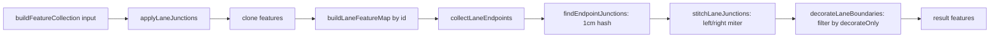

# Geometry: laneJunctions

> Source: `src/core/geometry/laneJunctions.ts` + `src/core/geometry/laneJunctions/internal.ts`

## Overview

Two responsibilities, both per-render-pass:

1. **Junction stitching** — when two lane endpoints share a quantised
   coordinate (1 cm precision), miter their left and right boundary
   features so they meet at a single shared point. The visual effect:
   no more "gap" or overlapping triangle at the seam between two
   continuous lanes.
2. **Boundary decoration** — paint each lane's left/right boundary
   feature with the right colour / dash / dot pattern derived from
   `lane.leftBoundary.boundaryType` (`SOLID_YELLOW`, `DOTTED_WHITE`,
   `DOUBLE_YELLOW`, `CURB`, …). Multi-segment boundaries (different
   `boundaryType` along `s`) are split into multiple LineString features.

Stitching is cheap and idempotent (~0.01 ms per junction; non-affected
lanes get the same join values back). Decoration is the expensive part:
~3 ms × N lanes for a naïve full pass. The Phase E optimisation caches
decoration per lane in the worker (`decorationCache`) and only
re-decorates an "affected set" of lanes on incremental edits — which is
what the `decorateOnly` parameter controls.



## Public API

### `applyLaneJunctions(features, entities, excludeId?, decorateOnly?): GeoJSON.Feature[]`

```ts
function applyLaneJunctions(
  features: GeoJSON.Feature[],
  entities: Iterable<MapEntity>,
  excludeId?: string | null,
  decorateOnly?: Set<string> | null,
): GeoJSON.Feature[];
```

| Param          | Purpose                                                                                   |
| -------------- | ----------------------------------------------------------------------------------------- |
| `features`     | input feature list (compiled by `compileApolloFeatures` per entity)                       |
| `entities`     | live entity collection — only `lane` entries are inspected                                |
| `excludeId`    | hot-layer caller's "actively edited entity" exclusion                                     |
| `decorateOnly` | when non-null, only re-decorate lanes in this set; others use cached decoration in caller |

Returns a new feature array (input is not mutated; line/polygon
geometries are deep-cloned via `cloneFeature`).

## Internal API (`laneJunctions/internal.ts`)

These are intentionally not re-exported from `apolloCompile` — they are
internal cooperators of `applyLaneJunctions` plus a small set of
helpers that `laneCorridor.ts` reuses for offset polylines.

### Types

```ts
type Vec2 = [number, number];

interface LaneEndpoint {
  id: string;
  isStart: boolean;
  pts: GeoPoint[]; // centerline points
  leftWidth: number;
  rightWidth: number;
  trimBoundaryOnStitch: boolean;
}

interface LaneFeatureRefs {
  left?: GeoJSON.Feature<GeoJSON.LineString>;
  right?: GeoJSON.Feature<GeoJSON.LineString>;
  polygon?: GeoJSON.Feature<GeoJSON.Polygon>;
}
```

### Key functions

#### `decorateBoundary(lane, side, boundaryFeature): Feature[]`

Slice the boundary line at every `boundaryType` change point along `s`,
emit a separate `LineString` feature per segment with the right paint
properties (color / dashed / dotted / lineWidth / parallelOffsets).

`DOUBLE_YELLOW` is rendered as two parallel offsets at ±0.18 m using
`offsetCoords` → `offsetPolylineDeg`.

#### `endpointDirection(endpoint, cosLat): Vec2`

Unit tangent at the endpoint, projected to local metres via cosLat.
Used to position miter joins.

#### `sideJoinOffset(side, a, b, dirA, dirB): Vec2`

Compute the local-space offset for the shared join point on a given
side (`'left'` or `'right'`). Internal vs outer corner distinguished by
the cross product of the two tangents:

- **Inner** (turn-in side) → exact miter intersection.
- **Outer** (turn-out side) → exact miter capped at `MAX_OUTER_MITER × maxWidth`,
  with bevel fallback for sharp turns (`cos(θ) ≤ -0.5`, i.e. > 120°).

Lane forks (`a.isStart === b.isStart`) always use the exact miter or
mid-bevel — there is no inner/outer distinction.

#### `updateLineEndpoint(feature, isStart, joinPt, dir, cosLat, trimFolded)`

Move the first or last vertex of a boundary linestring to `joinPt`. If
`trimFolded` is true (sparse polylines), drops adjacent endpoint
samples that now project _behind_ the new join point.

#### `syncPolygonFromEdges(refs)`

Rebuild the lane fill polygon from the post-stitch left + reversed
right boundaries.

#### `laneEndpointsFromEntity(lane): LaneEndpoint[]`

Build the start + end endpoint records for a lane. Returns `[]` when
the lane has explicit Apollo boundaries (those are imported as-is and
not stitched) or fewer than 2 centerline points.

`trimBoundaryOnStitch` is true for sparse polylines (≤ 6 points) and
false for curve-sourced lanes (`drawArc` / `drawBezier` / `drawCatmullRom`)
— dense sampled lanes already encode their shape and trimming would
cut across a valid arc.

## Behavior

### Idempotency

Stitching is **idempotent** under fixed inputs: running it twice yields
the same result. This is what makes per-render-pass invocation safe.
Adding a lane that doesn't share an endpoint with the input set leaves
every other lane's geometry unchanged.

### Decoration is the cost driver

`decorateBoundary` slices the boundary line at every `boundaryType`
change point along `s`, projects to metres, and emits a separate
LineString per segment. For a 100-lane map at 5 segments per side that's
~1000 features per pass — and each `sliceLineByS` reprojects the entire
polyline. Cumulative cost ≈ 3 ms per lane.

The `decorateOnly` parameter is the lever: when the worker passes a
non-null set, only those lane ids re-run decoration; everything else is
skipped and the caller substitutes per-lane cached decoration features.
Non-incremental callers (full SYNC, hot layer) pass `null` and re-run
everything.

### Continuous vs fork

Only **continuous** junctions (`a.isStart !== b.isStart` — one start, one
end) get stitched. Start-start forks and end-end merges are semantic
junctions but not continuous lane-to-lane edges; pulling left-left
boundaries to a shared miter point would corrupt the visible
split/merge geometry. Topology (predecessor/successor) and overlap
logic handle those cases.

### Endpoint key precision

Endpoint matching uses `toFixed(6)` quantisation — same as
`laneJunctionGraph.endpointKeyOf` and `laneTopology.endpointKey`. All
three modules quantise the same way so the dependency graph and
geometric stitcher stay consistent under floating-point drift.

::: warning Why decoration dominates buildFeatureCollection
On a 100-lane edit, the spatial worker measures ~300 ms total for a
naïve full rebuild — and `decorateBoundary` accounts for ~270 ms of
that. Junction stitching itself is ~1 ms total. The dominance gap is
why the Phase E optimisation only caches decoration; running stitching
unconditionally on every render is fine.
:::

## Examples

Cold-layer worker call (`spatialFeatures.buildFeatureCollection`):

```ts
import { applyLaneJunctions } from '@/core/geometry/laneJunctions';

const decorateOnly = isIncremental ? affectedLaneIds : null;
const stitched = applyLaneJunctions(
  inputFeatures,
  state.entityMap.values(),
  excludeId,
  decorateOnly,
);

// Update per-lane decorationCache: replace cached decor for affected
// lanes; leave others intact.
for (const f of stitched) {
  if (f.properties?.role !== 'laneBoundaryDecor') continue;
  const id = String(f.properties?.id);
  if (isIncremental && !affectedLaneIds.has(id)) continue;
  let bucket = state.decorationCache.get(id);
  if (!bucket) {
    bucket = [];
    state.decorationCache.set(id, bucket);
  }
  bucket.push(f);
}
```

## Related

- [Geometry: laneCorridor](/api/core/elements-overlap#lanecorridor-ts) — uses `explicitLaneBoundaryEdges` from `apolloCompile`
- [Apollo compile: offsetPolyline](/api/core/geometry-apollo-compile) — `offsetPolylineDeg` is invoked by `decorateBoundary` for `DOUBLE_YELLOW` paint
- [Workers: spatial](/api/core/workers-spatial) — the worker that owns `decorationCache`
- [Workers: junction graph](/api/core/workers-junction-graph) — endpoint dependency graph that computes `affectedLaneIds`
