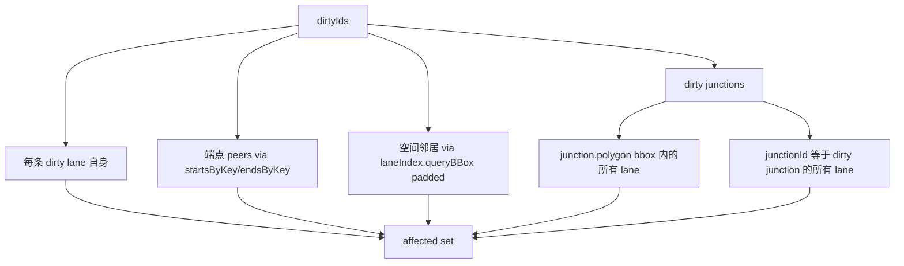

# `geometry/laneTopology` — 车道拓扑重算

> 源码：`src/core/geometry/laneTopology.ts`（~22 KB）
> 测试：`src/core/geometry/__tests__/laneTopology.test.ts`（~15 KB）

## Purpose & Invariants

`reconcileLaneTopology` 把"端点共享 / 横向相邻 / 落在 junction 内"这些
**几何事实**翻译成 lane 的拓扑字段：

- `predecessorIds` / `successorIds`：端点 1cm 精度共享
- `selfReverseLaneIds`：B 是 A 的反向孪生（B.start ≈ A.end ∧ B.end ≈ A.start）
- `junctionId`：lane 中心线与某 junction.polygon 几何相交
- `leftNeighborForwardIds` / `rightNeighborForwardIds` / `leftNeighborReverseIds`
  / `rightNeighborReverseIds`：基于本地米空间的横向相邻判定

整个过程是**对称纯函数**：A→B 的边和 B→A 的边由同一判定生成，所以"双向同步"
是几何重算的副产品，不需要主动通知对面。

### 不变量

1. **不主动写非派生字段**：`overlapIds`（语义=冲突区域，由 overlap pipeline 维护）
   和 `leftSamples / rightSamples` 等几何派生字段（由 derive 引擎管）都不动。
2. **端点 toFixed(6) ≈ 1cm**：与 `applyLaneJunctions` 渲染端的端点 hash 颗粒
   度对齐（`COORD_KEY_PRECISION = 6`）。lane 端点之间精确到这个精度才算"共享"。
3. **junctionId 与 overlap pipeline 一致**：lane × junction 的"在 junction 内"
   判定走 `polylineHitsPolygon`（点在内 OR 任一段穿越），与 overlap pipeline
   的判定**完全相同**——避免 lane.junctionId 与自动派生的 OverlapEntity{lane,junction}
   自相矛盾。

## Public API

```ts
export interface LaneTopologyDiff {
  /** 仅含拓扑字段实际变化的 lane */
  changes: Map<string, LaneEntity>;
}

export interface LaneTopologyIncrementalOptions {
  dirtyIds: ReadonlySet<string>;
  previousEntities?: ReadonlyMap<string, MapEntity>;
}

export function reconcileLaneTopology(entities: ReadonlyMap<string, MapEntity>): LaneTopologyDiff;

export function reconcileLaneTopologyIncremental(
  entities: ReadonlyMap<string, MapEntity>,
  options: LaneTopologyIncrementalOptions,
): LaneTopologyDiff;
```

### `reconcileLaneTopology(entities)`

全量入口（导入完成 / undo-redo / 大批 mutation 后）。流程：

1. `buildTopologyIndices(entities)` 一次性构建：
   - `lanes: LaneEntity[]`、`laneGeometry: Map<id, {start, end, centerline}>`
   - `frames: Map<id, LocalFrame>` —— ENU 米空间局部坐标
   - `startsByKey / endsByKey: Map<endpointKey, Endpoint[]>` —— 倒排索引
   - `junctionPolygons` + `junctionIndex`（RBush） + `laneIndex`（RBush）
2. `deriveChangesForLanes(indices, allLaneIds)`：对每条 lane 派生 4 类拓扑字段、
   set-equal 比对旧值，只把变化的写入 `changes`。

### `reconcileLaneTopologyIncremental(entities, { dirtyIds, previousEntities? })`

增量入口。`dirtyIds` 涵盖本轮所有几何变化的 lane / junction id。流程：

1. `buildTopologyIndices(entities)` 同上（incremental 不复用旧索引——成本不高）。
2. `collectAffectedLanes(indices, dirtyIds, previousEntities)`：把 dirty lanes
   的端点共享 lane、空间邻居 lane、所属 junction 的 lane 全收进 affected set。
   junction dirty 时，把所有可能受影响的 lane 也拉进来。
3. `deriveChangesForLanes(indices, affected)` 只对 affected 子集重算。

## 算法详解

### pred/succ 派生

```ts
const predHits = endsByKey.get(endpointKey(s.x, s.y)).filter((ep) => ep.laneId !== lane.id);
const succHits = startsByKey.get(endpointKey(t.x, t.y)).filter((ep) => ep.laneId !== lane.id);
```

`endpointKey(x, y)` = `${x.toFixed(6)},${y.toFixed(6)}`。

### selfReverse 派生

```
B.end ≈ A.start  ∧  B.start ≈ A.end
```

逐个 reverseCandidates `endsByKey.get(sKey)`，再筛 `endpointKey(B.start) === tKey`。

### junctionId 派生

`polylineHitsPolygon(centerline, junction.polygon)`：

```mermaid
flowchart TD
    L[lane centerline] --> P0{point[0] in polygon?}
    P0 -->|yes| Y[match]
    P0 -->|no| PN{point[N-1] in polygon?}
    PN -->|yes| Y
    PN -->|no| SEG[for each segment vs each polygon edge]
    SEG --> SC{any cross?}
    SC -->|yes| Y
    SC -->|no| N[no match]
```

候选 junction 用 `junctionIndex.queryBBox(laneBBox)` 缩范围，按 `order`
（首次出现顺序）取首个命中——保证多 junction 重叠时 deterministic。

### Neighbor 派生（4 个数组）

把 lane B 投影到 lane A 的局部 frame 做 `(forward, left)` 分类：

```mermaid
flowchart TD
    A[for each candidate B] --> D{方向 dot >= 0.95?}
    D -->|forward 平行| F[isForward=true]
    D -->|反平行 dot <= -0.95| R[isForward=false]
    D -->|否则| SK[skip]
    F --> O{纵向重叠 >= 50%?}
    R --> O
    O -->|否| SK
    O -->|是| L{横向偏移 in [1,8] m?}
    L -->|否| SK
    L -->|是| LR{lateral > 0?}
    LR -->|是| LL[Left]
    LR -->|否| RR[Right]
```

阈值（`laneTopology.ts:82-89`）：

- `NEIGHBOR_MIN_LATERAL_M = 1.0`
- `NEIGHBOR_MAX_LATERAL_M = 8.0`
- `NEIGHBOR_MIN_OVERLAP_RATIO = 0.5`
- `NEIGHBOR_QUERY_PADDING_M = 12`
- `PARALLEL_DOT_THRESHOLD = 0.95`（cos 18°）

候选用 `laneIndex.queryBBox(paddedLaneBBox)` 缩范围。

### Diff 比对

每个 lane 派生完所有字段后用 `setEqual`（无序集合相等）比对旧值；任一字段
变化才写入 `changes.set(lane.id, { ...lane, ...newFields })`。

## affected 集收集（incremental）



`previousEntities` 给 lane 几何变化前的端点 / bbox 一份额外的 affected：拖动
端点时旧位置的端点 peer 也得 reconcile（否则旧 pred/succ 残留）。

## 复杂度

| 操作 | 复杂度 | 备注 |
| ---------------------------------- | ------------- | ----------------------------------------------------------------- | ------- | -------------- |
| `buildTopologyIndices` | O(N) | N=entities 数；扫一遍 + RBush load |
| `derivePredSucc` per lane | O(1+1) | endpoint Map 查找 |
| `deriveSelfReverse` per lane | O(K) | K=同 sKey 的 lane 数（典型 0~~2） |
| `deriveJunctionId` per lane | O(B + S·V) | B=候选 junction 数（bbox 命中）；S=lane 段数；V=junction 多边形边 |
| `deriveNeighbors` per lane | O(C) | C=邻居候选数（typed bbox 内的 lane） |
| `reconcileLaneTopology` | O(N + L·avgC) | full |
| `reconcileLaneTopologyIncremental` | O( | affected | · avgC) | dirty 通常 1~~3 |

1000 lane 全量 < 10ms（无持久索引避免"陈旧索引"问题——每次 build）。

## 测试覆盖

`laneTopology.test.ts` 覆盖：

- 端点 1cm 精度共享派生 pred/succ
- 端点不精确共享 → 不派生
- selfReverse：A.start=B.end ∧ A.end=B.start
- junction polygon 内 / 端点在内 / 段穿越 都判定 junctionId
- 4 个 neighbor 数组的横向距离 / 纵向重叠 / 方向阈值
- 增量模式：dirty=1 lane 时只 affected 端点 peers
- junction dirty → 内部 lane 全 affected
- previousEntities 提供旧端点 → 旧 peers 重算
- 拓扑字段无变化时 `changes` 是空 Map

## 主要消费者

| 调用方                                             | 时机           | 模式             |
| -------------------------------------------------- | -------------- | ---------------- |
| `mapStore` `addEntity` / `updateEntity` middleware | 每次 mutation  | incremental      |
| `useImportApollo` 完成后                           | 导入结束       | full             |
| `usePostUndoReconcile`                             | undo / redo 后 | full（保险起见） |

## See also

- [geometry/connectLanes](./geometry-connect-lanes) — 把端点对齐后由本模块派生 pred/succ
- [elements/overlap](./elements-overlap) — 同样的 polylineHitsPolygon 判定，
  保证 junctionId 与 OverlapEntity{lane,junction} 一致
- [geometry/laneJunctions](./geometry-lane-junctions) — 渲染端的端点
  toFixed(6) 共享精度对齐
- [store/mapStore](/api/store/map-store) — 持有 reconcile 的入口
