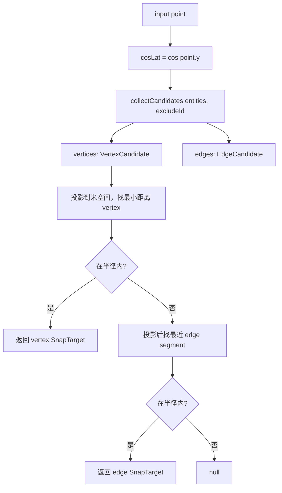
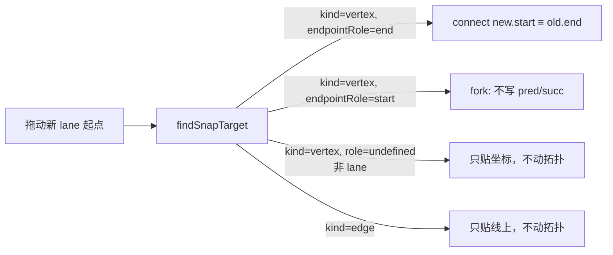

# `geometry/snap` — 吸附

> 源码：`src/core/geometry/snap.ts`
> 测试：`src/core/geometry/__tests__/snap.test.ts`（~9.9 KB）

## Purpose & Invariants

`findSnapTarget` 是一个**纯几何**模块：给定一个 cursor / drag 点、所有 entity、
半径，返回最佳吸附位置 + 来源实体 + 类型（vertex / edge）。

设计准则：

- **顶点优先**：同距离条件下顶点 wins over edge（"贴到那个端点" 比 "贴到附近线段" 更合用户意图）
- **lane 端点特殊待遇**：lane 顶点候选**只**收 `endpointRole: 'start' | 'end'`，
  不收中间点。理由：拓扑（pred/succ）只在端点有意义；如果允许吸附到 lane 内部
  顶点，结果是几何重叠但 reconcile 不识别，看起来连了实际没有连——典型 footgun。
- **不直接 import store / hooks / maplibre**：调用方自己拉数据传进来。
- **不维护索引**：`Iterable<MapEntity>` 全扫；mousemove 60fps 下 1k entity < 1ms。

### 不变量

1. **半径单位为米**：`pixelsToMeters(px, lat, zoom)` 把像素阈值转成米半径。
2. **`excludeId` 排除自身**：拖动时不能贴到正在被拖的实体的旧端点。
3. **lane 边段仍然贡献 edge snap**：mid-lane 拖动可以走 edge snap（不会误触发
   pred/succ）。

## Public API

### Types

```ts
export type SnapKind = 'vertex' | 'edge';
export type LaneEndpointRole = 'start' | 'end';

export interface SnapTarget {
  kind: SnapKind;
  point: GeoPoint; // 吸附后的 lng/lat 位置
  entityId: string;
  entityType: string;
  vertexIndex?: number; // vertex hit 时的源索引
  endpointRole?: LaneEndpointRole;
}
```

### `findSnapTarget(point, entities, radiusMeters, excludeId?) => SnapTarget | null`

```ts
findSnapTarget(
  point: GeoPoint,
  entities: Iterable<MapEntity>,
  radiusMeters: number,
  excludeId: string | null = null,
): SnapTarget | null;
```

流程：



vertex pass 优先；只有所有 vertex 都不在半径内才走 edge pass。

### `pixelsToMeters(pixels, lat, zoom) => number`

Web-Mercator 像素转米：

```
metersPerPixel ≈ cos(lat) · earth_circumference / (512 · 2^zoom)
```

512px tile 是 MapLibre 的 GL 默认（不是 raster 256px）。
（`snap.ts:87-91`）

调用端典型用法：

```ts
const radiusM = pixelsToMeters(8, cursor.lat, currentZoom);
const snap = findSnapTarget(cursor, entities.values(), radiusM, excludeId);
```

### `collectCandidates(entities, excludeId) => { vertices, edges }`

按 entityType 分发收集候选：

| entityType                                        | vertex 候选                                                  | edge 候选    |
| ------------------------------------------------- | ------------------------------------------------------------ | ------------ |
| lane                                              | **仅**端点（start / end），带 `endpointRole`                 | 全中心折线段 |
| junction / pncJunction / parkingSpace / crosswalk | 多边形所有顶点                                               | 闭合环边     |
| signal                                            | `boundary.points` 的顶点                                     | 闭合环边     |
| road                                              | (跳过；几何由其下属 lane 提供)                               | (同)         |
| 其它                                              | `points: GeoPoint[]` 或 `anchors: BezierAnchor[]` 的所有顶点 | 折线段       |

来源：`snap.ts:185-249`。

## 算法详解

### 投影到米空间

```ts
function project(p, cosLat) {
  return { x: p.x * cosLat * DEG_TO_M, y: p.y * DEG_TO_M }; // DEG_TO_M = 111320
}
```

把 lng/lat 度数转成米空间欧氏。距离比较直接 `dx*dx + dy*dy <= radiusSq`。

### 边段最近点

`closestOnSegment(p, a, b)` 标准的"点到线段"投影：

1. 算 segLenSq = |b-a|²；为 0 时退化到点
2. t = clamp((p-a)·(b-a) / segLenSq, 0, 1)
3. 返回 (a + t·(b-a), distSq)

边段距离用 `closestOnSegment(p, a, b).distSq`。

### lane 端点 role 反向触发 pred/succ



`endpointRole` 是 `useConnectLanes` / `useDrawCommit` 之类 hook 决定要不要派
pred/succ 的关键。

## 复杂度

| 函数                | 复杂度                                         |
| ------------------- | ---------------------------------------------- |
| `pixelsToMeters`    | O(1)                                           |
| `collectCandidates` | O(N · V_avg)；N = entities，V_avg = 平均顶点数 |
| `findSnapTarget`    | O(\|vertices\|) + O(\|edges\|) per call        |

实测：1000 entity 平均 30 顶点 / 30 edge，单次 < 1ms。

## 测试覆盖

`snap.test.ts` 覆盖：

- vertex 优先于同半径 edge
- lane 中心折线**中间**顶点不出现在 vertex 候选（只有端点）
- lane edge candidate 仍包括全段
- excludeId 排除自身的所有顶点 + 边
- 半径外不返回任何 SnapTarget
- bezier `anchors` 字段的实体退回到 anchor.point 顶点
- pixelsToMeters 在不同 lat 与 zoom 给出物理正确的米数

## See also

- [geometry/hitTest](./geometry-hit-test) — 同样的 cosLat 米空间换算 / 半径比较
- [geometry/laneTopology](./geometry-lane-topology) — 端点 endpointRole='end' 配
  另一条 lane 的 'start' 派生 pred/succ
- [hooks/useDrawCommit](/api/hooks/use-draw-commit) — commit 时把 snap 结果作为
  drawPoints 最后一个点
- [config/mapConstants](/api/config/) — `SNAP_RADIUS_PX` 等阈值
