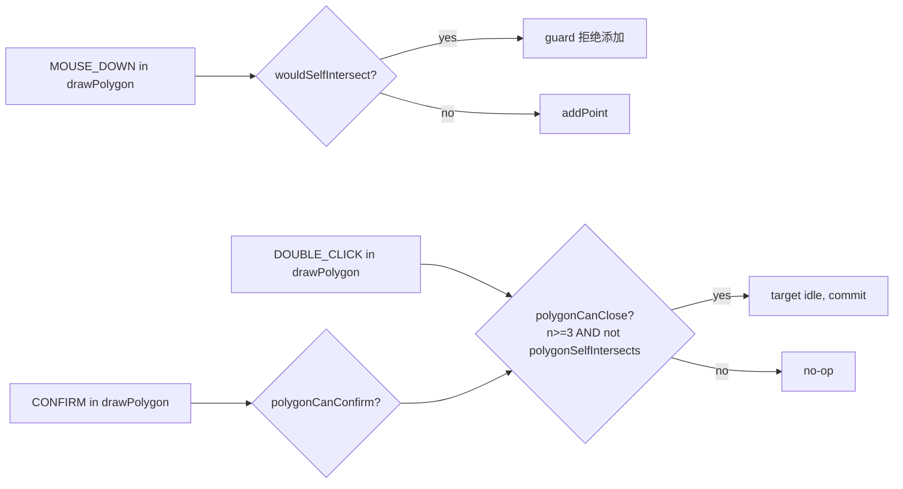

# `geometry/validation` — 自交检测

> 源码：`src/core/geometry/validation.ts`
> 测试：`src/core/geometry/__tests__/validation.test.ts`（~3.4 KB）

## Purpose & Invariants

`validation` 是一组**最小**的纯几何谓词，专门服务于 FSM 的 polygon guard 和
entity mutation 路径：

- `segmentsIntersect` — 两条线段是否严格相交（不含端点 / 共线）
- `wouldSelfIntersect` — 给折线加一个点会不会让新边与已有边相交
- `polygonSelfIntersects` — 闭合多边形是否自交（端点共享 + 相邻边视为不交）

这三函数都不投影到米空间——直接在 lng/lat 度数空间用 cross product 判定。
fork/join 决策的颗粒度 < 1° 时不需要 cosLat 修正（误差不影响"是否相交"的二值结果）。

### 不变量

1. **strict intersection**：端点重合不算相交（`d > 0 && d < 0` 严格异号）。
   FSM polygon 闭合的"末点 ≡ 首点"要靠**外部**判定（dedup 在输入层）。
2. **闭合多边形排除相邻边和首尾共享边**：`polygonSelfIntersects` 显式跳过
   `i === 0 && j === n-1`（首尾相连那条边和首边的"相邻"关系）。

## Public API

### `segmentsIntersect(a1, a2, b1, b2: LngLat): boolean`

```ts
function cross(o, a, b) {
  return (a[0] - o[0]) * (b[1] - o[1]) - (a[1] - o[1]) * (b[0] - o[0]);
}

const d1 = cross(a1, a2, b1);
const d2 = cross(a1, a2, b2);
const d3 = cross(b1, b2, a1);
const d4 = cross(b1, b2, a2);
return ((d1 > 0 && d2 < 0) || (d1 < 0 && d2 > 0)) && ((d3 > 0 && d4 < 0) || (d3 < 0 && d4 > 0));
```

这是经典的双 cross product 测试。任何 `d == 0`（共线 / 端点重合）都不计相交。

### `wouldSelfIntersect(points: LngLat[], newPt: LngLat): boolean`

模拟"加 newPt 进折线尾"，新边 = `points[n-1] → newPt`。检查它和 `points[0..n-2]`
之间所有非邻接边是否相交。

```ts
const edgeStart = points[n - 1];
const edgeEnd = newPt;
for (let i = 0; i < n - 2; i++) {
  if (segmentsIntersect(edgeStart, edgeEnd, points[i], points[i + 1])) return true;
}
return false;
```

注意循环到 `n-2` 而不是 `n-1`：跳过紧邻 newPt 的最后一条边（相邻边自然共享端点）。

FSM 的 `polygonNoSelfIntersect` guard 用它在 `MOUSE_DOWN` 时阻止添加自交点。

### `polygonSelfIntersects(points: LngLat[]): boolean`

闭合多边形自交检测：

```ts
for (let i = 0; i < n; i++) {
  const a1 = points[i];
  const a2 = points[(i + 1) % n];
  for (let j = i + 2; j < n; j++) {
    if (i === 0 && j === n - 1) continue; // 跳过首尾相邻
    const b1 = points[j];
    const b2 = points[(j + 1) % n];
    if (segmentsIntersect(a1, a2, b1, b2)) return true;
  }
}
return false;
```

- `j` 从 `i+2` 开始：跳过相邻边
- 显式跳过 `i=0 ∧ j=n-1`：跳过首尾相连的"环形相邻"对

最少 4 点（少于 4 时直接 false）。

FSM 的 `polygonCanClose` / `polygonCanConfirm` guard 用它判定 DOUBLE_CLICK / CONFIRM
时是否允许 commit。

## 测试覆盖

`validation.test.ts` 覆盖：

- `segmentsIntersect`：标准 X、平行不相交、共线不相交、端点共享不相交、T 形不相交（端点贴边）
- `wouldSelfIntersect`：加点造成新边穿过中间边、加点不造成自交、邻接边不算
- `polygonSelfIntersects`：经典蝴蝶（self-intersect）、凸 / 凹多边形不自交、
  4 点以下返回 false、闭合首尾共享边不误报

## 复杂度

| 函数                    | 复杂度                          |
| ----------------------- | ------------------------------- |
| `segmentsIntersect`     | O(1)（4 个 cross）              |
| `wouldSelfIntersect`    | O(N)（一条边 vs 已有 N-2 条边） |
| `polygonSelfIntersects` | O(N²)（双层 for）               |

`polygonSelfIntersects` 在 polygon 30+ 点时仍 < 0.1ms，对编辑期 60fps 无感。

## 与 FSM 的协同



`polygonCanClose` 与 `polygonCanConfirm` 当前实现等价；分开保留以便未来差异化。

## See also

- [fsm/editorMachine](./fsm-editor-machine) — 三个 guard `polygonNoSelfIntersect`
  / `polygonCanClose` / `polygonCanConfirm` 的实现
- [geometry/interpolate](./geometry-interpolate) — 互补：曲线生成 vs 自交检测
- [geometry/hitTest](./geometry-hit-test) — `pointInPolygon` 是另一个独立的多边形
  谓词
