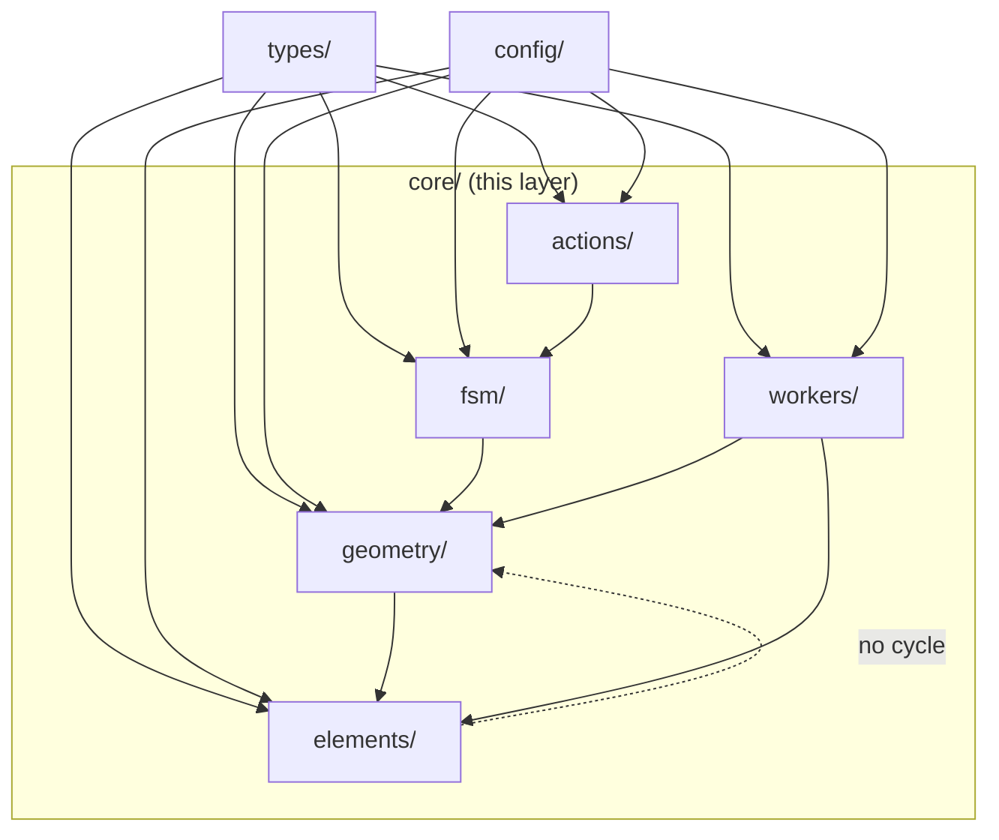

# core/ 层概览

`src/core/` 是整个仓库的最底层（bottom layer）。按 [`ARCHITECTURE.md`](/architecture/) 的分层契约，
`core/` 只允许 import 其他 `core/` 模块、`types/` 和 `config/`，**不允许**反向依赖
`lib/` / `store/` / `hooks/` / `components/`。

> 这一层是 Apollo HD Map Studio 的"领域核心"：FSM、几何、Worker、动作注册表
> 都长在这里。所有 UI/store/hook 通过明确的导出契约消费它，不直接戳内部实现。

## 模块地图

```
src/core/
├── actions/             ← 用户可执行动作的单一事实源（菜单、命令面板、快捷键）
│   ├── registry.ts      barrel: ACTION_DEFS + helpers + types
│   └── registry/
│       ├── definitions.ts   静态 ActionDef[]（19 条）
│       ├── helpers.ts       getMenuActions / matchesKeybinding / formatShortcut
│       └── types.ts         ActionId / ActionCategory / KeyBinding / ToolStripSlot
├── elements.ts          ← Apollo MapElement 目录（12 类 + 颜色/图标/工具）
├── elements/
│   ├── derive/          ← 派生引擎（lane.length / turn / boundarySeed / parking heading）
│   │   ├── index.ts         applyDerive / markUserOverride / clearUserOverride
│   │   ├── types.ts         DeriveCause / DeriveContext / DeriveRule
│   │   └── rules/
│   │       ├── lane.ts          lengthRule / turnRule / boundarySeedRule
│   │       └── parkingSpace.ts  headingFromRectRule
│   └── overlap/         ← Overlap 重算管线（lane × neighbors）
│       ├── reconcile.ts         主入口 reconcileOverlaps
│       ├── spatialIndex.ts      RBush 包装 + bbox 签名增量同步
│       ├── intersect.ts         几何相交基元
│       ├── pairTable.ts         lane × {junction,crosswalk,signal,...} 配对规则
│       ├── overlapId.ts / regionId.ts  语义化派生 id
│       ├── overridePaths.ts     _userOverrides 路径解析
│       ├── computeLaneS.ts      lane 弧长缓存 + projectSegmentParam
│       ├── geometryAdapters.ts  proto → 几何适配器
│       ├── laneCorridor.ts      lane corridor 多边形（lane × crosswalk 区域相交）
│       ├── polyClip.ts          polygon-clipping 包装
│       └── types.ts             ReconcileMode / ReconcilePatch / BBox / IndexNode
├── fsm/
│   └── editorMachine.ts ← XState 5 编辑器状态机（idle/selected/editingPoint/draw*）
├── geometry/
│   ├── apolloCompile.ts         barrel：12 类实体的工厂、坐标抽取、特征编译
│   ├── apolloCompile/
│   │   ├── factory.ts            createApolloEntity + inferLaneTurn
│   │   ├── features.ts           compileApolloFeatures（GeoJSON）
│   │   ├── editPoints.ts         getApolloEditPoints / setAllApolloEditPoints
│   │   ├── conversions.ts        pointsToCurve / pointsToPolygon
│   │   ├── offsetPolyline.ts     等距偏移（lane 左右边界）
│   │   ├── projection.ts         本地 ENU 投影
│   │   ├── signalHeading.ts      信号灯朝向计算
│   │   ├── signalTemplate.ts     信号灯几何模板
│   │   └── laneBoundaryGeometry.ts curvePoints / explicitLaneBoundaryEdges
│   ├── connectLanes.ts           lane 端点对齐：planConnection + applyLaneConnection
│   ├── laneTopology.ts           reconcileLaneTopology(Incremental)
│   ├── interpolate.ts            Catmull-Rom / Bezier / 三点圆弧 / rotatedRect
│   ├── snap.ts                   findSnapTarget（顶点 / 边段两类候选）
│   ├── validation.ts             segmentsIntersect / wouldSelfIntersect / polygonSelfIntersects
│   ├── hitTest.ts                pointToPolylineDist(Geo) / pointToPolygonDist(Geo)
│   ├── laneJunctions.ts          applyLaneJunctions（端点拼接 + 边界装饰）
│   ├── laneJunctions/internal.ts decorateBoundary / endpointDirection / sideJoinOffset
│   ├── coords.ts / anchorConvert.ts / compile.ts
│   └── ...
└── workers/
    ├── spatial.worker.ts         主 cold-layer worker（dispatch only）
    ├── spatialState.ts           SpatialState：tree + featureCache + decorationCache + junctionGraph
    ├── spatialRequests.ts        SYNC / INCREMENTAL / HIT_TEST / SYNC_BEGIN/CHUNK/FINISH
    ├── spatialFeatures.ts        buildFeatureCollection / groupFeaturesByEntity
    ├── spatialHitTest.ts         hitTest（按 PICK_TIER 排序）
    ├── spatialBridge.ts          SpatialWorkerBridge（主线程 RPC）
    ├── protocol.ts               WorkerRequest / WorkerResponse / EntityFeatureGroup / HitResult
    ├── laneJunctionGraph.ts      LaneJunctionGraph（端点 → 依赖 lane id 倒排）
    ├── overlap.worker.ts         全量 overlap 重算 worker（5w 实体 ~450ms）
    └── overlapBridge.ts          OverlapWorkerBridge
```

## 模块导航

| 模块            | 文档                                                | 关键导出                                                                              |
| --------------- | --------------------------------------------------- | ------------------------------------------------------------------------------------- |
| 动作注册表      | [actions/registry](./actions-registry)              | `ACTION_DEFS`、`getMenuActions`、`matchesKeybinding`、`formatShortcut`                |
| 编辑器 FSM      | [fsm/editorMachine](./fsm-editor-machine)           | `editorMachine`、`DrawTool`、`EditorContext`、`EditorEvent`                           |
| 元素目录        | [elements](./elements)                              | `MAP_ELEMENTS`、`ELEMENT_MAP`、`elementColor`、`laneTypeColor`                        |
| 派生引擎        | [elements/derive](./elements-derive)                | `applyDerive`、`markUserOverride`、`clearUserOverride`、`DeriveRule`                  |
| Overlap 重算    | [elements/overlap](./elements-overlap)              | `reconcileOverlaps`、`SpatialIndex`、`makeOverlapId`                                  |
| Apollo 几何编译 | [geometry/apolloCompile](./geometry-apollo-compile) | `createApolloEntity`、`compileApolloFeatures`、`inferLaneTurn`、`getApolloEditPoints` |
| 车道连接        | [geometry/connectLanes](./geometry-connect-lanes)   | `planConnection`、`applyLaneConnection`、`ConnectionMode`                             |
| 车道拓扑        | [geometry/laneTopology](./geometry-lane-topology)   | `reconcileLaneTopology(Incremental)`                                                  |
| 曲线插值        | [geometry/interpolate](./geometry-interpolate)      | `cubicBezier`、`catmullRom`、`threePointArc`、`rectCorners`                           |
| 吸附            | [geometry/snap](./geometry-snap)                    | `findSnapTarget`、`pixelsToMeters`、`SnapTarget`                                      |
| 几何校验        | [geometry/validation](./geometry-validation)        | `segmentsIntersect`、`wouldSelfIntersect`、`polygonSelfIntersects`                    |
| 命中检测        | [geometry/hitTest](./geometry-hit-test)             | `pointToPolylineDist(Geo)`、`pointToPolygonDist(Geo)`、`pointInPolygon`               |
| Lane 端点拼接   | [geometry/laneJunctions](./geometry-lane-junctions) | `applyLaneJunctions`、`decorateBoundary`、`sideJoinOffset`                            |
| Spatial Worker  | [workers/spatial](./workers-spatial)                | dispatch 入口；状态由 `SpatialState` 持有                                             |
| Overlap Worker  | [workers/overlap](./workers-overlap)                | `OverlapWorkerBridge.reconcileFull`                                                   |
| Worker 协议     | [workers/protocol](./workers-protocol)              | `WorkerRequest`、`WorkerResponse`、`EntityFeatureGroup`、`HitResult`                  |
| 端点依赖图      | [workers/junction-graph](./workers-junction-graph)  | `LaneJunctionGraph`、`endpointKeyOf`、`laneEndpointKeys`                              |

## 分层 import 规则



- `geometry/` 是几何原语层；`elements/derive` 调用 `geometry/apolloCompile.inferLaneTurn`、
  `elements/overlap` 调用 `geometry/laneJunctions` 间接产物。
- `workers/` 通过 worker 边界吃 `core/` 的纯函数（`reconcileOverlaps`、`applyLaneJunctions`、
  `compileColdFeatures`），不被反向依赖。
- `actions/` 的 `ActionDef` 引用 `fsm` 的 `DrawTool` 类型，单向依赖。

## 测试覆盖快照

| 模块              | 测试文件                                                         | 行数（参考）    |
| ----------------- | ---------------------------------------------------------------- | --------------- |
| FSM               | `src/core/fsm/__tests__/editorMachine.test.ts`                   | ~47 KB          |
| ActionRegistry    | `src/core/actions/__tests__/registry.test.ts`                    | ~8.6 KB         |
| Apollo Compile    | `src/core/geometry/__tests__/apolloCompile.{gaps,label}.test.ts` | ~13 KB + 3.4 KB |
| connectLanes      | `src/core/geometry/__tests__/connectLanes.test.ts`               | ~11 KB          |
| laneTopology      | `src/core/geometry/__tests__/laneTopology.test.ts`               | ~15 KB          |
| laneJunctions     | `src/core/geometry/__tests__/laneJunctions.{test,bench}.ts`      | ~29 KB + 3.5 KB |
| snap              | `src/core/geometry/__tests__/snap.test.ts`                       | ~9.9 KB         |
| hitTest           | `src/core/geometry/__tests__/hitTest.test.ts`                    | ~9.3 KB         |
| validation        | `src/core/geometry/__tests__/validation.test.ts`                 | ~3.4 KB         |
| spatial.worker    | `src/core/workers/__tests__/spatial.worker.test.ts`              | ~15 KB          |
| LaneJunctionGraph | `src/core/workers/__tests__/laneJunctionGraph.test.ts`           | ~6.1 KB         |
| Overlap           | `src/core/elements/overlap/__tests__/*.test.ts`                  | 多文件          |
| Derive            | `src/core/elements/derive/__tests__/*.test.ts`                   | 多文件          |

## See also

- [架构总览](/architecture/)
- [English version](/en/api/core/)
- [lib/entityOps](/api/lib/entity-ops) — proto 反腐层（R2 anti-corruption），
  UI 与 `core/` 之间的唯一桥梁。
- [hooks/useColdLayer](/api/hooks/use-cold-layer) — 主线程 cold-layer scheduler，
  通过 `SpatialWorkerBridge` 把 `entities` 推到 worker。
