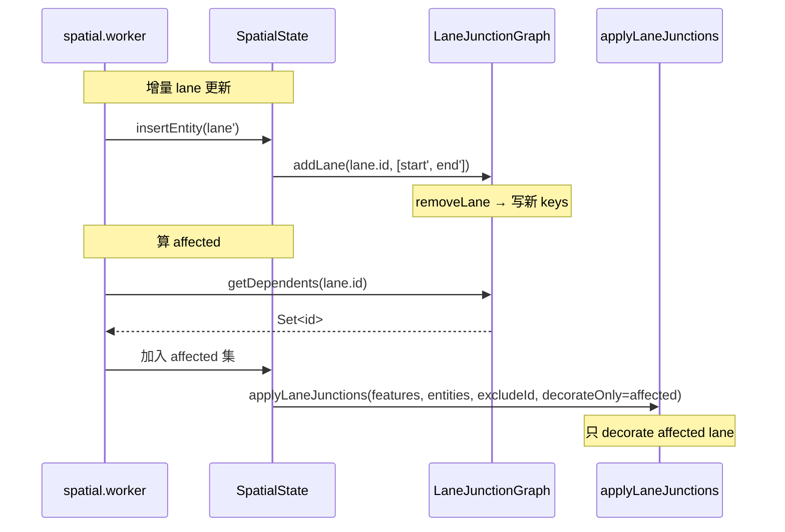

# `workers/junction-graph` — 端点依赖图

> 源码：`src/core/workers/laneJunctionGraph.ts`
> 测试：`src/core/workers/__tests__/laneJunctionGraph.test.ts`（~6.1 KB）

## Purpose & Invariants

为什么要这个图？

`applyLaneJunctions` 每次重建都会 stitch 全部 junction，且 worker 在每次
entity edit 时调用它。500 lane 量级的 cold-layer 单次 ~250ms（boundary
decoration 主导）。Phase E 优化要把"装饰只重算被影响的 lane"，所以**必须**
能快速回答："哪些 lane 跟 lane X 共享端点？"

`LaneJunctionGraph` 维护两份索引：

```ts
private laneToKeys = new Map<string, [EndpointKey, EndpointKey]>();   // lane id → [start, end]
private keyToLanes = new Map<EndpointKey, Set<string>>();             // endpoint key → Set<lane id>
```

`getDependents(id)` 返回与 `id` 共享至少一个端点的 lane id 集合（不含自己），
O(K) 时间，K 是端点 fan-out（典型 2-4）。

### 不变量

1. **端点 key 用 `toFixed(6)`**：与 `geometry/laneJunctions` 渲染端 stitch 端点
   颗粒度对齐 ≈ 1cm，否则两边判定不一致 → 装饰刷不到该刷的 lane。
2. **`addLane` 幂等**：内部 `removeLane` 先清旧条目，再 insert 新条目。
3. **`removeLane` 删空 bucket**：`keyToLanes.get(key).size === 0` 时删 key。

## Public API

### Types

```ts
export type EndpointKey = string;
```

### `endpointKeyOf(pt: GeoPoint): EndpointKey`

```ts
return `${pt.x.toFixed(6)},${pt.y.toFixed(6)}`;
```

约 1cm 颗粒度（lng/lat 都按 toFixed(6)）。
（`laneJunctionGraph.ts:25-27`）

### `laneEndpointKeys(lane: LaneEntity): [EndpointKey, EndpointKey] | null`

抽 lane 中心线首末点，转 endpointKey；中心线 < 2 点返回 null。
（`laneJunctionGraph.ts:30-36`）

### `class LaneJunctionGraph`

#### `addLane(id, [startKey, endKey])`

幂等插入：先 `removeLane(id)`，再写 `laneToKeys` + 把 id 加入两个 endpoint 的
`keyToLanes` bucket。
（`laneJunctionGraph.ts:47-58`）

#### `removeLane(id)`

清 `laneToKeys[id]` + 从两个 endpoint bucket 删 id；空 bucket 删 key。
（`laneJunctionGraph.ts:61-71`）

#### `getDependents(id) => Set<string>`

```ts
const out = new Set<string>();
const keys = this.laneToKeys.get(id);
if (!keys) return out;
for (const key of keys) {
  const bucket = this.keyToLanes.get(key);
  if (!bucket) continue;
  for (const other of bucket) if (other !== id) out.add(other);
}
return out;
```

返回**所有**与 lane id 共享至少一个端点的其它 lane id。（`laneJunctionGraph.ts:74-86`）

#### `has(id)` / `size()` / `clear()`

便捷查询与 reset。

## 工作流



## 算法属性

### O(K) 查找

```
getDependents(X)
  = ∪ keyToLanes[key]  for key in laneToKeys[X]   (除 X 自身)
```

K 是端点 fan-out 上限。一个 4-way junction = 4 lane × 2 端点 = 单端点 fan-out
最多 4。所以 `getDependents` 平均 < 10 集合操作。

### 端点 share 的语义

两条 lane "共享端点" 在本图中意味着 endpointKey 相等——但**不区分** start vs
end 哪一边。一对 lane 端到端 (A.end ≡ B.start) 与端起头 (A.start ≡ B.start)
都会让 `getDependents(A)` 包含 B。这正是 stitch 路径需要的"任何端点共享"语义。

更细粒度的"是否真 stitch"由 `applyLaneJunctions` 内的 `isContinuousJunction`
判定（参见 [geometry/laneJunctions](./geometry-lane-junctions)）。

## 与拓扑层 (`laneTopology.ts`) 的差异

| 方面   | `laneJunctionGraph` (worker) | `laneTopology` (geometry)                             |
| ------ | ---------------------------- | ----------------------------------------------------- |
| 颗粒度 | endpoint key 共享            | 同 toFixed(6) 端点                                    |
| 输出   | `Set<lane id>`（依赖关系）   | `LaneTopologyDiff.changes`（pred/succ/neighbor 字段） |
| 用途   | Phase E 增量装饰范围         | reconcile 写回 lane 拓扑字段                          |
| 持久   | 是（worker singleton 长存）  | 否（每次重新 buildIndices）                           |

两者并存：worker 的 graph 是性能抓手；topology 是数据派生事实。

## 复杂度

| 操作               | 复杂度                                |
| ------------------ | ------------------------------------- |
| `endpointKeyOf`    | O(1)                                  |
| `laneEndpointKeys` | O(P)（curvePoints）                   |
| `addLane`          | O(1)（amortized）；幂等               |
| `removeLane`       | O(1)                                  |
| `getDependents`    | O(K)，K=端点 fan-out 总和（典型 2-4） |
| `has` / `size`     | O(1)                                  |
| `clear`            | O(N+K)                                |

## 测试覆盖

`laneJunctionGraph.test.ts` 覆盖：

- 单 lane addLane → 两个 endpoint bucket 各含 1 个 id
- 两 lane 共享端点 → 互为 dependent
- removeLane → bucket 减 1，最后清空时删 key
- 反复 addLane 同 id → 幂等（先 remove 再 insert）
- 端点变化（lane 几何变了 → endpointKeys 变） → addLane 自动更新
- getDependents 返回不含自己
- clear 后 size 为 0

## See also

- [geometry/laneJunctions](./geometry-lane-junctions) — Phase E 装饰消费 dependents
- [workers/spatial](./workers-spatial) — `addLane` / `removeLane` 调用点
  （insertEntity / removeEntity）
- [geometry/laneTopology](./geometry-lane-topology) — 主线程拓扑派生（pred/succ）
- [workers/protocol](./workers-protocol) — INCREMENTAL → COLD_DELTA 路径用 dependents
  算 affected
