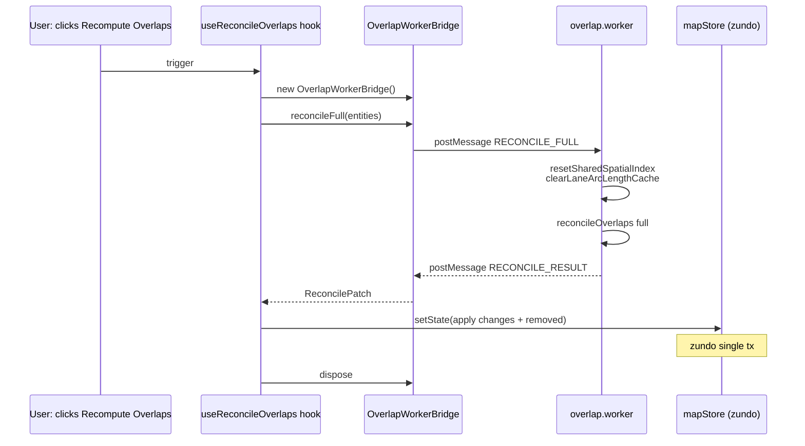

# `workers/overlap` — Overlap 重算 Worker

> 源码：`src/core/workers/overlap.worker.ts`
> 主线程桥：`src/core/workers/overlapBridge.ts`
> 测试：覆盖在 `elements/overlap/__tests__/` 的 reconcile 单测中（worker 仅做封装）

## Purpose & Invariants

5w 实体规模下，`reconcileOverlaps({ mode: 'full' })` 主线程跑 ~450ms—会把
60 fps 编辑卡到掉帧。本 worker 把 full 模式封装成一对 request/response：

- **何时走 worker**：导入完成 / 用户点 "Recompute overlaps" / 导出前校验。
- **何时走主线程**：编辑期 incremental（dirty=1~3）< 6ms，主线程直接跑（worker
  postMessage 拷贝 5w entity 反而成主要瓶颈）。

### 不变量

1. **Worker 不持有 store 引用**：纯计算 → 通过 `OverlapWorkerBridge` 把
   `entities: Map` 发过去，拿回 `ReconcilePatch` 再由主线程 apply（保 zundo
   单事务）。
2. **Worker 内部独立 V8 isolate**：`resetSharedSpatialIndex()` + `clearLaneArcLengthCache()`
   在每次请求开始时清，避免连续多次 RECONCILE_FULL 拿到旧索引。
3. **协议独立于 spatial.worker**：overlap 与空间索引职责分离，不把两个 worker 合一。

## 协议

### Request

```ts
interface OverlapRequest {
  type: 'RECONCILE_FULL';
  requestId: string;
  entities: MapEntity[];
}
```

`entities` 是数组（postMessage 序列化更直接）；worker 内部转为 `Map<id, entity>`。

### Response

```ts
interface OverlapResponse {
  type: 'RECONCILE_RESULT';
  requestId: string;
  changes: Array<[string, MapEntity]>;
  removedOverlapIds: string[];
  stats: {
    pairsTested: number;
    pairsMatched: number;
    overlapsCreated: number;
    overlapsRemoved: number;
    durationMs: number;
  };
}
```

`changes` 用数组而不是 Map：postMessage 不能直接传 Map（旧 Safari），数组
`Array.from(map.entries())` 是兼容写法；主线程 bridge 再 `new Map(...)`。

## 主线程使用

```ts
import { OverlapWorkerBridge } from '@/core/workers/overlapBridge';

const bridge = new OverlapWorkerBridge();
try {
  const patch = await bridge.reconcileFull(entities);
  // 保 zundo 单事务
  mapStore.setState((draft) => {
    for (const id of patch.removedOverlapIds) draft.entities.delete(id);
    for (const [id, e] of patch.changes) draft.entities.set(id, e);
  });
} finally {
  bridge.dispose(); // 一次性使用就 dispose
}
```

### `OverlapWorkerBridge`

```ts
class OverlapWorkerBridge {
  reconcileFull(
    entities: ReadonlyMap<string, MapEntity>,
    timeoutMs?: number, // 默认 30_000
  ): Promise<ReconcilePatch>;

  dispose(): void; // terminate worker；清 pending
}
```

## Lifecycle



## Worker 实现要点（overlap.worker.ts）

```ts
self.onmessage = (e: MessageEvent<OverlapRequest>) => {
  const req = e.data;
  if (req.type !== 'RECONCILE_FULL') return;

  // 独立 isolate 自己的 singleton
  resetSharedSpatialIndex();
  clearLaneArcLengthCache();

  const map = new Map<string, MapEntity>();
  for (const entity of req.entities) map.set(entity.id, entity);

  const patch = reconcileOverlaps(map, { mode: 'full' });
  self.postMessage({
    type: 'RECONCILE_RESULT',
    requestId: req.requestId,
    changes: Array.from(patch.changes.entries()),
    removedOverlapIds: Array.from(patch.removedOverlapIds),
    stats: patch.stats,
  });
};
```

只 35 行——worker 是**封装** `reconcileOverlaps` 的薄层，不重新实现逻辑。

## Bridge 实现要点（overlapBridge.ts）

- **timeout**：默认 30s，足够 5w 实体（~450ms）的 12+ 倍冗余。
- **Pending Map**：`Map<requestId, { resolve, reject, timer }>`；
  worker.onmessage 找到对应 entry，clearTimeout + resolve。
- **错误处理**：worker.onerror 把所有 pending reject 掉。
- **dispose**：terminate worker + reject pending；幂等。

## 性能特征

| 实体规模 | 主线程 incremental（dirty=1） | Worker full |
| -------- | ----------------------------- | ----------- |
| 5k       | < 1ms                         | ~30ms       |
| 50k      | < 6ms                         | ~450ms      |

worker postMessage 拷贝 5w entity（典型 30~50 MB JSON 序列化）成主要开销，
约 100~200ms；reconcile 本身 ~250~300ms。SharedArrayBuffer 启用是未来优化点。

## 测试覆盖

`overlap.worker` 本身没单测——它只是 `reconcileOverlaps` 的 thin worker shim。
逻辑覆盖在 `src/core/elements/overlap/__tests__/reconcile.test.ts`：

- full 模式 vs incremental 模式语义等价（dirtyIds = all entities 时输出一致）
- stats 字段（pairsTested / pairsMatched 等）累积正确

## See also

- [elements/overlap](./elements-overlap) — `reconcileOverlaps` 主流程
- [workers/protocol](./workers-protocol) — spatial worker 是另一套独立协议（这个不复用）
- [mapStore.recomputeOverlapsAsync](/api/store/map-store) — UI 调用的异步重算入口
- [store/mapStore](/api/store/map-store) — apply patch 的 setState
