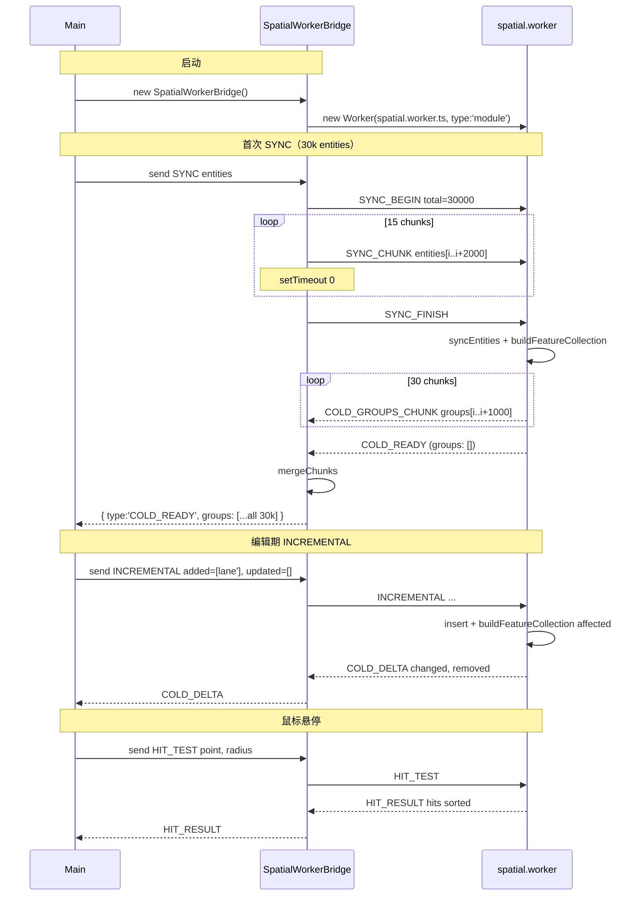

# `workers/protocol` — Worker 消息协议

> 源码：`src/core/workers/protocol.ts`
> 消费者：`workers/spatial.worker.ts`、`workers/spatialBridge.ts`、
> `workers/spatialRequests.ts`、`workers/spatialFeatures.ts`

## Purpose & Invariants

`protocol.ts` 是主线程 ↔ spatial worker 通信的**类型契约**。所有消息都
postMessage 序列化（V8 structured clone，跨 isolate 拷贝），所以：

1. **不能传 Map / Set / Function**（postMessage 不支持）。`SerializedEntity`
   就是 `MapEntity`（已经是 plain object union）。
2. **`requestId` 用于配对 request/response**：bridge 维护 `Map<requestId,
PendingEntry>`；worker 把 requestId 原样回传。
3. **大数据用 chunk**：SYNC 实体 > 2000 走 `SYNC_BEGIN` + `SYNC_CHUNK[]` +
   `SYNC_FINISH`；返回 group 数 > 1000 走 `COLD_GROUPS_CHUNK` + 终止
   `COLD_READY` 的合并。
4. **`overlap.worker` 协议独立**：本协议**只**服务 spatial.worker。

## 主线程 → Worker

```ts
export type WorkerPublicRequest =
  | { type: 'SYNC'; requestId: string; entities: SerializedEntity[]; excludeId?: string | null }
  | {
      type: 'INCREMENTAL';
      requestId: string;
      added: SerializedEntity[];
      removed: string[];
      updated: SerializedEntity[];
      excludeId?: string | null;
    }
  | { type: 'HIT_TEST'; requestId: string; point: [number, number]; radius: number };

export type WorkerRequest =
  | WorkerPublicRequest
  | { type: 'SYNC_BEGIN'; requestId: string; total: number; excludeId?: string | null }
  | {
      type: 'SYNC_CHUNK';
      requestId: string;
      entities: SerializedEntity[];
      offset: number;
      total: number;
    }
  | { type: 'SYNC_FINISH'; requestId: string };
```

`SerializedEntity = MapEntity`。

### `'SYNC'`（小负载直接走）

主线程把全部 entities 一次发过来。worker 调 `syncEntities` 重建 tree +
featureCache + junctionGraph，回 `COLD_READY`。

### `'SYNC_BEGIN' / 'SYNC_CHUNK' / 'SYNC_FINISH'`（大负载分块）

bridge 在 `request.entities.length > SYNC_ENTITY_CHUNK_SIZE (2000)` 时自动
切成多次 `SYNC_CHUNK`，每两块之间 `setTimeout(0)` 让 main thread 处理事件
（不卡 UI）。

```ts
SYNC_BEGIN(total, excludeId)
SYNC_CHUNK(entities[0..2000], offset=0, total)
SYNC_CHUNK(entities[2000..4000], offset=2000, total)
...
SYNC_FINISH                           // worker 一次性 syncEntities + buildFeatureCollection
```

### `'INCREMENTAL'`

```ts
{ type: 'INCREMENTAL', requestId, added, removed, updated, excludeId? }
```

worker 逐条 remove / insert，通过 junctionGraph 计算 affected lane 集，
重建 affected 部分的 features，回 `COLD_DELTA`。

### `'HIT_TEST'`

```ts
{ type: 'HIT_TEST', requestId, point: [lng, lat], radius: degrees }
```

`radius` 量纲 = lng 度数（caller `pixelToRadius(px, zoom)` 算）。worker 用
`tree.search` 缩范围 + `pointToPolyline/PolygonDistGeo` 精确判定。

## Worker → 主线程

```ts
export interface EntityFeatureGroup {
  id: string;
  features: GeoJSON.Feature[];
}

export type WorkerResponse =
  | {
      type: 'COLD_GROUPS_CHUNK';
      requestId: string;
      groups: EntityFeatureGroup[];
      offset: number;
      total: number;
    }
  | {
      type: 'COLD_READY';
      requestId: string;
      featureCollection?: GeoJSON.FeatureCollection;
      groups: EntityFeatureGroup[];
    }
  | { type: 'COLD_DELTA'; requestId: string; changed: EntityFeatureGroup[]; removed: string[] }
  | { type: 'HIT_RESULT'; requestId: string; hits: HitResult[] };

export interface HitResult {
  id: string;
  entityType: string;
  distance: number;
}
```

### `'COLD_READY'`

SYNC 完成。`groups` 是 per-entity 的 feature 桶（主线程 cold-layer cache 按
id key）。当 `groups.length > 1000`，worker 会发 `COLD_GROUPS_CHUNK[]` 然后
最后一条 `COLD_READY` 把 `groups: [], featureCollection: undefined` 设空，
表示"chunked 模式收尾"——bridge 的 `mergeChunks` 把所有 chunk 拼回一条。

### `'COLD_GROUPS_CHUNK'`

分块发 group，避免单条消息过大（V8 structured clone 上限 ~1GB 但实际 <
100MB 就有性能崩坏）。

### `'COLD_DELTA'`

INCREMENTAL 结果。`changed` 只含本次 mutation 影响到的 entity（包括端点共
享 lane 的 decoration 重算）。`removed` 是被删的 entity id。主线程的 cold
cache 直接 `delete + set`。

### `'HIT_RESULT'`

按 PICK_TIER + distance 排序的 hits。第一个就是用户"看起来点中"的 entity。

## EntityFeatureGroup 的 id 与 unkeyed bucket

`groupFeaturesByEntity`（spatialFeatures.ts）按 `feature.properties.id`
分桶。没有 string id 的 feature（少见，例如非实体的全局装饰）会被丢进
`__unkeyed` bucket。**每个 group 内** feature id 由 `withUniqueFeatureIds`
保证不重复（同一 entity 多 feature 时给 `:1`、`:2` 后缀）。

## 完整 sequence（典型编辑）



## 测试覆盖

protocol 类型契约是 TS 类型，正确性靠：

- `spatial.worker.test.ts` 覆盖各 request → response 的语义正确
- `WorkerRequest` / `WorkerResponse` 编译期穷举（switch 的 default 处会触发
  TS error 当未覆盖一支）

## See also

- [workers/spatial](./workers-spatial) — 协议消费者
- [workers/junction-graph](./workers-junction-graph) — INCREMENTAL 计算 affected 时调用
- [hooks/useColdLayer](/api/hooks/use-cold-layer) — bridge 主线程消费方
- [hooks/useHotLayer](/api/hooks/use-hot-layer) — 不走 worker（实时拖拽走主线程）
