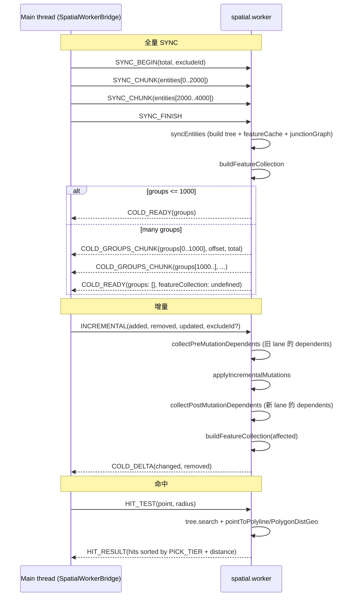
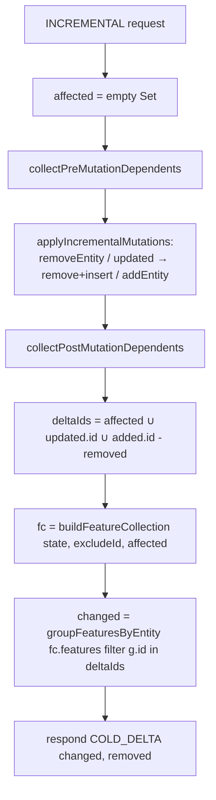
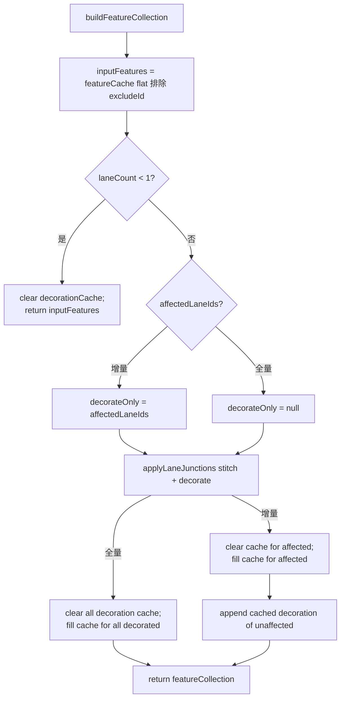
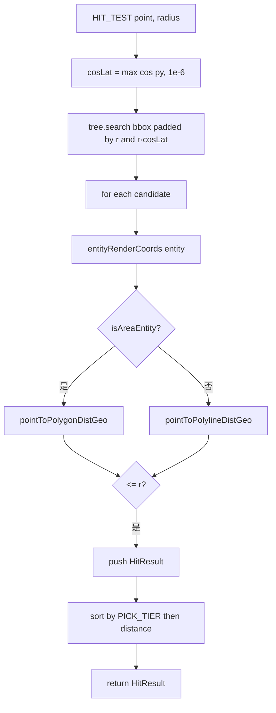

# `workers/spatial` — Cold Layer Worker

> 源码（dispatcher 极薄）：`src/core/workers/spatial.worker.ts`
> 状态：`spatialState.ts`（SpatialState 工厂 + insert/remove/sync）
> 请求处理：`spatialRequests.ts`（handleRequest 一支独大）
> 特征构建：`spatialFeatures.ts`（buildFeatureCollection / groupFeaturesByEntity）
> 命中：`spatialHitTest.ts`（hitTest + PICK_TIER）
> 主线程桥：`spatialBridge.ts`（SpatialWorkerBridge）
> 测试：`src/core/workers/__tests__/spatial.worker.test.ts`（~15 KB）

## Purpose & Invariants

`spatial.worker.ts` 是把 cold-layer feature 编译 + RBush 命中检测搬到 Web Worker
的实现，让主线程在 5w 实体规模下不卡帧。文件本身只是 dispatcher（10 行 +
chunked respond），所有逻辑分散到 `spatialState` / `spatialRequests` /
`spatialFeatures` / `spatialHitTest` 四个 helper。

worker-local 状态 `SpatialState`：

```ts
interface SpatialState {
  tree: RBush<SpatialItem>; // 空间索引
  entityMap: Map<string, MapEntity>; // id → entity
  itemMap: Map<string, SpatialItem>; // id → bbox node
  featureCache: Map<string, GeoJSON.Feature[]>; // id → 编译后的 cold features
  decorationCache: Map<string, GeoJSON.Feature[]>; // id → boundary 装饰 features
  junctionGraph: LaneJunctionGraph; // 端点 → 依赖 lane id
  pendingSyncs: Map<string, { entities; total; excludeId? }>; // chunked SYNC
  laneCount: number;
}
```

### 不变量

1. **Worker 是单实例**：spatialBridge 只 new 一次 Worker，整个 session 复用。
2. **状态在 worker 内**，主线程通过 postMessage 与 worker 同步；不共享内存
   （SharedArrayBuffer 暂未启用，跨 isolate 拷贝是协议成本）。
3. **`featureCache` 缓存的是 `compileColdFeatures(entity)` 的结果**，每 entity 一份
   ——edit 时只更新被 mutate 的 entity，未变实体的 features 直接复用。
4. **`decorationCache` 是 Phase E 关键**：boundary decoration 单独缓存，
   `INCREMENTAL` 模式只对 affected lane 重 decorate。
5. **`junctionGraph` 由 `addLane`/`removeLane` 同步维护**：lane mutation 时插
   `[startKey, endKey]`，删除时清条目。

## Worker 协议（高层）



完整消息类型见 [workers/protocol](./workers-protocol)。

## handleRequest 分发（spatialRequests.ts）

```ts
function handleRequest(state: SpatialState, req: WorkerRequest, respond: Respond) {
  switch (req.type) {
    case 'SYNC':
      handleSync(state, req, respond);
    case 'SYNC_BEGIN':
      handleSyncBegin(state, req);
    case 'SYNC_CHUNK':
      handleSyncChunk(state, req);
    case 'SYNC_FINISH':
      handleSyncFinish(state, req, respond);
    case 'INCREMENTAL':
      handleIncremental(state, req, respond);
    case 'HIT_TEST':
      respond({ type: 'HIT_RESULT', hits: hitTest(state, req.point, req.radius) });
  }
}
```

### `handleIncremental` 详解



`affected` 包含端点共享的 lane（pre + post），保证装饰（decoration）刷到所有
看得见受影响的 lane。`deltaIds` 是 worker → 主线程要回传的 group 集合。

## buildFeatureCollection（spatialFeatures.ts）



## hitTest（spatialHitTest.ts）



`PICK_TIER` 分层（`spatialHitTest.ts:13-31`）：

| tier        | entityType                                                       |
| ----------- | ---------------------------------------------------------------- |
| 0           | signal / stopSign / yieldSign / rsu / barrierGate / speedControl |
| 1           | crosswalk / speedBump / parkingSpace                             |
| 2           | lane / road / overlap                                            |
| 3           | clearArea / junction / pncJunction / parkingLot / area           |
| 9 (default) | 其它                                                             |

低 tier 优先，让"点击信号灯图标"不会被下面的 junction polygon 抢走。

## SpatialWorkerBridge（spatialBridge.ts）

主线程封装。核心：

- `send(request, timeout?)` → `Promise<WorkerResponse>`
- 每条请求带 `requestId`，pending Map 维护 resolve/reject + timer
- `SYNC` 实体 > 2000 时自动 chunked（`postChunkedSync`），yield to main
  task event loop
- `mergeChunks` 把 `COLD_GROUPS_CHUNK` 与 `COLD_READY` 合成单一 response
- `dispose()` 清 pending、terminate worker

默认 timeout = 120s（5w 实体冷启动可能 > 10s，给 12 倍冗余）。

## 复杂度

| 操作 | 复杂度 |
| ----------- | --------------------------------------------------- | -------- | ------------------------------- |
| SYNC | O(N + L·B)：N=entities，L=lanes，B=每条 lane 边界段 |
| INCREMENTAL | O( | affected | ·B + Δentities·feature_compile) |
| HIT_TEST | O(log N + k·V)：k=候选数，V=平均顶点数 |

## 测试覆盖

`spatial.worker.test.ts` 覆盖：

- SYNC：tree.search 命中正确数量
- SYNC_BEGIN/CHUNK/FINISH：分块同步正确性
- INCREMENTAL：added / removed / updated 各种组合下 changed 集正确
- HIT_TEST：点击 lane 时返回 lane（不被 junction 抢）
- excludeId：不出现在 feature collection 里
- 端点共享 lane 修改时另一条 lane 也在 affected 中（junctionGraph）

## See also

- [workers/protocol](./workers-protocol) — 完整消息类型
- [workers/junction-graph](./workers-junction-graph) — `LaneJunctionGraph` 内部
- [geometry/laneJunctions](./geometry-lane-junctions) — `applyLaneJunctions`
- [geometry/hitTest](./geometry-hit-test) — `pointToPolylineDistGeo` / `pointToPolygonDistGeo`
- [hooks/useColdLayer](/api/hooks/use-cold-layer) — 主线程调用 SpatialWorkerBridge.send 的入口
