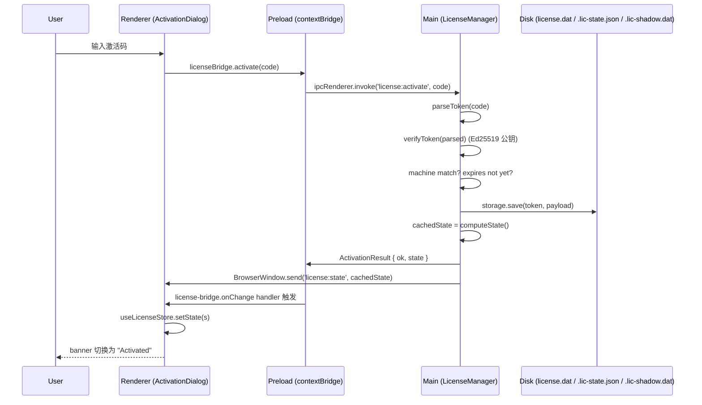
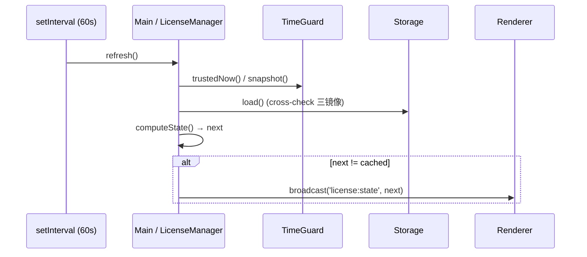

# Electron 集成总览

Apollo Map Studio 桌面构建基于 Electron 41。本页面汇总主进程 / 预加载 / 渲染端的关系、IPC 通道、安全配置、许可证子系统的入口。

## 进程架构

```
┌──────────────────────────────────────────────────────────────┐
│  Main process  (Node.js)                                     │
│  electron/main.cts                                           │
│  electron/license/manager.cts                                │
│  ─ window 创建                                               │
│  ─ 应用生命周期 (single-instance lock, before-quit)          │
│  ─ LicenseManager: machine-id / time-guard / storage / IPC  │
└────────────────────────┬─────────────────────────────────────┘
                         │ IPC (license:get-state / activate / ...)
                         │ Push (license:state broadcast)
                         ▼
┌──────────────────────────────────────────────────────────────┐
│  Preload  (sandboxed Node, contextIsolated)                  │
│  electron/preload.cts                                        │
│  ─ contextBridge.exposeInMainWorld('apolloMapStudio', ...)   │
│  ─ contextBridge.exposeInMainWorld('apolloMapStudioLicense', │
│        { getState, getMachineCode, activate, deactivate,     │
│          onChange })                                         │
└────────────────────────┬─────────────────────────────────────┘
                         │ window.apolloMapStudio*
                         ▼
┌──────────────────────────────────────────────────────────────┐
│  Renderer  (Chromium)                                        │
│  src/lib/license-bridge.ts  (window 封装 + 浏览器 fallback)  │
│  src/store/licenseStore.ts  (Zustand 镜像)                   │
│  src/lib/editable-guard.ts  (mutator 守卫)                   │
│  React UI                                                    │
└──────────────────────────────────────────────────────────────┘
```

## 安全配置（main.cts）

```ts
new BrowserWindow({
  webPreferences: {
    preload: getPreloadPath(),
    contextIsolation: true, // ✓ 渲染端 / preload 隔离
    nodeIntegration: false, // ✓ 渲染端无 require
    sandbox: true, // ✓ preload 也在 sandbox（Chromium 沙箱）
  },
});
```

三项都开 —— 这是 Electron 14+ 的安全基线。

| 选项               | 值      | 含义                                                                 |
| ------------------ | ------- | -------------------------------------------------------------------- |
| `contextIsolation` | `true`  | preload 与渲染端 V8 上下文隔离；只能通过 `contextBridge` 暴露 API    |
| `nodeIntegration`  | `false` | 渲染端 `require` / `process` 不可见                                  |
| `sandbox`          | `true`  | preload 在 Chromium 进程沙箱内运行；只能用 `electron` 模块的安全子集 |

外部链接处理 (`setWindowOpenHandler`) ：

```ts
mainWindow.webContents.setWindowOpenHandler(({ url }) => {
  if (url.startsWith('http://') || url.startsWith('https://')) {
    void shell.openExternal(url);
  }
  return { action: 'deny' }; // 默认拒绝，所有 window.open 走系统浏览器
});
```

## IPC 通道清单

许可证相关（唯一对外通道）：

| 通道                       | 类型                   | 渲染端入口                        | 主进程 handler           |
| -------------------------- | ---------------------- | --------------------------------- | ------------------------ |
| `license:get-state`        | invoke → Promise       | `licenseBridge.getState()`        | `manager.refresh()`      |
| `license:get-machine-code` | invoke → Promise       | `licenseBridge.getMachineCode()`  | 直接返回 `machine.code`  |
| `license:activate`         | invoke(code) → Promise | `licenseBridge.activate(code)`    | `manager.activate(code)` |
| `license:deactivate`       | invoke → Promise       | `licenseBridge.deactivate()`      | `manager.deactivate()`   |
| `license:state`            | push (main → renderer) | `licenseBridge.onChange(handler)` | `manager.broadcast()`    |

注意：所有通道都使用 `string` literal，没有用 enum—— `electron/license/manager.cts` 与 `electron/preload.cts` 各自维护一份 `LICENSE_IPC` 对象，确保两边一致。

## 模块导航

### 主进程

- [`main.cts`](./electron/main-process.md) —— window 创建、生命周期、LicenseManager 启停
- [`license/manager.cts`](./electron/license-manager.md) —— 许可证状态机、IPC handler、计时器
- [`license/storage.cts`](./electron/license-storage.md) —— 三镜像 + HMAC 文件存储
- [`license/crypto.cts`](./electron/license-crypto.md) —— Ed25519 / AES-GCM / HMAC / HKDF
- [`license/machine-id.cts`](./electron/license-machine-id.md) —— 机器码 (16 字符 base32)
- [`license/time-guard.cts`](./electron/license-time-guard.md) —— 时间篡改检测
- `license/public-key.cts` —— 内嵌 Ed25519 public key + APP_PEPPER
- `license/types.cts` —— 共享类型 (`LicenseState`, `ActivationResult`, `LicensePayload`)

### 预加载

- [`preload.cts`](./electron/preload.md) —— `contextBridge` 暴露 `apolloMapStudio` / `apolloMapStudioLicense`

### 渲染端

- [`license-bridge`](./lib/license-bridge.md) —— window API 包装
- [`licenseStore`](./store/license-store.md) —— React state 镜像
- [`editable-guard`](./lib/editable-guard.md) —— store mutator 守卫

## 激活时序



## 试用 / 状态判定时序

主进程每 60 秒自我刷新一次 `cachedState`，状态变化时广播：



## 许可证状态机

参见 [`licenseStore`](./store/license-store.md) 的状态表，简版：

```
       ┌───────────────────────┐
       │  not_started (clock?) │
       └─────────┬─────────────┘
                 │ time advances past trialStart
                 ▼
       ┌───────────────────────┐
       │       trial           │  (canEdit=true, 7 天)
       └─────────┬─────────────┘
                 │ activate(valid token)
                 ▼
       ┌───────────────────────┐
  ┌────│      activated        │
  │    └─────────┬─────────────┘
  │              │ expires < now
  │              ▼
  │    ┌───────────────────────┐
  │    │   expired_license     │
  │    └───────────────────────┘
  │
  │ Trial 路径：trial 时长耗尽
  │  ▼
  │ ┌───────────────────────┐
  └►│   expired_trial       │
    └───────────────────────┘

  任何状态 + 异常 →
  ┌───────────────────────┐  ┌─────────────────┐  ┌──────────┐
  │    tampered           │  │ machine_mismatch│  │ invalid  │
  └───────────────────────┘  └─────────────────┘  └──────────┘
```

## 离线安装包打包

`electron-builder.yml` 配置参见仓库根；构建产物在 `release/`。CI 工作流 `.github/workflows/desktop-package.yml` 在打 tag 时跨平台（mac/win/linux）打包。

## 相关源文件

- `electron/main.cts` (106 行)
- `electron/preload.cts` (47 行)
- `electron/license/manager.cts` (327 行)
- `electron/license/storage.cts` (280 行)
- `electron/license/crypto.cts` (201 行)
- `electron/license/machine-id.cts` (233 行)
- `electron/license/time-guard.cts` (251 行)
- `electron/license/public-key.cts` (37 行)
- `electron/license/types.cts` (88 行)

## 构建配置 highlight

### `tsconfig.electron.json`

主进程代码用独立 tsconfig：

- `module: "commonjs"` —— Electron main 仅 CJS
- `target: "ES2022"` —— Node 22 全部支持
- 输出目录 `dist-electron/`

### `electron-builder.yml`

```yaml
appId: com.apollo-map-studio.app
productName: Apollo Map Studio
files:
  - dist/** # renderer
  - dist-electron/** # main + preload
  - node_modules/** # 依赖
mac:
  target: dmg
  category: public.app-category.developer-tools
win:
  target: nsis
linux:
  target: AppImage
```

CI workflow `.github/workflows/desktop-package.yml` 在 git tag push 时跨平台 build。

## 故障排查指引

### "Activation is only available in the desktop build"

浏览器构建里调用 `licenseBridge.activate()` —— `window.apolloMapStudioLicense` 不存在。检查 `import.meta.env` 的 build mode，或用 `isDesktopBuild()` 守卫 UI。

### Banner 永远显示 "trial"

主进程 `LicenseManager` 没启动？检查 `main.cts` 中 `whenReady` → `licenseManager.start()` 调用顺序。`start()` **必须** 在 `createMainWindow` 之前。

### 状态栏卡住"Importing..."

`taskProgressStore.endTask` 没在 finally 里调用——某条异常路径泄漏。grep `beginTask` 检查每处都有 try/finally。

### `tampered` 立即触发

最常见：用户从备份恢复了 userData 目录但系统时钟较新——`time-guard` 检测到 `now > lastSeen` 但 `lastSeen` 是旧的。重新激活清除。

## 数据目录

| 平台    | userData 路径                                     |
| ------- | ------------------------------------------------- |
| macOS   | `~/Library/Application Support/Apollo Map Studio` |
| Windows | `%APPDATA%\Apollo Map Studio`                     |
| Linux   | `~/.config/Apollo Map Studio`                     |

许可证子系统写入：

- `license.dat` —— AES-GCM 加密 token + meta（primary）
- `.lic-state.json` —— JSON 状态（hash + nonce + HMAC，可读）
- `.lic-shadow.dat` —— shadow 副本，加密
- `.lic-clock.dat` —— time-guard state（HMAC sealed）
- `.lic-machine.dat` —— machine code 持久化（原文，HMAC 已在 storage 中保护）

## 参见

- [Main process](./electron/main-process.md)
- [Preload](./electron/preload.md)
- [License Manager](./electron/license-manager.md)
- [License Storage](./electron/license-storage.md)
- [License Crypto](./electron/license-crypto.md)
- [Machine ID](./electron/license-machine-id.md)
- [Time Guard](./electron/license-time-guard.md)
- [`licenseStore`](./store/license-store.md)
- [`editable-guard`](./lib/editable-guard.md)
- [`license-bridge`](./lib/license-bridge.md)
