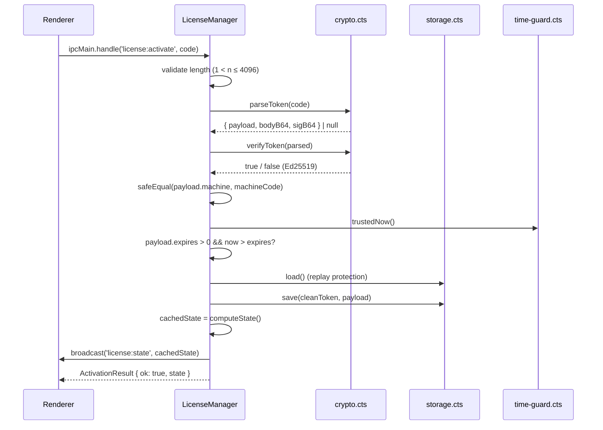
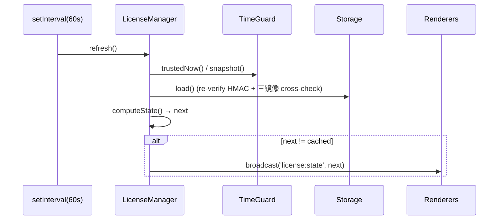

# `license/manager.cts` — 主进程许可证状态机

> 源码：`electron/license/manager.cts` · 327 行

## 用途

`LicenseManager` 是主进程的许可证 single source of truth。负责：

- **机器指纹**（委托给 `machine-id.cts`）
- **时间守卫**（委托给 `time-guard.cts`）—— 时钟回退 / 拖移 / mtime 检测
- **加密存储**（委托给 `storage.cts`）—— 三镜像 + HMAC
- **签名验证**（委托给 `crypto.cts`）—— Ed25519 detached signature
- **IPC 表面**：4 个 invoke handler + 1 个 push channel
- **定时刷新**：每 60 秒重算状态，变化时广播

渲染端 **永远** 不会看到 raw token 或私有 state——只能拿到 sanitise 后的 `LicenseState`，并被告知 `canEdit` 是否为 true。

## 公共 API

| 符号                       | 类型  | 摘要                                                |
| -------------------------- | ----- | --------------------------------------------------- |
| `LicenseManager`           | class | 类                                                  |
| `LICENSE_IPC`              | const | 4 个 IPC 通道字符串                                 |
| `STATUS_BROADCAST_CHANNEL` | const | `'license:state'` push 通道                         |
| 类型 re-export             | type  | `LicenseState`, `ActivationResult`, `LicenseStatus` |

### `LICENSE_IPC` 常量

```ts
export const LICENSE_IPC = {
  GET_STATE: 'license:get-state',
  GET_MACHINE_CODE: 'license:get-machine-code',
  ACTIVATE: 'license:activate',
  DEACTIVATE: 'license:deactivate',
} as const;
```

与 `electron/preload.cts` 的同名常量必须保持一致。

### 类成员

| 成员               | 签名               | 摘要                                               |
| ------------------ | ------------------ | -------------------------------------------------- |
| `constructor()`    | `()`               | 计算 machine code，初始化 storage / time guard     |
| `start()`          | `(): void`         | 启动 time guard、注册 IPC handler、开启 60s 定时器 |
| `stop()`           | `(): void`         | 关闭定时器，停止 time guard（持久化 state）        |
| `getState()`       | `(): LicenseState` | 返回缓存的 state（无 IO）                          |
| `getMachineCode()` | `(): string`       | 返回机器码                                         |

私有方法：`activate` / `deactivate` / `refresh` / `computeState` / `broadcast` / `failedActivation`。

## 详细行为

### Constructor

```ts
constructor() {
  this.userDataDir = app.getPath('userData');
  this.machine = computeMachineCode(this.userDataDir);

  const anchorPaths = [
    app.getAppPath(),
    path.join(app.getAppPath(), 'package.json'),
    process.execPath,
  ].filter((p) => existsSync(p));

  this.timeGuard = new TimeGuard(this.userDataDir, this.machine.code, anchorPaths);
  this.storage = new LicenseStorage(this.userDataDir, this.machine.code);
  this.cachedState = this.computeState();
}
```

要点：

- `userData` 是 Electron app 推荐的持久化目录（`%APPDATA%`/`~/Library/Application Support`/`~/.config`）
- `anchorPaths` 喂给 `TimeGuard` —— Electron 二进制 / `package.json` 的 mtime 是单调时间锚（系统时钟回退到这之前 = 篡改）
- 构造时立即 `computeState`——Renderer 启动后第一次 `getState` 直接返回缓存

### `start()`

```ts
start(): void {
  this.timeGuard.start();
  this.cachedState = this.computeState();

  // 60s 自刷新：让 banner 倒计时不需要 renderer 高频拉取
  this.rebroadcastTimer = setInterval(() => this.refresh(), 60 * 1000);
  if (typeof this.rebroadcastTimer.unref === 'function') this.rebroadcastTimer.unref();

  ipcMain.handle(LICENSE_IPC.GET_STATE, () => this.refresh());
  ipcMain.handle(LICENSE_IPC.GET_MACHINE_CODE, () => this.machine.code);
  ipcMain.handle(LICENSE_IPC.ACTIVATE, (_e, code: unknown) => this.activate(code));
  ipcMain.handle(LICENSE_IPC.DEACTIVATE, () => this.deactivate());
}
```

`unref()` 让定时器不阻止进程退出；如果运行环境不支持（Bun / 早期 Node）则跳过。

### `activate(code)` —— 激活流程

主流程（11 步）：

1. **格式校验** —— `code` 是 string 且 1 < length ≤ 4096
2. **解码** —— `parseToken(code)` 返回 `{ payload, bodyB64, sigB64 }` 或 null
3. **签名校验** —— `verifyToken(parsed)` Ed25519 公钥
4. **机器码校验** —— `safeEqual(payload.machine, this.machine.code)`（常时间）
5. **过期校验** —— `payload.expires > 0 && trustedNow() > payload.expires`
6. **重放保护** —— 同 `lic` id 已存在 + 新 token expires 更早 → 拒绝
7. **持久化** —— `storage.save(cleanToken, payload)`，IO 失败返回 `storage_error`
8. **重算 state** —— `cachedState = computeState()`
9. **广播** —— `broadcast()` 通知所有 BrowserWindow
10. **返回** `{ ok: true, state }`

任何步骤失败：

```ts
return this.failedActivation('invalid_signature', 'Signature does not match.');
```

返回 `ActivationResult` 包含 `errorCode` + 当前（未变更的）state。

### `deactivate()`

```ts
private deactivate(): LicenseState {
  this.storage.clear();
  this.cachedState = this.computeState();
  this.broadcast();
  return this.cachedState;
}
```

清除三镜像文件 → 状态退回到 `trial` 或 `expired_trial`（取决于试用是否还在）。

### `computeState()` —— 状态机心脏

按优先级判断（先匹配先返回）：

1. **`tampered`** —— time guard 报警（`tg.tampered`）或机器码漂移（`persistedHint !== current`）
2. 已存许可证（`storage.load()` 命中）：
   - `tampered` ← storage 自身 cross-check 失败
   - 重新 `parseToken + verifyToken` —— 防止攻击者塞入伪造但格式正确的文件 → `invalid`
   - `safeEqual(payload.machine, current)` ← 不匹配 → `machine_mismatch`
   - `expires > 0 && now > expires` → `expired_license` (`canEdit=false`)
   - 否则 → `activated` (`canEdit=true`)
3. 试用路径：
   - `now < trialStart` → `not_started`（系统时钟超前）
   - `now >= trialEnd` → `expired_trial`
   - 否则 → `trial` (`canEdit=true`, `daysRemaining` 倒计时)

trustedNow 来自 TimeGuard：`max(Date.now(), lastSeen)`。

### `refresh()`

```ts
private refresh(): LicenseState {
  const next = this.computeState();
  const changed = JSON.stringify(next) !== JSON.stringify(this.cachedState);
  this.cachedState = next;
  if (changed) this.broadcast();
  return this.cachedState;
}
```

JSON 序列化做 deep equality —— 不深、不昂贵，state 体量 < 1KB。

### `broadcast()`

```ts
private broadcast(): void {
  for (const win of BrowserWindow.getAllWindows()) {
    if (!win.isDestroyed()) {
      win.webContents.send(STATUS_BROADCAST_CHANNEL, this.cachedState);
    }
  }
}
```

向所有活动 BrowserWindow 推送（多窗口场景 / about 窗口 / 等）。

### `summariseLicense(p)` —— payload 脱敏

```ts
function summariseLicense(p: LicensePayload): NonNullable<LicenseState['license']> {
  return {
    id: p.lic,
    name: p.name ?? '',
    issued: p.issued,
    expires: p.expires,
  };
}
```

只暴露 4 字段——`machine`、`features`、`nonce`、`v` 不进入渲染端。

## 时序图

### 激活



### 60s 心跳



## 安全模型

| 威胁                        | 防御                                                                                              |
| --------------------------- | ------------------------------------------------------------------------------------------------- |
| 伪造激活码                  | Ed25519 公钥（`public-key.cts` 内嵌 PEM）签名校验                                                 |
| 把激活码发给别的机器        | `payload.machine === computeMachineCode()`（HKDF + APP_PEPPER）                                   |
| 复制 license 文件到别的机器 | `storage` 用 per-machine HKDF key 加密 + HMAC（机器码作 KDF input）                               |
| 时钟回退绕过过期            | `TimeGuard` 持久化 lastSeen + mtime anchor                                                        |
| 替换 license.dat 为旧的版本 | 三镜像 cross-check + HMAC sealed state file                                                       |
| 向后回滚到更短的 expires    | replay protection：同 `lic` id 拒绝降级                                                           |
| 渲染端绕过 `canEdit`        | mutator 调用 `editable-guard.assertEditable()`（zustand getState）；攻击者改 React state 也无意义 |

## 副作用

- 写 `app.getPath('userData')` 下：`license.dat`、`.lic-state.json`、`.lic-shadow.dat`、`.lic-clock.dat`、`.lic-machine.dat`
- 注册 4 个 `ipcMain.handle`
- 启动 60s `setInterval`
- 推送到所有 BrowserWindow

## 测试覆盖

无 repo 内单测（如有则在 `electron/license/__tests__/`）。生成激活码的 CLI 在 `tools/license-gen/`，用同一个 Ed25519 私钥（不进 git）签 token，可用于本地测试。

## 调用方

- `electron/main.cts` —— `whenReady` 时 new + start，`before-quit` 时 stop
- `electron/preload.cts` —— `LICENSE_IPC` 常量必须同步

## 源码索引

| 行      | 内容                                                   |
| ------- | ------------------------------------------------------ |
| 11–17   | imports                                                |
| 20–22   | `TRIAL_DAYS` / `TRIAL_MS` / `STATUS_BROADCAST_CHANNEL` |
| 24–29   | `LICENSE_IPC` 常量                                     |
| 31–58   | constructor                                            |
| 60–74   | `start()`                                              |
| 76–82   | `stop()`                                               |
| 84–86   | `getState()`                                           |
| 88–90   | `getMachineCode()`                                     |
| 94–137  | `activate(code)`                                       |
| 139–144 | `deactivate()`                                         |
| 146–154 | `refresh()`                                            |
| 156–292 | `computeState()`                                       |
| 294–300 | `broadcast()`                                          |
| 302–312 | `failedActivation`                                     |
| 315–322 | `summariseLicense`                                     |

## 参见

- [`crypto`](./license-crypto.md) —— Ed25519 / AES-GCM / HMAC / HKDF
- [`storage`](./license-storage.md) —— 三镜像存储
- [`machine-id`](./license-machine-id.md) —— 机器码生成
- [`time-guard`](./license-time-guard.md) —— 时间守卫
- [`preload`](./preload.md) —— IPC bridge
- [`licenseStore`](../store/license-store.md) —— renderer 镜像
- `tools/license-gen/` —— 私钥 + activation code 生成 CLI
