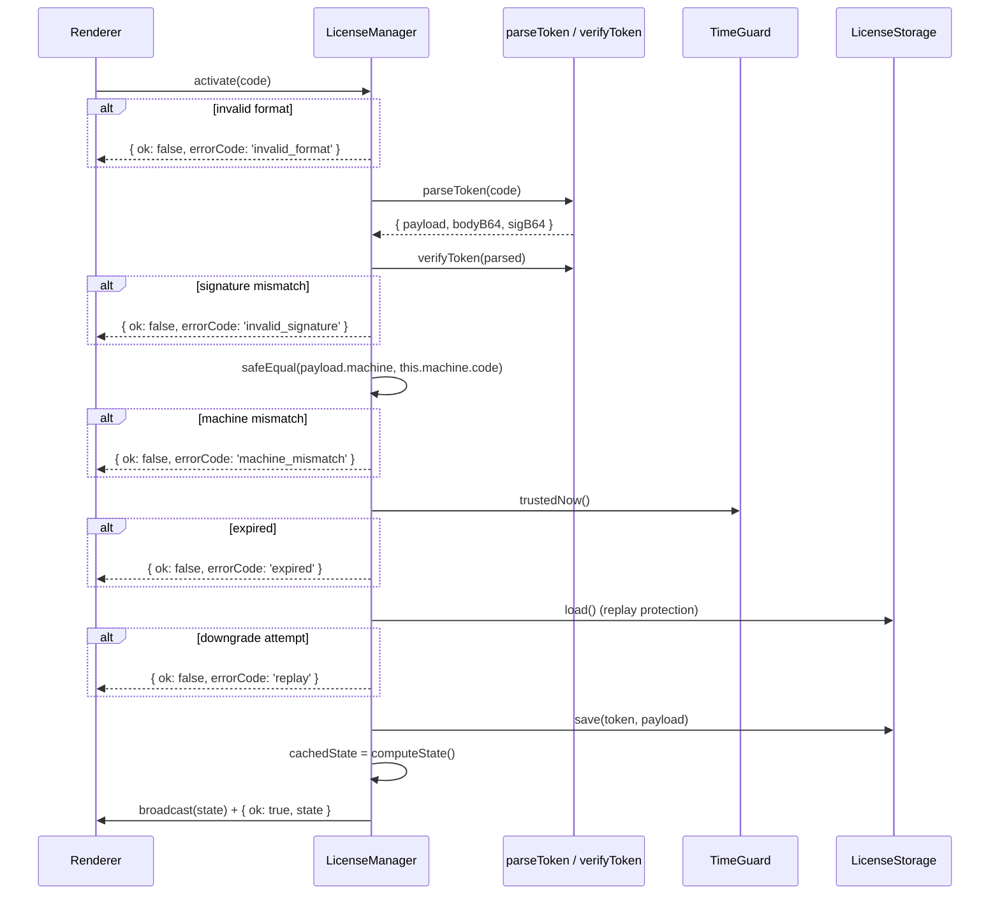

# LicenseManager

> Source: `electron/license/manager.cts`

## Overview

`LicenseManager` is the single source of truth for license state in
the main process. It coordinates:

- **machine-id** — fingerprint derived from stable hardware signals.
- **time-guard** — monotonic clock-rollback detection.
- **storage** — encrypted-at-rest license blob with three-way mirror.
- **crypto** — Ed25519 signature verification, constant-time compare.

Renderers never see private state — they get a sanitised `LicenseState`
object describing status, time remaining, and whether the app is
currently editable.

## Top-level surface

```ts
export class LicenseManager {
  constructor();
  start(): void; // wire IPC + start time guard
  stop(): void; // flush + tear down
  getState(): LicenseState;
  getMachineCode(): string;
}

export const LICENSE_IPC = {
  GET_STATE: 'license:get-state',
  GET_MACHINE_CODE: 'license:get-machine-code',
  ACTIVATE: 'license:activate',
  DEACTIVATE: 'license:deactivate',
} as const;

export const STATUS_BROADCAST_CHANNEL = 'license:state';
```

## Behavior

### Construction

```ts
constructor() {
  this.userDataDir = app.getPath('userData');
  this.machine = computeMachineCode(this.userDataDir);

  const anchorPaths = [
    app.getAppPath(),
    path.join(app.getAppPath(), 'package.json'),
    process.execPath,
  ].filter((p) => existsSync(p));

  this.timeGuard = new TimeGuard(this.userDataDir, this.machine.code, anchorPaths);
  this.storage = new LicenseStorage(this.userDataDir, this.machine.code);
  this.cachedState = this.computeState();
}
```

The anchor paths are install-time mtimes used by the time guard for a
"now must be ≥ install time" sanity check. `process.execPath` is the
Electron binary itself.

### Start / stop

```ts
start(): void {
  this.timeGuard.start();
  this.cachedState = this.computeState();
  this.rebroadcastTimer = setInterval(() => this.refresh(), 60 * 1000);
  if (this.rebroadcastTimer.unref) this.rebroadcastTimer.unref();

  ipcMain.handle(LICENSE_IPC.GET_STATE,        () => this.refresh());
  ipcMain.handle(LICENSE_IPC.GET_MACHINE_CODE, () => this.machine.code);
  ipcMain.handle(LICENSE_IPC.ACTIVATE,         (_e, code) => this.activate(code));
  ipcMain.handle(LICENSE_IPC.DEACTIVATE,       () => this.deactivate());
}

stop(): void {
  if (this.rebroadcastTimer) clearInterval(this.rebroadcastTimer);
  this.timeGuard.stop();
}
```

The 60-second tick recomputes state and broadcasts on change — that's
how the trial countdown ticks down without the renderer hammering
`getState`.

### Activation flow



### Activation guards (in order)

| Check                                                 | Failure errorCode   |
| ----------------------------------------------------- | ------------------- |
| `typeof code !== 'string'` or empty / >4096           | `invalid_format`    |
| `parseToken(code)` returns null                       | `invalid_format`    |
| `verifyToken(parsed)` returns false                   | `invalid_signature` |
| `safeEqual(payload.machine, this.machine.code)` false | `machine_mismatch`  |
| `payload.expires > 0 && now > payload.expires`        | `expired`           |
| stored license with same `lic` has longer expiry      | `replay`            |
| storage write throws                                  | `storage_error`     |

### State computation

`computeState()` is the master state machine. It computes a
`LicenseState` from:

- `timeGuard.snapshot()` — `{ now, lastSeen, firstSeen, sessions, tampered, tamperedReason }`.
- `storage.load()` — `StoredLicense | null`.
- `readPersistedHint(userDataDir)` — first-seen machine code, used for
  drift detection.

Resolution order:

```
if (timeGuard.tampered || machineDrift) → status: 'tampered'

stored = storage.load()
if (stored):
  if (stored.tampered)                              → status: 'tampered'
  parsed = parseToken(stored.token)
  if (!parsed || !verifyToken(parsed))              → status: 'invalid'
  if (payload.machine !== this.machine.code)        → status: 'machine_mismatch'
  expired = payload.expires > 0 && now > payload.expires
                                                    → 'expired_license' or 'activated'

else (no stored license — trial path):
  if (now < firstSeen)        → 'not_started'
  if (now >= firstSeen + 7d)  → 'expired_trial'
  else                        → 'trial'
```

::: warning Defense in depth: re-verify on every load
The signature is verified during storage **load** every time, not
just at activation. An attacker swapping in a forged-but-correctly-
formatted license file is caught here, so `tampered` / `invalid`
state activates immediately.
:::

### Trial constants

```ts
const TRIAL_DAYS = 7;
const TRIAL_MS = TRIAL_DAYS * 24 * 60 * 60 * 1000;
```

### Refresh + broadcast

```ts
private refresh(): LicenseState {
  const next = this.computeState();
  const changed = JSON.stringify(next) !== JSON.stringify(this.cachedState);
  this.cachedState = next;
  if (changed) this.broadcast();
  return this.cachedState;
}

private broadcast(): void {
  for (const win of BrowserWindow.getAllWindows()) {
    if (!win.isDestroyed()) {
      win.webContents.send(STATUS_BROADCAST_CHANNEL, this.cachedState);
    }
  }
}
```

JSON-stringify equality keeps broadcasts down to actual state changes
even though `computeState()` returns a fresh object every time.

### summariseLicense

Strips the renderer-visible license payload to four fields:

```ts
function summariseLicense(p: LicensePayload): NonNullable<LicenseState['license']> {
  return { id: p.lic, name: p.name ?? '', issued: p.issued, expires: p.expires };
}
```

The `nonce`, `machine`, and `features` fields stay private to main.

## Examples

### Wiring at app boot

```ts
// In main.cts
licenseManager = new LicenseManager();
licenseManager.start();
```

`start()` is required — without it the IPC handlers aren't registered
and the renderer's `getState()` rejects.

### Reading state in main code

```ts
const state = licenseManager.getState();
if (!state.canEdit) {
  console.log('blocked:', state.reason);
}
```

### Force a recompute (e.g. after manual tampering reset)

```ts
licenseManager.start(); // re-runs computeState() and broadcasts
```

## Related

- [License crypto](/api/electron/license-crypto)
- [License machine-id](/api/electron/license-machine-id)
- [License time-guard](/api/electron/license-time-guard)
- [License storage](/api/electron/license-storage)
- [Main process](/api/electron/main-process)
- [Preload](/api/electron/preload)
- [Architecture: license system](/architecture/license-system)
