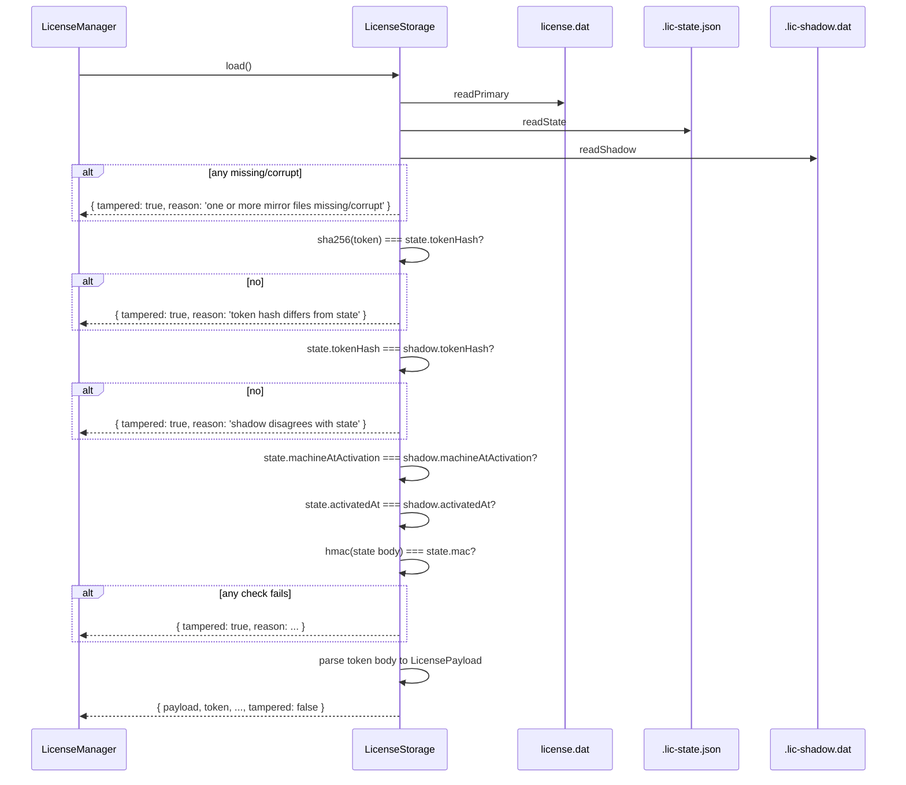

# License storage

> Source: `electron/license/storage.cts`

## Overview

`LicenseStorage` is the encrypted-at-rest persistence layer for an
activated license. It uses a **three-way mirror** with cross-checks:

```
userData/license.dat      — primary, AES-GCM encrypted token + meta
userData/.lic-state.json  — JSON envelope (token hash + nonce + HMAC)
userData/.lic-shadow.dat  — encrypted shadow copy of the JSON state
```

On read, all three are decoded and cross-validated. Disagreement
flags the install as tampered. On write, all three are written with
atomic rename.

## Exports

```ts
export interface StoredLicense {
  payload: LicensePayload;
  token: string;
  storedAt: number;
  machineAtActivation: string;
  /** True if any cross-check disagreed — caller should treat as tampered. */
  tampered: boolean;
  tamperedReason?: string;
}

export class LicenseStorage {
  constructor(userDataDir: string, machineCode: string);
  hasAnything(): boolean;
  save(token: string, payload: LicensePayload): void;
  load(): StoredLicense | null;
  clear(): void;
}
```

## Behavior

### File layouts

#### Primary (`license.dat`)

```ts
interface PrimaryV1 {
  v: 1;
  token: string; // raw activation token (APMS1.…)
  storedAt: number;
  machineAtActivation: string;
}
```

Serialized as `<hmac-hex>\n<aes-gcm-blob>`. The blob carries
`apms.primary.v1` AAD.

#### State (`.lic-state.json`) — plaintext

```ts
interface StateV1 {
  v: 1;
  tokenHash: string; // SHA-256 of the token
  machineAtActivation: string;
  activatedAt: number;
  nonce: string;
  mac: string; // HMAC-SHA256 over above fields
}
```

::: tip Why plaintext?
The state file is plaintext on purpose — easy to inspect for
support, integrity is HMAC-protected. The token **hash** is stored
(not the token itself), so reading this file does not leak
credentials.
:::

#### Shadow (`.lic-shadow.dat`)

Same shape as state but AES-GCM encrypted with `getFileKey(code, 'shadow')`
and AAD `apms.shadow.v1`. Mirrors the state for cross-checking; a
tampering attempt that edits `.lic-state.json` to change the
`tokenHash` won't match the shadow.

### Save flow

```ts
save(token: string, payload: LicensePayload): void {
  const now = Date.now();
  const primary: PrimaryV1 = { v: 1, token, storedAt: now, machineAtActivation: this.machineCode };
  const tokenHash = sha256Hex(token);
  const nonce = sha256Hex(`${now}|${tokenHash}|${this.machineCode}`);
  const mac = hmacHex(getMacKey(this.machineCode),
    tokenHash, this.machineCode, String(now), nonce);
  const state: StateV1 = { v: 1, tokenHash, machineAtActivation: this.machineCode,
    activatedAt: now, nonce, mac };

  this.writePrimary(primary);
  this.writeState(state);
  this.writeShadow(state);
}
```

Each write uses atomic rename:

```ts
private atomicWrite(name: string, data: Buffer): void {
  const final = path.join(this.userDataDir, name);
  const tmp = `${final}.tmp-${process.pid}`;
  writeFileSync(tmp, data, { mode: 0o600 });
  renameSync(tmp, final);
}
```

`mode: 0o600` ensures only the user account can read the files.

### Load flow with cross-checks



### Tampered fallback

```ts
private tampered(reason: string): StoredLicense {
  return {
    payload: { v: 1, lic: '', machine: '', issued: 0, expires: 0, nonce: '' },
    token: '',
    storedAt: 0,
    machineAtActivation: '',
    tampered: true,
    tamperedReason: reason,
  };
}
```

A tampered result still returns a valid object shape so the manager
doesn't have to handle null + tampered separately. The empty-payload
trick keeps downstream type narrowing clean.

### clear()

```ts
clear(): void {
  for (const f of [PRIMARY, STATE, SHADOW]) {
    try { unlinkSync(path.join(this.userDataDir, f)); } catch { /* ignore */ }
  }
}
```

Deactivation removes all three mirrors silently. Subsequent boots
fall back to the trial path.

### Why three mirrors

| Attack                                               | Detection                                   |
| ---------------------------------------------------- | ------------------------------------------- |
| Edit primary `license.dat` plaintext (won't decrypt) | aesDecrypt returns null → tampered          |
| Restore old `license.dat` from backup                | shadow / state.activatedAt mismatch         |
| Edit `.lic-state.json` to change tokenHash           | state HMAC fails OR shadow disagrees        |
| Edit shadow file in-place                            | shadow AEAD fails (different AAD/key)       |
| Replace shadow with old copy                         | shadow.tokenHash != current state.tokenHash |

The redundancy is deliberate — there's no single file an attacker
can swap to grant themselves a longer license without all three
agreeing, and only a valid signed token + matching machine code can
populate all three correctly via `save(...)`.

## Footguns

::: warning Don't move userData between machines
The encryption keys are derived from the machine code. Moving
`userData/` from machine A to machine B gives B a `tampered` state
on next boot — neither the AAD nor the AES key matches. This is the
correct behavior: an "I copied my license to a friend's PC" attack
fails at this layer.
:::

::: warning Concurrent writes from multiple instances
The single-instance lock in `main.cts` prevents two LicenseManagers
from coexisting. If you bypass that lock (e.g. for testing), the
atomic-rename writes can still race — use the locked-instance
contract.
:::

## Examples

### Save during activation

```ts
const storage = new LicenseStorage(userDataDir, machineCode);
storage.save(rawToken, parsedPayload);
```

### Load and inspect

```ts
const stored = storage.load();
if (!stored) console.log('trial mode');
else if (stored.tampered) console.warn('tampered:', stored.tamperedReason);
else console.log('activated until', new Date(stored.payload.expires));
```

### Manual recovery from corruption

```ts
storage.clear(); // wipe all three mirrors → next boot is fresh trial
```

The user must re-request activation from the vendor.

## Related

- [License crypto](/api/electron/license-crypto) — `aesEncrypt`, `hmacHex`, `getFileKey`, `getMacKey`, `sha256Hex`, `safeEqual`
- [License manager](/api/electron/license-manager) — primary consumer
- [License machine-id](/api/electron/license-machine-id)
- [Architecture: license system](/architecture/license-system)
