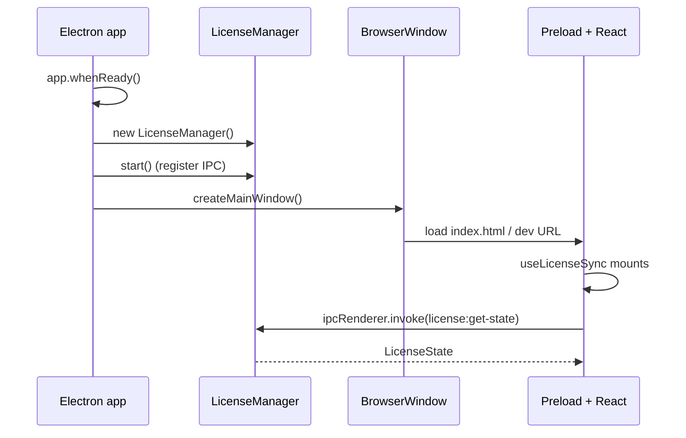

# Main process

> Source: `electron/main.cts`

## Overview

`main.cts` is the Electron main-process entrypoint. It handles app
lifecycle, BrowserWindow creation, the single-instance lock, and
wires up the `LicenseManager` before the first window opens. The
file is intentionally small — most logic lives in
`electron/license/*` and the renderer.

::: tip Why .cts (CommonJS)
The Electron main process runs in CommonJS. `*.cts` is the TypeScript
extension that emits CJS unconditionally, regardless of `package.json
"type": "module"`. The renderer can stay ESM; main + preload must be
CJS so `require('electron')` resolves at boot.
:::

## Exports

`main.cts` is an entrypoint; it doesn't export anything for downstream
consumption. Its public surface is the IPC channels registered by
`LicenseManager` and the `apolloMapStudio` /
`apolloMapStudioLicense` globals exposed by the preload.

## Behavior

### Module-level state

```ts
const rendererUrl = process.env.ELECTRON_RENDERER_URL;
let licenseManager: LicenseManager | null = null;
```

`ELECTRON_RENDERER_URL` is set by the dev script (Vite dev server).
Production reads from the bundled `dist/index.html`.

### App identity

```ts
app.setName('Apollo Map Studio');
if (process.platform === 'win32') {
  app.setAppUserModelId('com.apollo-map-studio.app');
}
```

The Windows app user model id is required for taskbar grouping and
notification identity — without it, multiple updates would show as
separate apps in the start menu.

### Single-instance lock

```ts
const gotSingleInstanceLock = app.requestSingleInstanceLock();

if (!gotSingleInstanceLock) {
  app.quit();
} else {
  app.on('second-instance', () => {
    const [mainWindow] = BrowserWindow.getAllWindows();
    if (!mainWindow) return;
    if (mainWindow.isMinimized()) mainWindow.restore();
    mainWindow.focus();
  });
  // ... whenReady ...
}
```

If the user double-clicks the app icon while it's already running, the
second instance dies and the existing window comes to the foreground.

### Boot order

```ts
app.whenReady().then(() => {
  // Wire the license manager *before* creating any window so the renderer
  // can request state from a fully-initialised IPC surface.
  licenseManager = new LicenseManager();
  licenseManager.start();

  void createMainWindow();

  app.on('activate', () => {
    if (BrowserWindow.getAllWindows().length === 0) {
      void createMainWindow();
    }
  });
});
```

The order matters: `LicenseManager` registers its IPC handlers in
`start()`. Creating the window first would race the renderer's
opening `getState()` call.



### Window options

```ts
new BrowserWindow({
  width: 1440,
  height: 960,
  minWidth: 1024,
  minHeight: 700,
  title: 'Apollo Map Studio',
  backgroundColor: '#101318',
  show: false,
  webPreferences: {
    preload: getPreloadPath(),
    contextIsolation: true,
    nodeIntegration: false,
    sandbox: true,
  },
});
```

Security baseline:

| Flag               | Value                                                 |
| ------------------ | ----------------------------------------------------- |
| `contextIsolation` | `true` — renderer can't reach Node globals            |
| `nodeIntegration`  | `false` — `require()` not exposed in DOM              |
| `sandbox`          | `true` — preload runs in a sandboxed renderer process |

`backgroundColor: '#101318'` paints the window dark immediately so
there's no white flash before the renderer mounts. `show: false` +
`once('ready-to-show')` defers showing the window until the renderer
has painted at least one frame.

### External link handling

```ts
mainWindow.webContents.setWindowOpenHandler(({ url }) => {
  if (url.startsWith('http://') || url.startsWith('https://')) {
    void shell.openExternal(url);
  }
  return { action: 'deny' };
});
```

Any `target="_blank"` or `window.open(...)` from the renderer is
intercepted: HTTP(S) URLs open in the OS's default browser, anything
else is silently denied. This keeps the editor from spawning
unintended Electron sub-windows.

### Renderer URL resolution

```ts
if (rendererUrl) {
  await mainWindow.loadURL(rendererUrl);
  mainWindow.webContents.openDevTools({ mode: 'detach' });
  return;
}
await mainWindow.loadFile(getRendererIndexPath());
```

In dev (URL set), DevTools opens detached automatically. In production
the bundled HTML loads from `__dirname/../dist/index.html`.

### Quit lifecycle

```ts
app.on('before-quit', () => {
  licenseManager?.stop();
});

app.on('window-all-closed', () => {
  if (process.platform !== 'darwin') app.quit();
});
```

`LicenseManager.stop()` flushes the time guard's last-seen timestamp
to disk before exit (otherwise a swift quit could leave the timestamp
behind real time). On macOS, closing the last window keeps the app
alive (standard Cocoa convention).

## Examples

### Adding a new IPC handler

Register in main:

```ts
ipcMain.handle('my-feature:do-thing', async (_e, arg: string) => {
  return await doThingInMain(arg);
});
```

Expose in preload:

```ts
contextBridge.exposeInMainWorld('apolloMapStudioMyFeature', {
  doThing: (arg: string) => ipcRenderer.invoke('my-feature:do-thing', arg),
});
```

Consume in renderer:

```ts
declare const apolloMapStudioMyFeature: { doThing(arg: string): Promise<...> };
```

### Disabling sandbox for debugging

::: warning Don't ship without sandbox
Setting `sandbox: false` would let the preload `require()` Node
modules directly — useful for debugging IPC issues, but a security
regression. Re-enable before merging.
:::

## Related

- [Preload](/api/electron/preload)
- [License manager](/api/electron/license-manager)
- [License crypto](/api/electron/license-crypto)
- [Architecture: license system](/architecture/license-system)
