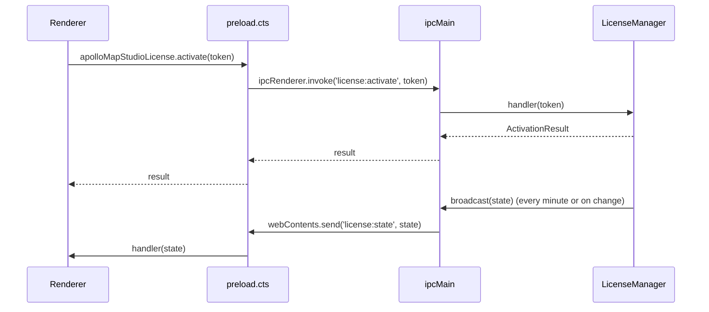

# Preload

> Source: `electron/preload.cts`

## Overview

`preload.cts` is the bridge between the Electron main process and the
renderer. It uses Node's `contextBridge` to expose two carefully-scoped
APIs on `window` — `apolloMapStudio` (platform / version metadata) and
`apolloMapStudioLicense` (IPC for license state). The renderer cannot
reach Node globals; this is the only sanctioned channel.

::: tip Why .cts (CommonJS)
Like `main.cts`, the preload runs in a CommonJS context. Electron
loads it via `require()` from main, regardless of the renderer's
module system.
:::

## Exports

The preload doesn't export to other JS modules — it exposes two
globals via `contextBridge.exposeInMainWorld`:

```ts
window.apolloMapStudio: {
  platform: NodeJS.Platform;
  versions: { chrome: string; electron: string; node: string };
};

window.apolloMapStudioLicense: {
  getState(): Promise<LicenseState>;
  getMachineCode(): Promise<string>;
  activate(code: string): Promise<ActivationResult>;
  deactivate(): Promise<LicenseState>;
  onChange(handler: (s: LicenseState) => void): () => void;
};
```

## Behavior

### Platform metadata

```ts
contextBridge.exposeInMainWorld('apolloMapStudio', {
  platform: process.platform,
  versions: {
    chrome: process.versions.chrome,
    electron: process.versions.electron,
    node: process.versions.node,
  },
});
```

Read from the renderer for diagnostic UI / "About" modal.

### License IPC channels

```ts
const STATUS_BROADCAST_CHANNEL = 'license:state';
const LICENSE_IPC = {
  GET_STATE: 'license:get-state',
  GET_MACHINE_CODE: 'license:get-machine-code',
  ACTIVATE: 'license:activate',
  DEACTIVATE: 'license:deactivate',
} as const;
```

These channel names are duplicated in `electron/license/manager.cts`
as the source of truth — the preload mirrors them. Drift would
silently break the bridge, so any change must update both files.

### License API

```ts
const licenseApi = {
  getState():       ipcRenderer.invoke(LICENSE_IPC.GET_STATE),
  getMachineCode(): ipcRenderer.invoke(LICENSE_IPC.GET_MACHINE_CODE),
  activate(code):   ipcRenderer.invoke(LICENSE_IPC.ACTIVATE, code),
  deactivate():     ipcRenderer.invoke(LICENSE_IPC.DEACTIVATE),
  onChange(handler) {
    const listener = (_evt, state) => handler(state);
    ipcRenderer.on(STATUS_BROADCAST_CHANNEL, listener);
    return () => ipcRenderer.off(STATUS_BROADCAST_CHANNEL, listener);
  },
};
contextBridge.exposeInMainWorld('apolloMapStudioLicense', licenseApi);
```

`onChange(handler)` returns an unsubscribe function — the standard
Node "EventEmitter once-off" idiom. The renderer uses this from
`useLicenseSync` to listen for push updates from `LicenseManager`'s
1-minute tick.



### Type safety

The preload imports types from `./license/types.cjs`:

```ts
import type { ActivationResult, LicenseState } from './license/types.cjs';
```

The cast on `ipcRenderer.invoke(...)` returns are TypeScript-only —
the IPC channel is opaque at runtime. If the main and preload
disagree on the shape, the renderer sees an unexpected object.
Keeping `types.cts` as the single source of truth (re-imported by
both sides) is the contract.

## contextBridge isolation

::: warning Footgun: function references vs. values
`contextBridge.exposeInMainWorld` clones primitives but **proxies**
function references. Returning an object with methods (as we do for
`licenseApi`) works — each method call hops through the bridge.
Returning an object with a `Date` would clone fine, but a `Map` would
not. Stick to JSON-compatible shapes for round-tripped state.
:::

::: warning Footgun: don't expose ipcRenderer directly
A naive bridge might do `exposeInMainWorld('ipc', ipcRenderer)` —
that would hand the renderer a wide-open channel into main and
defeat the entire `contextIsolation` model. The preload's job is to
expose **only** the specific operations the renderer needs.
:::

### Browser fallback

There's no preload in the browser build (Vite serves the renderer
directly without Electron). `@/lib/license-bridge` checks for the
global and provides a permissive trial-state stub when absent:

```ts
const native = (window as { apolloMapStudioLicense?: ... }).apolloMapStudioLicense;
const bridge = native ?? createBrowserStub();
```

So the same React code works in both targets without conditional
imports.

## Examples

### Reading the bridge from React

```ts
import { licenseBridge } from '@/lib/license-bridge';

const state = await licenseBridge.getState();
const unsubscribe = licenseBridge.onChange((s) => {
  console.log('license changed:', s.status);
});
// later
unsubscribe();
```

### Diagnosing IPC issues

```ts
console.log(
  'preload globals:',
  Object.keys(window).filter((k) => k.startsWith('apolloMapStudio')),
);
```

If those globals are missing, the preload didn't load — check the
`webPreferences.preload` path in `main.cts` and the dev script's
`ELECTRON_RENDERER_URL`.

### Adding a new IPC method

1. Add the channel name to both `electron/license/manager.cts` and
   `electron/preload.cts` (or extract to a shared constant module).
2. Register `ipcMain.handle(channel, fn)` in main.
3. Add the call to `licenseApi` (or a sibling object) in preload.
4. Add a typed wrapper in `@/lib/license-bridge`.
5. Update `LicenseState` / `ActivationResult` if the shape needs new
   fields.

## Related

- [Main process](/api/electron/main-process)
- [License manager](/api/electron/license-manager)
- [license-bridge (renderer wrapper)](/api/lib/license-bridge)
- [useLicenseSync](/api/hooks/use-license)
