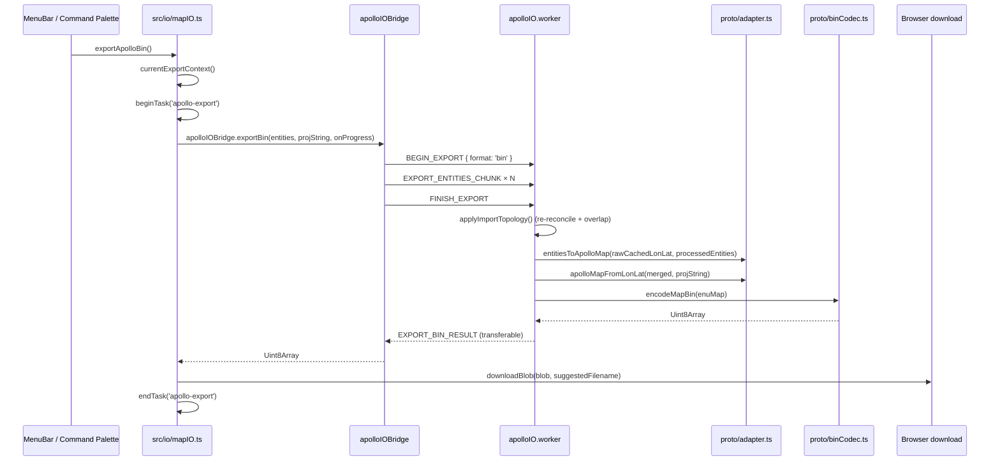

# Export / Base Map

> 本编辑器**没有**单独的 `buildBaseMap()` 函数。当前版本的 base_map
> 导出入口是 `src/io/mapIO.ts` 的 `exportApolloBin` /
> `exportApolloText`，通过 `apolloIOBridge` 把工作 fanout 到
> `apolloIO.worker.ts`。

## 公开符号

```ts
// src/io/mapIO.ts
export function exportApolloBin(): Promise<void>;
export function exportApolloText(): Promise<void>;
```

> Source: `src/io/mapIO.ts:91-141`

签名极简 —— 当前实体表与导入上下文都从 `useMapStore` /
`useApolloMapStore` 读取：

```ts
function currentExportContext(): { info: ApolloMapImportInfo; entities: MapEntity[] } | null;
```

如果 `apolloMapStore.info` 为空（用户尚未导入），会调
`setError('Nothing to export - import a map first.')` 并返回，
不弹文件保存对话框。

## 流程



## 返回的文件名

`suggestedFilename(originalName, ext)` 形如 `<base>-YYYYMMDDHHmmss.<ext>`，
保留原 base name（去掉 `.bin / .txt / .pb.txt`），便于导入再导出时
区分版本。

## 进度通知

`apolloIOBridge` 在分块发送实体时（每 2000 条一批）触发 `onProgress`：

```ts
{
  label: 'Exporting Apollo map',
  detail: 'Sending entities 4,000 / 12,345',
  progress: 0.05, // 0..1
}
```

`useTaskProgressStore` 在 1s 之后才显示 task badge，避免快速操作
弹一闪而过的 spinner。

## 异常路径

- 导出前 `applyImportTopology` 抛错 → worker `ERROR` 消息 → `mapIO`
  catch → `setError('Export failed: ${msg}')` + `console.error`；
- worker `cachedRawLonLatMap` 为空（未先导入即调用导出）→
  `'No imported Apollo map is cached in the IO worker.'`；
- `Map.verify` 抛错（实体形状非法） → 走 ERROR 通道；
- 浏览器拒绝下载 → 由 `downloadBlob` 内部的 `<a>` 触发，几乎不会失败，
  但 Chromium 多窗口同步下载策略可能延迟。

## 替代路径

`buildSimMap` / `buildRoutingMap` 当前不存在；如果未来需要派生
`sim_map.bin` / `routing_map.bin`，应在 worker 里加 `runDerive` 分支并
扩展 `apolloIOProtocol` 的 `BEGIN_EXPORT.format`。
