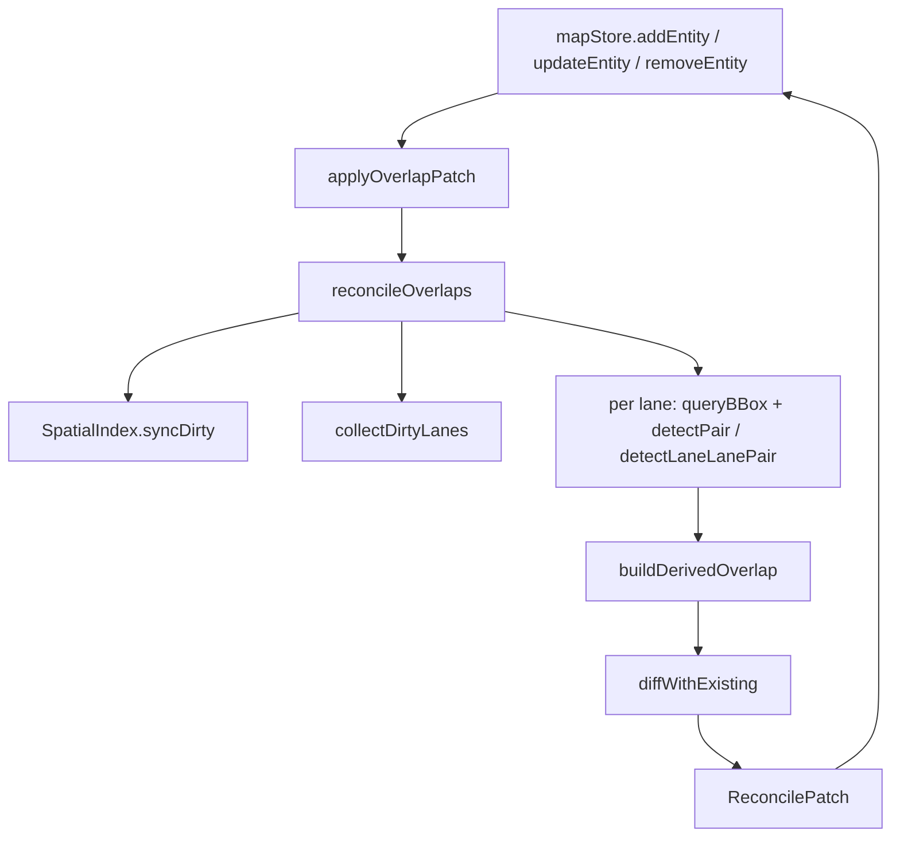

# Geo / Overlap Calculation

Overlap pipeline 位于 `src/core/elements/overlap/`，负责：

1. **reconcile**：从几何派生 `OverlapEntity[]` 集合，做 set-diff
   patch，由 store 一次性 apply；
2. **空间索引**：基于 RBush 的增量 R-tree，5 万实体下查询 < 0.5ms；
3. **配对规则**：`pairTable.ts` 集中收口 lane × secondary 的几何
   检测策略与 `ObjectOverlapInfo` 工厂；
4. **多边形布尔**：通过 `polygon-clipping`（Martinez）求 lane
   corridor × secondary polygon 的精确相交区域 → `RegionOverlapInfo`。

## 公共入口（`src/core/elements/overlap/index.ts`）

```ts
export { reconcileOverlaps, invalidateLaneCaches } from './reconcile';
export {
  SpatialIndex,
  bboxForEntity,
  getSharedSpatialIndex,
  resetSharedSpatialIndex,
} from './spatialIndex';
export { makeOverlapId, isDerivedOverlapId } from './overlapId';
export type { ReconcileMode, ReconcilePatch, BBox, IndexNode } from './types';
```

外部消费者（mapStore、apolloIO worker、`recomputeOverlapsAsync` 路径）
只看 `index.ts`。下面其它文件标记为 `@internal`，可能在补丁版本里挪位置。

## 类型（`types.ts`）

```ts
export interface BBox {
  minX: number;
  minY: number;
  maxX: number;
  maxY: number;
}

export interface IndexNode extends BBox {
  id: string;
  entityType: MapEntity['entityType'];
}

export type ReconcileMode =
  | { mode: 'incremental'; dirtyIds: ReadonlySet<string> }
  | { mode: 'full' };

export interface ReconcilePatch {
  changes: Map<string, MapEntity>;
  removedOverlapIds: Set<string>;
  stats: {
    pairsTested: number;
    pairsMatched: number;
    overlapsCreated: number;
    overlapsRemoved: number;
    durationMs: number;
  };
}
```

## reconcile.ts

```ts
export function reconcileOverlaps(
  entities: ReadonlyMap<string, MapEntity>,
  mode: ReconcileMode,
  index?: SpatialIndex,
): ReconcilePatch;

export function invalidateLaneCaches(removedLaneIds: Iterable<string>): void;
```

工作流程：

1. **R-tree 同步**：full 模式调 `idx.syncFromEntities`；incremental
   只 sync `dirtyIds`；caller 注入 `index` 时 reconcile 不再触碰索引；
2. **dirtyLanes 收集**：`collectDirtyLanes` 把 dirty 集映射到 lane
   集合（含 secondary 实体波及到的邻居 lane）；
3. **Pair 扫描**：每条 dirty lane 与 R-tree 邻居做 lane×lane / lane×other
   配对检测；用 sorted-participant id 去重；
4. **diffWithExisting**：与现有 OverlapEntity 做 set diff，merge user
   overrides（isMerge 钉位 + region polygon 钉位），同步回写每个
   参与实体的 `overlapIds`。

`invalidateLaneCaches` 在 lane 删除时调用，清掉 `computeLaneS` 内部的
prefix-length 缓存。

## spatialIndex.ts

```ts
export function bboxForEntity(entity: MapEntity): BBox | null;

export class SpatialIndex {
  build(entities: ReadonlyMap<string, MapEntity>): void;
  syncFromEntities(entities: ReadonlyMap<string, MapEntity>): void;
  syncDirty(entities: ReadonlyMap<string, MapEntity>, dirtyIds: ReadonlySet<string>): void;
  insert(entity: MapEntity): void;
  remove(id: string): void;
  queryBBox(bbox: BBox): IndexNode[];
  queryNeighbors(id: string): IndexNode[];
  size(): number;
  getBBox(id: string): BBox | null;
  clear(): void;
}

export function getSharedSpatialIndex(): SpatialIndex;
export function resetSharedSpatialIndex(): void;
```

要点：

- `bboxForEntity` 优先用 lane centerline，否则 polygon → stop_line →
  polylines。stop_line 用 `OVERLAP_STOPLINE_PROBE_DEG` 做 padding。
- 内部用 `bboxSig` (字符串签名) 而非 reference 做"未变跳过"判定。
  immer freeze 切换 ref 时签名不变，避免冷启重建。
- `getSharedSpatialIndex / resetSharedSpatialIndex` 是模块级 singleton，
  worker 终止 / undo / 大批 import 后用 `reset` 让下次 sync 走全量重建。

## pairTable.ts

```ts
export interface PairGeoHit {
  intersects: boolean;
  laneInterval?: { startS: number; endS: number };
  isMerge?: boolean;
  regionPolygon?: GeoPoint[];
}

export interface PairRule {
  secondaryType: MapEntity['entityType'];
  geometry: 'polygon' | 'stopLines' | 'polylines' | 'lane';
  computeRegion?: boolean;
  emitObjects(
    lane: LaneEntity,
    other: MapEntity,
    hit: PairGeoHit,
    opts?: { regionId?: string },
  ): ObjectOverlapInfo[];
}

export const PAIR_RULES: readonly PairRule[];
export function findPairRule(secondaryType: string): PairRule | null;
export function detectPair(lane, other, rule): PairGeoHit;
export function detectLaneLanePair(laneA, laneB): PairGeoHit;
export function emitLaneLaneObjects(laneA, laneB, hitForA, hitForB): ObjectOverlapInfo[];
```

`PAIR_RULES`（11 行）：lane × {junction, crosswalk, clearArea,
parkingSpace, pncJunction, area, signal, stopSign, yieldSign,
barrierGate, speedBump} 各一条。新加 Apollo 实体类型 = 加一行。

## intersect.ts

```ts
export function bboxOfPoints(points, pad?): BBox | null;
export function bboxUnion(boxes): BBox | null;
export function bboxOverlap(a, b): boolean;
export function segmentsIntersect(a1, a2, b1, b2): GeoPoint | null;
export function pointInPolygon(point, polygon): boolean;
export function polylinesIntersect(a, b): boolean;
export function polylineIntersectsPolygon(line, polygon): boolean;
export interface SegmentParam {
  segmentIndex: number;
  t: number;
}
export function polylinePolygonCrossings(line, polygon): SegmentParam[];
export function endpointsCoincide(a, b, cosLat, toleranceM): boolean;
export function polylinePolylineCrossings(a, b): SegmentParam[];
```

数学说明在源文件注释里：半开射线法（避免水平边 EPS bias）+ 米空间
端点重合判断。

## computeLaneS.ts

```ts
export function laneArcLength(lane: LaneEntity): number;
export function projectSegmentParam(lane: LaneEntity, segmentIndex: number, t: number): number;
export function invalidateLaneArcLength(laneId: string): void;
export function clearLaneArcLengthCache(): void;
```

prefix-length 缓存。`reference` 字段 = lane.centerline reference，
重新生成时自动失效。

## laneCorridor.ts

```ts
export function laneCorridorPolygon(lane: LaneEntity): GeoPoint[];
```

构造 lane 在地面投影的封闭走廊。优先使用 `leftBoundary / rightBoundary`
原始 curve；编辑器新建 lane 没有 boundary 时 fallback 到 centerline
offset（`offsetPolylineDeg`）。

## polyClip.ts

```ts
export function intersectPolygons(a: readonly GeoPoint[], b: readonly GeoPoint[]): GeoPoint[][];
export function largestRing(rings: readonly GeoPoint[][]): GeoPoint[] | null;
```

Martinez 多边形交集。返回 0..n 块；`largestRing` 取面积最大的那一块
（米空间近似面积）。

## overlapId.ts / regionId.ts

```ts
export function makeOverlapId(participantIds: readonly string[]): string;
export function isDerivedOverlapId(id: string): boolean;
export function makeRegionId(participantIds: readonly string[], slot?: number): string;
export function isDerivedRegionId(id: string): boolean;
```

格式：`overlap_<sortedIds.join('_')>`、`region_<sortedIds.join('_')>__<slot>`。
slot=0 时不带后缀。

## geometryAdapters.ts

```ts
export function curveToPolyline(curve: Curve): GeoPoint[];
export function getCenterline(lane: LaneEntity): GeoPoint[];
export function getPolygon(entity: MapEntity): GeoPoint[] | null;
export function getStopLines(entity: MapEntity): GeoPoint[][];
export function getPolylines(entity: MapEntity): GeoPoint[][];
export function isOverlapParticipant(entity: MapEntity): boolean;
```

把不同实体类型的"几何"统一成 GeoPoint 折线/多边形给配对检测用。

## overridePaths.ts

```ts
export function laneIsMergeOverridePath(objectIndex: number): string;
export const REGION_OVERLAPS_OVERRIDE_PATH: 'regionOverlaps';
export function parseLaneIsMergeOverride(path: string): number | null;
```

`OverlapEntity._userOverrides` 钉位路径解析。

## 调用图（mermaid）


