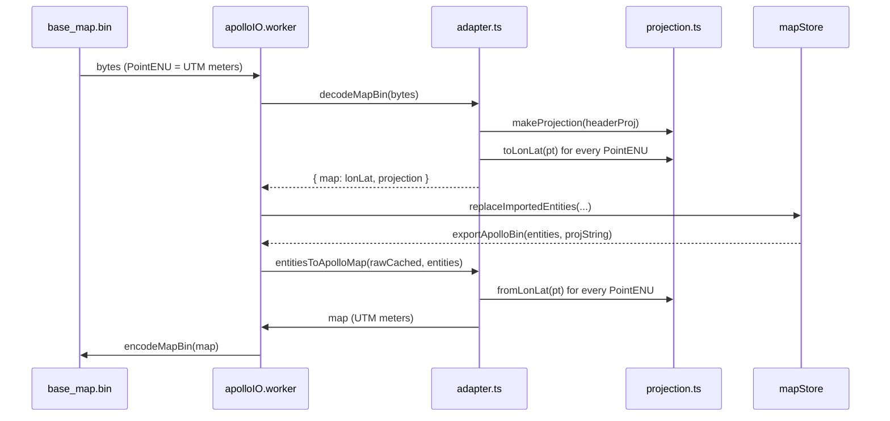

# Geo / Projection

Apollo Map Studio 的投影栈分两层：

- **`src/lib/geo.ts`** — 零依赖的球面测量（haversine + 米↔度换算），
  车道尺度误差 < 0.5%，给 `lane.length` / `signalTemplate` 这类小尺度
  几何用，不引 proj4。
- **`src/io/proto/projection.ts`** — proj4 包装，处理 Apollo
  `header.projection.proj` 字符串和 UTM ENU↔WGS84 的双向投影，给
  导入/导出路径用。

## src/lib/geo.ts

### `haversineMeters(a: GeoPoint, b: GeoPoint): number`

球面大圆距离（米）。`GeoPoint = { x: lng, y: lat, z?: number }`，单位
度。地球半径取 WGS84 平均 `6,371,008.8 m`。

```ts
import { haversineMeters } from '@/lib/geo';

const meters = haversineMeters({ x: 116.404, y: 39.915 }, { x: 116.405, y: 39.915 }); // ~85.4
```

数学：

```
h = sin²(Δlat/2) + cos(lat1) cos(lat2) sin²(Δlng/2)
d = 2 R · asin(min(1, √h))
```

### `polylineLengthMeters(points: readonly GeoPoint[]): number`

折线累计长度（米），少于两点返回 0。`lane.length` 派生用。

### `metersToDegLat(): number`

1 米对应的纬度差（度）— 与纬度无关。约 `8.99e-6 deg/m`。

### `metersToDegLng(latDeg: number): number`

在指定纬度上 1 米对应的经度差（度）。`cosLat < 1e-9` 时退化为
`metersToDegLat()` 避免除零。

> Source: `src/lib/geo.ts:1-57`

## src/io/proto/projection.ts

### `sanitizeProjString(s: string): string`

去掉 Apollo 模板占位符里的 `{}`：例如
`+lat_0={37.413082}` → `+lat_0=37.413082`。Apollo 参考地图（sunnyvale /
garage）会把数字外面包一层 `{}`，proj4 不识别。

### `interface PointXY { x: number; y: number; z?: number; }`

二维或三维点；与 `GeoPoint` 同形（用于 PROJ 路径不引 `@/types`）。

### `interface Projection`

```ts
interface Projection {
  readonly projString: string;
  toLonLat(p: PointXY): PointXY;
  fromLonLat(p: PointXY): PointXY;
}
```

`toLonLat` / `fromLonLat` 在 `z` 缺省时不会写入 `z=0`（proto2 round-trip
fidelity）。

### `makeProjection(projString: string): Projection`

从 PROJ.4 字符串构造一个双向投影器。typically traffic 来自
`Header.projection.proj`，sanitize 之后存入 `Projection.projString`。

```ts
import { makeProjection } from '@/io/proto/projection';

const proj = makeProjection('+proj=utm +zone=10 +ellps=WGS84 +datum=WGS84 +units=m +no_defs');
const ll = proj.toLonLat({ x: 587123, y: 4138000 });
const enu = proj.fromLonLat({ x: -122.13, y: 37.41 });
```

### `utmProjString(zone: number, hemisphere?: 'N' | 'S'): string`

构造 UTM 投影字符串。`zone` 范围 1..60，越界抛 Error。`hemisphere` 默认
`'N'`，`'S'` 时附 `+south`。Apollo header 缺失时作为 fallback。

### `utmZoneFromLon(lonDeg: number): number`

由经度反推 UTM 区号。每区 6° 经度，从 -180° 起。

```ts
utmZoneFromLon(116); // 50（北京）
utmZoneFromLon(-122); // 10（Sunnyvale）
```

### `UTM_PRESETS`

常见 Apollo 地图预设：

```ts
export const UTM_PRESETS = {
  sunnyvale: utmProjString(10, 'N'),
  beijing: utmProjString(50, 'N'),
  shanghai: utmProjString(51, 'N'),
  shenzhen: utmProjString(50, 'N'),
} as const;
```

`apolloIOBridge.FALLBACK_PROJ` 默认 = `UTM_PRESETS.beijing`，用户在
`projDialogStore` 取消时兜底。

> Source: `src/io/proto/projection.ts:1-81`

## 投影流向



## 注意事项

- **量纲**：编辑器内部一律 lng/lat 度数。`overlap` / `topology` /
  `snap` 模块再各自经 cosLat 修正到米空间，不要让度数从 worker 边界
  外溢回 ENU 空间。
- **没有全局投影 singleton**：每次导入都重新 `makeProjection`，避免
  跨 map 串扰。worker 内部短时间会持有最近一次的 projection，但
  `CLEAR` 消息会归零。
- **proj4 实例 caching**：`makeProjection` 内部对同一对 PROJ string
  会缓存；高频调用（如 PolyClip 内部）已是现成。
