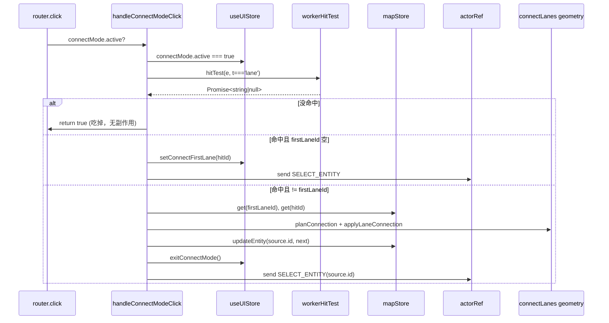

# Map Event Router 内部模块

> 源码：`src/hooks/mapEventRouter/{connectMode,cursorScheduler,hitTest,inputDedup,keyboard,selectionDrag,snap}.ts`

[`useMapEventRouter`](./use-map-event-router.md) 把跨 FSM 状态的事件分流
到 7 个原子模块。每个模块只暴露纯函数 / 工厂函数，不持有 React 生命周期。
本页给出每个模块的 API 表面、副作用与不变量。

## 模块速查

| 模块                 | 出口                                                       | 关注点                                                     |
| -------------------- | ---------------------------------------------------------- | ---------------------------------------------------------- |
| `hitTest.ts`         | `toLngLat` / `hitBbox` / `pixelToRadius` / `workerHitTest` | maplibre 像素 → worker HIT_TEST 的统一桥                   |
| `inputDedup.ts`      | `sampleInput` / `isDuplicateInput`                         | 抗 dblclick 伪 click                                       |
| `cursorScheduler.ts` | `createCursorScheduler`                                    | 60fps RAF 合并的 cursorLngLat 写入                         |
| `connectMode.ts`     | `handleConnectModeClick`                                   | connect-lanes 模式 click 分支                              |
| `selectionDrag.ts`   | `handleSelectedMouseDown`                                  | `selected` 状态下 vertex / handle / center / smooth-toggle |
| `keyboard.ts`        | `handleMapKeyDown`                                         | Esc / Enter / Del / Backspace 处理                         |
| `snap.ts`            | `applySnap`                                                | 包装 `findSnapTarget`，写回 `currentSnapTarget`            |

---

## `hitTest.ts`

```ts
export type HitFilter = (entityType: string) => boolean;

export function toLngLat(e: maplibregl.MapMouseEvent): LngLat;
export function hitBbox(point: maplibregl.PointLike): [PointLike, PointLike];
export function pixelToRadius(map: maplibregl.Map, px: number): number;
export function workerHitTest(
  map: maplibregl.Map,
  bridge: SpatialWorkerBridge | null,
  e: maplibregl.MapMouseEvent,
  filter?: HitFilter,
): Promise<string | null>;
```

| 函数            | 作用                                                                                                |
| --------------- | --------------------------------------------------------------------------------------------------- |
| `toLngLat`      | `[lng, lat]` 元组化，便于和 FSM 通讯                                                                |
| `hitBbox`       | 在屏幕空间扩张 `HIT_BBOX_PADDING_PX`，给 `queryRenderedFeatures` 用                                 |
| `pixelToRadius` | 像素半径换算到经纬度（粗近似：`(px*360) / (512 * 2^zoom)`）                                         |
| `workerHitTest` | 把 `HIT_TEST` 发到 spatial worker 并解出第一个匹配的 entity id；可选 `filter` 仅匹配某种 entityType |

### 不变量

- `bridge === null` 直接返回 `Promise.resolve(null)`，调用方不需要再做空判断（line 32）。
- `result.hits` 已按距离升序排好；不带 filter 时取 `hits[0]`，带 filter 时
  按 `find` 顺序取首个。

---

## `inputDedup.ts`

```ts
export type InputSample = { x: number; y: number; ts: number };

export function sampleInput(e: maplibregl.MapMouseEvent): InputSample;
export function isDuplicateInput(prev: InputSample | null, next: InputSample): boolean;
```

`isDuplicateInput` 判定双窗口：

```ts
// inputDedup.ts:3-4, 16-21
const DBLCLICK_PX_TOLERANCE = 4;
const DBLCLICK_MS_WINDOW = 350;
//
return Math.hypot(dx, dy) < DBLCLICK_PX_TOLERANCE && next.ts - prev.ts < DBLCLICK_MS_WINDOW;
```

### 不变量

- `prev === null` 必须返回 `false`（首次输入永远不是重复）。
- 调用方负责更新 `lastDrawInput`，本模块不持有状态。
- 即使去重命中，也仍要更新 `lastDrawInput = sample`，否则下一帧的 dblclick
  伪 click 会被错误放行。

---

## `cursorScheduler.ts`

```ts
export function createCursorScheduler(): {
  schedule(point: LngLat): void;
  dispose(): void;
};
```

每个调用方独占一个调度器实例。`schedule` 在 RAF 内 flush 最新点位到
`useUIStore.setCursorLngLat`；多次 schedule 在同一帧内只 flush 一次。

### 副作用

| 副作用                                         | 触发时机        | 清理                                |
| ---------------------------------------------- | --------------- | ----------------------------------- |
| `requestAnimationFrame(flushCursor)`           | 首次 `schedule` | `dispose` 中 `cancelAnimationFrame` |
| `useUIStore.getState().setCursorLngLat(point)` | RAF flush       | —                                   |

### 不变量

- 同一帧内多次 `schedule` 永远只产生 1 次 store 写入。
- `dispose` 之后再调用 `schedule` 仍会再起一个 RAF；调用方约定 dispose
  后不再使用调度器。

---

## `connectMode.ts`

```ts
export function handleConnectModeClick(
  actorRef: ActorRefFrom<typeof editorMachine>,
  hitTest: (e, filter?) => Promise<string | null>,
  e: maplibregl.MapMouseEvent,
): boolean;
```

connect-lanes 模式的 click 分支。返回值表示"是否吃掉本次 click"。

### 流程



### 不变量

- `connectMode.active === false` 时立刻 `return false`，不发任何 hitTest。
- promise 回流后必须重读 `useUIStore.getState()`，因为期间可能 Esc 退出。
- `firstLaneId === hitId` 是无效操作（不能自连），直接忽略。
- 连接成功 / 失败都要 `exitConnectMode()`，避免状态卡住。

---

## `selectionDrag.ts`

```ts
export interface SelectedMouseDownResult {
  handled: boolean;
  centerGrabOffset?: [number, number] | null;
}

export function handleSelectedMouseDown(
  map: maplibregl.Map,
  actorRef: ActorRefFrom<typeof editorMachine>,
  e: maplibregl.MapMouseEvent,
): SelectedMouseDownResult;
```

`selected` 状态下的 mousedown 路由：

| 命中                         | altKey | 行为                                                              |
| ---------------------------- | ------ | ----------------------------------------------------------------- |
| hot-points (vertex)          | true   | `toggleEntitySmooth` + `TOGGLE_SMOOTH`                            |
| hot-points (vertex / handle) | false  | `dragPan.disable()` + `START_DRAG{ index, pointType }`            |
| hot-fill                     | —      | 计算 `centerGrabOffset` + `START_DRAG{ index:-2, type:'center' }` |
| 其它                         | —      | `handled=false`，让上层走普通 click 路径                          |

### Smooth toggle 分支

```ts
// selectionDrag.ts:17-30
function toggleEntitySmooth(entityId, idx) {
  const entity = useMapStore.getState().entities.get(entityId);
  if (!entity) return;
  if (entity.entityType === 'bezier') {
    useMapStore.getState().updateEntity(entityId, toggleSmooth(entity, idx));
    return;
  }
  const src = getSource(entity);
  if (src?.drawTool === 'drawBezier' && src.anchors) {
    useMapStore.getState().updateEntity(entityId, toggleSmoothApollo(entity as ApolloEntity, idx));
  }
}
```

支持原生 `bezier` 与从 Apollo 导入的"曾用 bezier 绘制"的实体。

### 不变量

- `connectMode.active === true` 时不参与（`selectionDrag.ts:39`）。
- center 拖拽时 `index = -2`，`pointType = 'center'`，FSM 的 `applyDrag`
  分支据此识别。
- `dragPan.disable()` 必须先于发出 `START_DRAG`，否则同一帧内 maplibre
  会抢先处理 mousemove。

---

## `keyboard.ts`

```ts
export function handleMapKeyDown(
  actorRef: ActorRefFrom<typeof editorMachine>,
  e: KeyboardEvent,
  clearCenterGrabOffset: () => void,
): void;
```

| 按键                   | 行为                                                                                                      |
| ---------------------- | --------------------------------------------------------------------------------------------------------- |
| `Escape`               | `clearCenterGrabOffset()`; 若 connect-mode 活跃则 `exitConnectMode`；`CANCEL`                             |
| `Enter`                | `CONFIRM`                                                                                                 |
| `Delete` / `Backspace` | `selected` 状态：vertex 模式 `deleteVertex` + `SELECT_ENTITY` 重选；否则 `DELETE_ENTITY` + `removeEntity` |

### 不变量

- 即使 connect-mode 已退出，`CANCEL` 也无害（XState 5 在不匹配状态下 no-op）。
- `Delete` 在非 `selected` 状态完全无效（line 24）；避免在绘制中误删。
- `clearCenterGrabOffset` 是路由器持有的 closure 变量，本模块通过回调清除它。

---

## `snap.ts`

```ts
export function applySnap(
  map: maplibregl.Map,
  actorRef: ActorRefFrom<typeof editorMachine>,
  lngLat: LngLat,
  excludeId: string | null = null,
): LngLat;
```

把当前 lngLat 投影到最近的吸附点（如果命中），并把 `SnapTarget` 写入
`useUIStore.currentSnapTarget`。

### 流程

```ts
// snap.ts:15-39
1. 读 ui.snapEnabled + 当前 FSM 状态
2. !snapEnabled || !isSnapApplicable(state) → 清空 currentSnapTarget, 返回原 lngLat
3. radiusM = pixelsToMeters(SNAP_RADIUS_PX, lat, zoom)
4. findSnapTarget(point, entities, radiusM, excludeId)
5. ui.setSnapTarget(target)
6. target ? [target.point.x, target.point.y] : lngLat
```

### 不变量

- `excludeId` 用于排除"正在拖拽的实体本身"，否则编辑顶点会吸附到自己。
- `isSnapApplicable` 仅在 `editingPoint` 与 `isDrawingState` 中返回 true；
  其它状态（idle / selected）即使开启 snap 也不会显示指示环（line 11-13）。
- `ui.setSnapTarget(null)` 即使 target 为 null 也要写一次，确保上一次的
  指示环被清除。

---

## 整体协作

```mermaid
sequenceDiagram
    participant User
    participant Router as useMapEventRouter
    participant Snap as snap.applySnap
    participant Hit as hitTest.workerHitTest
    participant Conn as connectMode
    participant Sel as selectionDrag
    participant Cur as cursorScheduler
    participant Dedup as inputDedup
    participant Kbd as keyboard

    User->>Router: mousemove
    Router->>Cur: schedule(lngLat)
    Cur-->>useUIStore: setCursorLngLat (RAF)
    Router->>Snap: applySnap(lngLat)
    Snap-->>useUIStore: setSnapTarget(target)
    Snap-->>Router: snapped point
    Router-->>actor: MOUSE_MOVE / DRAG_MOVE

    User->>Router: click
    Router->>Conn: handleConnectModeClick
    alt eaten
        Conn-->>actor: SELECT_ENTITY
    else not connect mode
        Router->>Hit: workerHitTest
        Hit-->>Router: id|null
        Router-->>actor: SELECT_ENTITY/DESELECT/MOUSE_DOWN
    end

    User->>Router: mousedown (selected)
    Router->>Sel: handleSelectedMouseDown
    Sel-->>actor: START_DRAG / TOGGLE_SMOOTH

    User->>Router: keydown
    Router->>Kbd: handleMapKeyDown
    Kbd-->>actor: CANCEL/CONFIRM/DELETE_ENTITY

    Router->>Dedup: sampleInput / isDuplicateInput (各分支)
```

## 测试

- `src/hooks/__tests__/useMapEventRouter.test.ts` —— 端到端集成
- 各模块的纯函数（`isDuplicateInput`、`pixelToRadius` 等）通过单元测试覆盖

## 参见

- [`useMapEventRouter`](./use-map-event-router.md)（高层调度器）
- [Snap geometry](../core/geometry-snap.md)
- [Connect lanes geometry](../core/geometry-connect-lanes.md)
- [SpatialWorkerBridge](../core/spatial-bridge.md)

## 源码索引

| 文件                                | 关键行                                                     |
| ----------------------------------- | ---------------------------------------------------------- |
| `mapEventRouter/hitTest.ts`         | 全文 1-43                                                  |
| `mapEventRouter/inputDedup.ts`      | 全文 1-22                                                  |
| `mapEventRouter/cursorScheduler.ts` | 全文 1-32                                                  |
| `mapEventRouter/connectMode.ts`     | 全文 1-58；分支 14-56                                      |
| `mapEventRouter/selectionDrag.ts`   | 全文 1-87；smooth 17-30；vertex/handle 47-60；center 65-85 |
| `mapEventRouter/keyboard.ts`        | 全文 1-46；Escape 12-18；Delete 21-44                      |
| `mapEventRouter/snap.ts`            | 全文 1-40                                                  |
