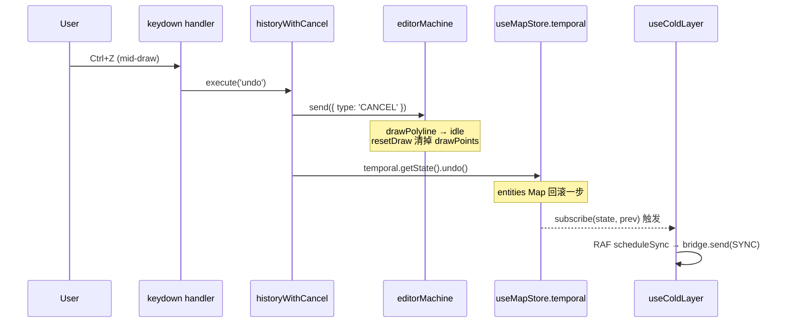

# useActionDispatcher

> 源码：[`src/hooks/useActionDispatcher.ts`](https://github.com/) · 测试：`src/hooks/__tests__/undoCancel.test.ts`

`useActionDispatcher` 是 Apollo Map Studio 内部"动作"层的中央枢纽。它把
`@/core/actions/registry` 中静态声明的 [`ActionDef`](../core/action-registry.md)
集合，绑定到真实的运行时处理器（FSM 事件、Zustand store 调用、模态打开
回调），并安装全局键盘监听。所有用户可执行动作 —— 菜单、命令面板、工具栏、
键盘快捷键 —— 最终都汇入同一个 `execute(actionId)` 入口。

> **R1 不变量**：撤销/重做必须先向 FSM 发送 `CANCEL`，再调用
> `temporal.undo()` / `temporal.redo()`（见
> `src/hooks/useActionDispatcher.ts:104-108`）。
> 缺少这一步会让 `drawPoints` / `dragPointIndex` 持有已被时间旅行
> 回滚掉的实体引用，下一次 `CONFIRM` / `DRAG_END` 写入将污染地图。

## 设计目标

- **单一执行入口**：菜单栏、命令面板、工具栏按钮、键盘快捷键都通过同一个
  `execute(actionId: ActionId)` 调用，保证语义统一。
- **类型安全**：`ActionId` 是 `as const` 字面量联合类型，`execute('tool:typo')`
  在编译期即报错，杜绝拼写漂移。
- **运行时一次注册**：`useMemo` 构建 `Map<ActionId, () => void>`，依赖
  `[actorRef, onOpenCommandPalette, onOpenSettings, onResetLayout]`，
  只有在 UI shell 重新挂载时才会重建。
- **守门**：所有改图动作（`category === 'edit' | 'tool' | 'selection'`，
  以及显式的 `connectLanes`）在 license `canEdit=false` 时被
  `assertEditable` 拦截。

## 签名

```ts
function useActionDispatcher(options: ActionDispatcherOptions): ActionDispatcher;

interface ActionDispatcherOptions {
  actorRef: ActorRefFrom<typeof editorMachine>;
  onOpenCommandPalette: () => void;
  onOpenSettings: () => void;
  onResetLayout: () => void;
}

interface ActionDispatcher {
  /** 通过 ActionId 执行动作。未注册的 id 会在 console 输出警告。 */
  execute: (actionId: ActionId) => void;
  /** 仅对 toggle 类动作有意义；其它动作恒返回 false。 */
  getToggleState: (actionId: ActionId) => boolean;
  /** 全部 ACTION_DEFS（用于 UI 渲染菜单 / 命令面板）。 */
  actions: ActionDef[];
}
```

## 参数

| 名称                   | 类型                                 | 角色                                                                                                     |
| ---------------------- | ------------------------------------ | -------------------------------------------------------------------------------------------------------- |
| `actorRef`             | `ActorRefFrom<typeof editorMachine>` | XState 5 actor 引用，所有 FSM 事件（`CANCEL` / `RESET` / `SELECT_TOOL` / `DELETE_ENTITY` …）通过它发出。 |
| `onOpenCommandPalette` | `() => void`                         | UI shell 提供的命令面板打开回调，对应 `commandPalette` action。                                          |
| `onOpenSettings`       | `() => void`                         | 打开设置弹窗，对应 `settings` action。                                                                   |
| `onResetLayout`        | `() => void`                         | 重置 dockview 布局，对应 `resetLayout` action。                                                          |

## 返回值

| 字段             | 类型                        | 说明                                                                                  |
| ---------------- | --------------------------- | ------------------------------------------------------------------------------------- |
| `execute`        | `(id: ActionId) => void`    | 主入口；未知 id 会触发 `console.warn`，不抛异常（`useActionDispatcher.ts:165-167`）。 |
| `getToggleState` | `(id: ActionId) => boolean` | `toggleGrid` / `toggleSnap` / `connectLanes` / `defaultMode` 返回真值，其它 `false`。 |
| `actions`        | `ActionDef[]`               | 直接从 registry 透传的全集，UI 渲染菜单时使用。                                       |

## 副作用

| 副作用                                                                                        | 触发时机                                   | 清理                                                           |
| --------------------------------------------------------------------------------------------- | ------------------------------------------ | -------------------------------------------------------------- |
| `window.addEventListener('keydown', handler)`                                                 | `execute` 闭包变化时（即 `handlers` 重建） | 同步 `removeEventListener`（`useActionDispatcher.ts:218-219`） |
| `actorRef.send({ type: 'CANCEL' \| 'RESET' \| 'SELECT_TOOL' \| 'DELETE_ENTITY' \| ... })`     | `execute` 调用时根据 ActionId 分发         | —                                                              |
| `useMapStore.temporal.getState().undo() / redo()`                                             | `historyWithCancel('undo' \| 'redo')`      | —                                                              |
| `useUIStore.getState().toggleGrid() / toggleSnap() / toggleConnectMode() / exitConnectMode()` | view / connect 类 action                   | —                                                              |
| `pickAndImportApollo()` / `exportApolloBin()` / `exportApolloText()`                          | file 类 action                             | 异步；返回 promise 被 `void` 吞掉，错误仅 `console.info`       |

注意：键盘 handler 在每个 `execute` 闭包变化时重建（依赖
`[execute]`，line 220）。这是必要的——`handlers` 依赖回调，回调
变化时旧 handler 会捕获过期 `execute`。

## 生命周期

```
mount: useMemo 构建 handlers map
  ├── file: importApollo / exportApolloBin / exportApolloText / settings
  ├── edit: undo (CANCEL→undo) / redo (CANCEL→redo) / delete
  ├── view: toggleGrid / toggleSnap / resetLayout / commandPalette
  ├── default: defaultMode (CANCEL+RESET, exit connectMode)
  ├── connect: connectLanes (CANCEL, toggleConnectMode)
  └── tools: 每个 ACTION_DEFS 中带 drawTool 的项 → SELECT_TOOL

useEffect: window.addEventListener('keydown', handler)
  ├── 在 input/textarea/select 中跳过非 global 快捷键
  ├── for each ACTION_DEFS w/ keybinding: matchesKeybinding → execute
  └── 第一个匹配项 e.preventDefault() 后 return

unmount: removeEventListener('keydown', handler)
```

## 不变量

### R1：CANCEL 必须先于时间旅行

```ts
// useActionDispatcher.ts:76-108
// R1 fix: flush any in-flight FSM draft/drag state *before* time-traveling
// the entity store. Without this, undo leaves FSM holding stale drawPoints
// or dragPointIndex pointing at an entity that just rolled back — the next
// CONFIRM/DRAG_END writes corrupted data. CANCEL is safe in every state:
// draw states → idle+resetDraw, selected → idle+deselect, editingPoint →
// selected, idle has no handler (XState 5 no-ops).
const historyWithCancel = (op: 'undo' | 'redo') => {
  actorRef.send({ type: 'CANCEL' });
  if (op === 'undo') useMapStore.temporal.getState().undo();
  else useMapStore.temporal.getState().redo();
};
map.set('undo', () => historyWithCancel('undo'));
map.set('redo', () => historyWithCancel('redo'));
```

回归测试：`src/hooks/__tests__/undoCancel.test.ts`。

### 默认模式（pan/select）使用 CANCEL+RESET 双发

```ts
// useActionDispatcher.ts:122-132
map.set('defaultMode', () => {
  actorRef.send({ type: 'CANCEL' });
  // CANCEL 在 idle 是 no-op，残余的 activeElement 会保留；
  // RESET 才能清掉 activeElement / drawPoints / bezierAnchors。
  actorRef.send({ type: 'RESET' });
  if (useUIStore.getState().connectMode.active) {
    useUIStore.getState().exitConnectMode();
  }
});
```

### License 守门

```ts
// useActionDispatcher.ts:33-38
function actionRequiresEdit(id: ActionId): boolean {
  if (id === 'connectLanes') return true;
  const def = ACTION_MAP.get(id);
  if (!def) return false;
  return def.category === 'edit' || def.category === 'tool' || def.category === 'selection';
}
```

任何归类为 `edit` / `tool` / `selection` 的动作，以及显式的 `connectLanes`，
都必须通过 `assertEditable(actionId)` 检查。校验失败时 `execute` 静默返回，
状态条会显示 license 提醒。

## 撤销 CANCEL 时序



如果省略第 3 步（`CANCEL`），第 4 步会让 `mapStore.entities`
回滚，但 FSM 仍持有 `drawPolyline` + `drawPoints`，下一次
`CONFIRM` 调用 `addEntity` 时会基于失效的状态计算 `nextEntityId`，
产生 id 冲突或几何错位。

## 工具注册：registry-driven SELECT_TOOL

```ts
// useActionDispatcher.ts:144-150
for (const action of ACTION_DEFS) {
  if (action.drawTool) {
    const tool = action.drawTool;
    map.set(action.id, () => actorRef.send({ type: 'SELECT_TOOL', tool }));
  }
}
```

新增工具时，唯一改动点是 `src/core/actions/registry.ts` 中的
`ActionDef`：声明 `drawTool: 'drawArc'` 之类即可。dispatcher 在 `useMemo`
重建时自动注册。

## 调用点

唯一挂载点是 `WorkspaceLayoutInner`（`src/components/layout/WorkspaceLayout.tsx:89`）：

```tsx
const { execute, getToggleState } = useActionDispatcher({
  actorRef,
  onOpenCommandPalette: () => setCommandPaletteOpen(true),
  onOpenSettings: () => setSettingsOpen(true),
  onResetLayout: () => dockviewRef.current?.api.fromJSON(DEFAULT_LAYOUT),
});
```

`execute` / `getToggleState` 通过 props 向下传给：

- `MenuBar` —— 渲染菜单项，点击 → `execute(actionId)`，toggle 状态 → `getToggleState(actionId)`
- `ToolStrip` —— 工具栏按钮 → `execute(toolActionId)`
- `CommandPalette` —— 命令搜索结果 → `execute(actionId)`
- `StatusBar` —— 显示当前 toggle 状态（grid / snap）

## 错误模式

| 现象                                        | 根因                                           | 修复                                                |
| ------------------------------------------- | ---------------------------------------------- | --------------------------------------------------- |
| 撤销后下一次 `CONFIRM` 写入坏数据           | 漏掉 R1 CANCEL 闭环                            | 始终走 `historyWithCancel`                          |
| `defaultMode` 无法清除 ToolStrip 上工具高亮 | `CANCEL` 在 `idle` 是 no-op                    | 同时发 `RESET`                                      |
| `Ctrl+Z` 在 input 框内吃掉浏览器原生撤销    | keybinding 没有 `global: false`                | 在 `registry.ts` 中省略 `global` 字段（默认 false） |
| toggle 不亮                                 | `getToggleState` 走 `default` 分支返回 `false` | 在 switch 中显式列出该 ActionId                     |

## 测试

- `src/hooks/__tests__/undoCancel.test.ts` —— R1 闭环回归测试
- `src/core/actions/__tests__/registry.test.ts` —— registry 与 dispatcher 的 ActionId 一致性

## 参见

- [Action Registry](../core/action-registry.md)
- [editorMachine FSM](../core/editor-machine.md)
- [`useDrawCommit`](./use-draw-commit.md)
- [Architecture: Action Registry (R5)](/architecture/)

## 源码索引

| 关注点                     | 行号                                    |
| -------------------------- | --------------------------------------- |
| `actionRequiresEdit` 守门  | `useActionDispatcher.ts:33-38`          |
| `handlers` Map 构建        | `useActionDispatcher.ts:73-153`         |
| **R1 CANCEL 闭环**         | `useActionDispatcher.ts:76-82, 104-108` |
| `defaultMode` CANCEL+RESET | `useActionDispatcher.ts:122-132`        |
| Registry-driven 工具注册   | `useActionDispatcher.ts:144-150`        |
| `execute` 守门 + 派发      | `useActionDispatcher.ts:157-170`        |
| `getToggleState` switch    | `useActionDispatcher.ts:174-190`        |
| 键盘监听 effect            | `useActionDispatcher.ts:194-220`        |
