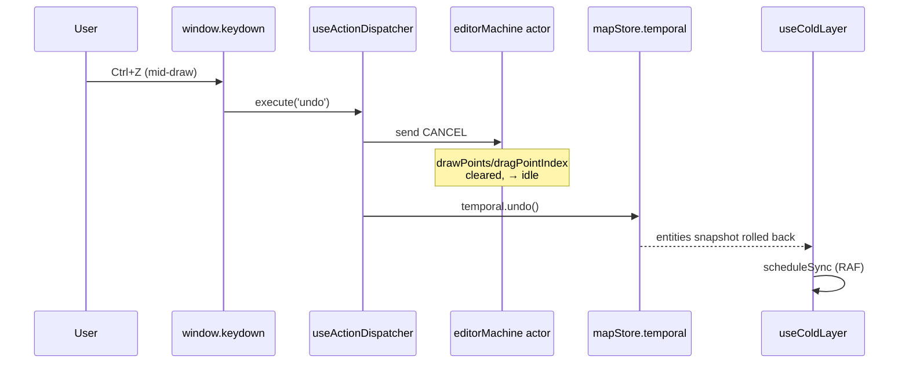

# useActionDispatcher

> Source: `src/hooks/useActionDispatcher.ts`

## Overview

`useActionDispatcher` is the single dispatcher that connects the
[Action Registry](/api/core/action-registry) to runtime handlers. Every
user-executable action — menus, command palette, tool strip buttons,
keyboard shortcuts — funnels through one `execute(actionId)` entry point,
making the registry's `ActionId` literal union the universal contract.

The hook is mounted exactly once inside `WorkspaceLayoutInner` and shared
with all UI surfaces by passing `execute` and `getToggleState` props.
This guarantees that "open Settings", "press Ctrl+S", and "click the gear
icon" cannot diverge in behavior.

## Hook signature

```ts
function useActionDispatcher(options: ActionDispatcherOptions): ActionDispatcher;

interface ActionDispatcherOptions {
  actorRef: ActorRefFrom<typeof editorMachine>;
  onOpenCommandPalette: () => void;
  onOpenSettings: () => void;
  onResetLayout: () => void;
}

interface ActionDispatcher {
  execute: (actionId: ActionId) => void;
  getToggleState: (actionId: ActionId) => boolean;
  actions: ActionDef[];
}
```

The four callbacks pierce the dispatcher to UI shell concerns that live
above the registry (modal overlays, dockview layout reset). Everything
else — file IO, undo, draw-tool selection, FSM commands — is fully
internal.

## Behavior

### Handler map

`useMemo` builds a `Map<ActionId, () => void>` covering every action the
dispatcher knows how to run. The map rebuilds only when its closure
inputs (`actorRef`, the three callbacks) change, so steady-state input
events do not allocate.

Categories handled:

| Category | Handlers                                                          |
| -------- | ----------------------------------------------------------------- |
| File     | `importApollo`, `exportApolloBin`, `exportApolloText`, `settings` |
| Edit     | `undo`, `redo`, `delete`                                          |
| View     | `toggleGrid`, `toggleSnap`, `resetLayout`, `commandPalette`       |
| Mode     | `defaultMode` (escape hatch), `connectLanes`                      |
| Tools    | every `ActionDef` with a `drawTool` field — registry-driven       |

Adding a tool means adding a registry record; the dispatcher discovers
it via `for (const action of ACTION_DEFS) { if (action.drawTool) ... }`
and emits `SELECT_TOOL` to the FSM with no further code changes.

### R1 closure: CANCEL before undo

::: warning Critical: undo footgun
Lines 76-82 implement the **R1 fix**. Without it, mid-draw `Ctrl+Z`
leaves the FSM holding stale `drawPoints` / `dragPointIndex` while
`mapStore.entities` rolls back, corrupting the next CONFIRM/DRAG_END
write.
:::

```ts
const historyWithCancel = (op: 'undo' | 'redo') => {
  actorRef.send({ type: 'CANCEL' });
  if (op === 'undo') useMapStore.temporal.getState().undo();
  else useMapStore.temporal.getState().redo();
};
```

`CANCEL` is safe in every state (XState 5 no-ops on `idle`), so we
unconditionally flush FSM draft state before time-traveling the entity
store. The regression test lives at
`src/hooks/__tests__/undoCancel.test.ts`.



### License-aware gating

Edit-class actions are blocked when the license is read-only:

```ts
function actionRequiresEdit(id: ActionId): boolean {
  if (id === 'connectLanes') return true;
  const def = ACTION_MAP.get(id);
  if (!def) return false;
  return def.category === 'edit' || def.category === 'tool' || def.category === 'selection';
}
```

`execute` calls `assertEditable(actionId)` from `@/lib/editable-guard`
before dispatching. If the license disallows edits, the assertion
records a friendly toast and returns `false`, short-circuiting the
handler.

### Default-mode toggle

`defaultMode` is the Photoshop-style "Hand" escape hatch — it sends
`CANCEL` then `RESET` to clear residual `activeElement`, plus exits
connect-mode if active. `getToggleState('defaultMode')` returns `true`
only when FSM is `idle`, no element is armed, and connect-mode is off.

### Toggle state reader

```ts
const getToggleState = (actionId: ActionId): boolean => {
  switch (actionId) {
    case 'toggleGrid':
      return gridEnabled;
    case 'toggleSnap':
      return snapEnabled;
    case 'connectLanes':
      return connectModeActive;
    case 'defaultMode':
      return inDefaultMode;
    default:
      return false;
  }
};
```

The first three are direct `uiStore` reads. `inDefaultMode` is computed
via `useSelector(actorRef, ...)` so it reactively tracks FSM
transitions.

### Keyboard shortcut binding

`useEffect` registers a single global `keydown` listener that walks
`getKeyBindingActions()` and matches against `matchesKeybinding(e, kb)`.

- `kb.global === false` (default) skips the shortcut while focus is in
  an `<input>` / `<textarea>` / `<select>`.
- The listener stops at the first match and calls `e.preventDefault()`.
- Unregisters on unmount.

This means the registry is the single source of truth for shortcuts —
`MenuBar`, `CommandPalette`, and `ToolStrip` only render `shortcut`
strings; they never bind keys themselves.

## Dependencies

| Source                    | Purpose                                           |
| ------------------------- | ------------------------------------------------- |
| `@/store/mapStore`        | `temporal.undo()` / `temporal.redo()` for history |
| `@/store/uiStore`         | grid/snap/connect toggles                         |
| `@/core/actions/registry` | `ACTION_DEFS`, keyboard binding tables            |
| `@/io/mapIO`              | `pickAndImportApollo`, `exportApollo*`            |
| `@/lib/editable-guard`    | license gating                                    |
| `@xstate/react`           | `useSelector` for FSM-derived toggle states       |

## Examples

### Mounting in WorkspaceLayout

```tsx
const { execute, getToggleState } = useActionDispatcher({
  actorRef,
  onOpenCommandPalette: () => setCommandPaletteOpen(true),
  onOpenSettings: () => setSettingsOpen(true),
  onResetLayout: handleResetLayout,
});

return (
  <>
    <MenuBar onExecute={execute} getToggleState={getToggleState} />
    <ToolStrip onExecuteAction={execute} getToggleState={getToggleState} />
  </>
);
```

### Adding a new action

```ts
// In src/core/actions/registry.ts
{
  id: 'duplicate',
  category: 'edit',
  label: 'Duplicate',
  shortcut: 'Cmd+D',
  keybinding: { key: 'd', meta: true },
  menu: 'Edit',
  menuOrder: 25,
  inCommandPalette: true,
}
```

Then add a case in the `useActionDispatcher` handler `useMemo`:

```ts
map.set('duplicate', () => actorRef.send({ type: 'DUPLICATE_ENTITY' }));
```

The new shortcut, menu entry, and palette item appear automatically.

## Related

- [Action Registry](/api/core/action-registry)
- [editorMachine FSM](/api/core/editor-machine)
- [mapStore (zundo)](/api/store/store-map)
- [License banner](/api/components/license-banner)
- [useMapEventRouter](/api/hooks/use-map-event-router)
