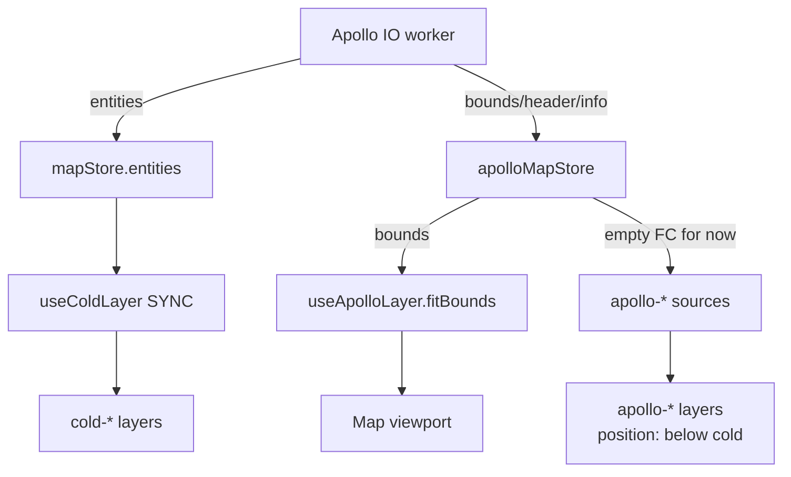

# useApolloLayer

> 源码：`src/hooks/useApolloLayer.ts`

`useApolloLayer` 负责在 Apollo IO 导入完成后注册 `apollo-*` sources/layers
并根据 `apolloMapStore.bounds` 自动取景。它通过一组以 `apollo-` 前缀命名的 GeoJSON sources 与 layers，专门
区分"导入数据"和"用户正在编辑的数据"，色调统一选用青色 / 信号黄色家族。

> **当前状态**：所有 Apollo 实体在导入阶段已被桥接到 `mapStore.entities`
> 并由冷层渲染。本 hook 注册的 sources 在运行期始终保持空 FC（line 217-220），
> 只剩 layer specs 作为 z-order 占位。这是 P9 重构前的过渡产物，
> 计划在分图层 UI 落地时再次启用真实数据流。

## 当前 vs 未来

| 维度   | 当前实现            | 未来分层 UI                |
| ------ | ------------------- | -------------------------- |
| 数据流 | 全部桥接到 mapStore | apollo source 持有原始数据 |
| 编辑   | 全部走 cold layer   | 仅"用户克隆"的实体可编辑   |
| 切换   | 单一开关            | 原始 / 编辑双层独立 toggle |
| 颜色   | 用户色覆盖          | 原始色 + 用户色对照        |

短期内本 hook 维持现状即可；其它 hook（cold / hot）的迭代不依赖本 hook 行为。

## 设计动机

- **视觉区分**：导入数据采用 cyan 主色，用户绘制走 ams-\* 主色，肉眼一眼区分。
- **可重启**：layer 安装是幂等的（line 191-208），多次导入只会刷新数据，
  不会重复注册 source/layer。
- **取景**：导入完成后按 worker 计算出来的 `bounds` 调用
  `map.fitBounds`，避免用户重置视角后找不到地图。

## 调试

- 检查 source 是否注册：浏览器控制台
  `window.__map?.getStyle().sources` 列出所有 source。
- 检查 layer 注册：`window.__map?.getStyle().layers.map(l => l.id)`
  应包含所有 `apollo-*-fill / -line / -circle` 项。
- 重新触发：在 console 调用
  `import('@/store/apolloMapStore').then(m => m.useApolloMapStore.setState({ bounds: null }))`
  随后再设置 bounds 可手动复现 fitBounds 路径。

## 与撤销系统的关系

Apollo 导入会清空旧的 `mapStore.entities`；该清空走 zundo `temporal`
的撤销栈 —— 用户 Ctrl+Z 可回到导入前的工作面。但 `apolloMapStore.bounds`
不在 zundo 范围内，撤销后视口取景仍指向已导入的范围。
若用户希望"完全回到导入前"，需要同时调 `apolloMapStore.clear()` —— 当前
没有 UI 路径触发；这是已知的次要 UX 问题。

## 重新导入的同源去重

import 时 `mapIO` 会通过 `replaceImportedEntities` 替换旧的 `mapStore.entities`。
导入两次同一个文件不会累积重复 id，因为实体集合会整体替换。

## 实体类型完整对照

下表把每个 `apollo-*` source 与 Apollo proto 类型 + 编辑层 entity 类型对齐。

| Source                 | Apollo proto                     | mapStore.entityType         | Editing 颜色         |
| ---------------------- | -------------------------------- | --------------------------- | -------------------- |
| `apollo-junction`      | `apollo.hdmap.Junction`          | `junction`                  | ams-\* fill          |
| `apollo-clear-area`    | `apollo.hdmap.ClearArea`         | `clearArea`                 | red-hatch pattern    |
| `apollo-parking-space` | `apollo.hdmap.ParkingSpace`      | `parkingSpace`              | green fill           |
| `apollo-crosswalk`     | `apollo.hdmap.Crosswalk`         | `crosswalk`                 | zebra pattern        |
| `apollo-road-boundary` | `apollo.hdmap.Road.RoadBoundary` | `boundary` (sub-kind: road) | line                 |
| `apollo-lane-boundary` | `apollo.hdmap.Lane.LaneBoundary` | `boundary` (sub-kind: lane) | line                 |
| `apollo-lane-center`   | `apollo.hdmap.Lane.center_line`  | `lane`                      | dashed line + arrows |
| `apollo-speed-bump`    | `apollo.hdmap.SpeedBump`         | `speedBump`                 | thick line           |
| `apollo-stop-sign`     | `apollo.hdmap.StopSign`          | `stopSign`                  | line + label         |
| `apollo-signal`        | `apollo.hdmap.Signal`            | `signal`                    | circle + label       |

## 数据来源

- `apolloMapStore.bounds` —— Apollo IO worker 在 `parseAndCompile` 后写入。
  bounds 类型 `[[lng, lat], [lng, lat]]`（西南角 + 东北角）。
- `mapStore.entities` —— 通过 entityOps 适配器桥接的可编辑实体；本 hook
  完全不读，只通过 z-order 让 cold layer 高于 apollo-\* layer。

## 签名

```ts
function useApolloLayer(
  mapRef: React.RefObject<maplibregl.Map | null>,
  mapLoadedRef: React.RefObject<boolean>,
): void;
```

## 参数

| 名称           | 类型                                | 角色                                                            |
| -------------- | ----------------------------------- | --------------------------------------------------------------- |
| `mapRef`       | `RefObject<maplibregl.Map \| null>` | MapLibre 实例引用，由 `useMapLibreInit` 提供。                  |
| `mapLoadedRef` | `RefObject<boolean>`                | `true` 表示 `map.on('load')` 已经触发；layer 安装前的守门标志。 |

## 返回值

无（`void`）。所有副作用直接落到 MapLibre 上。

## 副作用

| 副作用                         | 触发时机                                                                | 清理                                              |
| ------------------------------ | ----------------------------------------------------------------------- | ------------------------------------------------- |
| `map.addSource(apollo-*, ...)` | `apply()` → `ensureInstalled()` 首次执行（`useApolloLayer.ts:191-197`） | 不主动清理（hook 卸载时整个 map 也会 dispose）    |
| `map.addLayer(spec, beforeId)` | `ensureInstalled` 中按 `LAYERS` 顺序插入                                | 同上                                              |
| `src.setData(EMPTY_FC)`        | 每次 `apply()` 调用                                                     | —                                                 |
| `map.fitBounds(bounds, ...)`   | `bounds !== null` 时（line 222-224）                                    | —                                                 |
| `map.once('load', apply)`      | 当前未加载时                                                            | `useEffect` cleanup 调用 `map.off('load', apply)` |

## 生命周期

```
mount ──▶ ensureInstalled (idempotent)
            ├── 注册 10 个 apollo-* sources
            └── 在 cold-* layer 之下插入 LAYERS

bounds 变化 ──▶ apply()
            ├── 重置所有 source 数据为 EMPTY_FC
            └── fitBounds(bounds, padding=60, duration=600)

unmount ──▶ off('load', apply)
```

## 不变量

### 注册顺序：sources → layers

`ensureInstalled`（line 188-208）严格分两阶段：先注册全部 source，
再插入 layer。否则 MapLibre 会在 `addLayer` 时找不到 source 并抛错。

### Layer 必须插在 cold 层之下

```ts
// useApolloLayer.ts:198-201
const existingLayers = map.getStyle().layers ?? [];
const coldLayer = existingLayers.find((l) => l.id.startsWith('cold-'));
const beforeId = coldLayer?.id;
```

确保用户编辑（cold + hot + overlay）始终覆盖在导入图之上。

### Sources 永远空 FC（过渡产物）

```ts
// useApolloLayer.ts:213-220
// All Apollo entity types are bridged into mapStore and rendered by
// the cold layer. These viewer-layer sources stay empty; they exist
// only so the layer specs below remain valid.
for (const sourceId of Object.values(SOURCE)) {
  const src = map.getSource(sourceId) as maplibregl.GeoJSONSource | undefined;
  src?.setData(EMPTY_FC);
}
```

## 图层 / 数据源对照

| Source ID              | 渲染 layer                                           | 类型 / 颜色                                |
| ---------------------- | ---------------------------------------------------- | ------------------------------------------ |
| `apollo-junction`      | `apollo-junction-fill`                               | fill `#0e7490` α=0.18                      |
| `apollo-clear-area`    | `apollo-clear-area-fill`                             | fill `#dc2626` α=0.15                      |
| `apollo-parking-space` | `apollo-parking-space-fill`                          | fill `#16a34a` α=0.18                      |
| `apollo-crosswalk`     | `apollo-crosswalk-fill` + `apollo-crosswalk-outline` | fill `#fbbf24` α=0.25 + line `#f59e0b` 1px |
| `apollo-road-boundary` | `apollo-road-boundary-line`                          | line `#94a3b8` 1.5px                       |
| `apollo-lane-boundary` | `apollo-lane-boundary-line`                          | line `#cbd5e1` 1px α=0.7                   |
| `apollo-lane-center`   | `apollo-lane-center-line`                            | line `#22d3ee` 1.5px dashed                |
| `apollo-speed-bump`    | `apollo-speed-bump-line`                             | line `#a855f7` 3px                         |
| `apollo-stop-sign`     | `apollo-stop-sign-line`                              | line `#dc2626` 2px                         |
| `apollo-signal`        | `apollo-signal-circle` + `apollo-signal-line`        | circle 4px + line 2px `#facc15`            |

## 调用点

```tsx
// src/components/map/MapCanvas.tsx:41
useApolloLayer(mapRef, mapLoadedRef);
```

唯一调用方是 `MapCanvas`，每次该组件挂载即注册一次。`apolloMapStore.bounds`
变化时仅刷新 source 数据并 fitBounds，不会重复 addLayer。

## 错误模式

| 现象                    | 根因                                                       | 修复                                               |
| ----------------------- | ---------------------------------------------------------- | -------------------------------------------------- |
| 控制台 "no source"      | `ensureInstalled` 在 `mapLoadedRef.current=false` 提前返回 | 等 `map.once('load')` 兜底再 apply 一次            |
| Apollo 图层在 cold 之上 | `coldLayer.id` 找不到（cold 层未注册）                     | 确保 `useColdLayer` 已经挂载                       |
| fitBounds 不动          | `bounds === null`                                          | 检查 `apolloMapStore.bounds` 是否被 IO worker 设置 |

## 参见

- [`useColdLayer`](./use-cold-layer.md)
- [`apolloMapStore`](../store/apollo-map-store.md)
- [Apollo IO bridge](../io/apollo-io-bridge.md)

## 性能注记

- **Layer install 仅一次**：`installedRef` 是 `useRef(false)`（line 182）保护，
  即使 `bounds` 频繁刷新也不会重复 `addSource` / `addLayer`。
- **fitBounds animation 600ms**：导入大图时这是观感刚好的过渡时间；
  改成 0 会让用户瞬移到目的地，丢失方向感。
- **空 source 仍占内存**：每个 `apollo-*` source 都注册了空 FC，
  maplibre 内部仍持有 GL buffer 句柄。当真实的 Apollo 分图层 UI 重新接入时，
  这些 source 可以一次填入数据，无需重新 add。

## 与 cold layer 的协作



当前所有 Apollo 实体的真实数据都走 `mapStore` → cold layer 这条路；
`apollo-*` layer 仅维持 z-order 占位。未来引入 "原始底图层 / 编辑层"
分离时，`useApolloLayer` 会重新成为活跃通路。

## 常见问答

**Q: 为什么不直接复用 cold layer？**
A: cold layer 用 ams-\* 主色（用户绘制色），而 Apollo 导入数据需要明显的
青色 / 信号黄区分。让两者用不同的 source + layer 是为了未来开关切换更直接。

**Q: 删除 Apollo 数据时怎么清理？**
A: 当前清理路径是 `apolloMapStore.clear()` + `mapStore.clear()`。`useApolloLayer`
不主动 removeSource —— 它假设 layer 注册是终身的。若要支持完全卸载，
需要在清空 import context 时显式 `map.removeLayer` / `map.removeSource`。

## 源码索引

| 关注点                         | 行号                             |
| ------------------------------ | -------------------------------- |
| `SOURCE` 常量                  | `useApolloLayer.ts:14-25`        |
| `LAYERS` 列表                  | `useApolloLayer.ts:35-175`       |
| `installedRef` 守门            | `useApolloLayer.ts:182`          |
| `ensureInstalled`              | `useApolloLayer.ts:188-208`      |
| `apply()`                      | `useApolloLayer.ts:210-225`      |
| `bounds` 订阅 + fitBounds      | `useApolloLayer.ts:181, 222-224` |
| 当前空数据回填                 | `useApolloLayer.ts:213-220`      |
| `map.once('load', apply)` 兜底 | `useApolloLayer.ts:228-233`      |
