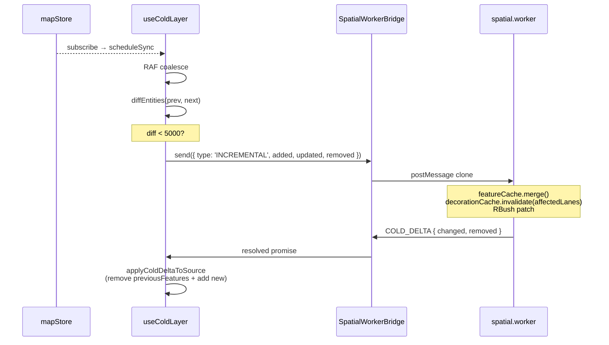

# useColdLayer

> 源码：`src/hooks/useColdLayer.ts` · 协议：`src/core/workers/protocol.ts` · Worker：`src/core/workers/spatial.worker.ts`

`useColdLayer` 是冷层（已提交实体）渲染管线的 React 端调度器。它把
`mapStore.entities` 的变更经过 **RAF 合并 → SpatialWorkerBridge →
spatial.worker → COLD_READY/COLD_DELTA → maplibre `cold` source** 一连串桥接，
保证：

1. 大量实体进入或编辑也只会按帧节流，避免主线程被 setData 卡死。
2. 增量改动走 `INCREMENTAL` 协议，仅重算受影响 lane 的 boundary decoration（Phase E N1 优化）。
3. 选择态变化只重写 layer filter，不重渲染数据。

## 架构定位

```
mapStore.entities ──▶ useColdLayer.scheduleSync (RAF) ──▶ bridge.send(SYNC | INCREMENTAL)
                                                              │
                                                              ▼
                                                    spatial.worker.ts
                                                    (featureCache + decorationCache + RBush)
                                                              │
                                          COLD_READY / COLD_DELTA
                                                              │
                                                              ▼
                                       cold GeoJSONSource.setData / updateData
```

详细分层见 [`Architecture: Cold Layer`](/architecture)。

## 签名

```ts
function useColdLayer(
  mapRef: React.RefObject<maplibregl.Map | null>,
  mapLoadedRef: React.RefObject<boolean>,
  actorRef: ActorRefFrom<typeof editorMachine>,
  bridgeRef: React.RefObject<SpatialWorkerBridge | null>,
): void;
```

## 参数

| 名称           | 类型                                     | 角色                                                                                  |
| -------------- | ---------------------------------------- | ------------------------------------------------------------------------------------- |
| `mapRef`       | `RefObject<maplibregl.Map \| null>`      | MapLibre 实例。                                                                       |
| `mapLoadedRef` | `RefObject<boolean>`                     | `true` 表示 `map.on('load')` 已触发。                                                 |
| `actorRef`     | `ActorRefFrom<typeof editorMachine>`     | FSM actor；用来读取 `selectedEntityId` 并订阅其变化以刷新 cold layer 高亮 filter。    |
| `bridgeRef`    | `RefObject<SpatialWorkerBridge \| null>` | spatial worker 桥；`null` 时本 hook 静默不工作（worker 不可用时 cold 层保持上一帧）。 |

## 返回值

`void`。所有副作用对 `cold` source / cold-\* layers 生效。

## 核心副作用

| 副作用                                                         | 触发时机                                           | 清理                                                 |
| -------------------------------------------------------------- | -------------------------------------------------- | ---------------------------------------------------- |
| `map.once('load', onLoad)`                                     | 当前未加载                                         | `map.off('load', onLoad)`                            |
| `actorRef.subscribe(onActorChange)`                            | mount                                              | `subscription.unsubscribe()`                         |
| `useMapStore.subscribe(...)`                                   | mount                                              | 返回的 `unsubscribeStore()`                          |
| `requestAnimationFrame(syncColdLayer)`                         | `scheduleSync`                                     | `cancelAnimationFrame(syncFrameRef.current)`         |
| `bridge.send({ type: 'SYNC' \| 'INCREMENTAL' \| 'HIT_TEST' })` | RAF 触发的 sync 路径                               | 通过 `requestVersion` + `cancelled` 双闸丢弃过期响应 |
| `src.setData(...)` / `src.updateData({ add, remove })`         | 收到 `COLD_READY` / `COLD_DELTA`                   | —                                                    |
| `map.setFilter(layerId, filter)`                               | `applyColdSelectionFilter` 被 actor 选择态变化触发 | —                                                    |
| `useTaskProgressStore.beginTask / endTask`                     | 全量 SYNC 时显示 "Rendering map layers" 进度       | `endTask` 在 `finally` 中触发                        |

## 生命周期

```
mount
  ├── 读取当前 selectedEntityId 写入 ref
  ├── subscribe(actorRef)         ── 选择态变化 → applyColdSelectionFilter
  ├── subscribe(useMapStore)      ── entities 变化 → scheduleSync
  └── if mapLoaded: onLoad() else: map.once('load', onLoad)

scheduleSync (RAF coalesced)
  ├── snapshot = clone(entities)
  ├── if !prev: SYNC (full)                    └─▶ groupsToFeatureMap + setData
  ├── diff = diffEntities(prev, entities)
  ├── if !hasChanges: return
  ├── if diffSize > 5000:    SYNC              └─▶ rebuildColdSourceFromCache
  └── else: INCREMENTAL { added, updated, removed }
       └─▶ applyColdDeltaToSource(remove old features, add new ones)

unmount
  ├── cancelled = true               ── in-flight worker response 被丢弃
  ├── unsubscribe actor + store
  ├── cancelAnimationFrame(syncFrameRef.current)
  └── map.off('load', onLoad)
```

## RAF 合并与版本闸

```ts
// useColdLayer.ts:278-281
const scheduleSync = () => {
  if (syncFrameRef.current !== null) return;
  syncFrameRef.current = requestAnimationFrame(syncColdLayer);
};
```

每次 store 变化只会请求一次 RAF。多次 `addEntity` / `updateEntity` 在
同一帧内只触发一次 worker SYNC，避免抖动。

```ts
// useColdLayer.ts:194, 211
const requestVersion = ++syncVersionRef.current;
// ...
if (cancelled || requestVersion !== syncVersionRef.current) return;
```

每次进入 `syncColdLayer` 取得递增的 `requestVersion`。后续 RAF 触发新的
请求时会自增计数；旧响应回流时被丢弃，避免乱序写入 cold source。

## SYNC vs INCREMENTAL 选择

```ts
// useColdLayer.ts:13-15, 237-239
const SOURCE_UPDATE_CHUNK_SIZE = 4_000;
const FULL_SYNC_ENTITY_CHANGE_THRESHOLD = 5_000;
// ...
if (diffSize(diff) > FULL_SYNC_ENTITY_CHANGE_THRESHOLD) {
  void syncAllColdFeatures('cold-layer-sync');
  return;
}
```

- 首帧或 diff 超阈值：走 `SYNC`，worker 全量重建 featureCache + decorationCache。
- 否则：走 `INCREMENTAL`，worker 仅重算受影响 lanes（依据
  `LaneJunctionGraph.getDependents`），返回 `COLD_DELTA`。
- `setData` / `updateData` 也按 `SOURCE_UPDATE_CHUNK_SIZE = 4000` 分片，
  避免单次 postMessage / clone 过大。

## 选择态高亮（filter-only）

```ts
// useColdLayer.ts:154-159
function applyColdSelectionFilter(map: maplibregl.Map, selectedEntityId: string | null) {
  for (const layerId of COLD_LAYER_IDS) {
    if (!map.getLayer(layerId)) continue;
    map.setFilter(layerId, buildColdLayerFilter(layerId, selectedEntityId));
  }
}
```

选择态变化不调用 `setData` —— 仅切换每个 cold-\* layer 的 filter，
让被选实体在 hot 层之上重绘。这是常驻最快路径，不经过 worker。

## 不变量

### 顺序：先 setData(空) 再 updateData(add)

```ts
// useColdLayer.ts:78-94
async function rebuildColdSourceFromCache(...) {
  await setColdSourceData(src, []);                    // 清空
  let chunk: GeoJSON.Feature[] = [];
  for (const bucket of cache.values()) {
    for (const feature of bucket) {
      chunk.push(withPromotedFeatureId(feature));
      if (chunk.length >= SOURCE_UPDATE_CHUNK_SIZE) {
        await updateColdSourceChunk(src, { add: chunk });
        chunk = [];
      }
    }
  }
  if (chunk.length > 0) await updateColdSourceChunk(src, { add: chunk });
}
```

`updateData` 是增量协议，必须先有"基线"。先发空 setData 把基线置零，
再分块 add，等价于无中间帧的全量替换。

### featureId 必须 promote

```ts
// useColdLayer.ts:47-51
function withPromotedFeatureId(feature: GeoJSON.Feature): GeoJSON.Feature {
  const id = featureId(feature);
  if (id == null || feature.properties?.featureId === id) return feature;
  return { ...feature, properties: { ...feature.properties, featureId: id } };
}
```

cold source 用了 `promoteId: 'featureId'`（见
`mapLibreInit/layers.ts:28`），所以 worker 输出每个 feature 必须带
`properties.featureId`。这一步把 `feature.id` 复制到 `properties.featureId`
（如果还没有）。

## INCREMENTAL 协议



## 调用点

```tsx
// src/components/map/MapCanvas.tsx:38
useColdLayer(mapRef, mapLoadedRef, actorRef, bridgeRef);
```

`bridgeRef` 在 `MapCanvas` 中由 `new SpatialWorkerBridge()` 创建，
hook 卸载与 bridge dispose 都依靠 `MapCanvas` 的 effect。

## 错误模式

| 现象                 | 根因                                                      | 修复                                                                            |
| -------------------- | --------------------------------------------------------- | ------------------------------------------------------------------------------- |
| 编辑后冷层不刷新     | `bridgeRef.current === null`（worker 启动失败）           | 查看 worker bootstrap，回退路径不会自动重试                                     |
| 选择高亮不切换       | `applyColdSelectionFilter` 被 `mapLoadedRef.current` 短路 | 等 `map.once('load')` 中的 `onLoad` 触发 `applySelection()`                     |
| 大量删除卡顿         | diff 命中阈值 → 全量 SYNC + worker rebuild                | 调整 `FULL_SYNC_ENTITY_CHANGE_THRESHOLD`（line 14）或 worker 内 decoration 算法 |
| Cold source 出现重影 | 只 `add` 没 `remove`：worker 写错了 affected set          | 检查 `LaneJunctionGraph.getDependents`                                          |

## 测试

- `src/hooks/__tests__/useColdLayer.test.ts` —— diff/版本闸/RAF 合并断言
- `src/core/workers/__tests__/spatial.worker.test.ts` —— worker 端协议
- `bench/coldLayer.bench.ts` —— Phase E 基线（`scripts/bench-budgets.json`）

## 参见

- [`useHotLayer`](./use-hot-layer.md)
- [SpatialWorkerBridge](../core/spatial-bridge.md)
- [Worker protocol](../core/worker-protocol.md)
- [Architecture: Cold layer pipeline](/architecture)

## 源码索引

| 关注点                        | 行号                      |
| ----------------------------- | ------------------------- |
| `groupFeaturesByEntity`       | `useColdLayer.ts:20-32`   |
| `withPromotedFeatureId`       | `useColdLayer.ts:47-51`   |
| `rebuildColdSourceFromCache`  | `useColdLayer.ts:78-94`   |
| `applyColdDeltaToSource`      | `useColdLayer.ts:96-115`  |
| `diffEntities`                | `useColdLayer.ts:121-144` |
| `applyColdSelectionFilter`    | `useColdLayer.ts:154-159` |
| `syncColdLayer` 主路径        | `useColdLayer.ts:184-276` |
| `scheduleSync` (RAF)          | `useColdLayer.ts:278-281` |
| 选择态订阅 + `applySelection` | `useColdLayer.ts:283-305` |
| 卸载清理                      | `useColdLayer.ts:309-330` |
