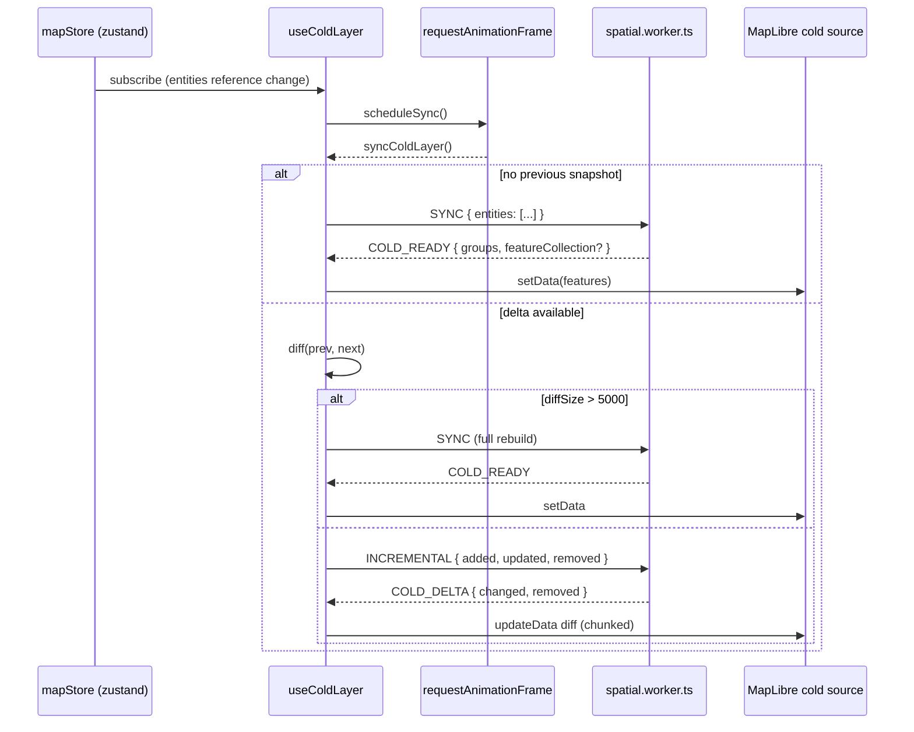

# useColdLayer

> Source: `src/hooks/useColdLayer.ts`

## Overview

`useColdLayer` keeps the MapLibre `cold` GeoJSON source in sync with
`mapStore.entities`. The cold layer holds **committed** map data —
expensive to compile (Apollo lane corridors, junction stitching, signal
boundaries), changes infrequently per frame. The hook coalesces store
mutations through `requestAnimationFrame`, ships them across the
`SpatialWorkerBridge` clone boundary, and applies the worker's response
either as a SYNC rebuild or an INCREMENTAL delta.

This hook is the production cold-layer loop. The hot layer (drag
preview) is a separate, simpler hook — see [useHotLayer](./use-hot-layer.md).

## Hook signature

```ts
function useColdLayer(
  mapRef: React.RefObject<maplibregl.Map | null>,
  mapLoadedRef: React.RefObject<boolean>,
  actorRef: ActorRefFrom<typeof editorMachine>,
  bridgeRef: React.RefObject<SpatialWorkerBridge | null>,
): void;
```

The hook returns nothing — its sole side effect is mutating
`map.getSource('cold')`.

## Behavior

### Lifecycle and refs

```ts
prevEntitiesRef; // last committed entities snapshot for diff
syncFrameRef; // RAF id, null when no sync queued
syncVersionRef; // monotonic counter, voids stale worker responses
selectedEntityIdRef; // tracks FSM selection for the cold-layer filter
entityFeatureCacheRef; // mirrors the worker's per-entity output
```

The version counter is the key correctness invariant: each `send()` to
the worker captures `requestVersion = ++syncVersionRef.current`, and
any in-flight response whose version no longer matches is discarded.
This prevents an older SYNC's `featureCollection` from clobbering a
newer INCREMENTAL.

### Sync scheduling



### SYNC vs INCREMENTAL decision

```ts
const FULL_SYNC_ENTITY_CHANGE_THRESHOLD = 5_000;

if (diffSize(diff) > FULL_SYNC_ENTITY_CHANGE_THRESHOLD) {
  void syncAllColdFeatures('cold-layer-sync');
  return;
}
// otherwise INCREMENTAL
```

A massive change (e.g. file import dropping 50k entities at once) shifts
the curve back to a single SYNC because INCREMENTAL's per-entity worker
overhead would be slower than rebuilding the cache wholesale.

### COLD_READY (full SYNC) handling

```ts
if (result.type === 'COLD_READY') {
  entityFeatureCacheRef.current = groupsToFeatureMap(result.groups);
  if (result.featureCollection) {
    await setColdSourceData(src, result.featureCollection.features);
  } else {
    await rebuildColdSourceFromCache(src, entityFeatureCacheRef.current);
  }
}
```

Two replenish paths:

- Worker returned a flat `featureCollection` → one `src.setData()` call.
- Worker returned only per-entity `groups` → chunked rebuild via
  `rebuildColdSourceFromCache` (4000 features per `updateData` chunk).

Both promote `feature.id` / `properties.featureId` so MapLibre's
`promoteId: 'featureId'` source declaration finds a stable identifier.

### COLD_DELTA (INCREMENTAL) handling

For INCREMENTAL responses:

1. Collect previous features for every entity in `result.removed` and
   `result.changed` (from the local cache).
2. Update the cache: drop removed, replace changed.
3. Issue a single `src.updateData({ remove, add })` diff to MapLibre,
   chunked at 4000 features.

This avoids re-uploading features that didn't change — the dominant
optimization for large maps where a single lane edit would otherwise
re-stream all junction-stitched features.

### Selection filter

`useColdLayer` also subscribes to FSM `selectedEntityId` and applies
`buildColdLayerFilter(layerId, selectedEntityId)` across all
`COLD_LAYER_IDS`. The current implementation keeps the selected entity
visible in cold layers (the hot layer adds editable handles on top
rather than hiding the cold form).

### User feedback

When a SYNC is large enough that the user might notice the worker
spinning up, the hook calls
`useTaskProgressStore.beginTask({ visibleAfterMs: 1000 })`. The overlay
only paints if the task takes longer than 1 second — short syncs go
unnoticed.

## Worker protocol

| Direction | Message       | Fields                                                       |
| --------- | ------------- | ------------------------------------------------------------ |
| → worker  | `SYNC`        | `entities: SerializedEntity[]`                               |
| → worker  | `INCREMENTAL` | `added`, `updated: SerializedEntity[]`, `removed: string[]`  |
| ← worker  | `COLD_READY`  | `groups: EntityFeatureGroup[]`, optional `featureCollection` |
| ← worker  | `COLD_DELTA`  | `changed: EntityFeatureGroup[]`, `removed: string[]`         |

See [spatial worker protocol](/api/core/worker-protocol) for the full
shape.

## Exported helpers

For testability, `useColdLayer.ts` also exports pure helpers:

```ts
export function groupFeaturesByEntity(features: GeoJSON.Feature[]): Map<string, GeoJSON.Feature[]>;
export function flattenEntityFeatures(
  cache: Map<string, GeoJSON.Feature[]>,
): GeoJSON.FeatureCollection;
export function diffEntities(
  prev: EntitySnapshot,
  next: Map<string, SerializedEntity>,
): {
  added: SerializedEntity[];
  updated: SerializedEntity[];
  removed: string[];
};
export function hasEntityChanges(diff: ReturnType<typeof diffEntities>): boolean;
```

## Examples

### Mounting in MapCanvas

```tsx
export function MapCanvas({ actorRef }: MapCanvasProps) {
  const containerRef = useRef<HTMLDivElement>(null);
  const bridgeRef = useRef<SpatialWorkerBridge | null>(null);

  useEffect(() => {
    const bridge = new SpatialWorkerBridge();
    bridgeRef.current = bridge;
    return () => bridge.dispose();
  }, []);

  const { mapRef, mapLoadedRef } = useMapLibreInit(containerRef);
  useColdLayer(mapRef, mapLoadedRef, actorRef, bridgeRef);
  return <div ref={containerRef} />;
}
```

### Inspecting INCREMENTAL throughput

The optional `featureCollection` field on `COLD_READY` lets the worker
hand back an already-flattened collection when it's cheaper than
chunked uploads. Disabling that path forces the rebuild loop and is
useful for benchmarks.

## Related

- [useHotLayer](/api/hooks/use-hot-layer)
- [useApolloLayer](/api/hooks/use-apollo-layer)
- [SpatialWorkerBridge](/api/core/spatial-bridge)
- [Worker protocol](/api/core/worker-protocol)
- [coldLayerConfig](/api/components/map-canvas)
- [mapStore](/api/store/store-map)
