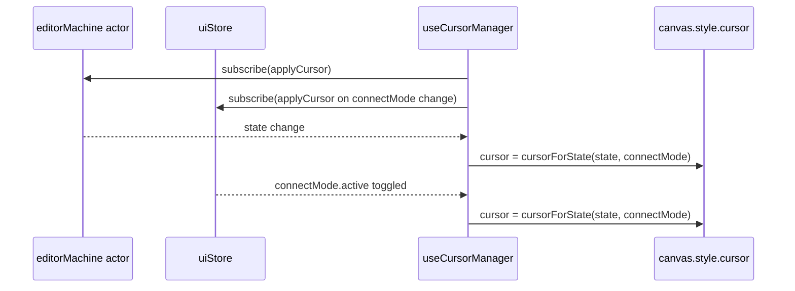

# useCursorManager

> Source: `src/hooks/useCursorManager.ts`

## Overview

`useCursorManager` keeps the canvas cursor style in sync with the
editor's mode. Connect-lanes mode and drawing states get a `crosshair`,
active vertex drag gets a `grabbing`, everything else falls back to
the browser default. Subscribes once to both the FSM actor and the UI
store; the canvas-level cursor changes are direct DOM writes (no
React re-render).

## Hook signature

```ts
function useCursorManager(
  mapRef: React.RefObject<maplibregl.Map | null>,
  actorRef: ActorRefFrom<typeof editorMachine>,
): void;

export function cursorForState(currentState: string, connectModeActive?: boolean): string;
```

## Behavior

### Decision table

```ts
export function cursorForState(currentState: string, connectModeActive = false): string {
  if (connectModeActive) return 'crosshair';
  if (currentState === 'editingPoint') return 'grabbing';
  if (isDrawingState(currentState)) return 'crosshair';
  return '';
}
```

| Condition                                                                                                     | Cursor                         |
| ------------------------------------------------------------------------------------------------------------- | ------------------------------ |
| `connectMode.active` (UI store)                                                                               | `crosshair`                    |
| FSM state = `editingPoint`                                                                                    | `grabbing`                     |
| FSM state in `drawPolyline` / `drawCatmullRom` / `drawBezier` / `drawArc` / `drawRotatedRect` / `drawPolygon` | `crosshair`                    |
| anything else                                                                                                 | empty string (browser default) |

::: tip Connect-mode wins
Connect-lanes is a non-FSM modal overlay — it lives in `uiStore` and
can fire while the FSM is still in `idle` or `selected`. The check
must take priority so the user gets an unambiguous "pick a lane"
affordance.
:::

### Subscription model



The `useUIStore.subscribe` callback only re-applies the cursor when
`connectMode.active` actually flipped, avoiding redundant DOM writes
on unrelated UI changes.

### Why direct DOM, not React

Cursor style is effectively a per-event UI overlay; routing it through
component state would force a re-render of the entire canvas slot. The
canvas DOM node is the only consumer, so writing
`canvas.style.cursor = '…'` is both faster and more localized.

## Examples

### Reading the current cursor in tests

```ts
import { cursorForState } from '@/hooks/useCursorManager';

expect(cursorForState('drawPolyline', false)).toBe('crosshair');
expect(cursorForState('selected', true)).toBe('crosshair'); // connect wins
expect(cursorForState('editingPoint', false)).toBe('grabbing');
expect(cursorForState('idle', false)).toBe('');
```

### Wiring

```tsx
useCursorManager(mapRef, actorRef);
```

The hook self-subscribes and self-unsubscribes — there's nothing else
to wire.

## Related

- [editorMachine FSM](/api/core/editor-machine)
- [useDragPan](/api/hooks/use-drag-pan)
- [Connect mode](/api/hooks/map-event-router-internals)
- [uiStore.connectMode](/api/store/store-ui)
