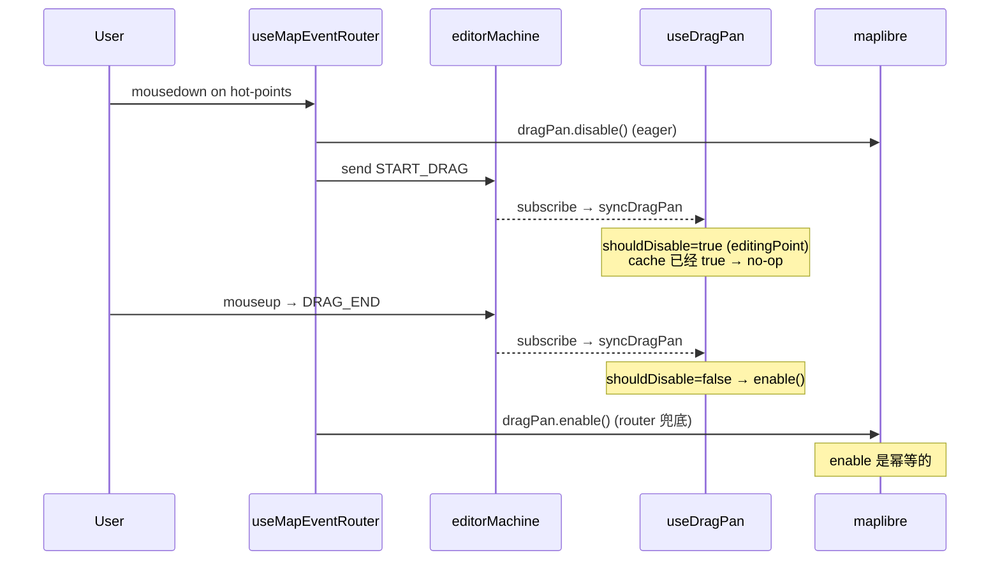

# useDragPan

> 源码：`src/hooks/useDragPan.ts`

`useDragPan` 是一个守门 hook：它在合适的 FSM 状态下调用
`map.dragPan.disable()`，恢复时调用 `map.dragPan.enable()`。逻辑只有一个
判定函数 `shouldDisableDragPan`，但避免了大量"地图被平移抢走"的 UX 错误。

## 状态决策表

| FSM state                                                                         | isDraggingHandle | dragPan |
| --------------------------------------------------------------------------------- | ---------------- | ------- |
| `idle`                                                                            | false            | enable  |
| `selected`                                                                        | false            | enable  |
| `selected`                                                                        | true (拖 handle) | disable |
| `drawPolyline` / `drawArc` / `drawCatmullRom` / `drawRotatedRect` / `drawPolygon` | false            | enable  |
| `drawBezier`                                                                      | —                | disable |
| `editingPoint`                                                                    | —                | disable |

`isDraggingHandle` 是 FSM context 的一个布尔标，在 bezier handle drag 子
流程中由 `START_HANDLE_DRAG` action 置 true，`END_HANDLE_DRAG` action 复位。

## FAQ

**Q: 为什么 `drawBezier` 也要禁 dragPan？**
A: drawBezier 用 `mousedown + drag` 来创建 bezier 控制柄
（`mapEventRouter.ts:54-62`），如果 dragPan 同时活跃，按下鼠标会立刻
开始平移地图，handle 永远画不出来。

**Q: 退出 drawBezier 后地图能正常 pan 吗？**
A: 能。`drawBezier → idle` 转移让 `shouldDisableDragPan` 返回 false，
本 hook 立刻 `enable()`。

## 性能记录

- `dragPan.disable / enable` 内部各执行 1 次 listener 解 / 装；
  对 60Hz mousemove 路径无感知影响。
- `actorRef.subscribe` 回调每次 FSM 转移一次，远低于 60Hz；
  `dragPanDisabledRef` 命中跳过的概率约 95%（大部分转移 disable 标记不变）。

## 集成测试入口

- 单元：`shouldDisableDragPan` 真值表（5 case）
- 集成：模拟 actor 进入 `editingPoint` → 断言 `dragPan.disable()` 被调用 1 次；
  退出后 `enable()` 被调用 1 次；多次同状态变化不重复调用。
- E2E：playwright 验证用户拖动顶点期间地图不平移。

## 与浏览器原生事件的关系

dragPan disable 不阻止：

- 鼠标滚轮（maplibre `scrollZoom`，独立 handler）
- 双指触摸缩放（`touchZoomRotate`）
- 键盘平移（如启用，本项目未启用）

只阻止 mousedown→mousemove→mouseup 这条 pan 路径。如果未来的工作流
需要在编辑态也禁滚轮，应扩展 `shouldDisableDragPan` 为更通用的开关。

## 与 `useCursorManager` 的对称

`useDragPan` 与 [`useCursorManager`](./use-cursor-manager.md) 都是订阅
actor 后修改 maplibre 行为，但写入目标不同：

| Hook               | 写入目标                       | 缓存                 |
| ------------------ | ------------------------------ | -------------------- |
| `useDragPan`       | `map.dragPan.disable / enable` | `dragPanDisabledRef` |
| `useCursorManager` | `canvas.style.cursor`          | 无（每次直接覆盖）   |

cursor 写入是字符串赋值；dragPan 是事件 listener 解 / 装；后者更贵，
所以更需要缓存防抖。

## 设计取舍

为什么不直接在 router 内部 disable / enable？因为 router 的 mousedown
路径不一定每次都途经 `editingPoint` —— 例如用户在 `drawBezier` 中按下
mousedown，FSM 内部进入子状态，没有显式的 mousedown 事件给 router。
独立 hook 通过订阅 actor 任何变化都能即时响应，比把 dragPan 状态散布在
mousedown / mouseup / dblclick 里更可靠。

## maplibre dragPan 内部机制

`map.dragPan` 是 `maplibre-gl-js` 的内置 handler，启用时会监听 mousedown

- mousemove + mouseup 自动平移。`disable()` 直接断开内部监听器，
  后续指针事件全部进入应用代码。`enable()` 重新接入。

API 是幂等的，但每次调用都会触发 `addEventListener` / `removeEventListener`
组合，频繁调用浪费 CPU。这就是 `dragPanDisabledRef` 缓存的存在意义。

## 设计动机

- **MapLibre 的 dragPan 默认开启**：用户按下鼠标拖拽地图时，maplibre 会
  在 mousedown 时立刻进入 pan 流程，吃掉之后的 mousemove。这对编辑顶点
  / 绘制贝塞尔/handle drag 都是灾难。
- **状态驱动**：通过 ref 缓存 `dragPanDisabledRef.current`，只在状态真的
  翻转时才调 disable/enable，避免 maplibre 内部触发不必要的事件。

## 签名

```ts
function useDragPan(
  mapRef: React.RefObject<maplibregl.Map | null>,
  actorRef: ActorRefFrom<typeof editorMachine>,
): void;

export function shouldDisableDragPan(currentState: string, isDraggingHandle: boolean): boolean;
```

## 参数

| 名称       | 类型                                 | 角色                                                    |
| ---------- | ------------------------------------ | ------------------------------------------------------- |
| `mapRef`   | `RefObject<maplibregl.Map \| null>`  | MapLibre 实例。                                         |
| `actorRef` | `ActorRefFrom<typeof editorMachine>` | FSM actor。读取 `value` 与 `context.isDraggingHandle`。 |

## 副作用

| 副作用                            | 触发时机                   | 清理                         |
| --------------------------------- | -------------------------- | ---------------------------- |
| `map.dragPan.disable()`           | `shouldDisable=true` 翻转  | —                            |
| `map.dragPan.enable()`            | `shouldDisable=false` 翻转 | —                            |
| `actorRef.subscribe(syncDragPan)` | mount                      | `subscription.unsubscribe()` |

## `shouldDisableDragPan`

```ts
// useDragPan.ts:6-8
export function shouldDisableDragPan(currentState: string, isDraggingHandle: boolean): boolean {
  return isDraggingHandle || currentState === 'editingPoint' || currentState === 'drawBezier';
}
```

| 条件                              | 触发原因                                                    |
| --------------------------------- | ----------------------------------------------------------- |
| `isDraggingHandle === true`       | 用户在 bezier 控制柄上拖动（FSM 内子状态）                  |
| `currentState === 'editingPoint'` | 顶点 / handle / center 拖拽期间                             |
| `currentState === 'drawBezier'`   | drawBezier 用 mousedown+drag 创建控制柄，不能让地图同时 pan |
| 其它                              | 允许 maplibre 自由 pan（idle / selected / drawPolyline 等） |

## 不变量

### 缓存防抖

```ts
// useDragPan.ts:14-31
const dragPanDisabledRef = useRef(false);

useEffect(() => {
  // ...
  const syncDragPan = () => {
    const snapshot = actorRef.getSnapshot();
    const shouldDisable = shouldDisableDragPan(
      snapshot.value as string,
      snapshot.context.isDraggingHandle,
    );

    if (shouldDisable === dragPanDisabledRef.current) return;
    dragPanDisabledRef.current = shouldDisable;
    if (shouldDisable) map.dragPan.disable();
    else map.dragPan.enable();
  };

  syncDragPan();
  const subscription = actorRef.subscribe(syncDragPan);
  return () => subscription.unsubscribe();
}, [actorRef]);
```

每次 actor 变化都重新计算 `shouldDisable`；如果与缓存相同则跳过——
maplibre 的 `dragPan.disable/enable` 内部不轻量。

### 双重保险

- `useMapEventRouter.handleSelectedMouseDown` 在进入 `editingPoint` 之前
  也直接调用 `map.dragPan.disable()`（`selectionDrag.ts:57, 78`）。
- 本 hook 在 `editingPoint` 期间也保持 disable。两者重叠，确保至少有
  一处把 dragPan 关掉。

`DRAG_END` 后 router 显式 `map.dragPan.enable()`（`useMapEventRouter.ts:160`）；
本 hook 同时也会因为 FSM 退出 `editingPoint` 而做一次 enable。重复 enable
是安全的。

## 调用点

```tsx
// src/components/map/MapCanvas.tsx:43
useDragPan(mapRef, actorRef);
```

## 错误模式

| 现象                             | 根因                                               | 修复                                            |
| -------------------------------- | -------------------------------------------------- | ----------------------------------------------- |
| 拖拽顶点时地图同时平移           | `editingPoint` 没进入或 `dragPan.disable()` 未调用 | 检查 router 的 `START_DRAG` 路径                |
| 退出编辑后地图无法拖动           | `enable()` 漏发                                    | 看 `dragPanDisabledRef.current` 是否一直挂 true |
| 频繁 disable/enable 导致地图卡顿 | 缓存防抖失效                                       | 见 `dragPanDisabledRef` 比较                    |

## 测试

- `src/hooks/__tests__/useDragPan.test.ts` —— `shouldDisableDragPan` 真值表

## 参见

- [`useMapEventRouter`](./use-map-event-router.md)
- [`useCursorManager`](./use-cursor-manager.md)
- [Editor Machine: editingPoint](../core/editor-machine.md)

## 状态时序



router 与 useDragPan 同时写状态是设计选择 ——

- router 的 eager disable 保证 mousedown 帧内立即生效（subscribe 是异步的，
  下一帧才会同步）。
- useDragPan 保证后续状态变更（如 FSM 内部子状态切换）也能正确驱动 pan。

两者都向幂等的 maplibre API 写入，重复调用无副作用。

## 与 doubleClickZoom 的关系

`useMapLibreInit` 创建 map 时已禁用 `doubleClickZoom: false`。`dragPan`
是另一个交互通道，需要 `useDragPan` 单独管理。

未来若引入更多 maplibre 行为（`scrollZoom` / `keyboard`），可以扩展
`shouldDisableDragPan` 为 `disableMapInteractions`，按状态阻塞所有交互。

## 源码索引

| 关注点                    | 行号                      |
| ------------------------- | ------------------------- |
| `shouldDisableDragPan`    | `useDragPan.ts:6-8`       |
| `syncDragPan` 主体        | `useDragPan.ts:20-31`     |
| `dragPanDisabledRef` 防抖 | `useDragPan.ts:14, 27-29` |
| 订阅 + cleanup            | `useDragPan.ts:33-37`     |
