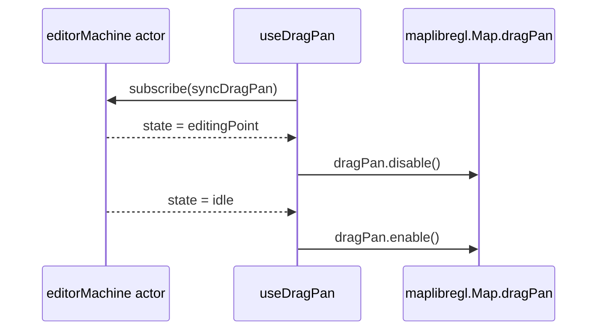

# useDragPan

> Source: `src/hooks/useDragPan.ts`

## Overview

`useDragPan` toggles MapLibre's built-in drag-to-pan handler on or off
based on the editor's FSM state. While the user is dragging a vertex
or shaping a bezier, the canvas should not scroll under their cursor —
this hook disables `map.dragPan` for those states and re-enables it
elsewhere.

## Hook signature

```ts
function useDragPan(
  mapRef: React.RefObject<maplibregl.Map | null>,
  actorRef: ActorRefFrom<typeof editorMachine>,
): void;

export function shouldDisableDragPan(currentState: string, isDraggingHandle: boolean): boolean;
```

## Behavior

### Decision

```ts
export function shouldDisableDragPan(currentState: string, isDraggingHandle: boolean): boolean {
  return isDraggingHandle || currentState === 'editingPoint' || currentState === 'drawBezier';
}
```

| Condition                        | dragPan  |
| -------------------------------- | -------- |
| `isDraggingHandle` (FSM context) | disabled |
| state = `editingPoint`           | disabled |
| state = `drawBezier`             | disabled |
| else                             | enabled  |

::: warning Why drawBezier specifically
Bezier draw uses `mousedown → drag handle → mouseup` to set the
out-handle. Letting MapLibre take the mousedown for panning would
swallow the gesture before the FSM ever sees it. Other draw modes
commit on click, so they keep dragPan enabled.
:::

### Subscription model

```ts
const dragPanDisabledRef = useRef(false);

const syncDragPan = () => {
  const snapshot = actorRef.getSnapshot();
  const shouldDisable = shouldDisableDragPan(
    snapshot.value as string,
    snapshot.context.isDraggingHandle,
  );
  if (shouldDisable === dragPanDisabledRef.current) return;
  dragPanDisabledRef.current = shouldDisable;
  if (shouldDisable) map.dragPan.disable();
  else map.dragPan.enable();
};
```

The `dragPanDisabledRef` guard means we only call `disable()` /
`enable()` on actual transitions, not on every FSM tick.



### Center drag and selectionDrag

Selection drag (drag the entity's body to translate it) is handled in
`useMapEventRouter` via `handleSelectedMouseDown`, which calls
`map.dragPan.disable()` directly when it grabs the entity. The
`useDragPan` hook still re-enables the pan on `mouseup` because by
then the FSM is back in `editingPoint` → `selected` and
`shouldDisableDragPan` returns `false`.

## Examples

### Mounting

```tsx
useDragPan(mapRef, actorRef);
```

### Snapshot tests

```ts
import { shouldDisableDragPan } from '@/hooks/useDragPan';

expect(shouldDisableDragPan('idle', false)).toBe(false);
expect(shouldDisableDragPan('idle', true)).toBe(true); // dragging handle
expect(shouldDisableDragPan('editingPoint', false)).toBe(true);
expect(shouldDisableDragPan('drawBezier', false)).toBe(true);
expect(shouldDisableDragPan('drawPolyline', false)).toBe(false);
```

## Related

- [editorMachine FSM](/api/core/editor-machine)
- [useMapEventRouter](/api/hooks/use-map-event-router)
- [useCursorManager](/api/hooks/use-cursor-manager)
