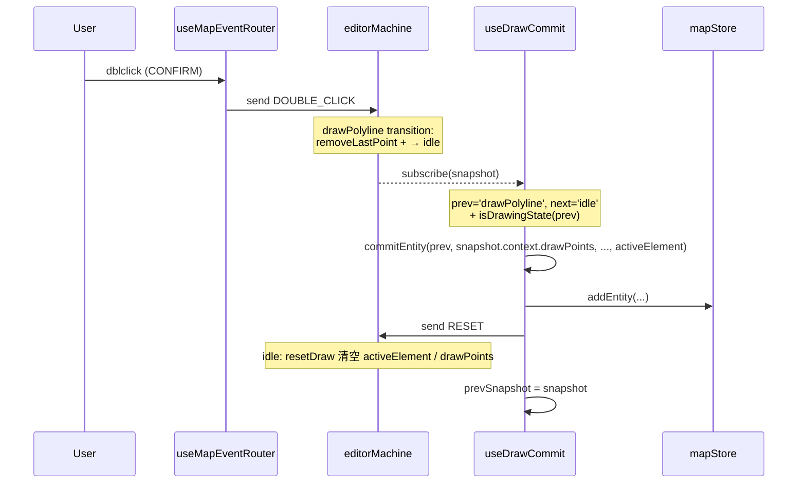

# useDrawCommit

> 源码：`src/hooks/useDrawCommit.ts`

`useDrawCommit` 是把 FSM 绘制态实际**落盘**到 `mapStore` 的桥。它订阅
`actorRef`，在每次状态转移之后比对 `prevState` 与 `nextState`：

- 当 `prevState` 是 `isDrawingState`（即 `drawPolyline` /
  `drawCatmullRom` / `drawBezier` / `drawArc` / `drawRotatedRect` /
  `drawPolygon`）且 `nextState === 'idle'`：调用 `commitEntity`，
  把当前 `drawPoints` / `bezierAnchors` 转成实体并 `addEntity`。
- 提交完毕**再发一次 `RESET`**，把 `activeElement` / `drawPoints` /
  `bezierAnchors` 清掉，避免 ToolStrip 上的工具高亮残留。

它读取的是 **POST-transition 的 snapshot**，因为 transition 自身可能携带
"添加最后一点"或"删除一点"的 action（如 `DOUBLE_CLICK` 的 `removeLastPoint`），
必须用转移后的最终上下文计算几何。

## 设计动机

- 单一职责：`useMapEventRouter` 只发 FSM 事件，`useDrawCommit` 单独负责
  落盘，避免在 router 里散布 store mutations。
- POST-snapshot 准确性：FSM 转移是原子的；只有在 subscribe 回调里读取
  的 snapshot 才反映完整的转移效果。
- 自洽：commit + RESET 双发保证下一次 `SELECT_TOOL` 进入新的绘制态时上下文是干净的。

## 签名

```ts
function useDrawCommit(actorRef: ActorRefFrom<typeof editorMachine>): void;

// 工具函数
export function hasGeometryForState(
  state: string,
  points: LngLat[],
  anchors: BezierAnchor[],
): boolean;
```

## 参数

| 名称       | 类型                                 | 角色           |
| ---------- | ------------------------------------ | -------------- |
| `actorRef` | `ActorRefFrom<typeof editorMachine>` | 编辑器 actor。 |

## 副作用

| 副作用                                  | 触发时机             | 清理                         |
| --------------------------------------- | -------------------- | ---------------------------- |
| `actorRef.subscribe(...)`               | mount                | `subscription.unsubscribe()` |
| `useMapStore.getState().addEntity(...)` | 绘制态退出时几何完整 | —                            |
| `actorRef.send({ type: 'RESET' })`      | commit 完成后        | —                            |

## 几何完整性

```ts
// useDrawCommit.ts:23-35
export function hasGeometryForState(state, points, anchors): boolean {
  return (
    (state === 'drawBezier' && anchors.length >= 2) ||
    (state === 'drawArc' && points.length >= 3) ||
    (state === 'drawRotatedRect' && points.length >= 3) ||
    (state === 'drawPolygon' && points.length >= 3) ||
    ((state === 'drawPolyline' || state === 'drawCatmullRom') && points.length >= 2)
  );
}
```

任何不满足下限点数的状态都会被丢弃 —— 不会写入空实体。

## commit 路径

```ts
// useDrawCommit.ts:37-90
function commitEntity(state, points, anchors, element) {
  const { addEntity, entities } = useMapStore.getState();

  if (element) {
    if (hasGeometryForState(state, points, anchors)) {
      const { laneHalfWidth } = useSettingsStore.getState();
      addEntity(createApolloEntity(element, state, points, anchors, { laneHalfWidth, entities }));
    }
    return;
  }

  // 内部 entity types: polyline / catmullRom / bezier / arc / rect / polygon
  // 通过 nextEntityId(entityType, entities) 生成 id，并调用 toGeoPoint /
  // coordsToPoints / anchorToData 把 LngLat 元组转成 store 形态。
}
```

| 当前 `activeElement`                    | 走哪一支                                   | 结果实体类型                                                      |
| --------------------------------------- | ------------------------------------------ | ----------------------------------------------------------------- |
| `non-null` (lane / boundary / signal …) | `createApolloEntity` 经 `entityOps` 适配器 | `ApolloEntity`                                                    |
| `null`                                  | 通过 `nextEntityId` 生成 id，构建原生几何  | `polyline` / `catmullRom` / `bezier` / `arc` / `rect` / `polygon` |

## 不变量

### POST-transition snapshot

```ts
// useDrawCommit.ts:96-119
useEffect(() => {
  let prevSnapshot = actorRef.getSnapshot();

  const subscription = actorRef.subscribe((snapshot) => {
    const prevState = prevSnapshot.value as string;
    const nextState = snapshot.value as string;

    if (nextState === 'idle' && isDrawingState(prevState)) {
      // POST-transition snapshot: 转移自身的 action（如 addPoint）已经
      // 应用过；prevSnapshot 是转移前一刻，刚好少了一步。
      commitEntity(
        prevState,
        snapshot.context.drawPoints, // ← post
        snapshot.context.bezierAnchors, // ← post
        snapshot.context.activeElement, // ← post
      );
      actorRef.send({ type: 'RESET' });
    }

    prevSnapshot = snapshot;
  });

  return () => {
    subscription.unsubscribe();
  };
}, [actorRef]);
```

`drawPoints` 必须从 `snapshot.context`（POST）读，不能从 `prevSnapshot.context`（PRE）。
否则 `drawArc` / `drawRotatedRect` 在 CONFIRM 那一击的 `addPoint` 不会被
计入，写入的实体少 1 个点。

### commit 后必须 RESET

```ts
// useDrawCommit.ts:115
actorRef.send({ type: 'RESET' });
```

注释指出：`drawPolyline → idle` 这条 transition 故意没带 `resetDraw`，
为的是让 `drawPoints` 在 commit 中可读；commit 完成后由本 hook 显式 RESET，
清空：

- `activeElement` —— 否则 ToolStrip 上工具高亮一直亮
- `drawPoints` / `bezierAnchors` —— 否则下次进入相同 draw 态时点会"叠加"

### 仅在退出到 idle 时 commit

```ts
// useDrawCommit.ts:100
if (nextState === 'idle' && isDrawingState(prevState)) { ... }
```

`drawPolyline → drawCatmullRom`（用户切工具）不会 commit。`selected` /
`editingPoint` 也不会。

## 转移时序



注意 `removeLastPoint` 是 `DOUBLE_CLICK` transition 自带的 action，
post-snapshot 中已经体现 —— 这是为什么 dblclick 关闭路径不会重复
最后一个点。

## 调用点

```tsx
// src/components/map/MapCanvas.tsx:35
useDrawCommit(actorRef);
```

`MapCanvas` 中独立挂载一次。

## 错误模式

| 现象                      | 根因                                           | 修复                                   |
| ------------------------- | ---------------------------------------------- | -------------------------------------- |
| dblclick 后实体多一个点   | 改成读 `prevSnapshot.context.drawPoints`       | 必须用 post-snapshot                   |
| 提交后 ToolStrip 仍高亮   | 漏 `RESET`                                     | 见 line 115                            |
| 提交了空实体              | `hasGeometryForState` 漏新 state               | 在表里添加                             |
| 单次工具切换被当作 commit | `drawPolyline → drawCatmullRom` 没有 idle 中转 | 仅 `nextState === 'idle'` 触发，无问题 |

## 测试

- `src/hooks/__tests__/useDrawCommit.test.ts` —— 各 draw state 的 commit 结构
- `src/hooks/__tests__/undoCancel.test.ts` —— 与 R1 闭环联动

## 参见

- [Editor Machine](../core/editor-machine.md)
- [`entityOps.createEntity`](../lib/entity-ops.md)
- [`useActionDispatcher`](./use-action-dispatcher.md)
- [`useMapEventRouter`](./use-map-event-router.md)

## R1 闭环视角下的 useDrawCommit

CANCEL 闭环（[`useActionDispatcher`](./use-action-dispatcher.md)）保证撤销
之前 FSM 已被打回 idle；`useDrawCommit` 不主动响应 CANCEL（CANCEL 是从
draw 状态 → idle 但跳过任何 commit，因为 `isDrawingState(prevState) →
nextState === 'idle'` 的判断仍然成立）。

但 CANCEL 转移会调 `resetDraw` action：`drawPoints` / `bezierAnchors` /
`activeElement` 都被清空，于是 `commitEntity` 中 `hasGeometryForState`
判定失败，安静返回。最终结果：CANCEL 路径不会落盘任何实体。

## 适配器 vs 原生分支

```ts
// useDrawCommit.ts:45-90
if (element) {
  // 适配器分支：通过 entityOps.createEntity 创建 ApolloEntity
  // 携带 laneHalfWidth + 已有 entities（用于 nextEntityId / 邻接 id）
} else {
  // 原生分支：直接构造 polyline / catmullRom / bezier / arc / rect / polygon
}
```

`activeElement` 由 ToolStrip 在选元素时通过 `SELECT_TOOL` 携带
（`elements.ts` 定义可选元素表）。当用户从 ToolStrip 选 `lane` 然后切
`drawPolyline` 工具时，FSM 同时持有 `activeElement: lane` +
`value: drawPolyline` —— commit 走第一个分支，进入 entityOps 适配器。

## 源码索引

| 关注点                     | 行号                       |
| -------------------------- | -------------------------- |
| `hasGeometryForState`      | `useDrawCommit.ts:23-35`   |
| `commitEntity` apollo 分支 | `useDrawCommit.ts:45-50`   |
| `commitEntity` 原生分支    | `useDrawCommit.ts:53-89`   |
| subscribe + commit 主体    | `useDrawCommit.ts:96-119`  |
| **POST-snapshot 注释**     | `useDrawCommit.ts:101-105` |
| **RESET 注释**             | `useDrawCommit.ts:112-115` |
