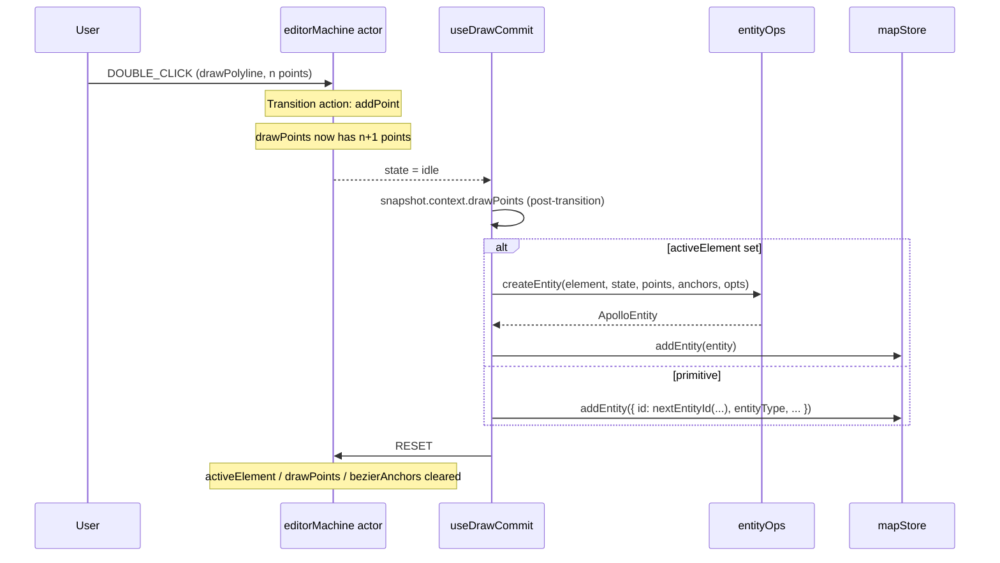

# useDrawCommit

> Source: `src/hooks/useDrawCommit.ts`

## Overview

`useDrawCommit` is the bridge between the FSM and `mapStore`: it
subscribes to FSM transitions and calls `addEntity(...)` whenever a
draw state exits to `idle`. It's the single place where ephemeral
draw points become a committed entity.

The hook supports both the **drawing primitive** path (polyline,
bezier, arc, rect, polygon) and the **Apollo element** path (lane,
crosswalk, signal, etc.) by checking the FSM's `activeElement` context
and dispatching to either `nextEntityId(...) + manual construction` or
`createApolloEntity(...)`.

::: warning Critical: post-transition snapshot
The hook reads the **post-transition snapshot** of `drawPoints` /
`bezierAnchors`. The trigger event (CONFIRM or DOUBLE_CLICK) often
includes an `addPoint` action as part of the transition, so the
pre-snapshot is stale by exactly one point. Reading post-transition
is what makes `drawArc` and `drawRotatedRect` commit with the correct
last vertex on double-click. See "Post-transition snapshot footgun"
below.
:::

## Hook signature

```ts
function useDrawCommit(actorRef: ActorRefFrom<typeof editorMachine>): void;

export function hasGeometryForState(
  state: string,
  points: LngLat[],
  anchors: BezierAnchor[],
): boolean;
```

## Behavior

### Subscription

```ts
let prevSnapshot = actorRef.getSnapshot();

const subscription = actorRef.subscribe((snapshot) => {
  const prevState = prevSnapshot.value as string;
  const nextState = snapshot.value as string;

  if (nextState === 'idle' && isDrawingState(prevState)) {
    commitEntity(
      prevState,
      snapshot.context.drawPoints,
      snapshot.context.bezierAnchors,
      snapshot.context.activeElement,
    );
    actorRef.send({ type: 'RESET' });
  }
  prevSnapshot = snapshot;
});
```

The hook tracks the previous snapshot to identify "I was in a draw
state, now I'm in idle" transitions. Anything else is ignored.

### Post-transition snapshot footgun

The transition that ends a draw (e.g. `DOUBLE_CLICK` from
`drawPolyline` → `idle`) often runs `addPoint` as a transition action.
That action mutates `context.drawPoints` _during_ the transition, so:

| Snapshot read                                          | `drawPoints` length |
| ------------------------------------------------------ | ------------------- |
| `prevSnapshot` (pre-transition)                        | n                   |
| `snapshot` (post-transition, what the subscriber sees) | n+1                 |

If we committed using `prevSnapshot`, the entity would lose the final
click. The hook deliberately reads `snapshot.context.drawPoints` so
the geometry is whole. This is also why the FSM's `commit` transition
does **not** include a `resetDraw` action — that would erase the
post-transition state before this hook sees it. The hook fires its
own `RESET` after committing instead.

### Dispatch by element

```ts
function commitEntity(
  state: string,
  points: LngLat[],
  anchors: BezierAnchor[],
  element: MapElementType | null,
) {
  const { addEntity, entities } = useMapStore.getState();

  if (element) {
    if (hasGeometryForState(state, points, anchors)) {
      const { laneHalfWidth } = useSettingsStore.getState();
      addEntity(createApolloEntity(element, state, points, anchors,
                                   { laneHalfWidth, entities }));
    }
    return;
  }

  // Drawing primitives — manual construction by state
  if (state === 'drawPolyline' || state === 'drawCatmullRom') { ... }
  else if (state === 'drawBezier' && anchors.length >= 2) { ... }
  // arc, rect, polygon...
}
```

The **element path** delegates to `entityOps.createEntity(...)` which
owns Apollo proto construction, lane corridor compilation, and any
type-specific defaults (e.g. `laneHalfWidth` from settings).

The **primitive path** constructs the entity inline using
`nextEntityId(type, entities)` from `lib/idGenerator` to assign a
fresh sequential id like `polyline-3`.

### Geometry validation

```ts
export function hasGeometryForState(
  state: string,
  points: LngLat[],
  anchors: BezierAnchor[],
): boolean {
  return (
    (state === 'drawBezier' && anchors.length >= 2) ||
    (state === 'drawArc' && points.length >= 3) ||
    (state === 'drawRotatedRect' && points.length >= 3) ||
    (state === 'drawPolygon' && points.length >= 3) ||
    ((state === 'drawPolyline' || state === 'drawCatmullRom') && points.length >= 2)
  );
}
```

Each draw mode has a minimum point count. A premature `CONFIRM` (e.g.
user pressed Enter after one click) is silently discarded — no entity
created, RESET still fires to clear `activeElement`.

### Sequence diagram



## Examples

### Mounting

```tsx
useDrawCommit(actorRef);
```

The hook is mounted exactly once per `MapCanvas`. Re-mounting on
`actorRef` change is the only valid reason to tear down — the
`actorRef` is stable for the editor's lifetime.

### Test scaffolding

```ts
import { hasGeometryForState } from '@/hooks/useDrawCommit';

expect(hasGeometryForState('drawArc', [p1, p2, p3], [])).toBe(true);
expect(hasGeometryForState('drawArc', [p1, p2], [])).toBe(false);
expect(hasGeometryForState('drawBezier', [], [a1, a2])).toBe(true);
```

## Related

- [editorMachine FSM](/api/core/editor-machine)
- [entityOps adapter](/api/lib/entity-ops)
- [Geometry: interpolate](/api/core/geometry-interpolate)
- [useOverlayLayer](/api/hooks/use-overlay-layer) — preview during draw
- [mapStore](/api/store/store-map) — receives `addEntity`
