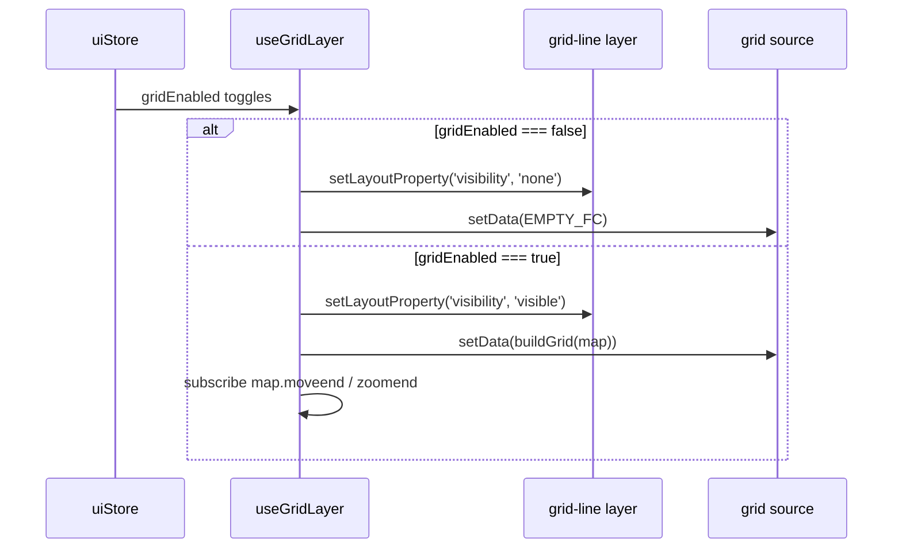

# useGridLayer

> Source: `src/hooks/useGridLayer.ts`

## Overview

`useGridLayer` paints the optional alignment grid on top of the dark
canvas — Photoshop / QGIS-style major/minor lines that snap to fixed
metric intervals and densify or sparsen with zoom. It reads
`uiStore.gridEnabled` to decide whether to draw, and rebuilds the grid
on every `moveend` / `zoomend` so it stays viewport-fitted without
streaming hundreds of off-screen lines.

## Hook signature

```ts
function useGridLayer(
  mapRef: React.RefObject<maplibregl.Map | null>,
  mapLoadedRef: React.RefObject<boolean>,
): void;
```

## Behavior

### Zoom-driven step

```ts
export function metersForZoom(zoom: number): { step: number; majorEvery: number };
```

| Zoom range | Step (m) | Major every |
| ---------- | -------- | ----------- |
| ≥ 20       | 0.5      | 10          |
| 19         | 1        | 10          |
| 18         | 2        | 5           |
| 17         | 5        | 5           |
| 16         | 10       | 5           |
| 15         | 25       | 4           |
| 14         | 50       | 4           |
| 13         | 100      | 5           |
| 12         | 250      | 4           |
| 11         | 500      | 4           |
| < 11       | 1000     | 5           |

Major grid lines render at `lineIdx % majorEvery === 0` with brighter
opacity; minors fill in between.

### Coordinate conversion

```ts
const stepLat = step / METERS_PER_DEG_LAT;
const stepLng = step / (METERS_PER_DEG_LAT * Math.cos((midLat * Math.PI) / 180));
```

Latitude steps are constant; longitude steps shrink toward the poles
via the cosine factor. The grid snaps to step multiples
(`Math.floor(south / stepLat) * stepLat`) so it does not drift while
panning.

### Safety cap

```ts
export const MAX_LINES_PER_AXIS = 240;
```

If a misconfigured zoom × step combination would generate tens of
thousands of lines, the loop bails out at 240 per axis. This protects
the GPU from accidental polylines explosions during zoom-out spam.

### Visibility model



Subscribing to viewport events only happens while the grid is enabled
— otherwise we save the per-frame work entirely.

## Source layer setup

The grid source / layer are defined in `mapLibreInit/layers.ts`:

```ts
map.addSource('grid', { type: 'geojson', data: EMPTY_FC });
map.addLayer({
  id: 'grid-line',
  type: 'line',
  source: 'grid',
  layout: { visibility: 'none' },
  paint: {
    'line-color': [
      'case',
      ['==', ['get', 'major'], true],
      'rgba(255,255,255,0.18)',
      'rgba(255,255,255,0.07)',
    ],
    'line-width': ['case', ['==', ['get', 'major'], true], 1, 0.5],
  },
});
```

`useGridLayer` only manipulates `visibility` and the source data — it
doesn't add or remove the layer.

## Examples

### Toggling from a button

```tsx
const toggleGrid = useUIStore((s) => s.toggleGrid);
return <button onClick={toggleGrid}>Grid</button>;
```

The next render of the canvas-scope component will pick up the change
through `useGridLayer`'s `useEffect` deps and rebuild.

### Reading the current step

```ts
import { metersForZoom } from '@/hooks/useGridLayer';
const { step, majorEvery } = metersForZoom(map.getZoom());
console.log(`grid: ${step}m, major every ${majorEvery}`);
```

## Related

- [uiStore](/api/store/store-ui)
- [Status bar](/api/components/status-bar) — shows the Grid indicator
- [mapLibreInit/layers](/api/hooks/map-event-router-internals)
