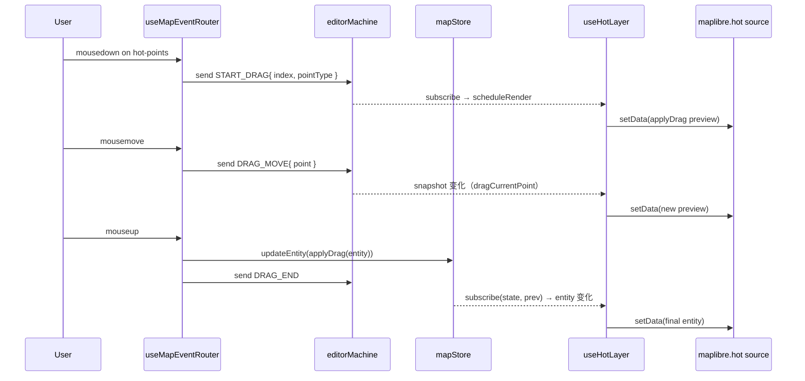

# useHotLayer

> 源码：`src/hooks/useHotLayer.ts`

`useHotLayer` 负责把"被选中的实体 + 正在拖拽中的预览"写入 maplibre 的
`hot` source。与冷层不同：

- **不经 worker**：直接在主线程从 FSM 读取上下文 + 调用 `applyDrag` 计算几何。
- **不缓存**：每帧（每次 actor 状态变化）都重算 GeoJSON `FeatureCollection`。
- **依赖去重**：通过 `sameHotRenderState` 比较 8 个键决定是否真的需要 setData。

它是 Photoshop 式编辑反馈 —— 拖动顶点 / 旋转 / 平移时，蓝色的 hot 层
高亮会跟随光标实时刷新。

## 何时该选 hot 层而不是 overlay 层

- **hot**：被选实体的"成形"几何 + 拖拽预览。蓝色高亮，用于"已存在的实体"。
- **overlay**：尚未提交的绘制几何（`drawPoints` / `bezierAnchors`）。黄色虚线，用于"将要变成实体的草稿"。

二者源不同，渲染不同优先级；不应混用。例如旋转矩形在 `drawRotatedRect`
中由 overlay 渲染预览，CONFIRM 后变成 RectEntity 由 cold 渲染基底，
被选时由 hot 层覆盖在 cold 之上。

## 设计动机

- 编辑反馈必须 60fps，跨 worker 的 postMessage 抖动会让光标看起来卡。
- 单个被选实体的几何很小（最多 ~100 个点），主线程重算成本可控。
- 渲染体积小 → setData 不会拖累其它图层。

## 签名

```ts
function useHotLayer(
  mapRef: React.RefObject<maplibregl.Map | null>,
  mapLoadedRef: React.RefObject<boolean>,
  actorRef: ActorRefFrom<typeof editorMachine>,
): void;
```

## 参数

| 名称           | 类型                                 | 角色                                                                                                                                       |
| -------------- | ------------------------------------ | ------------------------------------------------------------------------------------------------------------------------------------------ |
| `mapRef`       | `RefObject<maplibregl.Map \| null>`  | MapLibre 实例。                                                                                                                            |
| `mapLoadedRef` | `RefObject<boolean>`                 | 用于 RAF 路径的就绪标志。                                                                                                                  |
| `actorRef`     | `ActorRefFrom<typeof editorMachine>` | FSM actor。读取 `selectedEntityId` / `dragPointIndex` / `dragPointType` / `dragCurrentPoint` / `dragAltKey` / `value === 'editingPoint'`。 |

## 返回值

`void`。所有副作用作用于 `hot` source。

## `HotRenderState`

```ts
export type HotRenderState = {
  selectedEntityId: string | null;
  entity: MapEntity | null;
  isEditingPoint: boolean;
  dragPointIndex: number;
  dragPointType: DragPointType;
  dragCurrentPoint: LngLat | null;
  dragAltKey: boolean;
};
```

由 FSM snapshot + `mapStore.entities.get(selectedEntityId)` 拼出。

## 副作用

| 副作用                                  | 触发时机                                      | 清理                              |
| --------------------------------------- | --------------------------------------------- | --------------------------------- |
| `actorRef.subscribe(scheduleRender)`    | mount                                         | `subscription.unsubscribe()`      |
| `useMapStore.subscribe(...)`            | mount                                         | 返回的 `unsubscribeStore()`       |
| `requestAnimationFrame(renderHotLayer)` | `scheduleRender`                              | `cancelAnimationFrame(frameId)`   |
| `src.setData(...)`                      | render 触发且 `sameHotRenderState` 返回 false | —                                 |
| `map.once('load', scheduleRender)`      | 当前未加载                                    | `map.off('load', scheduleRender)` |

## 生命周期

```
mount
  ├── subscribe(actorRef) → scheduleRender
  ├── subscribe(useMapStore) → 仅在 entities 变更时 scheduleRender
  └── if mapLoaded: scheduleRender() else: map.once('load', scheduleRender)

renderHotLayer (RAF)
  ├── snapshot = actorRef.getSnapshot()
  ├── entity = entities.get(selectedEntityId)
  ├── nextState = HotRenderState{...}
  ├── if sameHotRenderState(last, next): return
  ├── if !entity: setData(EMPTY_FC); return
  ├── isEditingPoint && drag → applyDrag(entity, idx, type, point, alt)
  └── setData(entityToHotFeatures(displayEntity))

unmount
  ├── unsubscribe actor + store
  └── cancelAnimationFrame(frameId)
```

## 不变量

### 仅在状态真正变化时 setData

```ts
// useHotLayer.ts:30-41
export function sameHotRenderState(a: HotRenderState | null, b: HotRenderState) {
  return (
    !!a &&
    a.selectedEntityId === b.selectedEntityId &&
    a.entity === b.entity &&
    a.isEditingPoint === b.isEditingPoint &&
    a.dragPointIndex === b.dragPointIndex &&
    a.dragPointType === b.dragPointType &&
    a.dragAltKey === b.dragAltKey &&
    samePoint(a.dragCurrentPoint, b.dragCurrentPoint)
  );
}
```

`entity` 是同一引用比较：`mapStore` 在 `updateEntity` 时返回新引用，
此时 `entity !== prev.entity` 重渲染；如果只是 actor 选择态变化（同一实体），
`entity` 引用相同，`samePoint` 与索引也相同，`setData` 被跳过。

### 拖拽预览：applyDrag 必须看到非空 `dragCurrentPoint`

```ts
// useHotLayer.ts:85-99
const displayEntity =
  nextState.isEditingPoint &&
  nextState.dragCurrentPoint &&
  (nextState.dragPointIndex >= 0 ||
    nextState.dragPointType === 'rotate' ||
    nextState.dragPointType === 'center')
    ? applyDrag(
        entity,
        nextState.dragPointIndex,
        nextState.dragPointType,
        nextState.dragCurrentPoint,
        nextState.dragAltKey,
      )
    : entity;
```

`dragPointIndex >= 0` 走顶点 / 句柄；`rotate` 与 `center` 用特殊值
`-1` / `-2`。任何分支没命中时（例如刚进入 `editingPoint` 还没 mousemove），
直接渲染原 entity。

### 没选中 → 清空 hot source

```ts
// useHotLayer.ts:80-83
if (!selectedEntityId || !entity) {
  src.setData(EMPTY_FC);
  return;
}
```

避免上一次选择留下的高亮残留。

## 选择 + 拖拽时序



## 调用点

```tsx
// src/components/map/MapCanvas.tsx:39
useHotLayer(mapRef, mapLoadedRef, actorRef);
```

## 错误模式

| 现象                     | 根因                                            | 修复                                                 |
| ------------------------ | ----------------------------------------------- | ---------------------------------------------------- |
| 拖拽不显示预览           | 未进入 `editingPoint`，`isEditingPoint=false`   | 确认 `selectionDrag.ts` 中 `START_DRAG` 已发送       |
| 取消选择后旧实体仍高亮   | 没走到 EMPTY_FC 分支（`selectedEntityId` 残留） | FSM 的 deselect 必须清空 `context.selectedEntityId`  |
| 旋转 / center 拖拽不预览 | `dragPointType` 不在 `'rotate' \| 'center'` 中  | 检查 `selectionDrag.ts` 的分支                       |
| 单帧重复 setData         | `actorRef.subscribe` + store subscribe 同时触发 | RAF 合并已在 `scheduleRender` 中保证（line 103-106） |

## 参见

- [`useColdLayer`](./use-cold-layer.md)
- [`useOverlayLayer`](./use-overlay-layer.md)
- [Editor Machine: editingPoint](../core/editor-machine.md)
- [`entityMutations.applyDrag`](https://github.com/SakuraPuare/apollo-map-studio/blob/main/src/components/map/entityMutations.ts)

## 性能预算

- **每帧重算成本**：`entityToHotFeatures` + `applyDrag` 在主线程跑，被选实体顶点数 ≤ ~100 时单帧 < 0.5ms。
- **setData 成本**：FC 通常 < 50 features；maplibre 内部 GeoJSON 解析 < 0.2ms。
- **RAF 节流**：`scheduleRender` 通过 `frameId !== null` 守门保证一帧最多
  一次 setData，即使 actor 同时通知 + store 同时通知。

bench：见 `bench/hotLayer.bench.ts`，`scripts/bench-budgets.json` 中
`hot-layer-render` 项设置 1ms/帧上限。

## 与 useColdLayer 的协同

冷热层互补：

| 关注点   | useColdLayer                         | useHotLayer     |
| -------- | ------------------------------------ | --------------- |
| 数据规模 | 整个地图（千级实体）                 | 单实体          |
| 编译路径 | spatial worker（postMessage）        | 主线程纯函数    |
| 缓存     | 三层（feature / decoration / RBush） | 无              |
| 选择高亮 | 改 layer filter（不重 setData）      | 重写 hot source |
| 帧预算   | 16ms（RAF + worker）                 | 1ms（主线程）   |

被选实体被 cold layer filter 剔除（`buildColdLayerFilter` 把它过滤掉），
让 hot layer 完全接管该实体的渲染。

## 调用方注意

任何在 `editingPoint` 状态下调用 `useMapStore.updateEntity` 的代码
（router 的 `mouseup`）都会让 hot layer 重渲染：因为 entity 引用变了。
要让它"看起来不动"，必须在写入前 / 后保持 mapStore 的中间引用稳定 ——
通常是直接 `setData(entityToHotFeatures(post))` 由 hot layer 自己处理。

## 源码索引

| 关注点                  | 行号                     |
| ----------------------- | ------------------------ |
| `samePoint`             | `useHotLayer.ts:24-28`   |
| `sameHotRenderState`    | `useHotLayer.ts:30-41`   |
| `useHotLayer` 入口      | `useHotLayer.ts:43-132`  |
| `renderHotLayer` 主路径 | `useHotLayer.ts:55-101`  |
| 拖拽预览分支            | `useHotLayer.ts:85-98`   |
| EMPTY_FC 短路           | `useHotLayer.ts:80-83`   |
| `scheduleRender` (RAF)  | `useHotLayer.ts:103-106` |
| 卸载清理                | `useHotLayer.ts:121-128` |
