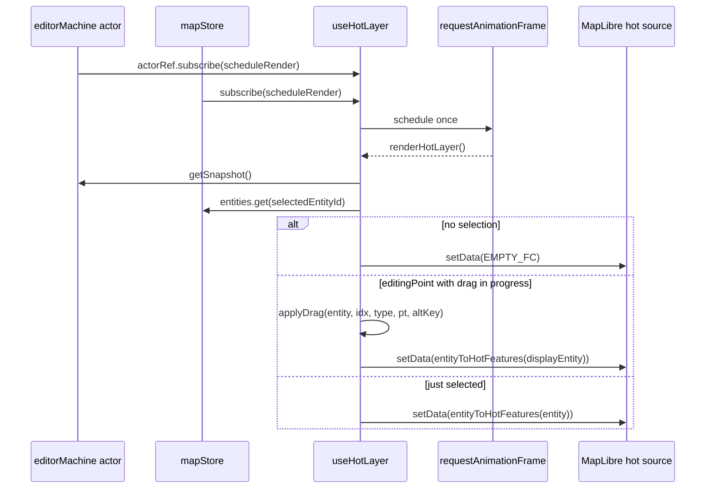

# useHotLayer

> Source: `src/hooks/useHotLayer.ts`

## Overview

`useHotLayer` renders the **in-flight edit preview** for the currently
selected entity. While `useColdLayer` ships committed entities through
a worker, the hot layer is the live, every-frame, no-worker path:

- During `editingPoint`, it applies the FSM's `dragCurrentPoint` to the
  selected entity and renders the result client-side.
- Outside drag, it renders the selected entity's editable handles
  (vertices, bezier handles).

There is no caching, no diffing, and no worker hop — this is the layer
the user is actively dragging, so latency wins over CPU.

## Hook signature

```ts
function useHotLayer(
  mapRef: React.RefObject<maplibregl.Map | null>,
  mapLoadedRef: React.RefObject<boolean>,
  actorRef: ActorRefFrom<typeof editorMachine>,
): void;
```

## Behavior

### Render state shape

```ts
export type HotRenderState = {
  selectedEntityId: string | null;
  entity: MapEntity | null;
  isEditingPoint: boolean;
  dragPointIndex: number;
  dragPointType: DragPointType;
  dragCurrentPoint: LngLat | null;
  dragAltKey: boolean;
};
```

The hook captures these on every animation frame, compares against the
previous frame via `sameHotRenderState(...)`, and short-circuits if
nothing relevant changed. Identity comparison on `entity` is enough —
`mapStore` always replaces the entity object on update.

### Render loop



### Drag preview

When `isEditingPoint` is true and a drag point is active
(`dragPointIndex >= 0`, or special `'rotate'` / `'center'` types), the
hook does not commit the change — instead it builds a **transient**
display entity:

```ts
const displayEntity =
  nextState.isEditingPoint && nextState.dragCurrentPoint && (...)
    ? applyDrag(entity, idx, pType, dragCurrentPoint, altKey)
    : entity;
```

The committed `mapStore.entities` does not see the move until
`useMapEventRouter`'s `mouseup` writes through `updateEntity(...)`. The
hot layer is a pure preview; the cold layer takes over once the
mutation is committed.

### Output features

`entityToHotFeatures(entity)` (from `@/lib/geoJsonHelpers`) emits:

- One main geometry feature (LineString / Polygon).
- One `Point` per editable vertex with `properties.role = 'vertex'`,
  `properties.index = i`.
- For bezier entities, additional `handle` and `handleLine` features
  per anchor.

These are styled by the `hot-fill`, `hot-line`, and `hot-points` layers
defined in `mapLibreInit/layers.ts`.

## Memoization helpers

```ts
export function samePoint(a: LngLat | null, b: LngLat | null): boolean;
export function sameHotRenderState(a: HotRenderState | null, b: HotRenderState): boolean;
```

Exported for unit tests and worker harnesses that want to assert
no-op re-renders behave identically.

## Examples

### Mounting

```tsx
useHotLayer(mapRef, mapLoadedRef, actorRef);
```

That's the entire integration — the hook self-subscribes to the FSM
actor and `mapStore`. Re-renders of the parent component do not
invalidate the effect because only `actorRef` is in the dep array, and
`mapRef` / `mapLoadedRef` are refs.

### Why no worker

The worker boundary's structured-clone cost is meaningful for full-map
syncs (50k+ features) but inverted for one entity per frame. Hot layer
work is at most O(handles × constants) per drag frame; running it on
the main thread is faster than a postMessage round-trip.

## Related

- [useColdLayer](/api/hooks/use-cold-layer)
- [useOverlayLayer](/api/hooks/use-overlay-layer) — drawing overlays
- [useMapEventRouter](/api/hooks/use-map-event-router) — emits drag events
- [entityMutations](/api/components/map-canvas) — `applyDrag` implementations
- [editorMachine FSM](/api/core/editor-machine)
