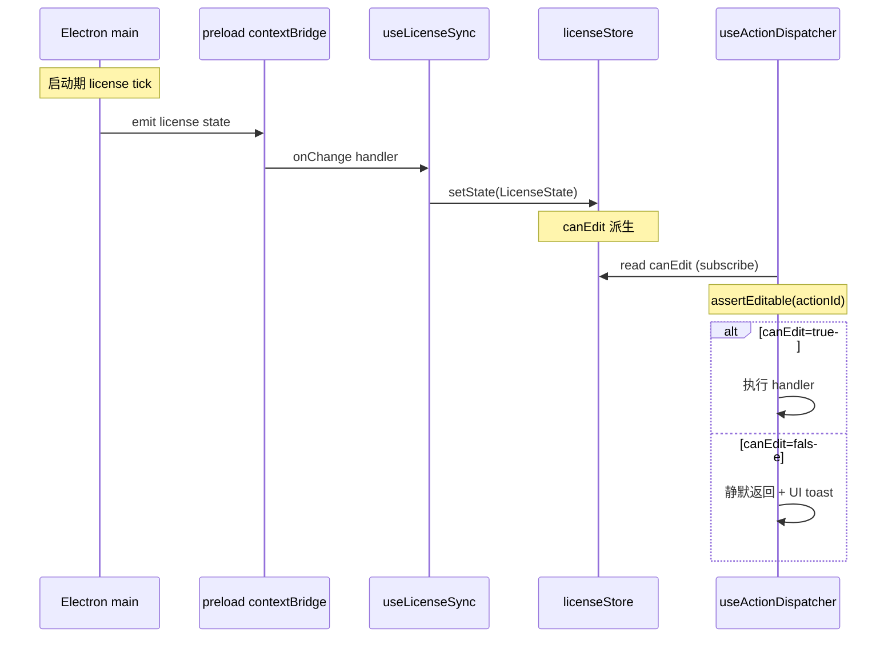

# useLicenseSync

> 源码：`src/hooks/useLicense.ts` · Bridge：`src/lib/license-bridge.ts`

`useLicenseSync` 是 license 系统在渲染层的入口。它在挂载时：

1. 调一次 `licenseStore.hydrate()`（内部走 `licenseBridge.getState()`）
2. 通过 `licenseBridge.onChange(setState)` 订阅主进程派发的状态变更
3. 注册 `window` 的 `focus` 事件，唤醒后再 hydrate 一次（覆盖笔记本休眠）

桌面构建里，`licenseBridge` 把调用透传给 `window.apolloMapStudioLicense`
（由 `electron/preload.cts` contextBridge 注入）。浏览器构建里 `window`
上没有这个对象，bridge 退化为返回 `fallbackState()` —— 永久 7 天 trial、
`canEdit=true`，让 dev / Storybook / 浏览器预览继续工作。

## license 状态语义

| status             | canEdit | UI 表现                                      |
| ------------------ | ------- | -------------------------------------------- |
| `trial`            | true    | 顶部条显示剩余天数                           |
| `activated`        | true    | 静默                                         |
| `expired_trial`    | false   | 红色顶部条 + 引导激活                        |
| `expired_license`  | false   | 红色顶部条 + 续费提示                        |
| `tampered`         | false   | 严重错误（机器码与签名不符）                 |
| `machine_mismatch` | false   | 当前设备与 license 绑定的 machineCode 不一致 |
| `invalid`          | false   | license 字符串格式错                         |
| `not_started`      | false   | 未来日期 license（预激活）                   |

## hot path：canEdit 派生

`useActionDispatcher` 中调用 `assertEditable(actionId)`：

```ts
// 伪代码
function assertEditable(id: ActionId): boolean {
  if (!useLicenseStore.getState().canEdit) {
    toast(useLicenseStore.getState().reason ?? 'License is read-only');
    return false;
  }
  return true;
}
```

每次菜单 / 快捷键 / 工具栏点击都会查一次 license store；该读路径必须 O(1)，
不能触发组件重渲染。zustand 的 `getState()` 是同步无重渲染读，符合要求。

## 设计动机

- **单点订阅**：所有 license 状态读取都走 zustand store，避免组件直接调
  bridge。
- **休眠兜底**：定时 tick 在后台标签 / 笔记本休眠时常被 throttling 错过；
  `focus` 触发的 hydrate 是兜底。
- **零依赖渲染**：`hydrate` / `setState` 是 stable 引用，依赖列表稳定。

## 签名

```ts
function useLicenseSync(): void;
```

## 副作用

| 副作用                                      | 触发时机             | 清理                                    |
| ------------------------------------------- | -------------------- | --------------------------------------- |
| `void hydrate()`                            | mount + `focus` 事件 | —                                       |
| `licenseBridge.onChange(setState)`          | mount                | 返回的 `unsub()` 在 unmount 调用        |
| `window.addEventListener('focus', onFocus)` | mount                | `removeEventListener('focus', onFocus)` |

## 生命周期

```
mount
  ├── hydrate() —— bridge.getState() → setState
  ├── unsub = licenseBridge.onChange(setState)
  └── window.addEventListener('focus', () => hydrate())

unmount
  ├── unsub()
  └── window.removeEventListener('focus', onFocus)
```

## `LicenseState` 字段

来自 `license-bridge.ts:21-32`：

```ts
export interface LicenseState {
  status:
    | 'trial'
    | 'activated'
    | 'expired_trial'
    | 'expired_license'
    | 'tampered'
    | 'machine_mismatch'
    | 'invalid'
    | 'not_started';
  canEdit: boolean;
  machineCode: string;
  trialStart: number;
  trialEnd: number;
  daysRemaining: number | null;
  hoursRemaining: number | null;
  license: { id: string; name: string; issued: number; expires: number } | null;
  checkedAt: number;
  reason: string;
}
```

`canEdit` 是 hot path：`useActionDispatcher.actionRequiresEdit` 的所有
edit/tool/selection 类 action 都取决于它。

## fallback 状态（浏览器预览）

```ts
// license-bridge.ts:62-75
function fallbackState(): LicenseState {
  return {
    status: 'trial',
    canEdit: true,
    machineCode: 'WEB-NO-LICENSE',
    trialStart: Date.now(),
    trialEnd: Date.now() + 7 * 24 * 60 * 60 * 1000,
    daysRemaining: 7,
    hoursRemaining: 7 * 24,
    license: null,
    checkedAt: Date.now(),
    reason: 'Browser preview — licensing disabled.',
  };
}
```

意图：浏览器里没有可信主进程，license 系统直接退化为开放编辑。
`isDesktopBuild()` 的判断条件是 `Boolean(window.apolloMapStudioLicense)`。

## 不变量

### `hydrate` 与 `setState` 通过 store selector 取出

```ts
// useLicense.ts:11-14
const hydrate = useLicenseStore((s) => s.hydrate);
const setState = useLicenseStore((s) => s.setState);
```

zustand 的 selector 返回的是 stable 引用（除非 store 自身重建），因此
依赖数组 `[hydrate, setState]` 实际只在 mount/unmount 之间生效一次。

### onChange 订阅必须在 hydrate 之后注册

```ts
// useLicense.ts:16-22
useEffect(() => {
  void hydrate();
  const unsub = licenseBridge.onChange(setState);
  // ...
}, [hydrate, setState]);
```

`hydrate` 是异步的（promise），但顺序读上 `onChange` 也立刻就绪 ——
后续主进程派发即可被捕获。如果反过来先订阅再 hydrate，第一次的
状态推送可能与 hydrate 的 setState 竞争；当前顺序保证 hydrate 的回填
先发生。

### `focus` 事件兜底

```ts
// useLicense.ts:18-21
const onFocus = () => void hydrate();
window.addEventListener('focus', onFocus);
```

主进程的 license tick 在后台标签 / 笔记本休眠时可能错过；focus 事件
触发的 `hydrate` 是兜底，确保用户回到窗口时 license 状态是最新的。

## 调用点

```tsx
// src/components/layout/WorkspaceLayout.tsx:42
useLicenseSync();
```

`WorkspaceLayoutInner` 在 mount 时调用一次，整个渲染层共享 store。

## 错误模式

| 现象                                    | 根因                                | 修复                                                    |
| --------------------------------------- | ----------------------------------- | ------------------------------------------------------- |
| 桌面构建中 `canEdit` 永远 true          | 浏览器后备路径生效                  | 检查 `window.apolloMapStudioLicense` 是否成功暴露       |
| 桌面休眠后 license 仍显示过期           | `focus` 事件没有触发 hydrate        | 见 line 19-21，确保监听挂载                             |
| onChange 触发但 store 不更新            | `setState` 引用变化导致 effect 重挂 | 不可能 —— zustand selector 稳定                         |
| 浏览器构建报 "activate is desktop-only" | 用户在 web 中触发 activate          | `licenseBridge.activate` 直接返回 `errorCode='unknown'` |

## 测试

- `src/hooks/__tests__/useLicense.test.ts`
- `src/lib/__tests__/license-bridge.test.ts`

## 参见

- [`licenseStore`](../store/license-store.md)
- [License Banner UI](../components/license-banner.md)
- [Electron preload bridge](../electron/preload.md)

## 与 useActionDispatcher 的协作



`assertEditable` 在 `@/lib/editable-guard` 中实现，读 store 并显示 toast。

## activate / deactivate 流程

```ts
// license-bridge.ts:84-97
async activate(code: string) {
  if (!window.apolloMapStudioLicense) {
    return {
      ok: false,
      state: fallbackState(),
      errorCode: 'unknown',
      errorMessage: 'Activation is only available in the desktop build.',
    };
  }
  return window.apolloMapStudioLicense.activate(code);
}
```

激活成功后主进程会通过 `onChange` 推送新 state；本 hook 自动捕获，
不需要手动 hydrate。

## 源码索引

| 关注点                | 行号                        |
| --------------------- | --------------------------- |
| `useLicenseSync` 主体 | `useLicense.ts:11-26`       |
| `LicenseStatus` 联合  | `license-bridge.ts:11-19`   |
| `LicenseState` 接口   | `license-bridge.ts:21-32`   |
| `ActivationResult`    | `license-bridge.ts:34-46`   |
| `fallbackState`       | `license-bridge.ts:62-75`   |
| `licenseBridge` 实现  | `license-bridge.ts:77-101`  |
| `isDesktopBuild`      | `license-bridge.ts:103-105` |
